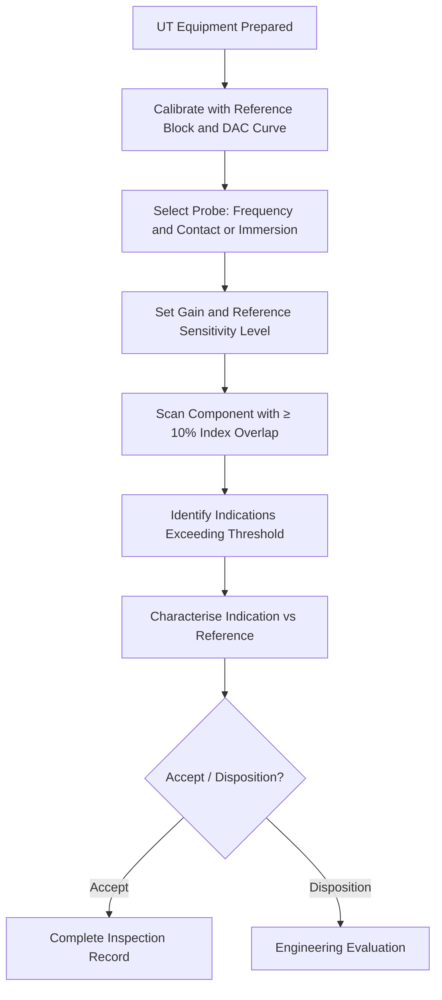

# ATLAS 050-059 · 05.051.050 — Ultrasonic Inspection Practices

> **ATLAS-1000** · Q+ATLANTIDE Baseline · Section 05.051 Standard Practices — Structures

---

## 1. Purpose

Defines the procedures, calibration requirements, sensitivity settings, and scanning parameters for ultrasonic inspection of metallic and composite aircraft structure. Correct application of UT procedures is essential to achieving the required probability of detection for internal flaws.

---

## 2. Scope

### 2.1 Context

Ultrasonic inspection uses high-frequency sound waves (1–25 MHz) to detect internal flaws including cracks, delaminations, disbonds, and porosity. Pulse-echo, pitch-catch, and through-transmission modes are used depending on the application. Calibration to a reference standard traceable to the actual component material specification is mandatory before each inspection session.

Phased array UT (PAUT) provides enhanced detection capability and scan coverage for complex geometries and thick sections. Where PAUT is used, the scanning plan and reference standard must be documented in the inspection procedure. All UT equipment must be maintained with current calibration certificates traceable to a national metrology standard.

### 2.2 Scope Diagram

### 2.3 Key Parameters

| Parameter | Value |
|-----------|-------|
| Frequency Range (Composite) | 1–10 MHz — lower frequency for thicker sections |
| Frequency Range (Metallic) | 2–25 MHz — higher frequency for fine crack resolution |
| Reference Standard | SDH (side-drilled hole) or FBH as specified in procedure |
| Minimum Scan Index Overlap | ≥ 10% of transducer active aperture |

---

## 3. Footprint

| Field | Value |
|-------|-------|
| **Document ID** | `QATL-ATLAS-1000-ATLAS-050-059-05-051-050-ULTRASONIC-INSPECTION-PRACTICES` |
| **Status** |  |
| **Folder Path** | `Q+ATLANTIDE/000-099_ATLAS/050-059_Estructuras/051_Standard-Practices-Structures/051-050-Inspection-NDT-and-Damage-Tolerance-Practices/` |

---

## 4. References

> [^1]: All references below are applicable at the revision level current at the time of document release. Superseded revisions must be assessed for impact before continued use.

| Reference | Description |
|-----------|-------------|
| ASTM E2533 | Standard Guide for UT of Polymer Matrix Composites |
| ASTM E114 | Standard Practice for Pulse-Echo UT of Metallic |
| NAS 410 | NDT Personnel Qualification — UT Level 2 |
| AMM 51-10-00 | Ultrasonic Inspection Procedures |
