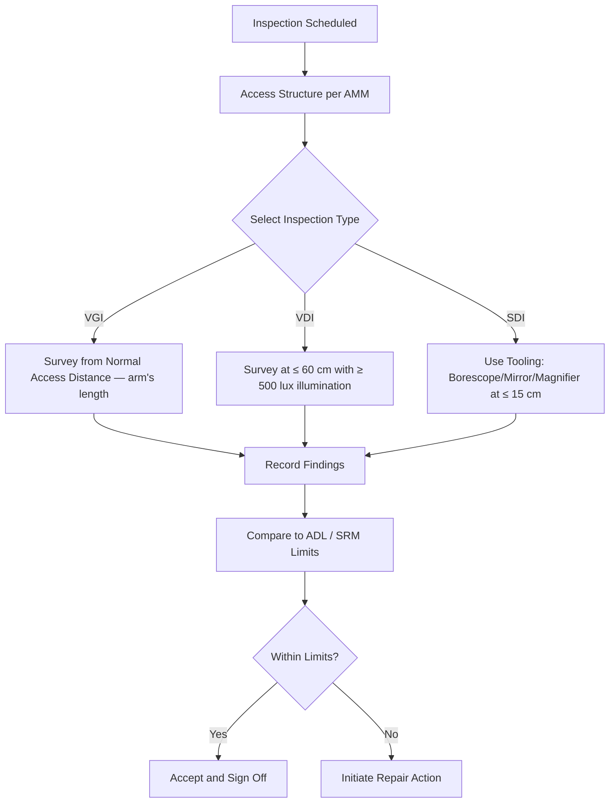

# ATLAS 050-059 · 05.051.050 — Visual and Detailed Inspection Practices

> **ATLAS-1000** · Q+ATLANTIDE Baseline · Section 05.051 Standard Practices — Structures

---

## 1. Purpose

Defines the standards and methods for visual general (VGI), visual detailed (VDI), and special detailed (SDI) inspections of aircraft structure. These inspection types form the foundation of the MSG-3 scheduled maintenance programme and must be applied with consistent technique to achieve the required probability of detection.

---

## 2. Scope

### 2.1 Context

Visual inspections form the primary detection method for obvious structural anomalies including cracks, corrosion, dents, and disbonds. VGI covers general condition from normal access distance and is typically performed at line maintenance visits. VDI requires direct access and lighting to a distance of ≤ 60 cm to detect fine cracks and early corrosion. SDI requires additional tooling such as borescopes, mirrors, or enhanced lighting to access confined or hidden structural areas.

Illumination quality is critical to inspection effectiveness. Inspectors must verify that lighting is adequate before beginning the inspection and must supplement natural or ambient light where required. Relevant training records and task cards must be accessible during execution, and the inspector must be familiar with the specific SRM ADL limits applicable to the zone being inspected.

### 2.2 Scope Diagram

### 2.3 Key Parameters

| Parameter | Value |
|-----------|-------|
| VGI Inspection Distance | Arm's length (approximately 60 cm or greater) |
| VDI Inspection Distance | ≤ 60 cm with adequate artificial illumination |
| SDI Inspection Distance | ≤ 15 cm; tooling required |
| Minimum Illumination (VDI) | ≥ 500 lux; ≥ 1000 lux for SDI |

---

## 3. Footprint

| Field | Value |
|-------|-------|
| **Document ID** | `QATL-ATLAS-1000-ATLAS-050-059-05-051-050-VISUAL-AND-DETAILED-INSPECTION-PRACTICES` |
| **Status** |  |
| **Folder Path** | `Q+ATLANTIDE/000-099_ATLAS/050-059_Estructuras/051_Standard-Practices-Structures/051-050-Inspection-NDT-and-Damage-Tolerance-Practices/` |

---

## 4. References

> [^1]: All references below are applicable at the revision level current at the time of document release. Superseded revisions must be assessed for impact before continued use.

| Reference | Description |
|-----------|-------------|
| ATA iSpec 2200 | Inspection Category Definitions |
| EASA CS-25.1529 | Instructions for Continued Airworthiness |
| MSG-3 Rev 2 | Inspection Task Definition and Classification |
| AMM 51-10-00 | General Structural Inspection Procedures |
