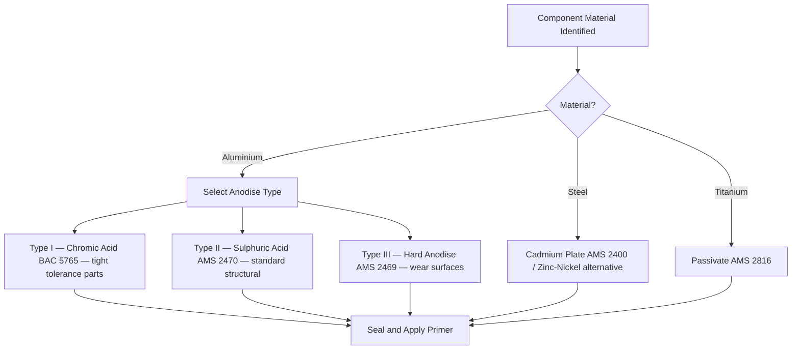

# ATLAS 050-059 · 05.051.060 — Anodizing, Plating and Chemical Treatments

> **ATLAS-1000** · Q+ATLANTIDE Baseline · Section 05.051 Standard Practices — Structures

---

## 1. Purpose

Defines the approved anodising, plating, and chemical conversion coating treatments for corrosion protection of metallic aircraft structure. These electrochemical and chemical processes form the base protection layer upon which subsequent primer and topcoat systems are applied.

---

## 2. Scope

### 2.1 Context

Anodising produces an oxide layer on aluminium that provides corrosion resistance and significantly improves adhesion for subsequent primers. Type II sulphuric acid anodising is the standard process for aluminium structural components. Type III hard anodising provides a thicker, harder oxide for wear-resistant surfaces such as hinges and sliding contacts. Chromic acid anodising (Type I) provides thin films with minimal dimensional change, used where close tolerances are critical.

Cadmium plating provides galvanically compatible, lubricious protection for steel fasteners and hardware. Alternatives to cadmium (zinc-nickel, aluminium-slurry) are increasingly required due to environmental restrictions on cadmium use in certain jurisdictions. All plating processes must be performed by qualified processors to the applicable AMS specification, with certification to accompany each batch.

### 2.2 Scope Diagram

### 2.3 Key Parameters

| Parameter | Value |
|-----------|-------|
| Type II Anodise Thickness | 18–25 µm per AMS 2470 |
| Type III Hard Anodise Thickness | 25–75 µm per AMS 2469 |
| Cadmium Plate Thickness | 5–13 µm per AMS 2400 |
| Alodine Touch-Up Thickness | 0.1–1.0 µm per MIL-DTL-5541 |

---

## 3. Footprint

| Field | Value |
|-------|-------|
| **Document ID** | `QATL-ATLAS-1000-ATLAS-050-059-05-051-060-ANODIZING-PLATING-AND-CHEMICAL-TREATMENTS` |
| **Status** |  |
| **Folder Path** | `Q+ATLANTIDE/000-099_ATLAS/050-059_Estructuras/051_Standard-Practices-Structures/051-060-Corrosion-Protection-Sealing-and-Surface-Treatment/` |

---

## 4. References

> [^1]: All references below are applicable at the revision level current at the time of document release. Superseded revisions must be assessed for impact before continued use.

| Reference | Description |
|-----------|-------------|
| AMS 2470 | Sulphuric Acid Anodic Coating of Aluminium Alloys |
| AMS 2469 | Hard Anodic Coating of Aluminium Alloys |
| AMS 2400 | Cadmium Plating |
| MIL-DTL-5541 | Chemical Conversion Coatings on Aluminium |
