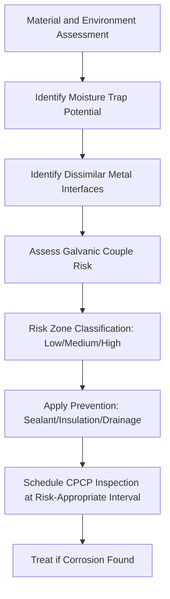

# ATLAS 050-059 · 05.051.060 — Corrosion Mechanisms and Risk Zones

> **ATLAS-1000** · Q+ATLANTIDE Baseline · Section 05.051 Standard Practices — Structures

---

## 1. Purpose

Identifies the principal corrosion mechanisms affecting aircraft structure and defines the structural risk zones based on environmental exposure and material susceptibility. Understanding the mechanism and location of corrosion is prerequisite to effective prevention and treatment.

---

## 2. Scope

### 2.1 Context

Aircraft structure is susceptible to multiple corrosion forms including galvanic, pitting, crevice, intergranular, stress corrosion cracking (SCC), and exfoliation. Risk zones are defined based on moisture trap potential, dissimilar metal interfaces, drainage characteristics, and operating environment exposure. High-risk zones require enhanced CPCP inspection frequency and additional protective measures.

Galvanic corrosion occurs at dissimilar metal interfaces where an electrolyte is present. The galvanic series ranks metals by electrochemical potential; the more anodic metal (magnesium, zinc, aluminium) corrodes preferentially when coupled to a more cathodic metal (stainless steel, titanium, carbon fibre). Galvanic isolation using sealants, insulating washers, or anodised surfaces is mandatory at structural dissimilar metal joints.

### 2.2 Scope Diagram

### 2.3 Key Parameters

| Parameter | Value |
|-----------|-------|
| High-Risk Zones | Bilge, lower fuselage skin, wheel wells, lap joints |
| SCC-Susceptible Materials | High-strength aluminium in 7075-T6 temper (certain environments) |
| Galvanic Protection | Sealant, anodise, or insulating spacer at all dissimilar interfaces |
| Moisture Trap Design Requirement | Drain within 24 hr of water ingress event |

---

## 3. Footprint

| Field | Value |
|-------|-------|
| **Document ID** | `QATL-ATLAS-1000-ATLAS-050-059-05-051-060-CORROSION-MECHANISMS-AND-RISK-ZONES` |
| **Status** |  |
| **Folder Path** | `Q+ATLANTIDE/000-099_ATLAS/050-059_Estructuras/051_Standard-Practices-Structures/051-060-Corrosion-Protection-Sealing-and-Surface-Treatment/` |

---

## 4. References

> [^1]: All references below are applicable at the revision level current at the time of document release. Superseded revisions must be assessed for impact before continued use.

| Reference | Description |
|-----------|-------------|
| AMS 2770 | Heat Treatment of Aluminium Alloys for SCC Resistance |
| MIL-HDBK-729 | Corrosion and Corrosion Control for Aerospace Applications |
| FAA AC 43-4B | Aircraft Corrosion Control Programme |
| EASA CS-25.603 | Material Properties and Corrosion Resistance Requirements |
