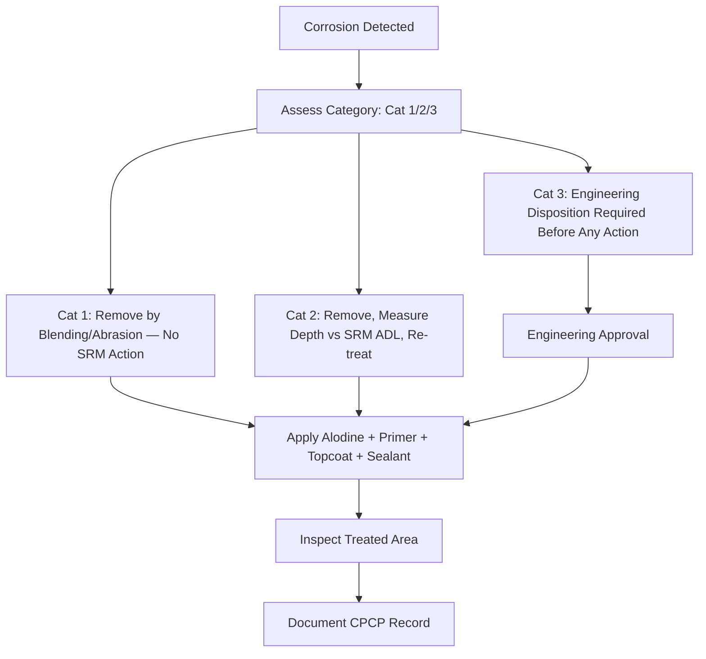

# ATLAS 050-059 · 05.051.060 — Corrosion Prevention and Control Practices

> **ATLAS-1000** · Q+ATLANTIDE Baseline · Section 05.051 Standard Practices — Structures

---

## 1. Purpose

Defines the corrosion prevention and control practices applied during maintenance and repair of Q+ATLANTIDE aircraft structures, including treatment methods for each corrosion category. These practices implement the CPCP and ensure structural surfaces are restored to their designed corrosion protection standard.

---

## 2. Scope

### 2.1 Context

Corrosion prevention relies on a layered system: material selection with inherent corrosion resistance, surface treatment (anodising or plating), barrier coatings (primer and topcoat), sealants at structural interfaces, and drainage design to prevent moisture accumulation. Active corrosion must be removed to bare metal and the affected area assessed for structural impact before re-treatment is applied.

Category 1 corrosion (surface only, ≤ 4% material loss) requires removal and re-treatment without structural repair. Category 2 corrosion requires removal, depth measurement against SRM allowable damage limits, and re-treatment; if within limits no structural repair is required. Category 3 corrosion exceeds the ADL and requires engineering disposition before re-treatment.

### 2.2 Scope Diagram

### 2.3 Key Parameters

| Parameter | Value |
|-----------|-------|
| Category 1 Threshold | Surface only, ≤ 4% material thickness loss |
| Category 2 Threshold | Pit depth within SRM ADL, no secondary structural damage |
| Category 3 Definition | Exceeds ADL or involves structural damage requiring repair |
| Re-treatment Sequence | Removal → Alodine → Epoxy Primer → Sealant → Topcoat |

---

## 3. Footprint

| Field | Value |
|-------|-------|
| **Document ID** | `QATL-ATLAS-1000-ATLAS-050-059-05-051-060-CORROSION-PREVENTION-AND-CONTROL-PRACTICES` |
| **Status** |  |
| **Folder Path** | `Q+ATLANTIDE/000-099_ATLAS/050-059_Estructuras/051_Standard-Practices-Structures/051-060-Corrosion-Protection-Sealing-and-Surface-Treatment/` |

---

## 4. References

> [^1]: All references below are applicable at the revision level current at the time of document release. Superseded revisions must be assessed for impact before continued use.

| Reference | Description |
|-----------|-------------|
| EASA AD 2002-0117 | CPCP Framework and Category Definitions |
| FAA AC 43-4B Chapter 5 | Corrosion Treatment Methods |
| AMM Chapter 51 | Corrosion Removal and Re-treatment Procedures |
| ATA MSG-3 CPCP Baseline | CPCP Task Development Guidelines |
