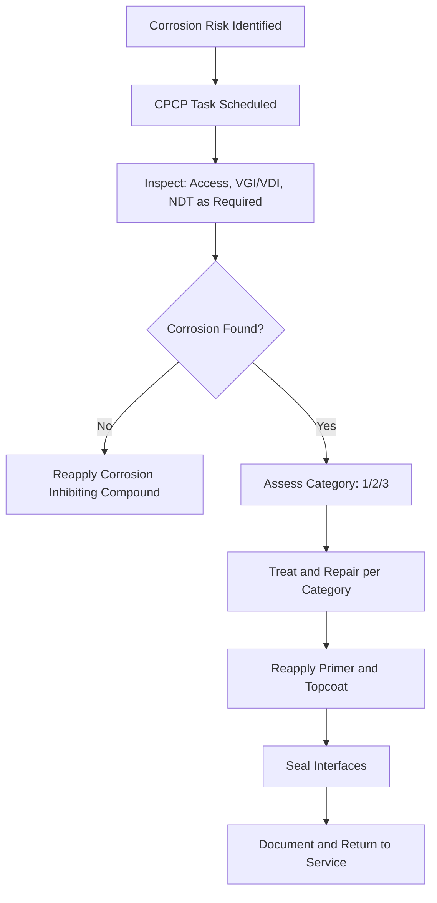

# ATLAS 050-059 · 05.051.060 — Corrosion Protection, Sealing and Surface Treatment — Overview

> **ATLAS-1000** · Q+ATLANTIDE Baseline · Section 05.051 Standard Practices — Structures

---

## 1. Purpose

Provides an overview of the corrosion protection, sealing, and surface treatment programme for Q+ATLANTIDE aircraft structures covering prevention, detection, and treatment of corrosion. The programme is implemented through the aircraft Corrosion Prevention and Control Programme (CPCP) as required by applicable EASA airworthiness directives.

---

## 2. Scope

### 2.1 Context

Corrosion is a primary threat to structural integrity and airworthiness throughout the aircraft operational life. The aircraft CPCP defines the inspection intervals, treatment procedures, and documentation requirements to manage corrosion risk. All structural surfaces must receive appropriate surface treatment in accordance with the applicable specification and be maintained through the CPCP.

The CPCP is derived from the manufacturer's baseline programme and adapted for operator-specific routes and environments. CPCP tasks are published in the MPD Chapter 05 and must be tracked by the CAMO. Operators in corrosive environments (coastal, tropical, or high-humidity routes) may be required to apply enhanced CPCP programmes per national authority instruction.

### 2.2 Scope Diagram

### 2.3 Key Parameters

| Parameter | Value |
|-----------|-------|
| CPCP Regulatory Authority | EASA Airworthiness Directive / OEM Service Bulletin |
| Corrosion Categories | Cat 1 Minor / Cat 2 Significant / Cat 3 Structural |
| Inspection Interval | CPCP tasks per MPD Chapter 05 |
| Treatment Standard | MIL-HDBK-1 series CPCP requirements |

---

## 3. Footprint

| Field | Value |
|-------|-------|
| **Document ID** | `QATL-ATLAS-1000-ATLAS-050-059-05-051-060-CORROSION-PROTECTION-SEALING-AND-SURFACE-TREATMENT-OVERVIEW` |
| **Status** |  |
| **Folder Path** | `Q+ATLANTIDE/000-099_ATLAS/050-059_Estructuras/051_Standard-Practices-Structures/051-060-Corrosion-Protection-Sealing-and-Surface-Treatment/` |

---

## 4. References

> [^1]: All references below are applicable at the revision level current at the time of document release. Superseded revisions must be assessed for impact before continued use.

| Reference | Description |
|-----------|-------------|
| EASA AD 2002-0117 | CPCP Mandatory Requirements for Transport Category Aircraft |
| FAA AC 43-4B | Corrosion Control for Aircraft |
| AMM Chapter 51 | Surface Treatment and Corrosion Control Procedures |
| ATA MSG-3 | CPCP Development within MSG-3 Maintenance Programme |
