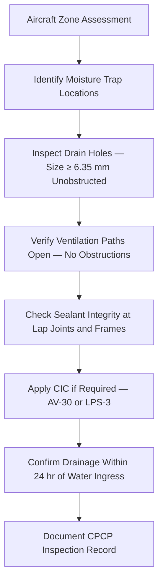

# ATLAS 050-059 · 05.051.060 — Drainage, Ventilation and Moisture Control

> **ATLAS-1000** · Q+ATLANTIDE Baseline · Section 05.051 Standard Practices — Structures

---

## 1. Purpose

Defines the design and maintenance requirements for structural drainage, ventilation, and moisture control to prevent moisture entrapment that accelerates corrosion. Maintaining functional drainage and ventilation is a core CPCP task applicable throughout the aircraft's service life.

---

## 2. Scope

### 2.1 Context

Moisture control is a critical element of the CPCP. Structural areas prone to moisture accumulation include bilge areas, wing fuel tank periphery, wheel wells, and fuselage lap joints. Drain holes must be kept unobstructed and free from sealant or paint bridging; ventilation paths must be maintained to reduce relative humidity in sealed bays and prevent condensation on cold structural surfaces.

Inspectors must verify that drain holes are open, correctly sized, and positioned to allow rapid drainage of accumulated water. Blocked drain holes must be cleared using approved tooling; chemical cleaners or picks that could damage the drain hole grommet or alter the structural interface must not be used. Corrosion inhibiting compound (CIC) must be reapplied to exposed structure following drain inspection.

### 2.2 Scope Diagram

### 2.3 Key Parameters

| Parameter | Value |
|-----------|-------|
| Minimum Drain Hole Diameter | 6.35 mm (0.25 in) per structural drawing |
| Corrosion Inhibiting Compound | AV-30 or LPS-3 (per approved materials list) |
| Sealed Bay Humidity Target | < 85% RH to prevent accelerated corrosion |
| CPCP Inspection Interval | Per MPD Chapter 05 task card |

---

## 3. Footprint

| Field | Value |
|-------|-------|
| **Document ID** | `QATL-ATLAS-1000-ATLAS-050-059-05-051-060-DRAINAGE-VENTILATION-AND-MOISTURE-CONTROL` |
| **Status** |  |
| **Folder Path** | `Q+ATLANTIDE/000-099_ATLAS/050-059_Estructuras/051_Standard-Practices-Structures/051-060-Corrosion-Protection-Sealing-and-Surface-Treatment/` |

---

## 4. References

> [^1]: All references below are applicable at the revision level current at the time of document release. Superseded revisions must be assessed for impact before continued use.

| Reference | Description |
|-----------|-------------|
| AMM Chapter 51 | Drainage Maintenance Procedures |
| FAA AC 43-4B | Moisture Control in Aircraft Corrosion Prevention |
| ATA Spec 100 | Drain Hole Design and Maintenance Standards |
| EASA AD 2002-0117 | CPCP Moisture Management Requirements |
