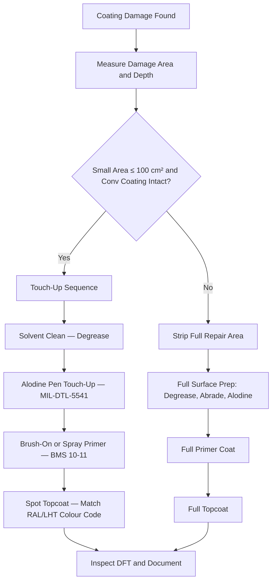

# ATLAS 050-059 · 05.051.060 — Inspection, Touch-Up and Repair of Protective Treatments

> **ATLAS-1000** · Q+ATLANTIDE Baseline · Section 05.051 Standard Practices — Structures

---

## 1. Purpose

Defines the inspection criteria, touch-up procedures, and full repair sequences for deteriorated or damaged protective coating systems on aircraft structure. Timely restoration of coating systems prevents corrosion initiation at bare metal exposures.

---

## 2. Scope

### 2.1 Context

Protective treatments deteriorate through chipping, scratching, abrasion, chemical exposure, and thermal cycling during normal aircraft operations. Touch-up of small areas (≤ 100 cm²) using approved brush-on or spray systems is permitted when the underlying conversion coating is intact and the substrate shows no active corrosion. Large area damage or conversion coating loss requires full surface preparation and recoating per the primary coating specification.

The inspector must assess the coating damage condition before selecting the repair approach. If active corrosion is present beneath the damaged coating, corrosion treatment must be completed before touch-up. Touch-up materials must be sourced from the approved vendor list and must be within their shelf-life at the time of application.

### 2.2 Scope Diagram

### 2.3 Key Parameters

| Parameter | Value |
|-----------|-------|
| Maximum Touch-Up Area | ≤ 100 cm² per single touch-up application |
| Touch-Up Alodine | MIL-DTL-5541 pen applicator — approved for touch-up |
| Minimum Touch-Up Primer DFT | ≥ 18 µm after cure |
| Minimum Touch-Up Topcoat DFT | ≥ 50 µm after cure |

---

## 3. Footprint

| Field | Value |
|-------|-------|
| **Document ID** | `QATL-ATLAS-1000-ATLAS-050-059-05-051-060-INSPECTION-TOUCH-UP-AND-REPAIR-OF-PROTECTIVE-TREATMENTS` |
| **Status** |  |
| **Folder Path** | `Q+ATLANTIDE/000-099_ATLAS/050-059_Estructuras/051_Standard-Practices-Structures/051-060-Corrosion-Protection-Sealing-and-Surface-Treatment/` |

---

## 4. References

> [^1]: All references below are applicable at the revision level current at the time of document release. Superseded revisions must be assessed for impact before continued use.

| Reference | Description |
|-----------|-------------|
| BMS 10-11 | Touch-Up Primer Procedures and Application Limits |
| AMM Chapter 51 | Paint Repair and Touch-Up Procedures |
| MIL-DTL-5541 | Chemical Conversion Coating Touch-Up Requirements |
| FAA AC 43-4B | Protective Coating Repair and Maintenance |
