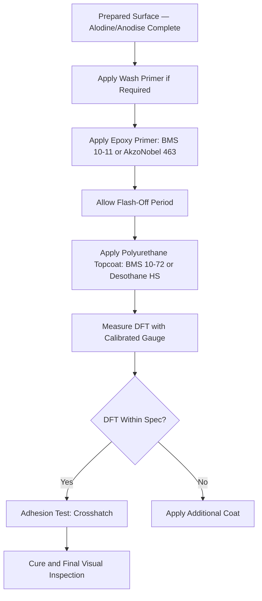

# ATLAS 050-059 · 05.051.060 — Primers, Coatings and Paint Systems

> **ATLAS-1000** · Q+ATLANTIDE Baseline · Section 05.051 Standard Practices — Structures

---

## 1. Purpose

Specifies the approved primers, topcoats, and paint systems used on Q+ATLANTIDE aircraft structure, including application parameters and dry film thickness requirements. The complete coating system provides multi-layer corrosion protection and UV stability for the aircraft operational life.

---

## 2. Scope

### 2.1 Context

The complete coating system provides corrosion protection through a conversion coating layer (anodise or alodine), an epoxy primer layer providing adhesion and corrosion inhibition, and a polyurethane topcoat providing UV and chemical resistance. Interior zones typically use a wash primer and epoxy system; exterior zones require a UV-stable polyurethane topcoat with high gloss retention for the aircraft's operational life exposure.

Spray application is preferred for large areas to achieve uniform dry film thickness (DFT) and minimise solvent entrapment. Brush or roller application is permitted for touch-up areas ≤ 100 cm². DFT must be measured with a calibrated gauge after curing and recorded in the maintenance documentation. Areas below minimum DFT must be re-coated before service.

### 2.2 Scope Diagram

### 2.3 Key Parameters

| Parameter | Value |
|-----------|-------|
| Epoxy Primer DFT | 18–25 µm dry film thickness |
| Polyurethane Topcoat DFT | 50–75 µm exterior, 25–50 µm interior |
| Maximum Total System DFT | ≤ 150 µm for fuselage exterior (weight control) |
| Approved Topcoat Systems | BMS 10-72 polyurethane / Desothane HS |

---

## 3. Footprint

| Field | Value |
|-------|-------|
| **Document ID** | `QATL-ATLAS-1000-ATLAS-050-059-05-051-060-PRIMERS-COATINGS-AND-PAINT-SYSTEMS` |
| **Status** |  |
| **Folder Path** | `Q+ATLANTIDE/000-099_ATLAS/050-059_Estructuras/051_Standard-Practices-Structures/051-060-Corrosion-Protection-Sealing-and-Surface-Treatment/` |

---

## 4. References

> [^1]: All references below are applicable at the revision level current at the time of document release. Superseded revisions must be assessed for impact before continued use.

| Reference | Description |
|-----------|-------------|
| BMS 10-11 | Primer Material and Application Specification |
| BMS 10-72 | Polyurethane Topcoat Specification |
| AMM Chapter 51 | Paint Application Procedures and DFT Requirements |
| MIL-PRF-85285 | Coating, Polyurethane — High Solids |
