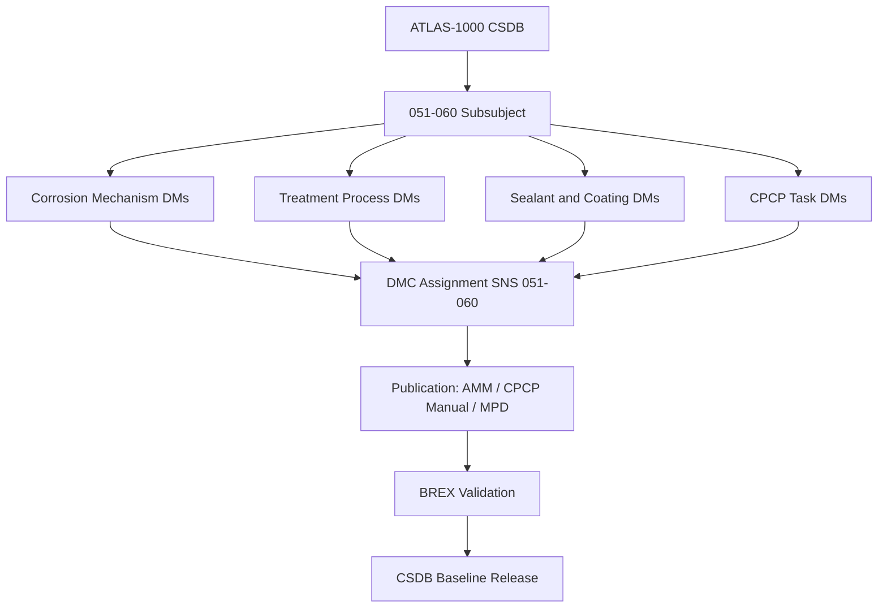

# ATLAS 050-059 · 05.051.060 — S1000D CSDB Mapping and Traceability

> **ATLAS-1000** · Q+ATLANTIDE Baseline · Section 05.051 Standard Practices — Structures

---

## 1. Purpose

Provides the S1000D DMC mapping and CSDB traceability matrix for all documents within the 051-060 Corrosion Protection, Sealing and Surface Treatment subsubject. This mapping enables structured publication and compliance tracking of corrosion control documentation within the ATLAS-1000 CSDB.

---

## 2. Scope

### 2.1 Context

Each document in this subsubject is assigned a unique S1000D DMC under the ATLAS-1000 CSDB using SNS 051-060, enabling structured publication into AMM corrosion control chapters, CPCP task cards, and surface treatment process data modules. Traceability from CPCP task data module to inspection record data module ensures that the regulatory CPCP compliance chain is maintained and auditable.

Periodic reviews of the CPCP data module set are required when the baseline CPCP is revised following fleet corrosion survey findings or regulatory amendment. All affected data modules must be re-issued under the CSDB change authority process, with delta data modules generated for any content change before re-publication.

### 2.2 Scope Diagram

### 2.3 Key Parameters

| Parameter | Value |
|-----------|-------|
| DMC Model Identifier | QATL |
| SNS Code | 051-060 Corrosion and Surface Treatment |
| Issue Authority | Q-STRUCTURES / Technical Publications |
| BREX File | ATLAS-1000-BREX-051.xml |

---

## 3. Footprint

| Field | Value |
|-------|-------|
| **Document ID** | `QATL-ATLAS-1000-ATLAS-050-059-05-051-060-S1000D-CSDB-MAPPING-AND-TRACEABILITY` |
| **Status** |  |
| **Folder Path** | `Q+ATLANTIDE/000-099_ATLAS/050-059_Estructuras/051_Standard-Practices-Structures/051-060-Corrosion-Protection-Sealing-and-Surface-Treatment/` |

---

## 4. References

> [^1]: All references below are applicable at the revision level current at the time of document release. Superseded revisions must be assessed for impact before continued use.

| Reference | Description |
|-----------|-------------|
| S1000D Issue 5.0 | DMC Coding Rules and Publication Standards |
| ASD SX000i | Integrated Technical Publication Framework |
| ATLAS BREX Q+ATLANTIDE | Business Rules Exchange for ATLAS-1000 CSDB |
| AMM Chapter 51 | CPCP Task Reference and Corrosion Control Documentation |
