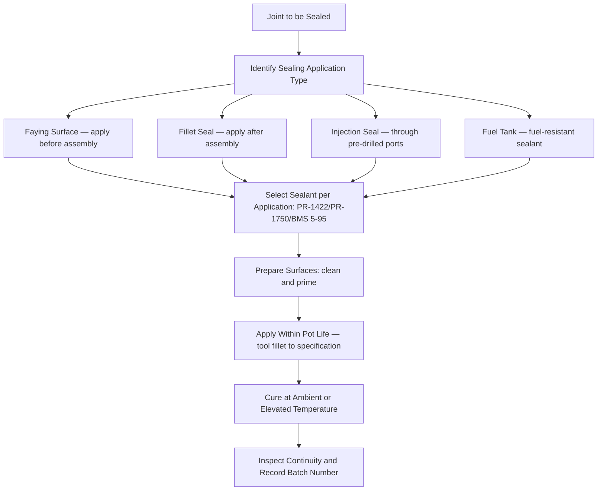

# ATLAS 050-059 · 05.051.060 — Sealants and Sealing Practices

> **ATLAS-1000** · Q+ATLANTIDE Baseline · Section 05.051 Standard Practices — Structures

---

## 1. Purpose

Defines the approved sealant systems, application methods, and curing requirements for structural sealing applications including faying surface, fillet, and injection sealing. Correct sealant selection and application technique are essential to maintain fuel tank integrity, prevent corrosion at structural interfaces, and maintain aerodynamic surface continuity.

---

## 2. Scope

### 2.1 Context

Sealants serve multiple functions: preventing electrolyte ingress into structural interfaces, maintaining fuel tank integrity, providing aerodynamic smoothness at panel interfaces, and acting as a barrier against galvanic corrosion at dissimilar metal joints. The correct sealant type must be selected based on application zone, service temperature range, and chemical exposure environment.

All sealant application must be performed within the pot life specified in the BMS or AMS specification. Surfaces must be clean, primed, and within the primer open time window before sealant application. Cured sealant that has failed or been damaged must be fully removed and the area re-prepared before re-sealing; partial removal is not acceptable for structural interface applications.

### 2.2 Scope Diagram

### 2.3 Key Parameters

| Parameter | Value |
|-----------|-------|
| Faying Surface Sealant | PR-1422 Class B (two-component polysulfide) |
| Fuel Tank Sealant | PR-1750 Class B (fuel-resistant polysulfide) |
| Structural Fillet Sealant | PR-1826 Class B — structural fillet application |
| Pot Life at 25°C | PR-1422: approximately 2 hr |

---

## 3. Footprint

| Field | Value |
|-------|-------|
| **Document ID** | `QATL-ATLAS-1000-ATLAS-050-059-05-051-060-SEALANTS-AND-SEALING-PRACTICES` |
| **Status** |  |
| **Folder Path** | `Q+ATLANTIDE/000-099_ATLAS/050-059_Estructuras/051_Standard-Practices-Structures/051-060-Corrosion-Protection-Sealing-and-Surface-Treatment/` |

---

## 4. References

> [^1]: All references below are applicable at the revision level current at the time of document release. Superseded revisions must be assessed for impact before continued use.

| Reference | Description |
|-----------|-------------|
| AMS 3276 | Aerospace Sealant Specification |
| BMS 5-95 | Boeing Sealant Material Specification |
| AMM Chapter 51 | Sealing Procedures and Sealant Application |
| ATA 12-20 | Sealing Requirements for Aircraft Maintenance |
