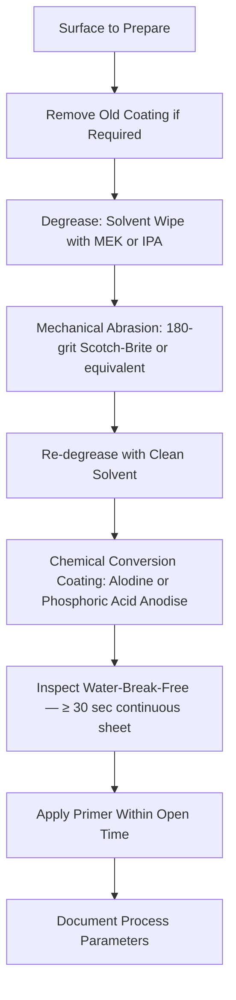

# ATLAS 050-059 · 05.051.060 — Surface Cleaning and Preparation

> **ATLAS-1000** · Q+ATLANTIDE Baseline · Section 05.051 Standard Practices — Structures

---

## 1. Purpose

Defines approved methods for cleaning and preparing metallic and composite aircraft surfaces prior to surface treatment, priming, painting, or bonding operations. Surface cleanliness is the fundamental prerequisite for adhesion of all protective coatings and bonded repairs.

---

## 2. Scope

### 2.1 Context

Surface cleanliness directly determines the adhesion quality of primers, topcoats, and bonded repairs. Contamination from hydraulic fluid, lubricating oils, and release agents must be fully removed before any coating or bonding operation proceeds. Solvent cleaning is followed by mechanical abrasion or chemical conversion to create a chemically active, high surface energy substrate.

Different preparation sequences apply to different substrates: aluminium alloys require degreasing, abrasion, and chemical conversion (alodine or phosphoric acid anodise); titanium requires degreasing and passivation; steel requires degreasing, abrasion, and phosphate treatment or primer direct; composite surfaces require peel-ply removal or controlled abrasion followed by primer. The correct sequence for each substrate is specified in the applicable AMM task or BMS specification.

### 2.2 Scope Diagram

### 2.3 Key Parameters

| Parameter | Value |
|-----------|-------|
| Degreasing Solvent | MEK (ASTM D740) or IPA (MIL-I-6702) |
| Abrasive Grade | 120–220 grit aluminium oxide or 180-grit Scotch-Brite |
| Alodine Specification | MIL-DTL-5541 Type 1 or Type 2 |
| Water-Break-Free Duration | ≥ 30 sec continuous water sheet required |

---

## 3. Footprint

| Field | Value |
|-------|-------|
| **Document ID** | `QATL-ATLAS-1000-ATLAS-050-059-05-051-060-SURFACE-CLEANING-AND-PREPARATION` |
| **Status** |  |
| **Folder Path** | `Q+ATLANTIDE/000-099_ATLAS/050-059_Estructuras/051_Standard-Practices-Structures/051-060-Corrosion-Protection-Sealing-and-Surface-Treatment/` |

---

## 4. References

> [^1]: All references below are applicable at the revision level current at the time of document release. Superseded revisions must be assessed for impact before continued use.

| Reference | Description |
|-----------|-------------|
| MIL-DTL-5541 | Chemical Conversion Coating for Aluminium Alloys |
| ASTM B449 | Chemical Film on Aluminium — Quality and Verification |
| AMM Chapter 51 | Surface Preparation Procedures |
| BMS 10-11 | Primer Application Process Specification |
