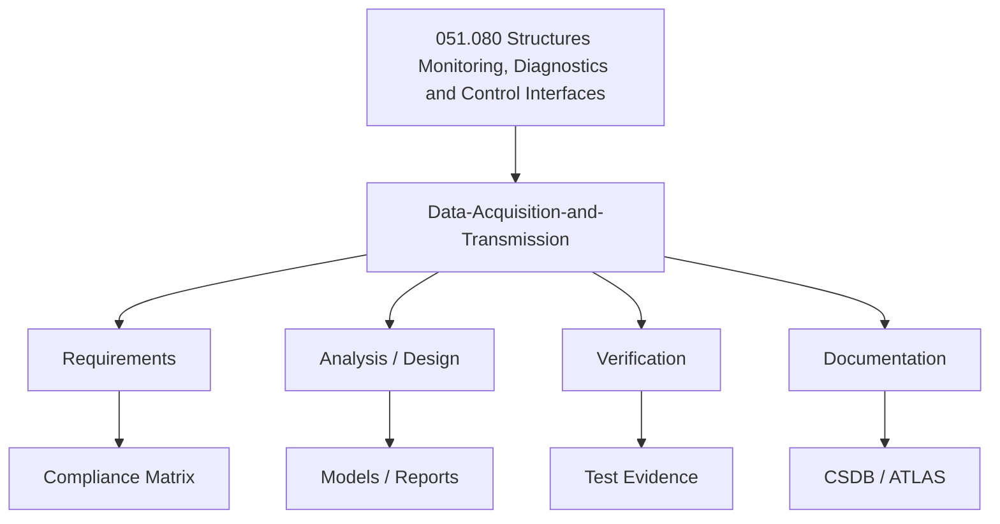

# ATLAS 050-059 · 05.051.080 — Data-Acquisition-and-Transmission

> 05.051.080 | Structures Monitoring, Diagnostics and Control Interfaces

## 1. Purpose

Data acquisition units, sampling rates, onboard storage, and ground transmission protocols.

## 2. Scope

### 2.1 Context

This document addresses **Data-Acquisition-and-Transmission** as part of the 051.080 subsubject within the Q+ATLANTIDE ATLAS 050-059 Estructuras section. It defines the technical boundaries, key parameters, and interfaces relevant to this topic across all Q+ programme configurations.

The scope encompasses design, analysis, and documentation activities applicable to primary and secondary structure where Data Acquisition and Transmission considerations are relevant. Applicability is governed by the effectivity codes defined in the programme CSDB.

Compliance and traceability to CS-25, ARP4754A, and programme-level requirements are maintained through the ATLAS governance process.

### 2.2 Scope Diagram

### 2.3 Key Parameters

| Parameter | Value / Reference | Unit | Notes |
|-----------|-------------------|------|-------|
| Governance Class | baseline | — | ATLAS-1000 |
| Primary Q-Division | Q-STRUCTURES | — | Owner |
| Version | 1.0.0 | — | Initial draft |
| Status | DRAFT | — | Pending review |

## 3. Footprint

| Document ID | Status | Folder Path |
|-------------|--------|-------------|
| `QATL-ATLAS-1000-ATLAS-050-059-05-051-080-DATA-ACQUISITION-AND-TRANSMISSION` |  | `Q+ATLANTIDE/000-099_ATLAS/050-059_Estructuras/051_Standard-Practices-Structures/051-080-Structures-Monitoring-Diagnostics-and-Control-Interfaces/` |

## 4. References

[^1]: Refer to parent subsubject index `051-080-Structures-Monitoring-Diagnostics-and-Control-Interfaces/README.md` for the complete document list and change history.

| Reference | Title | Source | Notes |
|-----------|-------|--------|-------|
| CS-25 | Certification Specifications for Large Aeroplanes | EASA | Applicable amendment |
| ARP4754A | Guidelines for Development of Civil Aircraft and Systems | SAE | Rev A |
| Q+ATLANTIDE | Programme Baseline Document | Q+ | See `organization/Q+ATLANTIDE.md` |
| ATLAS-1000 | Aircraft Top Level Architecture Schema/System | Q+ | ATLAS register |
