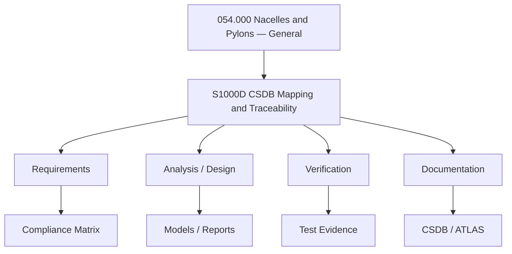

# ATLAS 050-059 · 05.054.000 — S1000D CSDB Mapping and Traceability

> 05.054.000 | Nacelles and Pylons — General

## 1. Purpose

This document defines **S1000D CSDB Mapping and Traceability** within the 054.000 subsubject of the Q+ATLANTIDE ATLAS 050-059 Estructuras / 054 Nacelles and Pylons section. It establishes the technical scope, key parameters, and programme governance applicable to this topic.

## 2. Scope

### 2.1 Context

This document addresses **S1000D CSDB Mapping and Traceability** as part of the 054.000 subsubject within the Q+ATLANTIDE ATLAS 050-059 Estructuras section. It defines the technical boundaries, key parameters, and interfaces relevant to this topic across all Q+ programme configurations.

The scope encompasses design, analysis, and documentation activities applicable to nacelles and pylons where s1000d csdb mapping and traceability considerations are relevant. Applicability is governed by the effectivity codes defined in the programme CSDB.

Compliance and traceability to CS-25, ARP4754A, and programme-level requirements are maintained through the ATLAS governance process.

### 2.2 Scope Diagram

## 3. Footprint

| Attribute | Value |
|-----------|-------|
| Folder path | `Q+ATLANTIDE/000-099_ATLAS/050-059_Estructuras/054_Nacelles-and-Pylons/054-000-Nacelles-and-Pylons-General/` |
| Document ID prefix | `QATL-ATLAS-1000-ATLAS-050-059-05-054-000` |
| Subsection | 054 — Nacelles and Pylons |
| Subsubject | 000 — Nacelles and Pylons — General |
| Status |  |

## 4. References

| Ref | Document | Applicability |
|-----|----------|---------------|
| [1] | CS-25 Subpart C — Structure | All variants |
| [2] | ARP4754A — Development of Civil Aircraft Systems | All |
| [3] | Q+ATLANTIDE ATLAS 050-059 README | Section governance |
| [4] | S1000D Issue 5.0 — Data Module structure | CSDB delivery |
