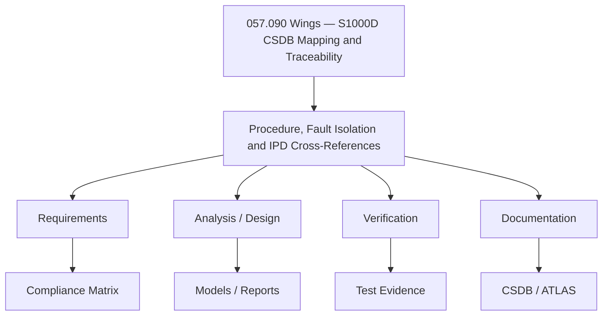

# ATLAS 050-059 · 05.057.090 — Procedure, Fault Isolation and IPD Cross-References

> 05.057.090 | Wings — S1000D CSDB Mapping and Traceability

## 1. Purpose

This document defines **Procedure, Fault Isolation and IPD Cross-References** within the 057.090 subsubject of the Q+ATLANTIDE ATLAS 050-059 Estructuras / 057 Wings section. It establishes the technical scope, key parameters, and programme governance applicable to this topic.

## 2. Scope

### 2.1 Context

This document addresses **Procedure, Fault Isolation and IPD Cross-References** as part of the 057.090 subsubject within the Q+ATLANTIDE ATLAS 050-059 Estructuras section. It defines the technical boundaries, key parameters, and interfaces relevant to this topic across all Q+ programme configurations.

The scope encompasses design, analysis, and documentation activities applicable to wings where procedure, fault isolation and ipd cross-references considerations are relevant. Applicability is governed by the effectivity codes defined in the programme CSDB.

Compliance and traceability to CS-25, ARP4754A, and programme-level requirements are maintained through the ATLAS governance process.

### 2.2 Scope Diagram

## 3. Footprint

| Attribute | Value |
|-----------|-------|
| Folder path | `Q+ATLANTIDE/000-099_ATLAS/050-059_Estructuras/057_Wings/057-090-S1000D-CSDB-Mapping-and-Traceability/` |
| Document ID prefix | `QATL-ATLAS-1000-ATLAS-050-059-05-057-090` |
| Subsection | 057 — Wings |
| Subsubject | 090 — Wings — S1000D CSDB Mapping and Traceability |
| Status |  |

## 4. References

| Ref | Document | Applicability |
|-----|----------|---------------|
| [1] | CS-25 Subpart C — Structure | All variants |
| [2] | ARP4754A — Development of Civil Aircraft Systems | All |
| [3] | Q+ATLANTIDE ATLAS 050-059 README | Section governance |
| [4] | S1000D Issue 5.0 — Data Module structure | CSDB delivery |
