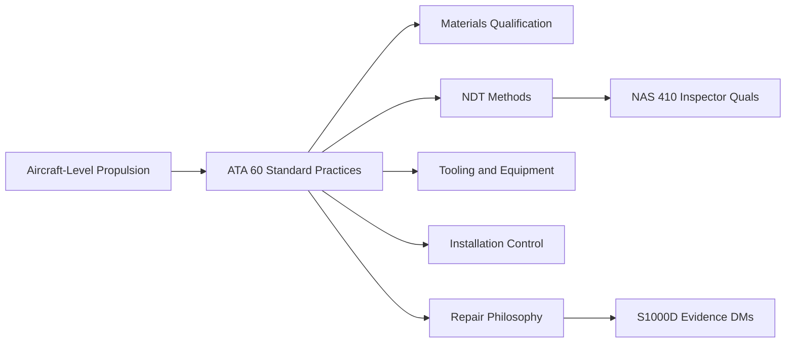
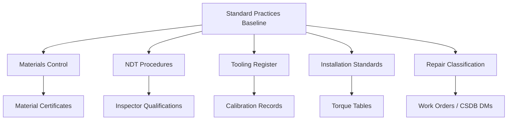

<!-- ──────────────────────────────────────────────────────────────────────────
     QATL-ATLAS-1000-ATLAS-060-069-060-000-STANDARD-PRACTICES-—-PROPELLER-ROTOR-GENERAL
     ATA 60 · Standard Practices — Propeller/Rotor General
     AMPEL360E eWTW — ATLAS Register 1000
────────────────────────────────────────────────────────────────────────────── -->

# Standard Practices — Propeller/Rotor General

---

## §0 Hyperlink Policy

> All hyperlinks in this document are **relative** (five directory levels: `../../../../../`).
> Absolute URLs are forbidden. Every linked document must exist in the Q+ATLANTIDE repository
> before the link is activated. Broken links are treated as open issues and must be resolved
> before the document is promoted from `DRAFT` to `APPROVED`.

---

## §1 Purpose

This document establishes the general scope, governing standards, and controlling philosophy for all Standard Practices applicable to propeller, rotor, and propulsor assemblies within the AMPEL360E eWTW programme. ATA Chapter 60 provides the cross-cutting procedural baseline that underpins every type-specific maintenance activity described in ATA Chapters 61–69.

On the AMPEL360E eWTW, propeller/rotor systems are not the primary propulsor for cruise; the aircraft uses high-bypass turbofan engines. However, ATA 60 Standard Practices remain mandatory for any auxiliary propulsor study, rotorcraft-heritage component programmes, ground-power extraction propulsors, and any future distributed propulsion integration. All such components must comply with the material qualification, NDT approval, tooling control, and documentation traceability standards defined here.

The Standard Practices baseline is controlled by Q-GREENTECH as primary Q-Division, with Q-MECHANICS leading process engineering, Q-AIR providing aeromechanical interface review, and Q-INDUSTRY overseeing supplier quality and manufacturing readiness. All procedures issued under this chapter must reference an approved AMPEL360E AMM task code and carry a valid CSDB data-module cross-reference before entry into the aircraft maintenance programme.

---

## §2 Applicability

| Parameter | Value |
|---|---|
| Aircraft Program | AMPEL360E eWTW |
| Governing standard | ATA iSpec 2200, Chapter 60 |
| Supplementary standard | SAE AS7506 — Propeller maintenance practices |
| NDT qualification | NAS 410 / EN 4179 |
| Certification basis | EASA CS-25 Amendment 27+ |
| Q-Division authority | Q-GREENTECH (primary) |
| BREX constraint | Bleed-less design — no pneumatic torque provisions |
| S1000D SNS | 060-000-00 |

---

## §3 Functional Description ![DRAFT]

ATA 60 Standard Practices define the procedural envelope within which all propeller and rotor maintenance is executed. The chapter governs six core practice domains:

1. **Materials qualification** — specification and approval of metals, composites, coatings, adhesives, and sealants for propeller/rotor applications.
2. **Non-Destructive Testing** — approved NDT methods (dye-penetrant, ultrasonic, eddy-current, thermography) and inspector qualification requirements per NAS 410.
3. **Tooling and equipment** — approved special tools, balance machines, and test fixtures; calibration intervals and traceability.
4. **Installation and torque control** — standard torque tables, anti-seize compounds, thread-locking provisions, and installation sequence logic.
5. **Repair philosophy** — damage classification, repair-or-replace decision boundaries, and blend repair limits.
6. **Documentation and traceability** — part identity tags, work records, material certs, and S1000D data-module evidence linkage.

---

## §4 Functional Breakdown

| ID | Name | Description | Lead Division |
|---|---|---|---|
| F-001 | Materials Qualification | Approve and traceably qualify all materials used in propeller/rotor construction and repair. | Materials engineering / Q-INDUSTRY |
| F-002 | NDT Method Control | Specify and approve NDT inspection methods; maintain inspector qualification records per NAS 410. | NDT authority / Q-MECHANICS |
| F-003 | Tooling Control | Manage special tools, balance machines, test fixtures; maintain calibration records. | Tool crib / Q-INDUSTRY |
| F-004 | Installation and Torque | Define standard torque values, anti-seize and thread-lock requirements, and installation sequences. | AMM task authority |
| F-005 | Repair Decision | Classify damage; define blend, repair, or replace criteria for all component classes. | Engineering / Q-MECHANICS |

---

## §5 System Context — Mermaid Diagram

---

## §6 Internal Architecture — Mermaid Diagram

---

## §7 Components and LRUs

| Component | Part Number | Qty | Location | Maintenance Interval | Notes |
|---|---|---|---|---|---|
| Approved NDT test sets (eddy-current, UT, PT) | Various | Per SWAM list | NDT lab / line maintenance | Per calibration interval (6–12 months) | TBD |
| Propeller/rotor balance machine | Dynamic balance stand | 1 | Maintenance bay | Annual calibration | TBD |
| Torque wrench set (1–2 000 N·m range) | Approved tool list | Per hangar | Tool crib | Per AMM calibration requirement | TBD |
| Blade handling cradles | Special tool per blade type | Per programme | Hangar storage | Periodic inspection | TBD |
| Material identification kit (alloy analyser, spectrometer) | Portable XRF | 1 per line station | NDT lab | Annual calibration | TBD |

---

## §8 Interfaces

| Interface Type | Connected System | Protocol / Medium | Data / Function |
|---|---|---|---|
| Maintenance data | CSDB / IETP | S1000D DM link | Approved procedures and task codes |
| Materials supply | Q-INDUSTRY / procurement | Material certificates | Batch traceability records |
| NDT qualification | NAS 410 / EN 4179 authority | Qualification records | Inspector cert database |
| Engineering | Q-MECHANICS | Disposition authority | Repair approval and concession records |
| Quality assurance | QA authority | Audit and inspection | Compliance verification records |

---

## §9 Operating Modes

| Mode | Trigger | System State | Actions / Consequences |
|---|---|---|---|
| In-service maintenance | Normal aircraft operation | Scheduled task | Close-up and return-to-service check |
| Base/shop maintenance | Heavy inspection cycle | Component removal from aircraft | Serviceable return or replacement |
| Repair disposition | Damage found | Damage beyond standard limits | Approved repair or replacement |
| Tooling calibration | Scheduled interval or tool event | Tool removed from service | Calibration complete, tool returned |

---

## §10 Performance and Budgets ![DRAFT]

| Parameter | Requirement | Target / Design Value | Status |
|---|---|---|---|
| NDT detection probability (DP) | ≥ 90 % at critical crack size | Demonstrated per NAS 410 | TBD |
| Torque retention (24 h after installation) | Residual torque ≥ 80 % applied | Measured per test sample | TBD |
| Balance residual imbalance | < 5 g·cm on any balance plane | Post-balance verification | TBD |
| Material cert traceability | 100 % batch-to-part traceability | QMS / ERP system | TBD |

---

## §11 Safety, Redundancy and Fault Tolerance

- All NDT tasks require inspector qualification current to NAS 410 / EN 4179 Level II or III; unqualified personnel are prohibited from signing off NDT records.
- Torque application shall only be performed with calibrated torque tooling; use of non-calibrated tools is a safety stop condition.
- Blade handling cradles are mandatory for all blade transport and installation; dropping or impact events require mandatory NDT re-inspection before return to service.
- Anti-seize and thread-locking compounds must match the approved specification per the applicable component maintenance manual; misapplication can cause incorrect preload.
- All removed life-limited parts (LLPs) must be permanently mutilated before disposal to prevent re-entry into the supply chain.

---

## §12 Maintenance and Diagnostics

| Task | Interval | Access | Special Tools |
|---|---|---|---|
| Scheduled NDT inspection of hub bore | Per blade removal | Hub removal / shop | Eddy-current test set, calibration standard |
| Torque wrench calibration check | 6-month or 500 operations | Tool crib | Calibration bench |
| Balance machine levelling and calibration | Annual or after relocation | Balance bay | Calibration masses, level standard |
| Material certificate audit | Annual / per batch receipt | QMS review | Batch records, ERP system |
| Blade storage cradle inspection | Annual / before each use | Storage area | Visual inspection checklist |

---

## §13 Footprint — Physical, Electrical, Maintenance, Data ![TBD]

| Footprint Type | Parameter | Value | Notes |
|---|---|---|---|
| Physical | Mass (system total) | ![TBD] | Pending OEM data |
| Physical | Envelope (max) | ![TBD] | Pending detailed design |
| Electrical | Peak power (W) | ![TBD] | To be defined |
| Maintenance | Access category | Standard line maintenance | Per AMM |
| Data | AFDX bandwidth | ![TBD] | Per AFDX bus load analysis |

---

## §14 Safety and Certification References ![DRAFT]

| Standard / Document | Title | Issuing Body | Applicability |
|---|---|---|---|
| ATA iSpec 2200 | Chapter 60 — Propeller Standard Practices | Air Transport Association | Chapter scope and numbering |
| SAE AS7506 | Maintenance Processes and Procedures for Aircraft Propellers | SAE International | Propeller maintenance practice baseline |
| NAS 410 | Certification and Qualification of NDT Personnel | AIA / NASM | NDT inspector qualification |
| EASA CS-25 Amdt 27 | Airworthiness Standards — Large Aeroplanes | EASA | Certification basis |
| DO-160G | Environmental Conditions and Test Procedures for Airborne Equipment | RTCA | Environmental qualification of test equipment |

---

## §15 V&V Approach ![TBD]

| Phase | Method | Acceptance Criterion | Status |
|---|---|---|---|
| Design | Analysis and simulation | Meets all §10 performance requirements | ![TBD] |
| Integration | Ground functional test | All BITE tests pass; interfaces verified | ![TBD] |
| Qualification | DO-160G environmental test | All applicable tests pass | ![TBD] |
| Certification | EASA CS-25 / CS-E compliance demonstration | Type Certificate / STC approval | ![TBD] |

---

## §16 Glossary

| Term | Definition |
|---|---|
| **NAS 410** | National Aerospace Standard defining qualification requirements for NDT personnel. |
| **EN 4179** | European NDT personnel qualification standard equivalent to NAS 410 for European programmes. |
| **PT** | Penetrant Testing — dye-penetrant NDT method for surface-breaking defects. |
| **UT** | Ultrasonic Testing — volumetric NDT method detecting subsurface flaws via sound waves. |
| **ET** | Eddy-Current Testing — electromagnetic NDT method sensitive to surface and near-surface cracks in conductive materials. |
| **LLP** | Life-Limited Part — a component with a mandatory retirement life expressed in cycles, flight hours, or calendar time. |
| **DP** | Detection Probability — the statistical probability that an NDT inspection will detect a defect of a given size. |
| **AMM** | Aircraft Maintenance Manual — the approved procedural document governing aircraft maintenance. |
| **Concession** | A documented engineering approval allowing use of a component that deviates from nominal specification within defined limits. |
| **SWAM** | Approved materials list (Special Workmanship Approval Material) documenting qualified materials for aircraft use. |

---

## §17 Open Issues

| ID | Description | Owner | Target |
|---|---|---|---|
| OI-060-000-001 | Confirm NAS 410 vs. EN 4179 primary standard selection for all inspector qualifications | Q-MECHANICS / QA | 2026-Q3 |
| OI-060-000-002 | Define approved NDT methods for next-generation composite propeller blade materials | Q-MECHANICS + Q-INDUSTRY | 2026-Q4 |
| OI-060-000-003 | Establish calibration interval for portable XRF alloy analysers used in field | Q-INDUSTRY | 2026-Q3 |

---

## §18 Status Legend

| Badge | Meaning |
|---|---|
| `![DRAFT]` | Section is drafted but not yet reviewed |
| `![TBD]` | Content not yet started — to be defined |
| `![To Be Completed]` | Partially complete — needs additional content |
| `![APPROVED]` | Reviewed and formally approved |

---

## §19 Related Documents (Siblings in this Subsection)

- [060-010](./060-010.md)
- [060-020](./060-020.md)
- [060-030](./060-030.md)
- [060-040](./060-040.md)
- [060-050](./060-050.md)
- [060-060](./060-060.md)
- [060-070](./060-070.md)
- [060-080](./060-080.md)
- [060-090](./060-090.md)

---

## §20 Change Log

| Rev | Date | Author | Description |
|---|---|---|---|
| 0.1 | 2026-05-11 | @copilot | Initial DRAFT — contextualized content per AMPEL360E eWTW architecture |
