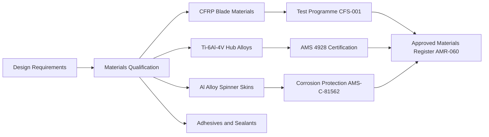
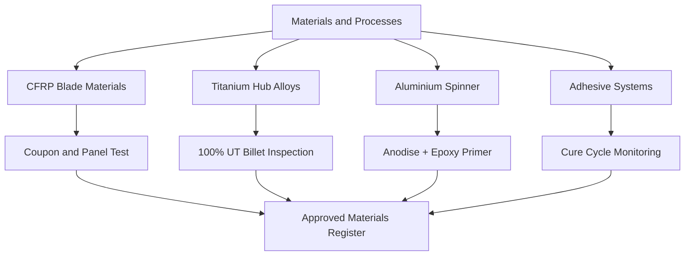

<!-- ──────────────────────────────────────────────────────────────────────────
     QATL-ATLAS-1000-ATLAS-060-069-060-010-PROPELLER-ROTOR-MATERIALS-AND-PROCESSES
     ATA 60 · Propeller/Rotor Materials and Processes
     programme-defined aircraft type — ATLAS Register 1000
────────────────────────────────────────────────────────────────────────────── -->

# Propeller/Rotor Materials and Processes

---

## §0 Hyperlink Policy

> All hyperlinks in this document are **relative** (five directory levels: `../../../../../`).
> Absolute URLs are forbidden. Every linked document must exist in the Q+ATLANTIDE repository
> before the link is activated. Broken links are treated as open issues and must be resolved
> before the document is promoted from `DRAFT` to `APPROVED`.

---

## §1 Purpose

This document defines the agnostic ATLAS standard-level architecture context for `Propeller/Rotor Materials and Processes`.

It describes the controlled scope, functions, interfaces, safety considerations, lifecycle traceability, and S1000D/CSDB mapping logic that programme implementations shall instantiate when this node is applicable.

This document is not a programme design baseline. Programme-specific capacities, locations, part numbers, effectivity, operating limits, maintenance references, and data module codes shall be defined only inside the applicable programme implementation branch.
## §2 Applicability

| Applicability Level | Rule |
|---|---|
| Standard taxonomy | Applies to the ATLAS node `060` |
| Programme implementation | Conditional; determined by programme architecture, trade studies, certification basis, and applicability model |
| Product configuration | Defined in the programme-specific configuration baseline |
| Effectivity | Defined in the programme CSDB / applicability layer |
| Non-applicability | Must be explicitly stated in the programme impact-study branch when excluded |
## §3 Functional Description ![DRAFT]

Material and process controls for propeller/rotor components span four technology families:

1. **Carbon-fibre composite blades** — pre-preg UD and woven CFRP with toughened epoxy resin matrix; blade skins, spar caps, and root fittings. Qualification per [PROGRAMME-AIRCRAFT]-CFS-001 including coupon test and panel test campaigns.
2. **Titanium alloy hubs** — Ti-6Al-4V ELI (AMS 4928) for blade retention hubs; requires 100 % ultrasonic inspection of billet before machining and magnetic-particle inspection of finished bore.
3. **Aluminium alloy spinners** — 7075-T73 or 2024-T42 sheet metal; hard-anodise (AMS 2480) and epoxy primer (AMS-C-81562) corrosion protection system.
4. **Adhesive and sealant systems** — controlled by the Adhesive Process Specification APS-060 which defines surface preparation, mix ratio, pot life, and cure cycle for all structural bonding operations.

---

## §4 Functional Breakdown

| ID | Name | Description | Lead Division |
|---|---|---|---|
| F-001 | Composite Material Qualification | Qualify CFRP blade materials through coupon, element, and panel test programme per [PROGRAMME-AIRCRAFT]-CFS-001. | Q-INDUSTRY / Q-MECHANICS |
| F-002 | Metallic Material Certification | Certify titanium and aluminium alloys against AMS specifications; 100 % UT of hub billet. | Q-INDUSTRY / NDT authority |
| F-003 | Surface Treatment Control | Implement and audit anodising, priming, and coating processes per approved process specifications. | Q-INDUSTRY |
| F-004 | Adhesive Process Control | Define and control bonding process including surface prep, mixing, application, and cure monitoring. | Q-MECHANICS / Q-INDUSTRY |
| F-005 | Materials Traceability | Maintain batch-to-part material traceability from raw material receipt to installed component. | QMS / ERP system |

---

## §5 System Context — Mermaid Diagram

---

## §6 Internal Architecture — Mermaid Diagram

---

## §7 Components and LRUs

| Component | Part Number | Qty | Location | Maintenance Interval | Notes |
|---|---|---|---|---|---|
| CFRP blade pre-preg (UD spar cap) | [PROGRAMME-AIRCRAFT]-CFS-001 Grade A | Per blade | Controlled store (−18 °C) | Lot qualification per batch | TBD |
| Ti-6Al-4V hub billet (AMS 4928) | AMS 4928 / ASTM B265 | Per hub | Certified metals store | 100 % UT before machining | TBD |
| 7075-T73 spinner sheet (AMS 2024) | AMS 2024 | Per spinner | Sheet metal store | Visual + dimensional on receipt | TBD |
| Epoxy primer (AMS-C-81562) | Approved supplier list | Per batch | Controlled store (temp/humidity) | Shelf life per PS | TBD |
| Structural adhesive (APS-060) | Approved supplier list | Per batch | Controlled store (−18 °C) | Shelf life + pot-life control | TBD |

---

## §8 Interfaces

| Interface Type | Connected System | Protocol / Medium | Data / Function |
|---|---|---|---|
| Structural design | Stress engineering | Material allowables input | Design allowables database |
| NDT programme | NDT authority | Inspection criteria per material type | NDT procedure cards |
| Corrosion protection | Surface treatment facility | Process specification AMS-C-81562 | Process control records |
| Supply chain | Q-INDUSTRY / procurement | Material cert and batch records | AMR-060 traceability |
| Repair scheme | Q-MECHANICS engineering | Approved repair material list | Repair procedure sheets |

---

## §9 Operating Modes

| Mode | Trigger | System State | Actions / Consequences |
|---|---|---|---|
| Normal production supply | Batch receipt from approved supplier | Material cert verified | Released to manufacturing store |
| Incoming inspection | Every batch / lot | Material received | Accept, quarantine, or reject |
| Shelf-life management | Continuous | Materials in store | Use, extend (if permitted), or dispose |
| Non-conformance disposition | When material fails inspection | Quarantine raised | Scrap, repair, or concession |

---

## §10 Performance and Budgets ![DRAFT]

| Parameter | Requirement | Target / Design Value | Status |
|---|---|---|---|
| CFRP blade ultimate tensile strength (UTS) | ≥ 1 200 MPa (UD 0° fibre direction) | Per CFS-001 coupon test | TBD |
| Ti-6Al-4V hub UTS | ≥ 930 MPa per AMS 4928 | AMS 4928 cert test | TBD |
| Adhesive lap shear strength | ≥ 35 MPa at +70 °C | APS-060 process qualification | TBD |
| Corrosion protection — salt spray | ≥ 1 000 h at 5 % NaCl | DO-160G Section 14 / ASTM B117 | TBD |
| CFRP fatigue life (R = 0.1) | ≥ 10⁷ cycles at design load | Coupon fatigue programme | TBD |

---

## §11 Safety, Redundancy and Fault Tolerance

- CFRP blade materials must be stored at −18 °C ± 2 °C; temperature exceedances beyond the PS-defined limit require mandatory engineering review before use.
- Ti-6Al-4V hub billets require dual-certification against AMS 4928 and the applicable component drawing material call-out; single-cert billets are not acceptable.
- Adhesive mixing ratio must be controlled by weight to ± 2 % of nominal; mixing by volume alone is prohibited for structural bonds.
- All surface-treatment operators must hold a current process qualification for the specific AMS specification being applied; qualification lapses are a stop-work condition.
- Pre-preg out-life at room temperature must be tracked from first opening of the sealed bag; material exceeding the defined out-life is to be scrapped, not returned to cold store.

---

## §12 Maintenance and Diagnostics

| Task | Interval | Access | Special Tools |
|---|---|---|---|
| CFRP blade pre-preg cold-store temperature log review | Weekly | Cold store facility | Temperature recorder download |
| Adhesive batch shelf-life audit | Monthly | Materials store | Batch records, expiry dates |
| NDT procedure card review against current material qualification | Annual | Engineering review | Material records, NDT procedure library |
| Surface-treatment process audit | Annual / per process change | Q-INDUSTRY facility | Process specification, records audit |
| Corrosion protection integrity check on stored components | At component receipt and before installation | Assembly bay | Visual inspection checklist |

---

## §13 Footprint — Physical, Electrical, Maintenance, Data ![TBD]

| Footprint Type | Parameter | Value | Notes |
|---|---|---|---|
| Physical | Mass (system total) | ![TBD] | Pending OEM data |
| Physical | Envelope (max) | ![TBD] | Pending detailed design |
| Electrical | Peak power (W) | ![TBD] | To be defined |
| Maintenance | Access category | Standard line maintenance | Per AMM |
| Data | AFDX bandwidth | ![TBD] | Per AFDX bus load analysis |

---

## §14 Safety and Certification References ![DRAFT]

| Standard / Document | Title | Issuing Body | Applicability |
|---|---|---|---|
| AMS 4928 | Titanium Alloy Bars, Billets, and Rings — 6Al-4V | SAE International | Hub billet qualification |
| AMS-C-81562 | Coating Compound, Corrosion Inhibiting, Epoxy-Polyamide | SAE International | Primer specification |
| AMS 2480 | Hard Anodic Coating, Aluminium Alloys | SAE International | Spinner corrosion protection |
| ASTM B117 | Practice for Operating Salt Spray (Fog) Apparatus | ASTM International | Corrosion protection qualification |
| EASA CS-25 Amdt 27 | Airworthiness Standards — Large Aeroplanes | EASA | Structural material certification basis |

---

## §15 V&V Approach ![TBD]

| Phase | Method | Acceptance Criterion | Status |
|---|---|---|---|
| Design | Analysis and simulation | Meets all §10 performance requirements | ![TBD] |
| Integration | Ground functional test | All BITE tests pass; interfaces verified | ![TBD] |
| Qualification | DO-160G environmental test | All applicable tests pass | ![TBD] |
| Certification | EASA CS-25 / CS-E compliance demonstration | Type Certificate / STC approval | ![TBD] |

---

## §16 Glossary

| Term | Definition |
|---|---|
| **CFRP** | Carbon Fibre Reinforced Polymer — composite material used for propeller blade skins, spar caps, and root fittings. |
| **AMS 4928** | Aerospace Material Specification for Ti-6Al-4V titanium alloy bar, billet, and plate. |
| **Pre-preg** | Fibre reinforcement pre-impregnated with partially cured resin matrix; stored at −18 °C to extend shelf life. |
| **Out-life** | Maximum allowable cumulative time that pre-preg material may spend at room temperature before cure. |
| **Lap shear strength** | Standard measure of adhesive bond strength; load applied parallel to the bond plane on a standard test coupon. |
| **AMS-C-81562** | Aerospace Material Specification for epoxy polyamide primer used in corrosion protection systems. |
| **AMS 2480** | Aerospace Material Specification for hard anodic coating on aluminium alloys. |
| **AMR-060** | [PROGRAMME-AIRCRAFT] Approved Materials Register for ATA 60 propeller/rotor materials. |
| **NDT Procedure Card** | Controlled document defining the approved NDT method, equipment, settings, and acceptance criteria for a specific component. |
| **Concession** | Formal engineering approval allowing use of material or component that deviates from nominal specification within defined limits. |

---

## §17 Open Issues

| ID | Description | Owner | Target |
|---|---|---|---|
| OI-060-010-001 | Confirm SAF compatibility of CFRP blade resin system (blended SAF exposure test required) | Q-GREENTECH / Q-MECHANICS | 2026-Q4 |
| OI-060-010-002 | Finalise out-life extension protocol for CFRP pre-preg stored between −18 °C and −10 °C | Q-MECHANICS / Q-INDUSTRY | 2026-Q3 |
| OI-060-010-003 | Qualify second-source titanium hub billet supplier to AMS 4928 | Q-INDUSTRY | 2026-Q4 |

---

## §18 Status Legend

| Badge | Meaning |
|---|---|
| `![DRAFT]` | Section is drafted but not yet reviewed |
| `![TBD]` | Content not yet started — to be defined |
| `![To Be Completed]` | Partially complete — needs additional content |
| `![APPROVED]` | Reviewed and formally approved |

---

## §19 Related Documents (Siblings in this Subsection)

- [060-000](./060-000.md)
- [060-020](./060-020.md)
- [060-030](./060-030.md)
- [060-040](./060-040.md)
- [060-050](./060-050.md)
- [060-060](./060-060.md)
- [060-070](./060-070.md)
- [060-080](./060-080.md)
- [060-090](./060-090.md)

---

## §20 Change Log

| Rev | Date | Author | Description |
|---|---|---|---|
| 0.1 | 2026-05-11 | @copilot | Initial DRAFT — contextualized content per programme-defined aircraft type architecture |
