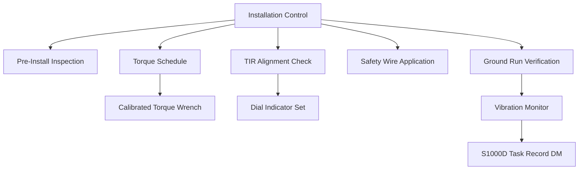

<!-- ──────────────────────────────────────────────────────────────────────────
     QATL-ATLAS-1000-ATLAS-060-069-060-020-PROPELLER-ROTOR-INSTALLATION-PRACTICES
     ATA 60 · Propeller/Rotor Installation Practices
     AMPEL360E eWTW — ATLAS Register 1000
────────────────────────────────────────────────────────────────────────────── -->

# Propeller/Rotor Installation Practices

---

## §0 Hyperlink Policy

> All hyperlinks in this document are **relative** (five directory levels: `../../../../../`).
> Absolute URLs are forbidden. Every linked document must exist in the Q+ATLANTIDE repository
> before the link is activated. Broken links are treated as open issues and must be resolved
> before the document is promoted from `DRAFT` to `APPROVED`.

---

## §1 Purpose

This document defines the controlled installation practices, torque schedules, alignment verification procedures, and post-installation functional-check requirements for propeller and rotor assemblies. Correct installation is the single largest contributor to in-service propeller safety; improper torque, incorrect shimming, or misaligned blade retention flanges have been primary causal factors in propeller accidents across the industry.

For the AMPEL360E eWTW, installation practices apply to any propulsor assembly evaluated or installed on the aircraft, including any electrically driven auxiliary propulsors used for distributed propulsion studies. The practices defined here are mandatory precedents to the type-specific procedures in ATA 61 and ATA 62.

---

## §2 Applicability

| Parameter | Value |
|---|---|
| Aircraft Program | AMPEL360E eWTW |
| ATA reference | ATA 60-020 — Installation Practices |
| Torque standard | ATA iSpec 2200 / SAE AS7506 |
| Alignment method | TIR measurement per AMM task |
| Certification basis | EASA CS-25 Amendment 27+ |
| Safety requirements | CS-25 §25.925 — Propeller clearance |
| S1000D SNS | 060-020-00 |

---

## §3 Functional Description ![DRAFT]

Installation practices span the full installation sequence from component pre-install inspection through to functional verification:

- **Pre-install inspection** — visual and dimensional check of mating flanges, blade retention threads, and anti-rotation features.
- **Torque sequence** — apply anti-seize compound per PS, install retention nuts in star pattern, achieve target torque in three equal increments.
- **Alignment check** — measure Total Indicator Runout (TIR) of blade tips and spinner flange; limits per component drawing.
- **Safety wire / lockwire** — all propeller retention fasteners require dual-strand safety wire per MS33540.
- **Post-installation ground run** — minimum idle run to confirm steady-state vibration is within limits before clearance for flight.

---

## §4 Functional Breakdown

| ID | Name | Description | Lead Division |
|---|---|---|---|
| F-001 | Pre-Install Inspection | Inspect all mating surfaces, threads, retention features before assembly. | Q-MECHANICS / technician |
| F-002 | Torque Sequence Control | Apply controlled torque in defined sequence with calibrated tooling. | AMM task / technician |
| F-003 | Alignment Verification | Measure TIR at defined measurement stations against drawing limits. | NDT / QA inspector |
| F-004 | Safety Locking | Apply safety wire or locking devices to all retention fasteners per MS33540. | Technician / QA |
| F-005 | Post-Install Functional Check | Perform ground run or bench spin; verify vibration within limits. | Engineering / test pilot |

---

## §5 System Context — Mermaid Diagram

---

## §6 Internal Architecture — Mermaid Diagram

---

## §7 Components and LRUs

| Component | Part Number | Qty | Location | Maintenance Interval | Notes |
|---|---|---|---|---|---|
| Calibrated torque wrench (0–500 N·m) | Approved tool list | 1 per installation team | Tool crib | 6-month calibration | TBD |
| Dial indicator and stand (TIR measurement) | Approved metrology tool | 1 per bay | Bay tool set | Annual calibration | TBD |
| Safety wire twist tool (MS33540-compatible) | Standard tool | Per team | Tool kit | Annual inspection | TBD |
| Anti-seize compound (AMS 2488 Moly type) | Approved materials list | Per batch | Materials store | Shelf life per PS | TBD |
| Vibration analyser (portable) | Approved vibration system | 1 per hangar | Test equipment store | Annual calibration | TBD |

---

## §8 Interfaces

| Interface Type | Connected System | Protocol / Medium | Data / Function |
|---|---|---|---|
| Engine/propulsion | ATA 61/62 propeller assembly | Flange mating interface and torque specification | Installation drawing ICD |
| Structural | ATA 53/57 airframe attachment zone | Clearance and vibration load path | CS-25 §25.925 compliance analysis |
| CMS / BITE | ATA 45 Central Maintenance | Post-install vibration record upload | AFDX / maintenance terminal |
| Documentation | CSDB / IETP | Signed-off task record, work order | S1000D DM 720 (Install) |

---

## §9 Operating Modes

| Mode | Trigger | System State | Actions / Consequences |
|---|---|---|---|
| Initial installation | New aircraft build / engine change | Component serviceable, flange inspected | Return-to-service check complete |
| Re-installation after removal | Following scheduled removal or repair | Component serviceable after NDT/repair | Return-to-service check complete |
| Post-repair re-installation | Following approved repair | Repair approved and documented | Ground run vibration check passed |

---

## §10 Performance and Budgets ![DRAFT]

| Parameter | Requirement | Target / Design Value | Status |
|---|---|---|---|
| Retention nut torque (typical hub) | Per component drawing ± 2 % | Calibrated torque wrench | TBD (drawing-specific) |
| Blade tip TIR limit | < 3 mm across all blades | Dial indicator, 3 readings per blade | TBD |
| Post-install vibration (idle) | < 0.15 ips peak-to-peak | Portable vibration analyser | TBD |
| Safety wire minimum turns | ≥ 2 turns per inch (MS33540) | Inspector visual check | DONE |

---

## §11 Safety, Redundancy and Fault Tolerance

- Only calibrated torque wrenches with current calibration certificates shall be used; use of extension bars or 'feel-tighten' methods is prohibited.
- Star-pattern torque sequence is mandatory; sequential (round-robin) tightening is NOT permitted and may cause blade retention flange distortion.
- Ground clearance must be verified per CS-25 §25.925 before any ground run; minimum blade-tip clearance to ground must be documented.
- A second independent inspector must verify safety-wire installation on all primary retention fasteners (dual QA sign-off required).
- If TIR exceeds drawing limits at any blade station, the installation is stopped and an engineering disposition is required before proceeding.

---

## §12 Maintenance and Diagnostics

| Task | Interval | Access | Special Tools |
|---|---|---|---|
| Torque wrench calibration verification | Before each use / 6-month max | Tool crib | Calibration bench check |
| Retention fastener torque check (scheduled) | Per AMM inspection interval | Access per AMM | Calibrated torque wrench |
| TIR verification after vibration event | After any reported abnormal vibration | Propeller access | Dial indicator |
| Safety wire integrity check | Pre-flight inspection per AMM | External access | Visual inspection |
| Ground run vibration record download | After installation ground run | Maintenance terminal | CMS download |

---

## §13 Footprint — Physical, Electrical, Maintenance, Data ![TBD]

| Footprint Type | Parameter | Value | Notes |
|---|---|---|---|
| Physical | Mass (system total) | ![TBD] | Pending OEM data |
| Physical | Envelope (max) | ![TBD] | Pending detailed design |
| Electrical | Peak power (W) | ![TBD] | To be defined |
| Maintenance | Access category | Standard line maintenance | Per AMM |
| Data | AFDX bandwidth | ![TBD] | Per AFDX bus load analysis |

---

## §14 Safety and Certification References ![DRAFT]

| Standard / Document | Title | Issuing Body | Applicability |
|---|---|---|---|
| ATA iSpec 2200 | Chapter 60 — Propeller Standard Practices | Air Transport Association | Installation practice scope |
| SAE AS7506 | Maintenance Processes and Procedures for Aircraft Propellers | SAE International | Torque and installation practices |
| MS33540 | Safety Wiring and Cotter Pinning | US DoD / MIL spec | Safety locking practices |
| EASA CS-25 §25.925 | Propeller clearance | EASA | Ground clearance requirement |
| DO-160G | Environmental Conditions and Test Procedures for Airborne Equipment | RTCA | Vibration measurement equipment qualification |

---

## §15 V&V Approach ![TBD]

| Phase | Method | Acceptance Criterion | Status |
|---|---|---|---|
| Design | Analysis and simulation | Meets all §10 performance requirements | ![TBD] |
| Integration | Ground functional test | All BITE tests pass; interfaces verified | ![TBD] |
| Qualification | DO-160G environmental test | All applicable tests pass | ![TBD] |
| Certification | EASA CS-25 / CS-E compliance demonstration | Type Certificate / STC approval | ![TBD] |

---

## §16 Glossary

| Term | Definition |
|---|---|
| **TIR** | Total Indicator Runout — measurement of blade tip or flange eccentricity using a dial indicator; expressed in millimetres. |
| **MS33540** | Military Standard defining lockwire (safety wire) technique for aviation fasteners. |
| **Anti-seize compound** | Lubricating paste applied to retention threads to prevent galling and enable repeatable torque application. |
| **Star pattern** | Fastener tightening sequence where diametrically opposite fasteners are torqued alternately to distribute clamping load evenly. |
| **Ground run** | Engine/propeller operation on the ground at controlled power settings to verify installation quality. |
| **CS-25 §25.925** | EASA certification standard defining minimum propeller tip clearance to ground and other aircraft structure. |
| **ICD** | Interface Control Document — defines mechanical, electrical, and data interfaces between two systems. |
| **Retention nut** | The primary fastener used to retain a propeller blade in the hub pitch-change mechanism or fixed hub flange. |
| **TIR limit** | Maximum allowable value of total indicator runout for a given blade or flange, as defined on the component drawing. |
| **Work order** | Formal documentation authorising and recording a specific maintenance task; required for all propeller installation events. |

---

## §17 Open Issues

| ID | Description | Owner | Target |
|---|---|---|---|
| OI-060-020-001 | Confirm TIR limits for AMPEL360E carbon-composite blade types (pending blade supplier data) | Q-MECHANICS / Q-AIR | 2026-Q3 |
| OI-060-020-002 | Determine minimum vibration acceptance level for post-install ground run | Q-AIR / vibration specialist | 2026-Q3 |

---

## §18 Status Legend

| Badge | Meaning |
|---|---|
| `![DRAFT]` | Section is drafted but not yet reviewed |
| `![TBD]` | Content not yet started — to be defined |
| `![To Be Completed]` | Partially complete — needs additional content |
| `![APPROVED]` | Reviewed and formally approved |

---

## §19 Related Documents (Siblings in this Subsection)

- [060-000](./060-000.md)
- [060-010](./060-010.md)
- [060-030](./060-030.md)
- [060-040](./060-040.md)
- [060-050](./060-050.md)
- [060-060](./060-060.md)
- [060-070](./060-070.md)
- [060-080](./060-080.md)
- [060-090](./060-090.md)

---

## §20 Change Log

| Rev | Date | Author | Description |
|---|---|---|---|
| 0.1 | 2026-05-11 | @copilot | Initial DRAFT — contextualized content per AMPEL360E eWTW architecture |
