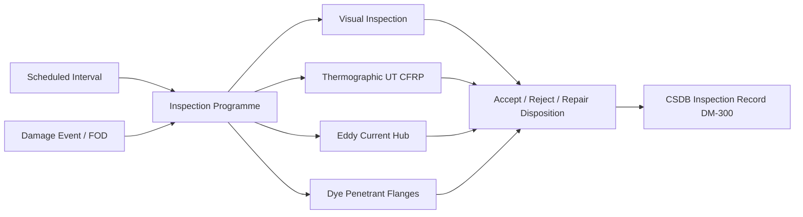
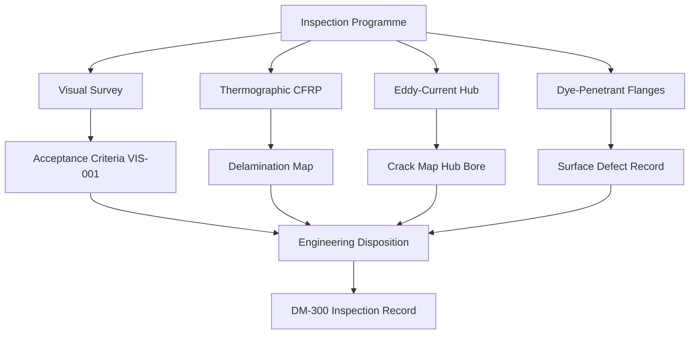

<!-- ──────────────────────────────────────────────────────────────────────────
     QATL-ATLAS-1000-ATLAS-060-069-060-030-PROPELLER-ROTOR-INSPECTION-AND-NDT
     ATA 60 · Propeller/Rotor Inspection and NDT
     programme-defined aircraft type — ATLAS Register 1000
────────────────────────────────────────────────────────────────────────────── -->

# Propeller/Rotor Inspection and NDT

---

## §0 Hyperlink Policy

> All hyperlinks in this document are **relative** (five directory levels: `../../../../../`).
> Absolute URLs are forbidden. Every linked document must exist in the Q+ATLANTIDE repository
> before the link is activated. Broken links are treated as open issues and must be resolved
> before the document is promoted from `DRAFT` to `APPROVED`.

---

## §1 Purpose

This document defines the agnostic ATLAS standard-level architecture context for `Propeller/Rotor Inspection and NDT`.

It describes the controlled scope, functions, interfaces, safety considerations, lifecycle traceability, and S1000D/CSDB mapping logic that programme implementations shall instantiate when this node is applicable.

This document is not a programme design baseline. Programme-specific capacities, locations, part numbers, effectivity, operating limits, maintenance references, and data module codes shall be defined only inside the applicable programme implementation branch.
## §2 Applicability

| Applicability Level | Rule |
|---|---|
| Standard taxonomy | Applies to the ATLAS node `060` |
| Programme implementation | Conditional; determined by programme architecture, trade studies, certification basis, and applicability model |
| Product configuration | Defined in the programme-specific configuration baseline |
| Effectivity | Defined in the programme CSDB / applicability layer |
| Non-applicability | Must be explicitly stated in the programme impact-study branch when excluded |
## §3 Functional Description ![DRAFT]

The inspection programme covers four component classes:

1. **Composite blade skins and spar caps** — thermographic (TT) and tap-test inspection for delamination; ultrasonic (UT) C-scan for sub-surface disbonds; visual inspection for erosion, gel-coat damage, and impact damage.
2. **Metallic hubs and retention flanges** — eddy-current (ET) for surface and near-surface cracks in hub bore and blade retention flange; dye-penetrant (PT) for corner radii and machined features.
3. **Spinners and fairings** — visual inspection for cracks, disbonds, and corrosion; PT for metallic spinner flanges.
4. **Fasteners and retention hardware** — visual inspection and torque-check; magnetic particle (MP) on titanium hub bolts during periodic overhaul.

---

## §4 Functional Breakdown

| ID | Name | Description | Lead Division |
|---|---|---|---|
| F-001 | Visual Inspection | Scheduled visual survey of all external surfaces against [PROGRAMME-AIRCRAFT]-VIS-001 acceptance criteria. | Technician (Line authorisation) |
| F-002 | Composite Thermographic Inspection | Thermographic (flash or lock-in) inspection for delamination in CFRP blade skins and spar caps. | NDT Level II/III |
| F-003 | Hub Eddy-Current Inspection | ET scanning of hub bore, shank bore, and retention flange for fatigue cracks. | NDT Level II/III |
| F-004 | Dye-Penetrant Inspection | PT inspection of hub corner radii, bolt holes, and spinner metallic flanges. | NDT Level II/III |
| F-005 | Unscheduled Damage Assessment | Assess and disposition impact, FOD, and lightning damage events; define return-to-service path. | Engineering / NDT Level III |

---

## §5 System Context — Mermaid Diagram

---

## §6 Internal Architecture — Mermaid Diagram

---

## §7 Components and LRUs

| Component | Part Number | Qty | Location | Maintenance Interval | Notes |
|---|---|---|---|---|---|
| Infrared thermographic camera (flash IR) | Approved equipment list | 1 per NDT lab | NDT lab | Annual calibration | TBD |
| Portable eddy-current unit (multi-frequency) | Approved equipment list | Per NDT team | NDT store | 6-month calibration | TBD |
| Dye penetrant kit (Type II fluorescent) | Approved supplier | Per batch | NDT store | Shelf life per PS | TBD |
| UT C-scan immersion system | Approved equipment list | 1 per MRO shop | MRO NDT bay | Annual calibration | TBD |
| Reference standard blocks (hub bore ET) | Drawing-specific standards | Per hub type | Calibration standard store | Annual recertification | TBD |

---

## §8 Interfaces

| Interface Type | Connected System | Protocol / Medium | Data / Function |
|---|---|---|---|
| Engineering | Q-MECHANICS | Acceptance criteria and disposition authority | NDT procedure cards, engineering concessions |
| Maintenance planning | MCC / MRO | Scheduled interval input | Aircraft maintenance programme |
| Quality assurance | QA authority | Inspector qualification records | NAS 410 cert database |
| CSDB | Q-DATAGOV | Inspection record DMs | S1000D DM-300 submissions |
| PHM / CMS | ATA 45 | Inspection trigger data (vibration, BITE) | CMS alert output |

---

## §9 Operating Modes

| Mode | Trigger | System State | Actions / Consequences |
|---|---|---|---|
| Scheduled inspection | Defined FH/cycle/calendar interval | Aircraft at maintenance input | Accept, repair, or replacement decision |
| Unscheduled / event-driven | Damage event, abnormal vibration, FOD | Aircraft at gate or maintenance bay | Engineering disposition; minimum return-to-service test |
| Overhaul | Shop-level periodic overhaul | Component removed to shop | Full NDT suite; all reference standards reset |
| Post-repair inspection | After approved repair | Repair complete | Acceptance NDT per repair scheme approval |

---

## §10 Performance and Budgets ![DRAFT]

| Parameter | Requirement | Target / Design Value | Status |
|---|---|---|---|
| ET crack detection limit (hub bore) | 0.5 mm surface crack at hub bore | Calibrated per reference standard | TBD |
| TT delamination detection area | ≥ 5 cm² delamination within 10 mm of surface | Qualified thermographic procedure | TBD |
| Visual defect detection reliability | DP ≥ 90 % for 10 mm surface crack in good lighting | VIS-001 procedure qualification | TBD |
| PT detection limit (flanges) | 0.3 mm surface-breaking crack | Type II fluorescent PT per AMS 2647 | TBD |

---

## §11 Safety, Redundancy and Fault Tolerance

- NDT inspections on propeller hubs and blade roots are safety-critical tasks; all such inspections require Level II or III NDT certification with current currency (< 12 months since last qualification activity).
- Reference standards used for ET and UT inspections must be traceable to a primary standard and must be re-certified annually or after any physical damage.
- An unscheduled inspection triggered by FOD, lightning, or abnormal vibration must be completed and signed off by an NDT Level III before the aircraft is returned to service.
- Dye-penetrant (PT) inspection of composite components is prohibited — PT penetrant fluids can degrade epoxy resin systems and cause latent damage.
- Thermographic inspection results must be stored as calibrated thermal images (not just pass/fail notation) to enable trend analysis at subsequent inspection intervals.

---

## §12 Maintenance and Diagnostics

| Task | Interval | Access | Special Tools |
|---|---|---|---|
| Scheduled CFRP blade thermographic inspection | Per AMM interval (TBD FH/cycles) | Blade accessible (no removal required) | Thermographic camera, calibration plate |
| Hub bore eddy-current inspection | Per AMM interval or blade removal | Hub removed to NDT bay | ET unit, hub-bore probe, reference standard |
| Visual inspection (walk-around level) | Pre-flight / A-check | External access | Inspection torch, mirror, [PROGRAMME-AIRCRAFT]-VIS-001 sheet |
| Post-FOD unscheduled inspection | Triggered by event | As required — line or hangar | Full NDT suite per damage type |
| NDT reference standard re-certification | Annual | NDT lab | Calibration authority, traceability documentation |

---

## §13 Footprint — Physical, Electrical, Maintenance, Data ![TBD]

| Footprint Type | Parameter | Value | Notes |
|---|---|---|---|
| Physical | Mass (system total) | ![TBD] | Pending OEM data |
| Physical | Envelope (max) | ![TBD] | Pending detailed design |
| Electrical | Peak power (W) | ![TBD] | To be defined |
| Maintenance | Access category | Standard line maintenance | Per AMM |
| Data | AFDX bandwidth | ![TBD] | Per AFDX bus load analysis |

---

## §14 Safety and Certification References ![DRAFT]

| Standard / Document | Title | Issuing Body | Applicability |
|---|---|---|---|
| NAS 410 | Certification and Qualification of NDT Personnel | AIA / NASM | Inspector qualification standard |
| AMS 2647 | Fluorescent Penetrant Inspection — Aircraft and Engine Component Maintenance | SAE International | PT procedure standard |
| ASTM E1742 | Standard Practice for Radiographic Examination | ASTM International | Radiographic reference (if applicable) |
| EASA CS-25 Amdt 27 | Airworthiness Standards — Large Aeroplanes | EASA | Structural integrity certification basis |
| MSG-3 Rev 2020 | Airline/Manufacturer Maintenance Program Development Document | ATA / IATA | Maintenance programme development logic |

---

## §15 V&V Approach ![TBD]

| Phase | Method | Acceptance Criterion | Status |
|---|---|---|---|
| Design | Analysis and simulation | Meets all §10 performance requirements | ![TBD] |
| Integration | Ground functional test | All BITE tests pass; interfaces verified | ![TBD] |
| Qualification | DO-160G environmental test | All applicable tests pass | ![TBD] |
| Certification | EASA CS-25 / CS-E compliance demonstration | Type Certificate / STC approval | ![TBD] |

---

## §16 Glossary

| Term | Definition |
|---|---|
| **PT** | Dye-Penetrant Testing — surface NDT method using coloured or fluorescent penetrant to reveal surface-breaking defects. |
| **ET** | Eddy-Current Testing — electromagnetic NDT method detecting cracks in conductive materials by eddy-current disruption. |
| **TT** | Thermographic Testing — NDT method using infrared camera to detect delaminations by thermal diffusivity differences. |
| **C-scan** | Ultrasonic scan producing a 2D plan-view defect map of a structure by mechanically scanning a probe over the surface. |
| **DP** | Detection Probability — statistical probability that an NDT inspection will detect a defect of a given size; must be demonstrated by qualification. |
| **NAS 410** | National Aerospace Standard for NDT personnel qualification; defines Level I, II, and III certification requirements. |
| **EN 4179** | European equivalent of NAS 410 for NDT personnel qualification, used in EASA programmes. |
| **FOD** | Foreign Object Damage — damage caused by foreign objects ingested or impacting propeller/rotor blades. |
| **Flash thermography** | Thermographic NDT method using a high-energy flash lamp to excite thermal response; reveals delaminations within 0–10 ms. |
| **Reference standard** | A physical artefact of known defect size used to calibrate and validate NDT equipment sensitivity before inspection. |

---

## §17 Open Issues

| ID | Description | Owner | Target |
|---|---|---|---|
| OI-060-030-001 | Define thermographic inspection interval for CFRP blades based on fatigue spectrum analysis | Q-MECHANICS + Q-AIR | 2026-Q4 |
| OI-060-030-002 | Qualify lock-in thermography method for CFRP blade spar cap inspection (alternative to flash IR) | NDT Level III / Q-MECHANICS | 2027-Q1 |
| OI-060-030-003 | Determine ET crack detection requirement for titanium hub on [PROGRAMME-AIRCRAFT] specific hub geometry | Q-MECHANICS NDT authority | 2026-Q3 |

---

## §18 Status Legend

| Badge | Meaning |
|---|---|
| `![DRAFT]` | Section is drafted but not yet reviewed |
| `![TBD]` | Content not yet started — to be defined |
| `![To Be Completed]` | Partially complete — needs additional content |
| `![APPROVED]` | Reviewed and formally approved |

---

## §19 Related Documents (Siblings in this Subsection)

- [060-000](./060-000.md)
- [060-010](./060-010.md)
- [060-020](./060-020.md)
- [060-040](./060-040.md)
- [060-050](./060-050.md)
- [060-060](./060-060.md)
- [060-070](./060-070.md)
- [060-080](./060-080.md)
- [060-090](./060-090.md)

---

## §20 Change Log

| Rev | Date | Author | Description |
|---|---|---|---|
| 0.1 | 2026-05-11 | @copilot | Initial DRAFT — contextualized content per programme-defined aircraft type architecture |
