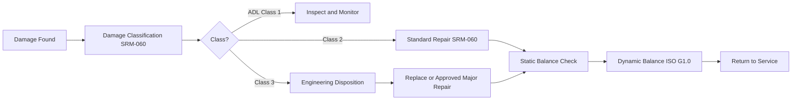
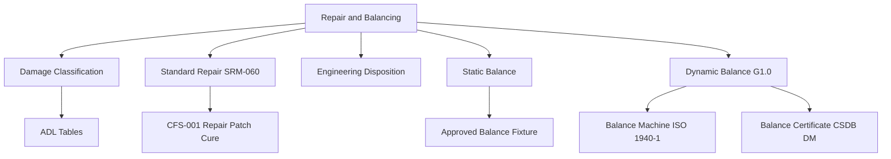

<!-- ──────────────────────────────────────────────────────────────────────────
     QATL-ATLAS-1000-ATLAS-060-069-060-040-PROPELLER-ROTOR-REPAIR-AND-BALANCING
     ATA 60 · Propeller/Rotor Repair and Balancing
     AMPEL360E eWTW — ATLAS Register 1000
────────────────────────────────────────────────────────────────────────────── -->

# Propeller/Rotor Repair and Balancing

---

## §0 Hyperlink Policy

> All hyperlinks in this document are **relative** (five directory levels: `../../../../../`).
> Absolute URLs are forbidden. Every linked document must exist in the Q+ATLANTIDE repository
> before the link is activated. Broken links are treated as open issues and must be resolved
> before the document is promoted from `DRAFT` to `APPROVED`.

---

## §1 Purpose

This document defines the controlled repair classification system, approved repair schemes, and static/dynamic balancing requirements for propeller and rotor assemblies. Repair and balance decisions are safety-critical: an improperly repaired blade or an unbalanced propeller can produce aeromechanical excitation loads that damage the engine, airframe, and flight controls.

On the AMPEL360E eWTW, composite blade repair authority is split between line-level cosmetic repair (scratch and gel-coat damage), base-level structural repair (small leading-edge erosion filling, cosmetic disbond), and shop-level major repair (spar cap damage, root fitting repair). Each repair level requires specific material qualification, inspector certification, and engineering approval before application.

---

## §2 Applicability

| Parameter | Value |
|---|---|
| Aircraft Program | AMPEL360E eWTW |
| ATA reference | ATA 60-040 — Repair and Balancing |
| Repair classification | AMPEL360E SRM-060 Chapter 20 |
| Balance standard | ISO 1940-1 Grade G1.0 for propeller assemblies |
| Repair authority | Q-MECHANICS Engineering — Concession/repair approval |
| Composite repair material | AMPEL360E-CFS-001 approved repair patch system |
| S1000D SNS | 060-040-00 |

---

## §3 Functional Description ![DRAFT]

Repair classification uses a three-tier system:

- **Class 1 — Allowable Damage Limits (ADL)**: Damage within published ADL dimensions; no repair required; inspection record and monitoring required.
- **Class 2 — Standard Repair**: Damage exceeds ADL but within defined repair limit; repair by approved scheme in SRM-060; no engineering concession required.
- **Class 3 — Major Repair / Engineering Disposition**: Damage beyond standard repair limits; requires specific engineering disposition and may require component replacement.

After any repair affecting blade mass distribution, static balance (tip-to-root moment check) and dynamic balance (ISO 1940-1 G1.0) are mandatory before return to service. Balance weights are installed in approved weight pockets on the hub or spinner; weight placement is recorded in the propeller configuration record.

---

## §4 Functional Breakdown

| ID | Name | Description | Lead Division |
|---|---|---|---|
| F-001 | Damage Classification | Classify all damage against ADL and repair limits in SRM-060 Chapter 20. | Q-MECHANICS / inspector |
| F-002 | Class 2 Standard Repair | Execute approved repair from SRM-060; document materials, process, and inspector sign-off. | Approved repair station / base MRO |
| F-003 | Class 3 Engineering Disposition | Obtain engineering disposition for damage beyond standard limits; define approved repair or replacement. | Q-MECHANICS engineering |
| F-004 | Static Balance Check | Measure static blade moment balance on approved balance fixture after any repair. | Balancing technician |
| F-005 | Dynamic Balance Verification | Perform dynamic balance on balance machine to ISO 1940-1 G1.0; record and archive balance certificate. | Balance technician / QA |

---

## §5 System Context — Mermaid Diagram

---

## §6 Internal Architecture — Mermaid Diagram

---

## §7 Components and LRUs

| Component | Part Number | Qty | Location | Maintenance Interval | Notes |
|---|---|---|---|---|---|
| Dynamic balance machine (propeller-rated) | ISO 1940-1 qualified machine | 1 per MRO shop | Balance bay | Annual calibration + ISO cert | TBD |
| Static balance fixture (blade moment arm) | Drawing-specific fixture | Per blade type | Shop fixture store | Annual inspection | TBD |
| CFRP patch repair kit (Class 2) | AMPEL360E-CFS-001 repair system | Per batch | Controlled store −18 °C | Shelf life per PS | TBD |
| Balance weight set (hub pocket weights) | Per hub drawing | Per hub | Assembly parts store | Part number controlled | TBD |
| Surface profile gauge (erosion depth) | Calibrated depth micrometer | Per repair team | Repair bay | Annual calibration | TBD |

---

## §8 Interfaces

| Interface Type | Connected System | Protocol / Medium | Data / Function |
|---|---|---|---|
| Engineering | Q-MECHANICS | Repair scheme approval and disposition authority | SRM-060 Chapter 20 |
| NDT | NDT authority | Post-repair inspection requirement | NDT procedure card for each repair class |
| Supply chain | Q-INDUSTRY | Repair materials supply | AMR-060 approved materials list |
| CSDB | Q-DATAGOV | Repair and balance record DMs | S1000D DM-400 / DM-300 submissions |
| Configuration management | CAMO | Balance weight record, component status update | Aircraft configuration record |

---

## §9 Operating Modes

| Mode | Trigger | System State | Actions / Consequences |
|---|---|---|---|
| Class 1 monitoring | ADL damage found | Damage within ADL | Repeat inspection at next interval |
| Class 2 repair | Damage beyond ADL, within SRM | Repair station available | Post-repair NDT and balance verification |
| Class 3 disposition | Damage beyond standard repair | Engineering engaged | Component replacement or approved major repair |
| Re-balance only | Mass redistribution without structural damage | Balance facility available | New balance certificate issued |

---

## §10 Performance and Budgets ![DRAFT]

| Parameter | Requirement | Target / Design Value | Status |
|---|---|---|---|
| Dynamic balance residual (ISO 1940-1 G1.0) | Residual < 0.4 mm/s at max governed RPM | Balance machine certificate | TBD per assembly |
| CFRP patch repair strength restoration | ≥ 90 % of original laminate UTS | Coupon qualification per CFS-001 | TBD |
| ADL erosion limit (leading edge) | < 3 mm depth over ≤ 50 mm span | SRM-060 ADL table (TBD) | TBD |
| Balance weight limit (per pocket) | Per hub drawing — max mass TBD | Hub drawing specification | TBD |

---

## §11 Safety, Redundancy and Fault Tolerance

- Class 3 damaged components must be tagged 'UNSERVICEABLE — AWAITING ENGINEERING DISPOSITION' and physically segregated from serviceable parts before any engineering assessment.
- Post-repair dynamic balance is mandatory for any repair that removes or redistributes material ≥ 5 g at any blade span location.
- CFRP patch repairs must be cured in a vacuum bag with a calibrated heat blanket; uncured or undercured patches are not acceptable and must be removed.
- Balance weights must be torqued to the drawing specification and safety-locked; loss of a balance weight in flight can cause catastrophic propeller vibration.
- All major repair (Class 3) components that are returned to service must carry a permanent modification record tag traceable to the engineering disposition.

---

## §12 Maintenance and Diagnostics

| Task | Interval | Access | Special Tools |
|---|---|---|---|
| Dynamic balance check after blade replacement | After each blade replacement | Balance bay | ISO 1940-1 balance machine |
| Static moment check during scheduled strip | At component overhaul | Shop balance fixture | Balance fixture, calibrated weights |
| ADL erosion measurement | Per AMM scheduled inspection | External blade access | Calibrated depth gauge |
| Balance machine calibration | Annual | Balance bay | ISO calibration authority |
| Repair patch adhesion check (post-cure NDT) | After each Class 2 repair | Repair bay | Thermographic camera or tap test kit |

---

## §13 Footprint — Physical, Electrical, Maintenance, Data ![TBD]

| Footprint Type | Parameter | Value | Notes |
|---|---|---|---|
| Physical | Mass (system total) | ![TBD] | Pending OEM data |
| Physical | Envelope (max) | ![TBD] | Pending detailed design |
| Electrical | Peak power (W) | ![TBD] | To be defined |
| Maintenance | Access category | Standard line maintenance | Per AMM |
| Data | AFDX bandwidth | ![TBD] | Per AFDX bus load analysis |

---

## §14 Safety and Certification References ![DRAFT]

| Standard / Document | Title | Issuing Body | Applicability |
|---|---|---|---|
| ISO 1940-1 | Mechanical Vibration — Balance quality requirements for rotors in a constant (rigid) state | ISO | Dynamic balance quality grade G1.0 |
| AMPEL360E SRM-060 | Structural Repair Manual — Chapter 60 Propeller/Rotor | AMPEL360E programme | Damage classification and repair schemes |
| AMPEL360E-CFS-001 | Carbon Fibre System specification — repair patch system | AMPEL360E programme | CFRP repair material qualification |
| ATA iSpec 2200 | Chapter 60 — Propeller Standard Practices | Air Transport Association | Repair practice scope |
| SAE AS7506 | Maintenance Processes and Procedures for Aircraft Propellers | SAE International | Repair philosophy reference |

---

## §15 V&V Approach ![TBD]

| Phase | Method | Acceptance Criterion | Status |
|---|---|---|---|
| Design | Analysis and simulation | Meets all §10 performance requirements | ![TBD] |
| Integration | Ground functional test | All BITE tests pass; interfaces verified | ![TBD] |
| Qualification | DO-160G environmental test | All applicable tests pass | ![TBD] |
| Certification | EASA CS-25 / CS-E compliance demonstration | Type Certificate / STC approval | ![TBD] |

---

## §16 Glossary

| Term | Definition |
|---|---|
| **ADL** | Allowable Damage Limits — defined maximum damage dimensions within which no repair is required; monitored and reinspected at next interval. |
| **SRM** | Structural Repair Manual — approved document defining allowable repairs, repair schemes, and damage limits for aircraft structures. |
| **ISO 1940-1** | International Standard for balancing quality of rigid rotors; Grade G1.0 is the most stringent commercial aviation grade. |
| **Balance weight** | Precision mass installed in a hub or spinner pocket to correct mass imbalance resulting from production variance or repair. |
| **Patch repair** | Composite repair method applying a CFRP pre-preg patch over damaged area, vacuum-bagged and heat-cured. |
| **Class 1 damage** | Damage within ADL — no repair required but reinspection at next scheduled interval. |
| **Class 2 repair** | Standard repair from SRM with approved materials; no additional engineering disposition required. |
| **Class 3 repair** | Major repair or replacement; requires specific engineering disposition before execution. |
| **Moment arm** | Distance from blade root rotation axis to the centre of mass of a blade; used in static balance calculation. |
| **Residual imbalance** | Remaining unbalance after balancing; expressed in g·mm per ISO 1940-1. |

---

## §17 Open Issues

| ID | Description | Owner | Target |
|---|---|---|---|
| OI-060-040-001 | Define ADL erosion limits for AMPEL360E CFRP blade leading edge (pending erosion coupon test campaign) | Q-MECHANICS / Q-AIR | 2026-Q4 |
| OI-060-040-002 | Confirm maximum balance weight mass per pocket for AMPEL360E hub design | Q-MECHANICS / propeller supplier | 2026-Q3 |
| OI-060-040-003 | Develop Class 2 repair scheme for carbon-spar blade root region (new repair type, no precedent) | Q-MECHANICS engineering | 2027-Q1 |

---

## §18 Status Legend

| Badge | Meaning |
|---|---|
| `![DRAFT]` | Section is drafted but not yet reviewed |
| `![TBD]` | Content not yet started — to be defined |
| `![To Be Completed]` | Partially complete — needs additional content |
| `![APPROVED]` | Reviewed and formally approved |

---

## §19 Related Documents (Siblings in this Subsection)

- [060-000](./060-000.md)
- [060-010](./060-010.md)
- [060-020](./060-020.md)
- [060-030](./060-030.md)
- [060-050](./060-050.md)
- [060-060](./060-060.md)
- [060-070](./060-070.md)
- [060-080](./060-080.md)
- [060-090](./060-090.md)

---

## §20 Change Log

| Rev | Date | Author | Description |
|---|---|---|---|
| 0.1 | 2026-05-11 | @copilot | Initial DRAFT — contextualized content per AMPEL360E eWTW architecture |
