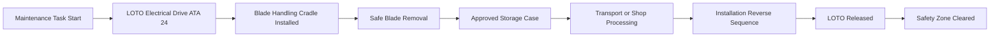
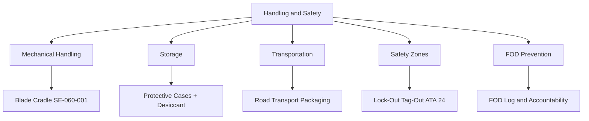

<!-- ──────────────────────────────────────────────────────────────────────────
     QATL-ATLAS-1000-ATLAS-060-069-060-050-PROPELLER-ROTOR-HANDLING-AND-SAFETY
     ATA 60 · Propeller/Rotor Handling and Safety
     AMPEL360E eWTW — ATLAS Register 1000
────────────────────────────────────────────────────────────────────────────── -->

# Propeller/Rotor Handling and Safety

---

## §0 Hyperlink Policy

> All hyperlinks in this document are **relative** (five directory levels: `../../../../../`).
> Absolute URLs are forbidden. Every linked document must exist in the Q+ATLANTIDE repository
> before the link is activated. Broken links are treated as open issues and must be resolved
> before the document is promoted from `DRAFT` to `APPROVED`.

---

## §1 Purpose

This document defines the safe handling, storage, transportation, and safety-zone procedures for propeller and rotor assemblies throughout the maintenance cycle. Propeller and rotor components present distinct hazards: large rotating blade assemblies carry stored kinetic energy; CFRP structures can splinter dangerously if mishandled; and electrical propulsors present additional shock and arc-flash hazards.

On the AMPEL360E eWTW, propeller safety procedures intersect with the aircraft's all-electric architecture because any blade removal or installation involves working in proximity to electric motor drives. Personnel must follow both the mechanical handling procedures in this document and the relevant electrical safety procedures in ATA 24 before commencing any propulsor-related task.

---

## §2 Applicability

| Parameter | Value |
|---|---|
| Aircraft Program | AMPEL360E eWTW |
| ATA reference | ATA 60-050 — Handling and Safety |
| Blade handling cradle spec | AMPEL360E-SE-060-001 |
| Electrical safety requirement | ATA 24 — Electrical Power safety isolation |
| FOD prevention standard | AMPEL360E-FOD-001 FOD Control Programme |
| Personal protective equipment | Safety equipment matrix AMPEL360E-HSE-002 |
| S1000D SNS | 060-050-00 |

---

## §3 Functional Description ![DRAFT]

Handling and safety controls address three distinct hazard domains:

1. **Mechanical handling** — Blade cradles, slings, and handling bars rated for the full blade mass plus a 3× design factor; no improvised slings or chain blocks without engineering approval.
2. **Storage and transportation** — Blades stored in approved protective cases with desiccant packs; hub assemblies on dedicated trolleys with vibration-damping mounts for road transport.
3. **Safety zones** — Defined arcs and distances around a running or coasting propulsor; personnel exclusion zones enforced by physical barriers and signage; mandatory lock-out tag-out (LOTO) before blade removal.

---

## §4 Functional Breakdown

| ID | Name | Description | Lead Division |
|---|---|---|---|
| F-001 | Blade Handling Procedure | Define approved cradle, sling, and hoist procedures for blade removal and installation. | Q-MECHANICS / HSE |
| F-002 | Storage Control | Control protective case standards, desiccant management, and temperature limits for stored assemblies. | Q-INDUSTRY / stores |
| F-003 | Transportation Control | Define road/air transport packaging and vibration limits for blades and hub assemblies. | Q-INDUSTRY / logistics |
| F-004 | Safety Zone Management | Enforce personnel exclusion zones around running/coasting propulsors; manage LOTO on electrical drives. | HSE / Q-MECHANICS |
| F-005 | FOD Prevention | Implement foreign object exclusion programme during assembly and maintenance. | Q-INDUSTRY / FOD programme |

---

## §5 System Context — Mermaid Diagram

---

## §6 Internal Architecture — Mermaid Diagram

---

## §7 Components and LRUs

| Component | Part Number | Qty | Location | Maintenance Interval | Notes |
|---|---|---|---|---|---|
| Blade handling cradle (AMPEL360E-SE-060-001) | Drawing-specific to blade type | 2 per blade type | Hangar GSE store | Annual load test + inspection | TBD |
| Hub transport trolley | Drawing-specific | 1 per hub type | Hangar GSE store | Annual inspection | TBD |
| Blade protective case | Drawing-specific | 2 per blade | Long-term storage | Inspect before each use | TBD |
| LOTO kit (lock, tag, hasp) | Safety standard kit | Per maintenance team | Tool store | Annual inspection | TBD |
| Desiccant packs (silica gel) | As required | Per storage case | Materials store | Replace when colour indicator exhausted | TBD |

---

## §8 Interfaces

| Interface Type | Connected System | Protocol / Medium | Data / Function |
|---|---|---|---|
| Electrical safety | ATA 24 electrical power | LOTO on electric drive motor | ATA 24 isolation procedure |
| HSE authority | AMPEL360E-HSE | Safety zone enforcement and PPE requirements | HSE-002 safety matrix |
| FOD control | Programme FOD coordinator | FOD accountability record | FOD-001 programme |
| Facilities | Hangar management | GSE storage and maintenance bay layout | Bay layout drawing |
| CSDB | Q-DATAGOV | Handling procedure DMs | S1000D DM-040 descriptive DM |

---

## §9 Operating Modes

| Mode | Trigger | System State | Actions / Consequences |
|---|---|---|---|
| Pre-task safety check | Before any propeller maintenance | Aircraft grounded, drive powered off | LOTO confirmed; safety zone established |
| Active blade handling | Blade removal / installation | LOTO active, cradle installed | All personnel inside safety cordon |
| Ground run (power up) | Engine / propulsor test | All blade work complete, tools cleared | Personnel cleared to exclusion distance |
| Long-term storage | Blades removed and stored > 30 days | Blades in protective cases | Desiccant check monthly; vibration-free store |

---

## §10 Performance and Budgets ![DRAFT]

| Parameter | Requirement | Target / Design Value | Status |
|---|---|---|---|
| Blade cradle load rating | ≥ 3× maximum blade assembly mass | Design certificate for cradle | DONE per SE-060-001 |
| Safety exclusion zone radius | ≥ blade tip diameter + 1 m | HSE risk assessment | TBD |
| Storage temperature range | −20 °C to +50 °C (CFRP blades) | Manufacturer specification | TBD |
| LOTO verification time | < 5 min from power-off command | Procedure check | TBD |

---

## §11 Safety, Redundancy and Fault Tolerance

- LOTO on the electric drive motor (ATA 24) must be applied before ANY propeller blade removal begins; working on a non-isolated electric drive is a Category 1 safety violation.
- Personnel must not stand within the propeller arc exclusion zone when any drive power could be applied; the exclusion zone extends to at least one blade diameter plus one metre.
- Blade-handling cradles must be inspected and load-tested before each use event if the last use was > 6 months ago.
- FOD accountability count (tool count, hardware count) is mandatory before and after all propeller maintenance; any unaccounted item stops the task.
- CFRP blades dropped or impacted must be treated as potentially damaged and subjected to full NDT per ATA 60-030 before re-installation, even if there is no visible damage.

---

## §12 Maintenance and Diagnostics

| Task | Interval | Access | Special Tools |
|---|---|---|---|
| Blade cradle load test | Before use after > 6 months idle | GSE bay | Load test rig, calibrated load cell |
| Desiccant pack check in storage cases | Monthly during long-term storage | Storage facility | Visual indicator check |
| LOTO kit inspection | Annual | Safety equipment store | Visual inspection checklist |
| FOD sweep of maintenance bay after propeller task | After each maintenance task | Maintenance bay | FOD accountability log |
| Safety zone marking audit | Annual | Hangar floor markings | Tape measure, marking kit |

---

## §13 Footprint — Physical, Electrical, Maintenance, Data ![TBD]

| Footprint Type | Parameter | Value | Notes |
|---|---|---|---|
| Physical | Mass (system total) | ![TBD] | Pending OEM data |
| Physical | Envelope (max) | ![TBD] | Pending detailed design |
| Electrical | Peak power (W) | ![TBD] | To be defined |
| Maintenance | Access category | Standard line maintenance | Per AMM |
| Data | AFDX bandwidth | ![TBD] | Per AFDX bus load analysis |

---

## §14 Safety and Certification References ![DRAFT]

| Standard / Document | Title | Issuing Body | Applicability |
|---|---|---|---|
| AMPEL360E-HSE-002 | Safety Equipment Matrix — Propeller/Rotor Maintenance | AMPEL360E programme | PPE and safety zone requirements |
| AMPEL360E-FOD-001 | FOD Control Programme | AMPEL360E programme | Foreign object debris management |
| ATA iSpec 2200 | Chapter 60 — Propeller Standard Practices | Air Transport Association | Handling practices scope |
| OSHA 1910.147 | Control of Hazardous Energy (Lockout/Tagout) | US OSHA | LOTO reference standard |
| EASA Part-145 | Approved Maintenance Organisation Requirements | EASA | Workshop safety management requirement |

---

## §15 V&V Approach ![TBD]

| Phase | Method | Acceptance Criterion | Status |
|---|---|---|---|
| Design | Analysis and simulation | Meets all §10 performance requirements | ![TBD] |
| Integration | Ground functional test | All BITE tests pass; interfaces verified | ![TBD] |
| Qualification | DO-160G environmental test | All applicable tests pass | ![TBD] |
| Certification | EASA CS-25 / CS-E compliance demonstration | Type Certificate / STC approval | ![TBD] |

---

## §16 Glossary

| Term | Definition |
|---|---|
| **LOTO** | Lock-Out Tag-Out — a safety procedure that ensures dangerous machinery is properly shut off and not able to be started up again before maintenance. |
| **GSE** | Ground Support Equipment — aircraft-specific tooling and equipment used during maintenance. |
| **FOD** | Foreign Object Damage or Debris — any object in the maintenance area that could damage equipment or injure personnel if ingested or encountered. |
| **Safety zone** | Defined area around operating or potentially operating machinery within which only authorised personnel may be present. |
| **Exclusion zone** | Physical perimeter around a propulsive system beyond which personnel must remain during operation. |
| **Blade cradle** | Purpose-designed fixture supporting a propeller blade during removal, transport, and installation. |
| **Arc-flash** | An electrical explosion resulting from a fault current passing through air; a hazard when working near high-voltage electrical systems. |
| **Desiccant** | Moisture-absorbing material (typically silica gel) used in sealed packaging to prevent humidity damage. |
| **Hoist** | Mechanical lifting device; any hoist used for blade or hub handling must be rated for ≥ 3× maximum component mass. |
| **PPE** | Personal Protective Equipment — safety equipment such as gloves, safety glasses, hard hats, and hearing protection. |

---

## §17 Open Issues

| ID | Description | Owner | Target |
|---|---|---|---|
| OI-060-050-001 | Define minimum safety exclusion radius for AMPEL360E propulsor based on blade tip speed and energy | Q-AIR / HSE | 2026-Q3 |
| OI-060-050-002 | Confirm LOTO compatibility of AMPEL360E electric drive controller with standard LOTO hasp design | ATA 24 team / HSE | 2026-Q3 |

---

## §18 Status Legend

| Badge | Meaning |
|---|---|
| `![DRAFT]` | Section is drafted but not yet reviewed |
| `![TBD]` | Content not yet started — to be defined |
| `![To Be Completed]` | Partially complete — needs additional content |
| `![APPROVED]` | Reviewed and formally approved |

---

## §19 Related Documents (Siblings in this Subsection)

- [060-000](./060-000.md)
- [060-010](./060-010.md)
- [060-020](./060-020.md)
- [060-030](./060-030.md)
- [060-040](./060-040.md)
- [060-060](./060-060.md)
- [060-070](./060-070.md)
- [060-080](./060-080.md)
- [060-090](./060-090.md)

---

## §20 Change Log

| Rev | Date | Author | Description |
|---|---|---|---|
| 0.1 | 2026-05-11 | @copilot | Initial DRAFT — contextualized content per AMPEL360E eWTW architecture |
