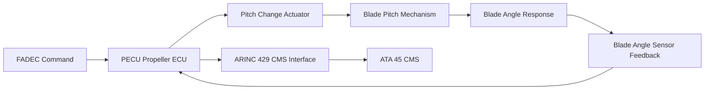
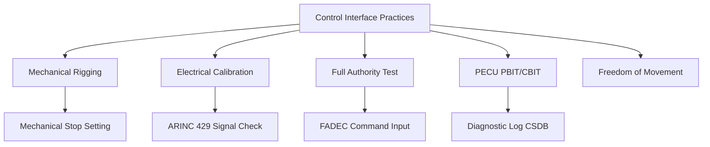

<!-- ──────────────────────────────────────────────────────────────────────────
     QATL-ATLAS-1000-ATLAS-060-069-060-060-PROPELLER-ROTOR-CONTROL-INTERFACE-PRACTICES
     ATA 60 · Propeller/Rotor Control Interface Practices
     AMPEL360E eWTW — ATLAS Register 1000
────────────────────────────────────────────────────────────────────────────── -->

# Propeller/Rotor Control Interface Practices

---

## §0 Hyperlink Policy

> All hyperlinks in this document are **relative** (five directory levels: `../../../../../`).
> Absolute URLs are forbidden. Every linked document must exist in the Q+ATLANTIDE repository
> before the link is activated. Broken links are treated as open issues and must be resolved
> before the document is promoted from `DRAFT` to `APPROVED`.

---

## §1 Purpose

This document defines the controlled interface standards, rigging procedures, and verification tests for mechanical and electrical control interfaces between propeller/rotor systems and the aircraft propulsion control architecture. Incorrect rigging of pitch-change mechanisms or misconfigured electrical command signals are leading causes of propeller in-flight incidents.

On the AMPEL360E eWTW, the propulsion control interface uses the FADEC/ECU digital command architecture (ATA 67); pitch-change actuators receive digital commands via the Propeller Electronic Control Unit (PECU). This document defines the practices for verifying and setting both the mechanical range of travel and the digital signal calibration at the PECU–propeller actuator interface.

---

## §2 Applicability

| Parameter | Value |
|---|---|
| Aircraft Program | AMPEL360E eWTW |
| ATA reference | ATA 60-060 — Control Interface Practices |
| FADEC/PECU interface | ATA 67 Engine Controls |
| Rigging standard | SAE AS7506 / AMM Chapter 27 rigging procedures |
| Digital interface standard | ARINC 429 / AFDX ARINC 664 P7 |
| Certification basis | CS-25 §25.901(b) — Installation of powerplant controls |
| S1000D SNS | 060-060-00 |

---

## §3 Functional Description ![DRAFT]

Control interface practices address two coupled domains:

1. **Mechanical rigging** — physical range-of-travel checks for pitch-change actuator travel; mechanical stops set and verified; linkage freedom-of-movement check; null position and full-travel positions recorded against drawing limits.

2. **Electrical / digital interface verification** — PECU signal calibration check; command-response verification across full authority range; ARINC 429 bus signal format check; BITE self-test pass verification; end-to-end control channel test from FADEC command to pitch-change actuator response.

---

## §4 Functional Breakdown

| ID | Name | Description | Lead Division |
|---|---|---|---|
| F-001 | Mechanical Rigging Check | Verify pitch-change actuator mechanical travel against drawing limits; set and lock stops. | Q-MECHANICS / technician |
| F-002 | Electrical Interface Calibration | Calibrate PECU command-to-actuator response curve; verify ARINC 429 output format. | Avionics technician |
| F-003 | Full-Authority Control Test | Command full pitch range from FADEC; verify actuator response at all control points. | Test engineer |
| F-004 | BITE Self-Test Verification | Execute PECU PBIT and CBIT; confirm all diagnostic paths pass. | Avionics technician |
| F-005 | Freedom-of-Movement Check | Verify all mechanical links move without binding, excessive friction, or interference. | Q-MECHANICS / technician |

---

## §5 System Context — Mermaid Diagram

---

## §6 Internal Architecture — Mermaid Diagram

---

## §7 Components and LRUs

| Component | Part Number | Qty | Location | Maintenance Interval | Notes |
|---|---|---|---|---|---|
| Propeller Electronic Control Unit (PECU) | AMPEL360E-PECU-001 | 1 per propulsion unit | Nacelle avionics bay | On condition / per FADEC PBIT | TBD |
| Blade angle sensor (LVDT type) | Drawing-specific | Per blade (N blades) | Pitch change mechanism | On condition / annual calibration | TBD |
| Pitch-change actuator (EHA type) | Drawing-specific | 1 per propulsion unit | Hub actuation zone | On condition | TBD |
| PECU GSE interface (digital test set) | Approved GSE list | 1 per hangar | Avionics shop | Annual calibration | TBD |
| Mechanical rigging fixture (angular protractor) | Approved tool | Per hub type | Tool store | Annual calibration | TBD |

---

## §8 Interfaces

| Interface Type | Connected System | Protocol / Medium | Data / Function |
|---|---|---|---|
| FADEC | ATA 67 Engine Controls | ARINC 429 / AFDX digital command | ICD-060-067 |
| ATA 45 CMS | Central Maintenance System | BITE fault codes; PECU health data | S1000D DM-400 fault isolation |
| ATA 24 Electrical Power | Power distribution | 28 V DC / HVDC bus supply to PECU | ATA 24 load sheet |
| ATA 31 ECAM | Cockpit indication | Blade angle, pitch-change status | ARINC 429 parameter list |
| Structural | ATA 57 Wing attachment | Nacelle vibration interface; control cable routing clearance | Installation drawing |

---

## §9 Operating Modes

| Mode | Trigger | System State | Actions / Consequences |
|---|---|---|---|
| Normal operation | Powered, PECU PBIT complete | Full pitch authority active | FADEC commands accepted; BITE running |
| Rigging mode | PECU in maintenance mode | Aircraft grounded; drive powered off | Full actuator travel exercised; stops verified |
| PECU fault | Fault detected in PECU | Degraded command authority | Fixed-pitch fallback (fail-safe position) |
| Ground functional test | Post-installation check | Aircraft grounded | Full command sweep; BITE pass required |

---

## §10 Performance and Budgets ![DRAFT]

| Parameter | Requirement | Target / Design Value | Status |
|---|---|---|---|
| Pitch actuator travel accuracy | ± 0.5° of commanded angle across full range | LVDT calibration bench test | TBD |
| PECU PBIT completion time | < 30 s | PECU spec | TBD |
| ARINC 429 update rate (blade angle word) | 50 Hz | ARINC 429 bus analyser check | TBD |
| Mechanical stop position tolerance | ± 0.25° of nominal drawing position | Angular protractor measurement | TBD |

---

## §11 Safety, Redundancy and Fault Tolerance

- PECU must be isolated (ATA 24 circuit breaker pulled) before any work on the pitch-change actuator or blade angle sensor; LOTO required.
- Any rigging adjustment must be followed by a complete full-authority sweep test before the aircraft is cleared for flight; partial rigging checks are not acceptable.
- Fail-safe pitch position (feather or defined fixed pitch) must be verified to engage correctly following a simulated PECU power failure.
- Calibrated angular measurement tooling is mandatory for all rigging tasks; protractors not on the approved calibration register are prohibited.

---

## §12 Maintenance and Diagnostics

| Task | Interval | Access | Special Tools |
|---|---|---|---|
| PECU PBIT execution and log review | A-check / after PECU replacement | Maintenance terminal / MCDU | PECU GSE test set |
| Blade angle sensor calibration check | Per AMM interval or after blade replacement | Hub access | PECU GSE + calibration reference |
| Rigging position verification | At major inspection or following reported pitch anomaly | Maintenance bay, drive isolated | Angular protractor + rigging fixture |
| ARINC 429 bus signal check | After PECU replacement | Avionics test bench | ARINC 429 analyser |
| Freedom-of-movement full travel sweep | After any pitch linkage maintenance | Ground run or rigging mode | Test command set via PECU GSE |

---

## §13 Footprint — Physical, Electrical, Maintenance, Data ![TBD]

| Footprint Type | Parameter | Value | Notes |
|---|---|---|---|
| Physical | Mass (system total) | ![TBD] | Pending OEM data |
| Physical | Envelope (max) | ![TBD] | Pending detailed design |
| Electrical | Peak power (W) | ![TBD] | To be defined |
| Maintenance | Access category | Standard line maintenance | Per AMM |
| Data | AFDX bandwidth | ![TBD] | Per AFDX bus load analysis |

---

## §14 Safety and Certification References ![DRAFT]

| Standard / Document | Title | Issuing Body | Applicability |
|---|---|---|---|
| CS-25 §25.901(b) | Installation of powerplant controls | EASA | Propeller control system installation requirements |
| ARINC 429 | Digital Information Transfer System | ARINC | PECU data bus standard |
| SAE AS7506 | Maintenance Processes and Procedures for Aircraft Propellers | SAE International | Rigging practice reference |
| ATA iSpec 2200 | Chapter 60 — Control Interface Practices | Air Transport Association | Interface practice scope |
| DO-178C | Software Considerations in Airborne Systems — PECU Software | RTCA | PECU software assurance |

---

## §15 V&V Approach ![TBD]

| Phase | Method | Acceptance Criterion | Status |
|---|---|---|---|
| Design | Analysis and simulation | Meets all §10 performance requirements | ![TBD] |
| Integration | Ground functional test | All BITE tests pass; interfaces verified | ![TBD] |
| Qualification | DO-160G environmental test | All applicable tests pass | ![TBD] |
| Certification | EASA CS-25 / CS-E compliance demonstration | Type Certificate / STC approval | ![TBD] |

---

## §16 Glossary

| Term | Definition |
|---|---|
| **PECU** | Propeller Electronic Control Unit — digital controller commanding pitch-change actuator from FADEC signals. |
| **LVDT** | Linear Variable Differential Transformer — position sensor used to measure blade angle or actuator displacement. |
| **EHA** | Electro-Hydraulic Actuator — an actuator containing an internal self-contained hydraulic circuit driven by an integral electric motor. |
| **Pitch-change mechanism** | Assembly enabling individual blade pitch rotation; key to propeller pitch control including feathering and reverse thrust. |
| **PBIT** | Power-On Built-In Test — diagnostic self-test executed automatically when the PECU receives power. |
| **CBIT** | Continuous Built-In Test — ongoing background diagnostic running during normal PECU operation. |
| **Feathering** | Rotating propeller blades to approximately 90° pitch to minimise drag in the event of engine failure. |
| **Fine pitch** | Propeller blade angle set for maximum thrust at low forward speed (e.g., take-off); minimum blade angle. |
| **Coarse pitch** | Propeller blade angle set for efficient cruise operation; high blade angle, lower RPM. |
| **Rigging** | The process of mechanically setting and verifying control system positions and ranges of travel against design drawings. |

---

## §17 Open Issues

| ID | Description | Owner | Target |
|---|---|---|---|
| OI-060-060-001 | Confirm ARINC 429 or AFDX interface type for PECU on AMPEL360E (PECU supplier data pending) | Q-MECHANICS / FADEC team | 2026-Q3 |
| OI-060-060-002 | Define fail-safe pitch position for AMPEL360E propulsor (feather vs. fine pitch vs. coarse pitch) | Q-AIR / Q-GREENTECH | 2026-Q3 |

---

## §18 Status Legend

| Badge | Meaning |
|---|---|
| `![DRAFT]` | Section is drafted but not yet reviewed |
| `![TBD]` | Content not yet started — to be defined |
| `![To Be Completed]` | Partially complete — needs additional content |
| `![APPROVED]` | Reviewed and formally approved |

---

## §19 Related Documents (Siblings in this Subsection)

- [060-000](./060-000.md)
- [060-010](./060-010.md)
- [060-020](./060-020.md)
- [060-030](./060-030.md)
- [060-040](./060-040.md)
- [060-050](./060-050.md)
- [060-070](./060-070.md)
- [060-080](./060-080.md)
- [060-090](./060-090.md)

---

## §20 Change Log

| Rev | Date | Author | Description |
|---|---|---|---|
| 0.1 | 2026-05-11 | @copilot | Initial DRAFT — contextualized content per AMPEL360E eWTW architecture |
