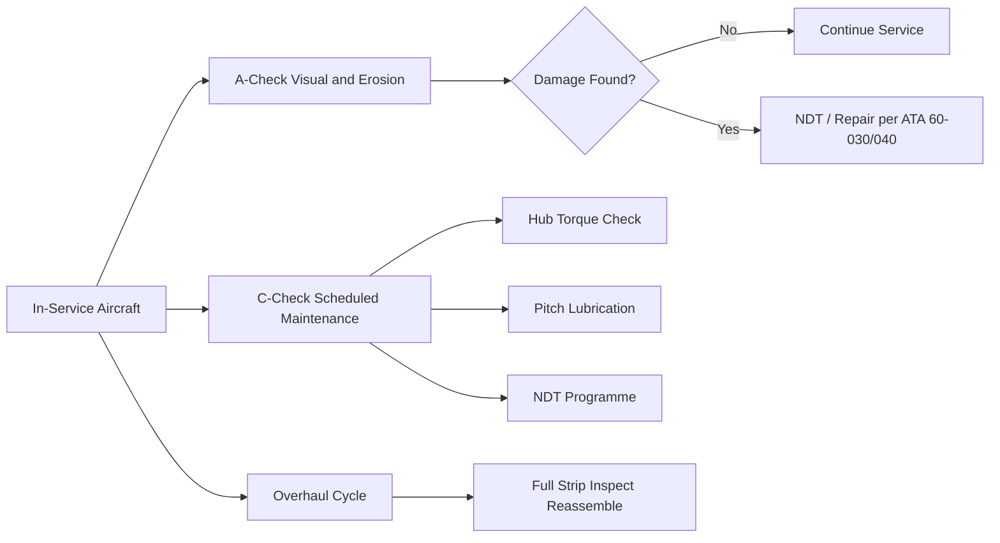
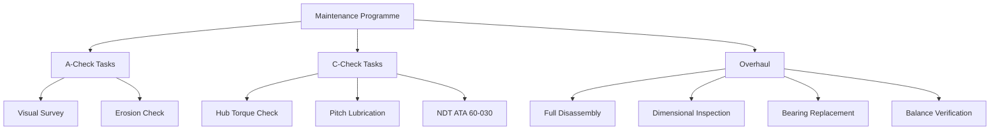

<!-- ──────────────────────────────────────────────────────────────────────────
     QATL-ATLAS-1000-ATLAS-060-069-060-070-PROPELLER-ROTOR-MAINTENANCE-AND-SERVICING
     ATA 60 · Propeller/Rotor Maintenance and Servicing
     programme-defined aircraft type — ATLAS Register 1000
────────────────────────────────────────────────────────────────────────────── -->

# Propeller/Rotor Maintenance and Servicing

---

## §0 Hyperlink Policy

> All hyperlinks in this document are **relative** (five directory levels: `../../../../../`).
> Absolute URLs are forbidden. Every linked document must exist in the Q+ATLANTIDE repository
> before the link is activated. Broken links are treated as open issues and must be resolved
> before the document is promoted from `DRAFT` to `APPROVED`.

---

## §1 Purpose

This document defines the agnostic ATLAS standard-level architecture context for `Propeller/Rotor Maintenance and Servicing`.

It describes the controlled scope, functions, interfaces, safety considerations, lifecycle traceability, and S1000D/CSDB mapping logic that programme implementations shall instantiate when this node is applicable.

This document is not a programme design baseline. Programme-specific capacities, locations, part numbers, effectivity, operating limits, maintenance references, and data module codes shall be defined only inside the applicable programme implementation branch.
## §2 Applicability

| Applicability Level | Rule |
|---|---|
| Standard taxonomy | Applies to the ATLAS node `060` |
| Programme implementation | Conditional; determined by programme architecture, trade studies, certification basis, and applicability model |
| Product configuration | Defined in the programme-specific configuration baseline |
| Effectivity | Defined in the programme CSDB / applicability layer |
| Non-applicability | Must be explicitly stated in the programme impact-study branch when excluded |
## §3 Functional Description ![DRAFT]

The maintenance programme is structured into three tiers:
- **A-check (transit/weekly)**: visual survey, leading-edge erosion check, blade tip clearance check.
- **C-check (heavy maintenance)**: blade root torque check, pitch-change mechanism lubrication, actuator seal inspection, full NDT programme (ATA 60-030).
- **Overhaul (shop-level)**: full disassembly, dimensional inspection of all hub bores and blade retention features, bearing replacement, full balance verification.

---

## §4 Functional Breakdown

| ID | Name | Description | Lead Division |
|---|---|---|---|
| F-001 | A-Check Servicing | Visual inspection, erosion check, blade tip clearance measurement. | Line maintenance technician |
| F-002 | C-Check Maintenance | Hub torque check, pitch-change lubrication, actuator seal inspection, scheduled NDT. | Base maintenance MRO |
| F-003 | Lubrication Schedule | Apply approved grease to hub bearings and spar bearings at defined intervals. | Technician / lubrication chart |
| F-004 | Pitch-Change Actuator Service | Actuator seal and fluid check; pressure test at C-check. | Hydraulic/actuator technician |
| F-005 | Overhaul Cycle | Full disassembly, dimensional inspection, bearing change, balance, and reassembly. | Approved MRO / OEM |

---

## §5 System Context — Mermaid Diagram

---

## §6 Internal Architecture — Mermaid Diagram

---

## §7 Components and LRUs

| Component | Part Number | Qty | Location | Maintenance Interval | Notes |
|---|---|---|---|---|---|
| Approved grease (MIL-PRF-23827) | MIL-PRF-23827 Type II | Per batch | Lubrication store | Shelf life per PS | TBD |
| Spar bearing grease (AMS 2518) | AMS 2518 | Per batch | Lubrication store | Shelf life per PS | TBD |
| Blade pitch actuator hydraulic fluid (if EHA) | Drawing-specific fluid type | Per service kit | Lubrication store | Replace at C-check | TBD |
| Torque wrench (hub retention) | Approved calibrated wrench | 1 per maintenance team | Tool crib | 6-month calibration | TBD |
| Blade tip clearance gauge | Feeler gauge set | Per maintenance team | Tool kit | Annual inspection | TBD |

---

## §8 Interfaces

| Interface Type | Connected System | Protocol / Medium | Data / Function |
|---|---|---|---|
| Engineering | Q-MECHANICS | Lubrication specification and interval approval | Lubrication chart AMM Ch 12 |
| CMS / BITE | ATA 45 | BITE triggered maintenance alerts | BITE fault code to maintenance message |
| Vibration monitoring | ATA 68 Engine Indicating | Vibration trend data input to maintenance decision | PHM dashboard |
| CSDB | Q-DATAGOV | Signed maintenance task records | S1000D DM-300 / DM-520 submissions |

---

## §9 Operating Modes

| Mode | Trigger | System State | Actions / Consequences |
|---|---|---|---|
| A-Check | Transit / weekly interval | Aircraft at gate or light maintenance | Tasks complete; no unresolved findings |
| C-Check | Hard time / FH threshold | Aircraft at base maintenance input | All C-check tasks signed off; NDT passed |
| Overhaul | Overhaul cycle or on-condition trigger | Component removed to approved MRO | Full overhaul documentation package issued |
| Unscheduled maintenance | BITE alert, vibration exceedance, FOD event | Aircraft at gate | Investigation complete; defect rectified |

---

## §10 Performance and Budgets ![DRAFT]

| Parameter | Requirement | Target / Design Value | Status |
|---|---|---|---|
| Hub bearing lubrication interval (MIL-PRF-23827) | Per MPD — target 1 000 FH C-check | Lubrication chart | TBD |
| A-check erosion check duration | < 30 min per propulsor unit | Task time study | TBD |
| Pitch-change actuator seal life | Per OEM data — target 3 000 FH | Actuator OEM report | TBD |
| Overhaul interval | Per MSG-3 analysis — target TBD FH/cycles | MSG-3 task card | TBD |

---

## §11 Safety, Redundancy and Fault Tolerance

- Over-lubrication of spar bearings can cause grease migration into blade root area, potentially affecting NDT detectability; apply precisely the specified quantity.
- Hub retention torque checks are safety-critical; only calibrated torque wrenches with current certificates may be used.
- Any C-check NDT finding of a crack or delamination stops the maintenance task; an engineering disposition is required before the task can continue.
- Pitch-change actuator fluid check requires the aircraft to be on ground with drive isolated; actuator pressurisation under power is prohibited during maintenance.

---

## §12 Maintenance and Diagnostics

| Task | Interval | Access | Special Tools |
|---|---|---|---|
| A-Check visual and erosion survey | A-check interval (TBD FH) | External blade access | Inspection torch, depth gauge, VIS-001 |
| C-Check hub retention torque verification | C-check interval (TBD FH) | Spinner removal, hub access | Calibrated torque wrench |
| C-Check pitch-change mechanism lubrication | C-check interval | Pitch mechanism access | Approved grease, grease gun, lubrication chart |
| Overhaul — blade root spar bearing replacement | Overhaul cycle (TBD) | Shop — full disassembly | Bearing extraction/installation tools, bearing heater |
| BITE log review and escalation | A-check or BITE alert | Maintenance terminal | CMS download terminal |

---

## §13 Footprint — Physical, Electrical, Maintenance, Data ![TBD]

| Footprint Type | Parameter | Value | Notes |
|---|---|---|---|
| Physical | Mass (system total) | ![TBD] | Pending OEM data |
| Physical | Envelope (max) | ![TBD] | Pending detailed design |
| Electrical | Peak power (W) | ![TBD] | To be defined |
| Maintenance | Access category | Standard line maintenance | Per AMM |
| Data | AFDX bandwidth | ![TBD] | Per AFDX bus load analysis |

---

## §14 Safety and Certification References ![DRAFT]

| Standard / Document | Title | Issuing Body | Applicability |
|---|---|---|---|
| MSG-3 Revision 2020 | Airline/Manufacturer Maintenance Program Development Document | ATA / IATA | Maintenance task logic |
| MIL-PRF-23827 | Performance Specification — Grease, Aircraft and Instrument | US DoD | Hub bearing lubricant specification |
| AMS 2518 | Grease — Aircraft Wheel and Airframe | SAE International | Spar bearing lubricant specification |
| ATA iSpec 2200 | Chapter 60 — Propeller Standard Practices | Air Transport Association | Maintenance practice scope |
| EASA Part-M | Continuing Airworthiness Management | EASA | Airworthiness maintenance programme requirement |

---

## §15 V&V Approach ![TBD]

| Phase | Method | Acceptance Criterion | Status |
|---|---|---|---|
| Design | Analysis and simulation | Meets all §10 performance requirements | ![TBD] |
| Integration | Ground functional test | All BITE tests pass; interfaces verified | ![TBD] |
| Qualification | DO-160G environmental test | All applicable tests pass | ![TBD] |
| Certification | EASA CS-25 / CS-E compliance demonstration | Type Certificate / STC approval | ![TBD] |

---

## §16 Glossary

| Term | Definition |
|---|---|
| **MSG-3** | Maintenance Steering Group Revision 3 — industry standard methodology for developing aircraft maintenance programmes using task-logic decision trees. |
| **MPD** | Master Planning Document — defines all scheduled maintenance tasks, intervals, and access requirements for the aircraft. |
| **A-Check** | Light maintenance check at the shortest scheduled interval; typically performed at gate or line maintenance. |
| **C-Check** | Base-level heavy maintenance check involving system-level access, component servicing, and NDT. |
| **Overhaul** | Full disassembly, inspection, repair or replacement of worn parts, and reassembly of a component to new or equivalent-to-new condition. |
| **On-condition** | Maintenance strategy where component removal is triggered by a measurable performance indicator rather than a fixed time interval. |
| **MIL-PRF-23827** | Military specification grease used for aircraft hub bearings; high-load, low-temperature capable. |
| **AMS 2518** | SAE Aerospace Material Specification for grease used in blade spar bearings. |
| **PHM** | Prognostic Health Management — use of sensor data and algorithms to predict remaining useful life of components. |
| **Grease migration** | Unintended movement of lubricating grease from its intended location into adjacent areas; can mask NDT signals. |

---

## §17 Open Issues

| ID | Description | Owner | Target |
|---|---|---|---|
| OI-060-070-001 | Define lubrication interval for [PROGRAMME-AIRCRAFT] spar bearings based on OEM qualification data | Q-MECHANICS / supplier | 2026-Q4 |
| OI-060-070-002 | Establish overhaul interval for [PROGRAMME-AIRCRAFT] propulsor based on fatigue spectrum and MSG-3 analysis | Q-AIR / Q-MECHANICS | 2027-Q1 |
| OI-060-070-003 | Confirm pitch-change actuator seal change interval with EHA supplier | Q-MECHANICS / actuator OEM | 2026-Q4 |

---

## §18 Status Legend

| Badge | Meaning |
|---|---|
| `![DRAFT]` | Section is drafted but not yet reviewed |
| `![TBD]` | Content not yet started — to be defined |
| `![To Be Completed]` | Partially complete — needs additional content |
| `![APPROVED]` | Reviewed and formally approved |

---

## §19 Related Documents (Siblings in this Subsection)

- [060-000](./060-000.md)
- [060-010](./060-010.md)
- [060-020](./060-020.md)
- [060-030](./060-030.md)
- [060-040](./060-040.md)
- [060-050](./060-050.md)
- [060-060](./060-060.md)
- [060-080](./060-080.md)
- [060-090](./060-090.md)

---

## §20 Change Log

| Rev | Date | Author | Description |
|---|---|---|---|
| 0.1 | 2026-05-11 | @copilot | Initial DRAFT — contextualized content per programme-defined aircraft type architecture |
