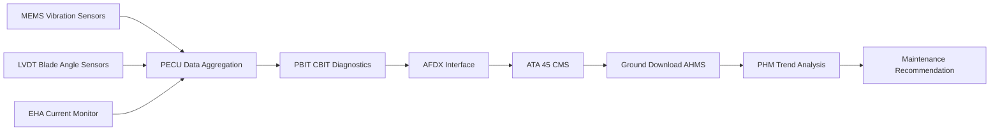
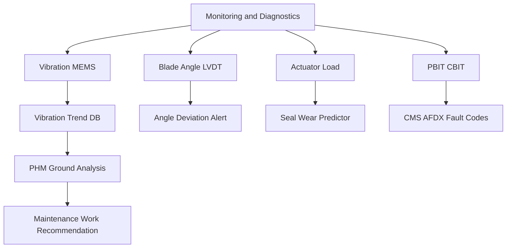

<!-- ──────────────────────────────────────────────────────────────────────────
     QATL-ATLAS-1000-ATLAS-060-069-060-080-PROPELLER-ROTOR-MONITORING-DIAGNOSTICS-AND-CONTROL-INTERFACES
     ATA 60 · Propeller/Rotor Monitoring, Diagnostics and Control Interfaces
     AMPEL360E eWTW — ATLAS Register 1000
────────────────────────────────────────────────────────────────────────────── -->

# Propeller/Rotor Monitoring, Diagnostics and Control Interfaces

---

## §0 Hyperlink Policy

> All hyperlinks in this document are **relative** (five directory levels: `../../../../../`).
> Absolute URLs are forbidden. Every linked document must exist in the Q+ATLANTIDE repository
> before the link is activated. Broken links are treated as open issues and must be resolved
> before the document is promoted from `DRAFT` to `APPROVED`.

---

## §1 Purpose

This document defines the monitoring parameters, BITE architecture, diagnostic message structure, and CMS interface requirements for propeller and rotor health management on the AMPEL360E eWTW. Propeller health monitoring reduces maintenance costs, prevents unscheduled removals, and detects incipient structural and mechanical deterioration before it reaches airworthiness-relevant levels.

The AMPEL360E propulsor health monitoring is integrated with the Aircraft Health Management System (AHMS) via the Central Maintenance System (ATA 45). The Propeller Electronic Control Unit (PECU) provides vibration, blade angle, actuator load, and BITE data to the CMS through the AFDX backbone. Ground-based analysis tools access downloaded PECU data for trend analysis and PHM (Prognostic Health Management) processing.

---

## §2 Applicability

| Parameter | Value |
|---|---|
| Aircraft Program | AMPEL360E eWTW |
| ATA reference | ATA 60-080 — Monitoring, Diagnostics and Control Interfaces |
| CMS interface | ATA 45 Central Maintenance System — AFDX backbone |
| PHM platform | AMPEL360E AHMS ground tool suite |
| BITE assurance level | DO-178C DAL D (PECU BITE partition) |
| S1000D SNS | 060-080-00 |

---

## §3 Functional Description ![DRAFT]

Propeller/rotor monitoring covers three health domains:

1. **Vibration monitoring** — MEMS accelerometers at the hub and nacelle measure 1P, 2P, and NP vibration; trend data alerts maintenance when levels approach action limits.
2. **Blade angle and actuator health** — LVDT blade angle sensor data compared with commanded angle; actuator load trending for seal and bearing wear detection.
3. **BITE diagnostics** — PECU self-test coverage for control electronics, sensor plausibility, ARINC bus integrity, and actuator loop test; fault codes reported to CMS in S1000D-compatible format.

---

## §4 Functional Breakdown

| ID | Name | Description | Lead Division |
|---|---|---|---|
| F-001 | Vibration Trending | Monitor hub and nacelle vibration (1P, 2P, NP) via MEMS sensors; alert at action limits. | PECU / CMS |
| F-002 | Blade Angle Monitoring | Compare LVDT-measured angle with FADEC command; detect sensor drift, actuator lag. | PECU continuous |
| F-003 | Actuator Load Trending | Monitor EHA current draw; detect bearing wear, seal degradation, or hydraulic contamination. | PECU CBIT |
| F-004 | PBIT/CBIT Diagnostics | Execute PBIT at power-on; run CBIT continuously; report faults to CMS via AFDX. | PECU |
| F-005 | PHM Ground Analysis | Download PECU health records; run PHM algorithms; generate maintenance recommendations. | AHMS ground tool |

---

## §5 System Context — Mermaid Diagram

---

## §6 Internal Architecture — Mermaid Diagram

---

## §7 Components and LRUs

| Component | Part Number | Qty | Location | Maintenance Interval | Notes |
|---|---|---|---|---|---|
| MEMS accelerometer (hub-mounted) | Approved sensor list | 2 per hub (X+Y axis) | Hub attachment flange | Annual calibration / on-condition | TBD |
| LVDT blade angle sensor | Drawing-specific | N per blade | Pitch mechanism | On condition / annual calibration | TBD |
| EHA current monitor (integrated in PECU) | PECU integrated | Internal | PECU | On condition | TBD |
| PECU (with BITE partition) | AMPEL360E-PECU-001 | 1 per propulsor | Nacelle avionics bay | On condition / per BITE schedule | TBD |
| AHMS ground analysis workstation | Approved tool suite | 1 per MRO hub | Maintenance operations centre | Software update per release | TBD |

---

## §8 Interfaces

| Interface Type | Connected System | Protocol / Medium | Data / Function |
|---|---|---|---|
| ATA 45 CMS | Central Maintenance System | AFDX ARINC 664 P7 | BITE fault codes, health data packets |
| ATA 68 Engine Indicating | Engine parameter display | ARINC 429 or AFDX | Vibration level indication to EICAS/ECAM |
| ATA 31 ECAM | Cockpit display | AFDX | Vibration advisory alert display |
| AHMS ground tool | Ground analysis platform | Wired or wireless download | PECU health record, trending data |
| ATA 67 FADEC | Engine Controls | AFDX | Blade angle commanded vs. actual comparison |

---

## §9 Operating Modes

| Mode | Trigger | System State | Actions / Consequences |
|---|---|---|---|
| Normal powered | Aircraft powered, PECU operational | PBIT passed | CBIT running; all monitoring active |
| Vibration alert | Vibration level crosses advisory threshold | Aircraft in flight or on ground | CMS message; maintenance review required |
| BITE fault | PECU fault detected in CBIT | Any phase | Fault logged in CMS; maintenance action triggered |
| Ground download | Aircraft at gate | Maintenance terminal connected | PECU data downloaded; PHM analysis executed |

---

## §10 Performance and Budgets ![DRAFT]

| Parameter | Requirement | Target / Design Value | Status |
|---|---|---|---|
| Vibration monitoring update rate | 1P sample per revolution (continuous) | PECU specification | TBD |
| Blade angle monitoring resolution | 0.1° per LVDT sample | LVDT calibration data | TBD |
| PBIT completion time | < 30 s | PECU specification | TBD |
| CBIT fault detection coverage | ≥ 80 % of all PECU hardware faults | BITE design analysis | TBD |
| PHM prediction horizon (seal wear) | ≥ 200 FH advance warning | Algorithm validation | TBD |

---

## §11 Safety, Redundancy and Fault Tolerance

- Vibration levels exceeding the 'action' limit (to be defined in MPD) require the aircraft to be grounded until engineering review; flight continuation above action limits is a safety stop.
- PECU BITE faults classified as 'GO IF' in the MEL require CMS fault escalation before dispatch; dispatch without CMS acknowledgement is prohibited.
- PHM recommendations are advisory only; all maintenance actions must be formally raised as work orders and executed by authorised personnel per AMM.
- PECU health data downloads must be performed at every scheduled A-check to ensure PHM trend continuity; gaps in health data reduce PHM prediction reliability.

---

## §12 Maintenance and Diagnostics

| Task | Interval | Access | Special Tools |
|---|---|---|---|
| PECU PBIT execution and fault log review | A-check or after PECU replacement | Maintenance terminal / MCDU | CMS download terminal |
| Vibration trend data download and PHM analysis | A-check | Ground maintenance terminal | AHMS workstation |
| MEMS accelerometer calibration check | Annual | Hub access (blade removal) | Calibration mass, accelerometer test rig |
| BITE fault code resolution (after CMS alert) | On demand / as triggered | Maintenance bay | PECU GSE test set |
| AHMS software update | Per software release schedule | Ground workstation | AHMS update package |

---

## §13 Footprint — Physical, Electrical, Maintenance, Data ![TBD]

| Footprint Type | Parameter | Value | Notes |
|---|---|---|---|
| Physical | Mass (system total) | ![TBD] | Pending OEM data |
| Physical | Envelope (max) | ![TBD] | Pending detailed design |
| Electrical | Peak power (W) | ![TBD] | To be defined |
| Maintenance | Access category | Standard line maintenance | Per AMM |
| Data | AFDX bandwidth | ![TBD] | Per AFDX bus load analysis |

---

## §14 Safety and Certification References ![DRAFT]

| Standard / Document | Title | Issuing Body | Applicability |
|---|---|---|---|
| DO-178C | Software Considerations in Airborne Systems | RTCA | PECU BITE software assurance level |
| ARINC 664 P7 | Aircraft Data Network — AFDX | ARINC | CMS interface bus standard |
| SAE ARP4761 | Guidelines and Methods for Conducting Safety Assessment Process on Civil Airborne Systems | SAE International | BITE coverage assessment methodology |
| MSG-3 Revision 2020 | Airline/Manufacturer Maintenance Program Development Document | ATA / IATA | PHM maintenance credit methodology |
| ATA iSpec 2200 | Chapter 60 — Propeller Standard Practices | Air Transport Association | Monitoring system scope |

---

## §15 V&V Approach ![TBD]

| Phase | Method | Acceptance Criterion | Status |
|---|---|---|---|
| Design | Analysis and simulation | Meets all §10 performance requirements | ![TBD] |
| Integration | Ground functional test | All BITE tests pass; interfaces verified | ![TBD] |
| Qualification | DO-160G environmental test | All applicable tests pass | ![TBD] |
| Certification | EASA CS-25 / CS-E compliance demonstration | Type Certificate / STC approval | ![TBD] |

---

## §16 Glossary

| Term | Definition |
|---|---|
| **MEMS** | Micro-Electro-Mechanical Sensor — miniature accelerometer used to measure hub vibration; lightweight and low-power. |
| **1P** | Once-per-revolution vibration component; signature of propeller mass imbalance. |
| **NP** | N-per-revolution vibration (N = number of blades); signature of aerodynamic blade loading periodicity. |
| **LVDT** | Linear Variable Differential Transformer — high-precision position sensor measuring blade angle. |
| **EHA** | Electro-Hydraulic Actuator — self-contained actuator; current draw is a proxy for bearing and seal condition. |
| **AHMS** | Aircraft Health Management System — ground-based software suite for downloading, analysing, and trending airborne health data. |
| **PHM** | Prognostic Health Management — predictive maintenance technique using sensor trends and models to forecast remaining component life. |
| **PBIT** | Power-On Built-In Test — diagnostic self-test executed at PECU power-up. |
| **CBIT** | Continuous Built-In Test — background diagnostic continuously monitoring PECU hardware and software integrity. |
| **VL** | Virtual Link — defined bandwidth-allocated unidirectional data path within an AFDX (ARINC 664 P7) network. |

---

## §17 Open Issues

| ID | Description | Owner | Target |
|---|---|---|---|
| OI-060-080-001 | Define vibration alert and action limits for AMPEL360E propulsor based on OEM analytical model | Q-AIR / Q-MECHANICS | 2026-Q4 |
| OI-060-080-002 | Determine PHM model accuracy requirements for seal wear prediction on EHA (OEM model validation pending) | Q-MECHANICS / EHA supplier | 2027-Q1 |
| OI-060-080-003 | Confirm AFDX virtual link (VL) allocation for PECU in aircraft NCF | Q-DATAGOV / avionics team | 2026-Q3 |

---

## §18 Status Legend

| Badge | Meaning |
|---|---|
| `![DRAFT]` | Section is drafted but not yet reviewed |
| `![TBD]` | Content not yet started — to be defined |
| `![To Be Completed]` | Partially complete — needs additional content |
| `![APPROVED]` | Reviewed and formally approved |

---

## §19 Related Documents (Siblings in this Subsection)

- [060-000](./060-000.md)
- [060-010](./060-010.md)
- [060-020](./060-020.md)
- [060-030](./060-030.md)
- [060-040](./060-040.md)
- [060-050](./060-050.md)
- [060-060](./060-060.md)
- [060-070](./060-070.md)
- [060-090](./060-090.md)

---

## §20 Change Log

| Rev | Date | Author | Description |
|---|---|---|---|
| 0.1 | 2026-05-11 | @copilot | Initial DRAFT — contextualized content per AMPEL360E eWTW architecture |
