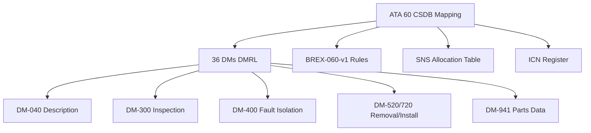

<!-- ──────────────────────────────────────────────────────────────────────────
     QATL-ATLAS-1000-ATLAS-060-069-060-090-S1000D---CSDB-MAPPING-AND-TRACEABILITY
     ATA 60 · S1000D / CSDB Mapping and Traceability
     programme-defined aircraft type — ATLAS Register 1000
────────────────────────────────────────────────────────────────────────────── -->

# S1000D / CSDB Mapping and Traceability


---

## §0 Hyperlink Policy

> All hyperlinks in this document are **relative** (five directory levels: `../../../../../`).
> Absolute URLs are forbidden. Every linked document must exist in the Q+ATLANTIDE repository
> before the link is activated. Broken links are treated as open issues and must be resolved
> before the document is promoted from `DRAFT` to `APPROVED`.

---

## §1 Purpose

This document defines the agnostic ATLAS standard-level architecture context for `S1000D / CSDB Mapping and Traceability`.

It describes the controlled scope, functions, interfaces, safety considerations, lifecycle traceability, and S1000D/CSDB mapping logic that programme implementations shall instantiate when this node is applicable.

This document is not a programme design baseline. Programme-specific capacities, locations, part numbers, effectivity, operating limits, maintenance references, and data module codes shall be defined only inside the applicable programme implementation branch.

## §2 Applicability

| Applicability Level | Rule |
|---|---|
| Standard taxonomy | Applies to the ATLAS node `060` |
| Programme implementation | Conditional; determined by programme architecture, trade studies, certification basis, and applicability model |
| Product configuration | Defined in the programme-specific configuration baseline |
| Effectivity | Defined in the programme CSDB / applicability layer |
| Non-applicability | Must be explicitly stated in the programme impact-study branch when excluded |

## §3 Functional Description ![DRAFT]

The DMRL covers 36 Data Modules distributed across 9 SNS nodes (one per subsubject 000–080):

- **Description DMs (040)** — system/component descriptions for each subsubject.
- **Inspection DMs (300)** — scheduled inspection tasks referencing NDT procedure cards.
- **Maintenance DMs (520/720)** — removal/installation procedures for components.
- **Fault isolation DMs (400)** — BITE-driven fault isolation trees.
- **Parts data DMs (941)** — illustrated parts data for each subsubject component class.

BREX validation is a mandatory CSDB ingestion gate for all ATA 60 DMs. The BREX checks the mandatory PS and NAS 410 citations, validates SNS code format, and enforces the no-pneumatic-tooling constraint.

---

## §4 Functional Breakdown

| ID | Name | Description | Lead Division |
|---|---|---|---|
| F-001 | DMC Structure Definition | Define and maintain the 060 DMC namespace, SNS allocation, and info-code set. | Q-DATAGOV |
| F-002 | BREX Configuration | Maintain [PROGRAMME-AIRCRAFT]-BREX-060-v1; enforce constraints on all 060 DM submissions. | Q-DATAGOV |
| F-003 | DMRL Maintenance | Maintain the 36-DM DMRL; track authoring, review, and release status of each DM. | Q-DATAGOV / Q-GREENTECH |
| F-004 | Traceability Matrix | Maintain ATLAS architecture to S1000D DM traceability matrix. | Q-DATAGOV |
| F-005 | ICN Management | Assign and control ICNs (Illustration Control Numbers) for all ATA 60 illustrations. | Q-DATAGOV |

---

## §5 System Context — Mermaid Diagram

```mermaid
flowchart LR
    A[ATLAS 060 Architecture] --> B[DMRL 36 DMs]
    B --> C[DMC [PROGRAMME-AIRCRAFT]-[PROGRAMME-VARIANT]-060-NNN-00A]
    C --> D[BREX [PROGRAMME-AIRCRAFT]-BREX-060-v1]
    D --> E[CSDB Ingestion Validation]
    E --> F[Approved CSDB DMs]
    F --> G[IETP Publication]
    G --> H[AMM Maintenance Tasks]
```

---

## §6 Internal Architecture — Mermaid Diagram



---

## §7 Components and LRUs

| Component | Part Number | Qty | Location | Maintenance Interval | Notes |
|---|---|---|---|---|---|
| S1000D Issue 5.0 schema (XML) | S1000D.org | CSDB platform | CSDB authoring tool | Per schema release | TBD |
| BREX file [PROGRAMME-AIRCRAFT]-BREX-060-v1 | Programme document | CSDB | CSDB validator | Per BREX revision | TBD |
| CSDB authoring tool | Q-DATAGOV approved tool list | CSDB platform | IT infrastructure | Per software update cycle | TBD |
| DMRL tracking spreadsheet / database | Q-DATAGOV internal tool | Programme management | PMO tool | Continuously maintained | TBD |
| ICN registry | Q-DATAGOV ICN database | CSDB platform | IT infrastructure | Continuously maintained | TBD |

---

## §8 Interfaces

| Interface Type | Connected System | Protocol / Medium | Data / Function |
|---|---|---|---|
| Q-GREENTECH authors | ATA 60 technical authors | CSDB submission workflow | DM content authoring and review |
| Q-MECHANICS engineering | Technical review authority | DM review and approval | CSDB review workflow |
| IETP publisher | Publication platform | Approved CSDB DMs | Rendered IETP for maintenance technicians |
| Regulatory authority | EASA / NAA | Certification data package | Evidence that DM content supports compliance |
| ATLAS architecture | Q+ATLANTIDE register | Architecture-to-DM traceability matrix | ATLAS/CSDB cross-reference table |

---

## §9 Operating Modes

| Mode | Trigger | System State | Actions / Consequences |
|---|---|---|---|
| DMRL development | Programme initiation | DMRL populated with all 36 DM entries | All DMs identified; authoring assignments made |
| DM authoring | Active programme development | Individual DM under authoring | Technical content draft completed |
| BREX validation | At DM submission to CSDB | DM draft complete | BREX pass; DM ingested to CSDB |
| DM release | Approved DM for publication | Engineering and quality approval complete | DM status changed to RELEASED in CSDB |

---

## §10 Performance and Budgets ![DRAFT]

| Parameter | Requirement | Target / Design Value | Status |
|---|---|---|---|
| BREX validation pass rate | 100 % on first submission (target) | CSDB submission statistics | TBD |
| DMRL completion at MPD issue | ≥ 90 % of 36 DMs in RELEASED status | DMRL status tracker | TBD |
| DM traceability to ATLAS | 100 % of 36 DMs linked to corresponding ATLAS subsubject | Traceability matrix | TBD |
| ICN coverage | 100 % of referenced illustrations assigned ICN | ICN registry | TBD |

---

## §11 Safety, Redundancy and Fault Tolerance

- No ATA 60 maintenance procedure DM may be released for IETP publication without engineering approval signature in the CSDB workflow; reviewer-only approval is insufficient.
- BREX validation failures that relate to safety-relevant content (NDT method citation, approved process specification) must be escalated to Q-MECHANICS before DM authoring continues.
- DM revisions that change acceptance criteria or inspection intervals are safety-relevant changes; they require CCB approval before release.

---

## §12 Maintenance and Diagnostics

| Task | Interval | Access | Special Tools |
|---|---|---|---|
| DMRL status review | Monthly (programme milestone-driven) | PMO/Q-DATAGOV | DMRL tracker |
| BREX file update | Per programme change affecting BREX rules | CSDB platform | BREX editor |
| Traceability matrix update | After each ATLAS architecture change | Q-DATAGOV | ATLAS/CSDB cross-reference table |
| ICN registry audit | Quarterly | Q-DATAGOV | ICN database audit tool |
| CSDB DM status audit | At programme gate reviews | Q-DATAGOV / QA | CSDB status report |

---

## §13 Footprint — Physical, Electrical, Maintenance, Data ![TBD]

| Footprint Type | Parameter | Value | Notes |
|---|---|---|---|
| Physical | Mass (system total) | ![TBD] | Pending OEM data |
| Physical | Envelope (max) | ![TBD] | Pending detailed design |
| Electrical | Peak power (W) | ![TBD] | To be defined |
| Maintenance | Access category | Standard line maintenance | Per AMM |
| Data | AFDX bandwidth | ![TBD] | Per AFDX bus load analysis |

---

## §14 Safety and Certification References ![DRAFT]

| Standard / Document | Title | Issuing Body | Applicability |
|---|---|---|---|
| S1000D Issue 5.0 | International Specification for Technical Publications | S1000D.org | CSDB authoring standard |
| ATA iSpec 2200 | Chapter 60 — Propeller Standard Practices | Air Transport Association | ATA reference for SNS allocation |
| NAS 410 | Certification and Qualification of NDT Personnel | AIA / NASM | BREX-enforced NDT citation requirement |
| [PROGRAMME-AIRCRAFT] GP-CSDB-001 | CSDB Governance Procedure | Q-DATAGOV | CSDB submission and release workflow |
| DO-178C | Software Considerations in Airborne Systems | RTCA | Software evidence DM content requirements |

---

## §15 V&V Approach ![TBD]

| Phase | Method | Acceptance Criterion | Status |
|---|---|---|---|
| Design | Analysis and simulation | Meets all §10 performance requirements | ![TBD] |
| Integration | Ground functional test | All BITE tests pass; interfaces verified | ![TBD] |
| Qualification | DO-160G environmental test | All applicable tests pass | ![TBD] |
| Certification | EASA CS-25 / CS-E compliance demonstration | Type Certificate / STC approval | ![TBD] |

---

## §16 Glossary

| Term | Definition |
|---|---|
| **DMC** | Data Module Code — the unique identifier for an S1000D data module in the format model-diff-system-subsys-subsubsys-unit-infocode. |
| **DMRL** | Data Module Requirement List — the master list of all data modules required for an aircraft's technical documentation programme. |
| **BREX** | Business Rules eXchange — an S1000D document defining the project-specific business rules that all data modules must comply with. |
| **ICN** | Illustration Control Number — unique identifier assigned to each illustration in the S1000D CSDB. |
| **CSDB** | Common Source DataBase — the controlled repository for S1000D data modules. |
| **SNS** | Standard Numbering System — the hierarchical system/sub-system/unit numbering scheme used in S1000D DMCs. |
| **IETP** | Interactive Electronic Technical Publication — the electronically delivered maintenance publication produced from CSDB data. |
| **DM-040** | S1000D data module information code 040 — descriptive data module. |
| **DM-300** | S1000D data module information code 300 — examination/inspection/check. |
| **DM-941** | S1000D data module information code 941 — illustrated parts data. |

---

## §17 Open Issues

| ID | Description | Owner | Target |
|---|---|---|---|
| OI-060-090-001 | Finalise [PROGRAMME-AIRCRAFT]-BREX-060-v1 rule set with Q-MECHANICS to include composite repair DM constraints | Q-DATAGOV / Q-MECHANICS | 2026-Q3 |
| OI-060-090-002 | Confirm ICN scheme compatibility with Q-DATAGOV ICN registry for new propulsor-type illustrations | Q-DATAGOV | 2026-Q3 |
| OI-060-090-003 | Resolve 6 DMs in DMRL with TBD authoring assignments (pending programme resource allocation) | Q-DATAGOV / PMO | 2026-Q4 |

---

## §18 Status Legend

| Badge | Meaning |
|---|---|
| `![DRAFT]` | Section is drafted but not yet reviewed |
| `![TBD]` | Content not yet started — to be defined |
| `![To Be Completed]` | Partially complete — needs additional content |
| `![APPROVED]` | Reviewed and formally approved |

---

## §19 Related Documents (Siblings in this Subsection)

- [060-000](./060-000.md)
- [060-010](./060-010.md)
- [060-020](./060-020.md)
- [060-030](./060-030.md)
- [060-040](./060-040.md)
- [060-050](./060-050.md)
- [060-060](./060-060.md)
- [060-070](./060-070.md)
- [060-080](./060-080.md)

---

## §20 Change Log

| Rev | Date | Author | Description |
|---|---|---|---|
| 0.1 | 2026-05-11 | @copilot | Initial DRAFT — contextualized content per programme-defined aircraft type architecture |
