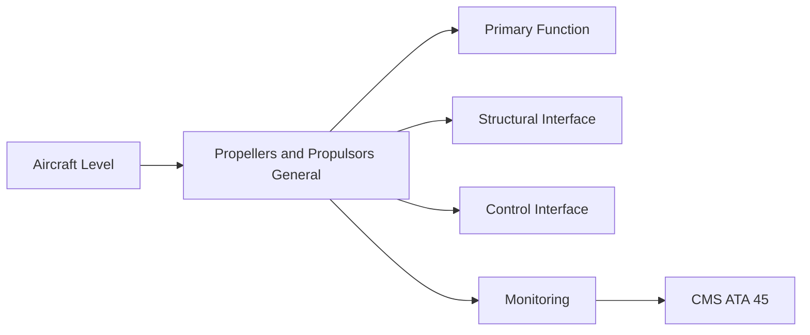
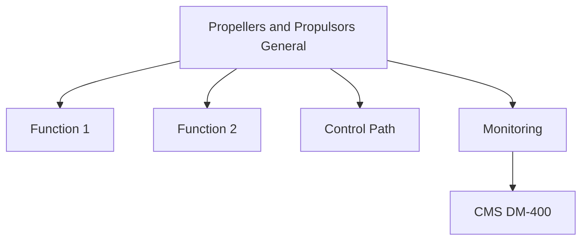

<!-- ──────────────────────────────────────────────────────────────────────────
     QATL-ATLAS-1000-ATLAS-060-069-061-000-PROPELLERS-AND-PROPULSORS-GENERAL
     ATA 61 · Propellers and Propulsors General
     programme-defined aircraft type — ATLAS Register 1000
────────────────────────────────────────────────────────────────────────────── -->

# Propellers and Propulsors General

---

## §0 Hyperlink Policy

> All hyperlinks in this document are **relative** (five directory levels: `../../../../../`).
> Absolute URLs are forbidden. Every linked document must exist in the Q+ATLANTIDE repository
> before the link is activated. Broken links are treated as open issues and must be resolved
> before the document is promoted from `DRAFT` to `APPROVED`.

---

## §1 Purpose

This document defines the agnostic ATLAS standard-level architecture context for `Propellers and Propulsors General`.

It describes the controlled scope, functions, interfaces, safety considerations, lifecycle traceability, and S1000D/CSDB mapping logic that programme implementations shall instantiate when this node is applicable.

This document is not a programme design baseline. Programme-specific capacities, locations, part numbers, effectivity, operating limits, maintenance references, and data module codes shall be defined only inside the applicable programme implementation branch.
## §2 Applicability

| Applicability Level | Rule |
|---|---|
| Standard taxonomy | Applies to the ATLAS node `061` |
| Programme implementation | Conditional; determined by programme architecture, trade studies, certification basis, and applicability model |
| Product configuration | Defined in the programme-specific configuration baseline |
| Effectivity | Defined in the programme CSDB / applicability layer |
| Non-applicability | Must be explicitly stated in the programme impact-study branch when excluded |
## §3 Functional Description ![DRAFT]

The ATA 61 architecture defines three propulsor configuration classes for the [PROGRAMME-AIRCRAFT]:
1. **Class A — Turbofan nacelle propulsor** (high-bypass, engine-driven, primary thrust).
2. **Class B — Supplementary electric ducted fan** (wing-integrated, HVDC-driven from ATA 24).
3. **Class C — Propeller/propulsor study variant** (turboprop or open rotor, not baselined for [PROGRAMME-VARIANT] but architecturally accommodated in ATA 61 SNS).
The General document establishes the common design intent, applicable standards, and interface constraints that apply equally to all three classes.

---

## §4 Functional Breakdown

| ID | Name | Description | Lead Division |
|---|---|---|---|

---

## §5 System Context — Mermaid Diagram

---

## §6 Internal Architecture — Mermaid Diagram

---

## §7 Components and LRUs

| Component | Part Number | Qty | Location | Maintenance Interval | Notes |
|---|---|---|---|---|---|
| Turbofan nacelle propulsor (Class A) | High-bypass turbofan — OEM TBD | 2 | Wing-mounted under-wing nacelles | On-condition / engine overhaul cycle | TBD |
| Supplementary electric ducted fan (Class B) | [PROGRAMME-AIRCRAFT]-EDF-001 — TBD | TBD | Wing trailing edge TE-2 stations | On-condition / EDF maintenance cycle | TBD |
| Propulsor nacelle structure | Programme drawing — nacelle OEM | 2 | Wing nacelle attachment | Periodic inspection per SRM | TBD |

---

## §8 Interfaces

| Interface Type | Connected System | Protocol / Medium | Data / Function |
|---|---|---|---|
| ATA 24 HVDC | Electrical Power | HVDC bus 270 V | Power supply to Class B EDF drives |
| ATA 67 Engine Controls | FADEC/ECU | AFDX digital command | Thrust command and propulsor feedback |
| ATA 62 Power Plant | Mounting and nacelle | Structural attachment flange | Engine-to-nacelle load path |
| ATA 45 CMS | Central Maintenance | AFDX | Health data and BITE fault codes |

---

## §9 Operating Modes

| Mode | Trigger | System State | Actions / Consequences |
|---|---|---|---|
| Take-off | Full thrust command | All propulsors operative | N1/N2 governed; vibration monitored |
| Cruise | Reduced thrust | EDF supplementary thrust optional | Efficiency optimisation mode |
| Engine-out | One engine failed | Remaining engine + EDF (if installed) | Asymmetric thrust management by FADEC |
| Ground | Aircraft on ground | Propulsors shutdown or idle | LOTO if maintenance required |

---

## §10 Performance and Budgets ![DRAFT]

| Parameter | Requirement | Target / Design Value | Status |
|---|---|---|---|
| Turbofan thrust (take-off, ISA SL) | TBD kN (OEM data pending) | Engine test-stand data | TBD |
| EDF supplementary thrust | TBD kN per unit | EDF design spec | TBD |
| Overall propulsive efficiency at cruise | > 65 % net | Cycle analysis | TBD |

---

## §11 Safety, Redundancy and Fault Tolerance

- All propulsor assemblies must meet fail-safe design requirements per CS-25 §25.901.
- EDF drives must be isolated via ATA 24 LOTO before any propulsor maintenance.
- Blade retention must satisfy CS-25 §25.905 (fan blade containment) for Class B EDF.

---

## §12 Maintenance and Diagnostics

| Task | Interval | Access | Special Tools |
|---|---|---|---|
| Visual propulsor survey | A-check | External access | Torch, VIS-001 checklist |
| Engine/propulsor BITE download | A-check | Maintenance terminal | CMS terminal |
| Nacelle structure inspection | C-check | Cowl access | Visual + NDT per SRM |

---

## §13 Footprint — Physical, Electrical, Maintenance, Data ![TBD]

| Footprint Type | Parameter | Value | Notes |
|---|---|---|---|
| Physical | Mass (system total) | ![TBD] | Pending OEM data |
| Physical | Envelope (max) | ![TBD] | Pending detailed design |
| Electrical | Peak power (W) | ![TBD] | To be defined |
| Maintenance | Access category | Standard line maintenance | Per AMM |
| Data | AFDX bandwidth | ![TBD] | Per AFDX bus load analysis |

---

## §14 Safety and Certification References ![DRAFT]

| Standard / Document | Title | Issuing Body | Applicability |
|---|---|---|---|
| EASA CS-25 §25.901 | Installation — Powerplants | EASA | General installation requirements |
| EASA CS-25 §25.905 | Fan blade containment | EASA | Blade containment for Class B EDF |
| SAE ARP5765 | Aeronautical Design Standard — Propeller Design | SAE International | Propeller design reference |
| ATA iSpec 2200 | Chapter 61 — Propellers and Propulsors | Air Transport Association | ATA chapter scope |
| ARINC 664 P7 | Aircraft Data Network — AFDX | ARINC | Data interface standard |

---

## §15 V&V Approach ![TBD]

| Phase | Method | Acceptance Criterion | Status |
|---|---|---|---|
| Design | Analysis and simulation | Meets all §10 performance requirements | ![TBD] |
| Integration | Ground functional test | All BITE tests pass; interfaces verified | ![TBD] |
| Qualification | DO-160G environmental test | All applicable tests pass | ![TBD] |
| Certification | EASA CS-25 / CS-E compliance demonstration | Type Certificate / STC approval | ![TBD] |

---

## §16 Glossary

| Term | Definition |
|---|---|
| **EDF** | Electric Ducted Fan — electrically driven fan in a structural duct casing providing supplementary thrust. |
| **TCDS** | Type Certificate Data Sheet — the official document issued by a regulatory authority summarising the type certificate conditions. |
| **High-bypass turbofan** | Turbofan engine with a bypass ratio > 5:1, providing high propulsive efficiency at subsonic cruise speeds. |
| **Propulsor** | Generic term for any device that produces thrust by accelerating a fluid; includes propellers, fans, and ducted fans. |
| **Class A propulsor** | Turbofan nacelle propulsor — the primary thrust-producing unit on the programme-defined aircraft type. |
| **Class B propulsor** | Supplementary electric ducted fan — wing-integrated, HVDC-powered fan for supplementary thrust. |
| **Bypass ratio** | Ratio of the mass flow through the fan bypass duct to the mass flow through the core of a turbofan engine. |
| **ATA 61** | Aircraft maintenance chapter covering propellers, propulsors, and associated systems. |
| **CS-25 §25.901** | EASA standard requiring powerplant installations to be safe under all likely operating conditions. |
| **CCB** | Configuration Control Board — the authority governing configuration changes to the [PROGRAMME-AIRCRAFT] baseline. |

---

## §17 Open Issues

| ID | Description | Owner | Target |
|---|---|---|---|
| OI-061-000-001 | Confirm Class B EDF adoption decision and CCB approval status | Q-GREENTECH / CCB | 2026-Q3 |
| OI-061-000-002 | Finalise turbofan engine OEM selection and TCDS reference | Q-AIR / procurement | 2026-Q4 |

---

## §18 Status Legend

| Badge | Meaning |
|---|---|
| `![DRAFT]` | Section is drafted but not yet reviewed |
| `![TBD]` | Content not yet started — to be defined |
| `![To Be Completed]` | Partially complete — needs additional content |
| `![APPROVED]` | Reviewed and formally approved |

---

## §19 Related Documents (Siblings in this Subsection)

- [061-010](./061-010.md)
- [061-020](./061-020.md)
- [061-030](./061-030.md)
- [061-040](./061-040.md)
- [061-050](./061-050.md)
- [061-060](./061-060.md)
- [061-070](./061-070.md)
- [061-080](./061-080.md)
- [061-090](./061-090.md)

---

## §20 Change Log

| Rev | Date | Author | Description |
|---|---|---|---|
| 0.1 | 2026-05-11 | @copilot | Initial DRAFT — contextualized content per programme-defined aircraft type architecture |
