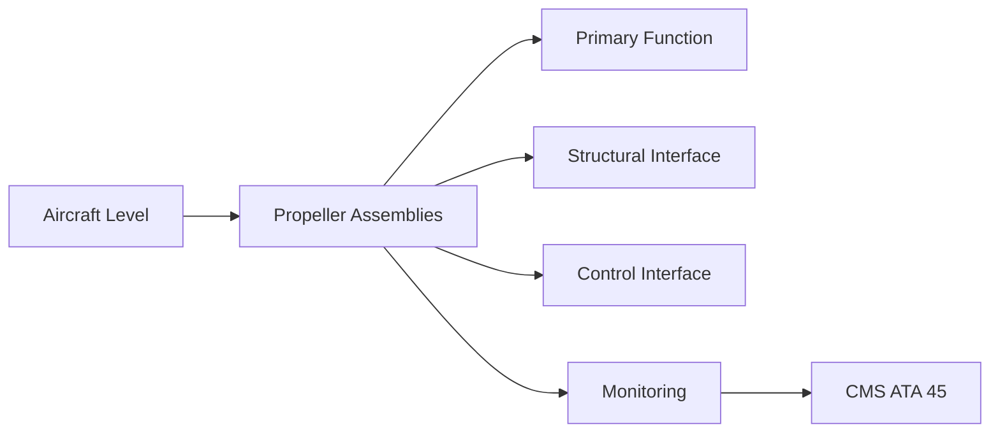
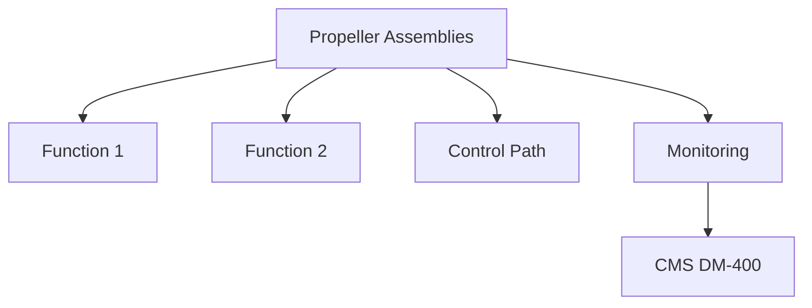

<!-- ──────────────────────────────────────────────────────────────────────────
     QATL-ATLAS-1000-ATLAS-060-069-061-010-PROPELLER-ASSEMBLIES
     ATA 61 · Propeller Assemblies
     AMPEL360E eWTW — ATLAS Register 1000
────────────────────────────────────────────────────────────────────────────── -->

# Propeller Assemblies

---

## §0 Hyperlink Policy

> All hyperlinks in this document are **relative** (five directory levels: `../../../../../`).
> Absolute URLs are forbidden. Every linked document must exist in the Q+ATLANTIDE repository
> before the link is activated. Broken links are treated as open issues and must be resolved
> before the document is promoted from `DRAFT` to `APPROVED`.

---

## §1 Purpose

This document defines the controlled architecture, configuration, and design definition for complete propeller assemblies when installed on the AMPEL360E eWTW programme. A propeller assembly comprises the hub, blades, pitch-change mechanism, spinner, and all associated retention hardware as a single airworthiness-certified unit.

The propeller assembly is the interface point between the engine shaft and the air mass; it must be designed for the specific shaft torque and overspeed limits of the installed engine, must pass FAR/CS-35 propeller certification, and must be documented in a Propeller Flight Manual Supplement (PFMS) appended to the AMPEL360E AFM.

---

## §2 Applicability

| Parameter | Value |
|---|---|
| Aircraft Program | AMPEL360E eWTW |
| ATA reference | ATA 61-010 — Propeller Assemblies |
| Certification basis | EASA CS-25 Amendment 27+ |
| S1000D SNS | 061-010-00 |

---

## §3 Functional Description ![DRAFT]

The propeller assembly architecture is described by:
- **Hub** — the structural centre body retaining all blades; designed in titanium or steel alloy; must resist blade centrifugal loads at overspeed condition.
- **Blades** — CFRP spar-cap / shell construction; variable pitch; N = TBD blades per configuration.
- **Pitch-change mechanism** — hydraulic or electro-mechanical (EMA) actuator; PECU-commanded.
- **Spinner and fairing** — aluminium or composite nose cone; reduces aerodynamic drag at hub station.
- **Retention hardware** — stud/nut or bolted flange retention; safety-wired per MS33540.

---

## §4 Functional Breakdown

| ID | Name | Description | Lead Division |
|---|---|---|---|
| F-001 | CFRP propeller blade | Blade PN TBD | N per assembly |
| F-001 | Titanium hub assembly | Hub PN TBD | 1 |
| F-001 | Pitch-change actuator (EMA or EHA) | Actuator PN TBD | 1 per hub |
| F-001 | Spinner/fairing (aluminium) | Spinner PN TBD | 1 |
| F-001 | Blade retention nuts (steel) | MS drawing PN TBD | N per blade |

---

## §5 System Context — Mermaid Diagram

---

## §6 Internal Architecture — Mermaid Diagram

---

## §7 Components and LRUs

| Component | Part Number | Qty | Location | Maintenance Interval | Notes |
|---|---|---|---|---|---|
| CFRP propeller blade | Blade PN TBD | N per assembly | Hub blade pocket | On condition / per SRM ADL check | TBD |
| Titanium hub assembly | Hub PN TBD | 1 | Engine output shaft flange | On condition / per overhaul cycle | TBD |
| Pitch-change actuator (EMA or EHA) | Actuator PN TBD | 1 per hub | Hub actuator cavity | On condition / seal change at C-check | TBD |
| Spinner/fairing (aluminium) | Spinner PN TBD | 1 | Forward hub station | Visual inspect A-check / replace on damage | TBD |
| Blade retention nuts (steel) | MS drawing PN TBD | N per blade | Hub blade retention flanges | Torque check at every C-check | TBD |

---

## §8 Interfaces

| Interface Type | Connected System | Protocol / Medium | Data / Function |
|---|---|---|---|
| Engine shaft | ATA 72 Engine mounting | Splined or bolted flange | Torque, thrust, and overspeed load path |
| PECU | ATA 67 Engine Controls | Electrical command | Pitch angle command signal |
| Oil system (if hydraulic actuator) | ATA 69 Oil System | Oil line connections | Pitch-change hydraulic supply/return |
| De-ice system | ATA 61-060 | Electrical heater mat connection | Blade leading-edge deicing power |

---

## §9 Operating Modes

| Mode | Trigger | System State | Actions / Consequences |
|---|---|---|---|
| Normal pitch control | PECU commanded | Full pitch range available | FADEC schedules pitch for all flight conditions |
| Feather | Engine shutdown | FADEC feather command | Blades rotate to ~90° to minimise drag |
| Reverse pitch | Ground reverse thrust | Ground weight-on-wheels signal | Blades to negative pitch; braking |
| Fixed pitch (fail-safe) | PECU power loss | Mechanical fail-safe latch | Blades locked at last commanded pitch |

---

## §10 Performance and Budgets ![DRAFT]

| Parameter | Requirement | Target / Design Value | Status |
|---|---|---|---|
| Maximum centrifugal load (blade tip) | Per CS-35 design load case | Stress analysis + test | TBD |
| Pitch actuator travel range | 0° to 95° (fine to feather) | Rigging measurement | TBD |
| Propeller diameter | TBD m (OEM data pending) | Propeller design spec | TBD |
| Overspeed trip speed | N > 105 % rated | Overspeed governor setting | TBD |

---

## §11 Safety, Redundancy and Fault Tolerance

- Blade retention nuts must be safety-wired per MS33540; any wire failure requires immediate torque recheck.
- Feathering system must be demonstrably fail-safe per CS-25 §25.1155 (engine shut-down control).
- Propeller overspeed condition > 110 % requires mandatory engineering inspection before return to service.

---

## §12 Maintenance and Diagnostics

| Task | Interval | Access | Special Tools |
|---|---|---|---|
| Blade torque check | C-check | Hub access, spinner removed | Calibrated torque wrench |
| Pitch actuator seal inspection | C-check | Hub access | Seal inspection kit, actuator GSE |
| Spinner/fairing inspection | A-check | External access | Torch, VIS-001 |
| Full pitch sweep functional test | After any pitch system maintenance | Ground run mode | PECU GSE command set |
| Hub bore NDT (ET) | Overhaul / at blade removal | Hub in shop | Eddy-current unit, bore probe |

---

## §13 Footprint — Physical, Electrical, Maintenance, Data ![TBD]

| Footprint Type | Parameter | Value | Notes |
|---|---|---|---|
| Physical | Mass (system total) | ![TBD] | Pending OEM data |
| Physical | Envelope (max) | ![TBD] | Pending detailed design |
| Electrical | Peak power (W) | ![TBD] | To be defined |
| Maintenance | Access category | Standard line maintenance | Per AMM |
| Data | AFDX bandwidth | ![TBD] | Per AFDX bus load analysis |

---

## §14 Safety and Certification References ![DRAFT]

| Standard / Document | Title | Issuing Body | Applicability |
|---|---|---|---|
| EASA CS-35 | Airworthiness Standards: Propellers | EASA | Propeller assembly certification standard |
| SAE ARP5765 | Aeronautical Design Standard — Propeller Design | SAE International | Propeller design guidelines |
| MS33540 | Safety Wiring — Aircraft Fasteners | US DoD | Safety wire standard for retention nuts |
| ATA iSpec 2200 | Chapter 61 — Propellers and Propulsors | Air Transport Association | ATA chapter scope |
| EASA CS-25 §25.1155 | Engine Shutdown Controls | EASA | Feathering system fail-safe requirement |

---

## §15 V&V Approach ![TBD]

| Phase | Method | Acceptance Criterion | Status |
|---|---|---|---|
| Design | Analysis and simulation | Meets all §10 performance requirements | ![TBD] |
| Integration | Ground functional test | All BITE tests pass; interfaces verified | ![TBD] |
| Qualification | DO-160G environmental test | All applicable tests pass | ![TBD] |
| Certification | EASA CS-25 / CS-E compliance demonstration | Type Certificate / STC approval | ![TBD] |

---

## §16 Glossary

| Term | Definition |
|---|---|
| **CS-35** | EASA Airworthiness Standards for Propellers — the dedicated propeller type certification standard. |
| **PFMS** | Propeller Flight Manual Supplement — document appended to the AFM defining propeller-specific operating limits. |
| **PECU** | Propeller Electronic Control Unit — ECU commanding pitch actuator from FADEC signals. |
| **Feathering** | Rotating blades to ~90° pitch to minimise drag after engine shutdown. |
| **Reverse pitch** | Negative pitch angle enabling propeller to generate reverse thrust for ground deceleration. |
| **EMA** | Electro-Mechanical Actuator — linear or rotary actuator driven directly by an electric motor; no internal hydraulics. |
| **Fail-safe latch** | Mechanical device holding blades at last commanded pitch if actuator power is lost. |
| **Hub** | Central structural body of the propeller assembly; retains blades and transmits torque and thrust to/from engine shaft. |
| **Spinner** | Aerodynamic nosecone fitted to the propeller hub to reduce drag at the hub station. |
| **Centrifugal load** | Outward radial force acting on each propeller blade due to rotation; the dominant structural load on the hub. |

---

## §17 Open Issues

| ID | Description | Owner | Target |
|---|---|---|---|
| OI-061-010-001 | Confirm blade count (N) and diameter for AMPEL360E propulsor configuration — pending propulsion sizing study | Q-AIR / Q-GREENTECH | 2026-Q3 |
| OI-061-010-002 | Select EMA vs EHA pitch-change actuator based on power and thermal comparison | Q-MECHANICS / Q-GREENTECH | 2026-Q4 |

---

## §18 Status Legend

| Badge | Meaning |
|---|---|
| `![DRAFT]` | Section is drafted but not yet reviewed |
| `![TBD]` | Content not yet started — to be defined |
| `![To Be Completed]` | Partially complete — needs additional content |
| `![APPROVED]` | Reviewed and formally approved |

---

## §19 Related Documents (Siblings in this Subsection)

- [061-000](./061-000.md)
- [061-020](./061-020.md)
- [061-030](./061-030.md)
- [061-040](./061-040.md)
- [061-050](./061-050.md)
- [061-060](./061-060.md)
- [061-070](./061-070.md)
- [061-080](./061-080.md)
- [061-090](./061-090.md)

---

## §20 Change Log

| Rev | Date | Author | Description |
|---|---|---|---|
| 0.1 | 2026-05-11 | @copilot | Initial DRAFT — contextualized content per AMPEL360E eWTW architecture |
