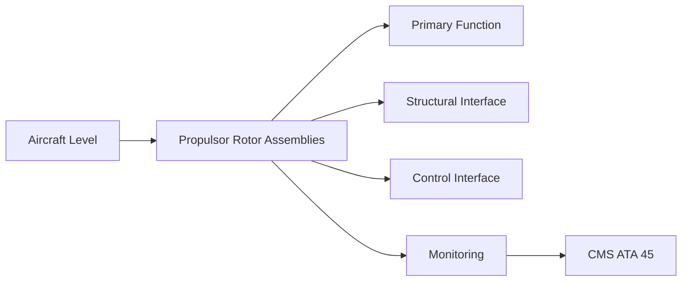
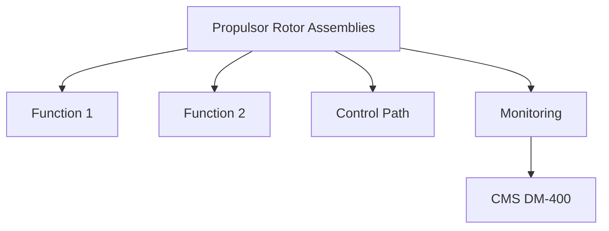

<!-- ──────────────────────────────────────────────────────────────────────────
     QATL-ATLAS-1000-ATLAS-060-069-061-020-PROPULSOR-ROTOR-ASSEMBLIES
     ATA 61 · Propulsor Rotor Assemblies
     programme-defined aircraft type — ATLAS Register 1000
────────────────────────────────────────────────────────────────────────────── -->

# Propulsor Rotor Assemblies

---

## §0 Hyperlink Policy

> All hyperlinks in this document are **relative** (five directory levels: `../../../../../`).
> Absolute URLs are forbidden. Every linked document must exist in the Q+ATLANTIDE repository
> before the link is activated. Broken links are treated as open issues and must be resolved
> before the document is promoted from `DRAFT` to `APPROVED`.

---

## §1 Purpose

This document defines the agnostic ATLAS standard-level architecture context for `Propulsor Rotor Assemblies`.

It describes the controlled scope, functions, interfaces, safety considerations, lifecycle traceability, and S1000D/CSDB mapping logic that programme implementations shall instantiate when this node is applicable.

This document is not a programme design baseline. Programme-specific capacities, locations, part numbers, effectivity, operating limits, maintenance references, and data module codes shall be defined only inside the applicable programme implementation branch.
## §2 Applicability

| Applicability Level | Rule |
|---|---|
| Standard taxonomy | Applies to the ATLAS node `061` |
| Programme implementation | Conditional; determined by programme architecture, trade studies, certification basis, and applicability model |
| Product configuration | Defined in the programme-specific configuration baseline |
| Effectivity | Defined in the programme CSDB / applicability layer |
| Non-applicability | Must be explicitly stated in the programme impact-study branch when excluded |
## §3 Functional Description ![DRAFT]

The EDF rotor assembly comprises:
- **Rotor** — multi-blade CFRP fan rotor; driven by axial flux HVDC motor integral in hub.
- **Stator vane set** — stationary exit guide vanes (EGVs) to recover swirl energy.
- **Duct casing** — composite or aluminium structural duct; must contain a released blade.
- **Containment ring** — aramid-fibre wound ring at rotor plane to contain blade-out event.
- **EPCU** — electronic controller receiving FADEC thrust demand and commanding motor current.

---

## §4 Functional Breakdown

| ID | Name | Description | Lead Division |
|---|---|---|---|
| F-001 | CFRP EDF rotor (fan blades) | EDF-Rotor-PN-TBD | 1 set |
| F-001 | Axial-flux HVDC motor (integral) | Motor-PN-TBD | 1 per EDF |
| F-001 | Composite EGV stator set | EGV-PN-TBD | 1 set |
| F-001 | Aramid containment ring | Containment-PN-TBD | 1 per EDF |
| F-001 | EPCU | EPCU-PN-TBD | 1 per EDF |

---

## §5 System Context — Mermaid Diagram

---

## §6 Internal Architecture — Mermaid Diagram

---

## §7 Components and LRUs

| Component | Part Number | Qty | Location | Maintenance Interval | Notes |
|---|---|---|---|---|---|
| CFRP EDF rotor (fan blades) | EDF-Rotor-PN-TBD | 1 set | EDF duct inner ring | On condition / per SRM ADL | TBD |
| Axial-flux HVDC motor (integral) | Motor-PN-TBD | 1 per EDF | EDF hub cavity | On condition | TBD |
| Composite EGV stator set | EGV-PN-TBD | 1 set | Aft duct station | C-check visual + NDT | TBD |
| Aramid containment ring | Containment-PN-TBD | 1 per EDF | Duct inner wall at rotor plane | Replace after any blade release event | TBD |
| EPCU | EPCU-PN-TBD | 1 per EDF | Duct avionics bay | On condition / PBIT | TBD |

---

## §8 Interfaces

| Interface Type | Connected System | Protocol / Medium | Data / Function |
|---|---|---|---|
| ATA 24 HVDC bus | Electrical Power | HVDC 270 V supply cable | Motor power supply |
| ATA 67 FADEC | Engine Controls | AFDX | Thrust demand and EDF status |
| ATA 26 Fire Protection | Fire detection | Dedicated fire loop | Motor compartment fire detection |
| Structural (wing TE) | ATA 57 Wing | Mounting brackets / attach fittings | EDF structural attachment |

---

## §9 Operating Modes

| Mode | Trigger | System State | Actions / Consequences |
|---|---|---|---|
| Normal operation | EPCU powered, PBIT passed | Full motor authority | FADEC schedules thrust; vibration monitored |
| Motor overload protection | Current exceeds limit | EPCU protection active | Derate or trip motor; alert to CMS |
| Blade-out | Uncontained blade release | Containment ring activated | Drive shutdown; CMS alert; no restart |
| Maintenance isolation | Before any EDF maintenance | HVDC isolation per ATA 24 LOTO | HVDC bus isolated; EDF static |

---

## §10 Performance and Budgets ![DRAFT]

| Parameter | Requirement | Target / Design Value | Status |
|---|---|---|---|
| EDF thrust at full power | TBD kN per EDF | EPCU + motor spec | TBD |
| Motor efficiency at cruise power | ≥ 96 % | Motor qualification test | TBD |
| Blade-tip to duct clearance | < 0.5 mm nominal | Drawing controlled | TBD |
| Containment ring blade-out energy absorption | ≥ 1.5× design blade kinetic energy | Containment qualification test | TBD |

---

## §11 Safety, Redundancy and Fault Tolerance

- EDF HVDC isolation (ATA 24 LOTO) is mandatory before any work on the EDF rotor or duct; arc-flash risk is Category 2.
- Containment ring must be replaced after any blade release event; reinstallation without replacement is prohibited.
- EPCU must pass PBIT before first flight of the day; failed PBIT requires engineering action before dispatch.

---

## §12 Maintenance and Diagnostics

| Task | Interval | Access | Special Tools |
|---|---|---|---|
| EPCU PBIT execution | Pre-flight / A-check | Maintenance terminal | CMS terminal |
| EDF rotor visual inspection | A-check | External duct access | Torch, VIS-001 |
| Containment ring NDT check | C-check or after FOD event | Duct removal or in-situ probe | UT or ET per NDT procedure |
| Motor insulation resistance test | C-check | HVDC isolated | Megger insulation tester |
| EGV stator condition check | C-check | Duct internal access | Borescope camera |

---

## §13 Footprint — Physical, Electrical, Maintenance, Data ![TBD]

| Footprint Type | Parameter | Value | Notes |
|---|---|---|---|
| Physical | Mass (system total) | ![TBD] | Pending OEM data |
| Physical | Envelope (max) | ![TBD] | Pending detailed design |
| Electrical | Peak power (W) | ![TBD] | To be defined |
| Maintenance | Access category | Standard line maintenance | Per AMM |
| Data | AFDX bandwidth | ![TBD] | Per AFDX bus load analysis |

---

## §14 Safety and Certification References ![DRAFT]

| Standard / Document | Title | Issuing Body | Applicability |
|---|---|---|---|
| EASA CS-25 §25.905 | Fan blade containment | EASA | Containment ring certification requirement |
| SAE AS6858 | Electric/Hybrid Electric Propulsion Control System Architecture | SAE International | EPCU architecture reference |
| IEC 60664-1 | Insulation coordination for equipment in low-voltage systems | IEC | Motor insulation design standard |
| ATA iSpec 2200 | Chapter 61 — Propellers and Propulsors | Air Transport Association | ATA chapter scope |
| DO-160G | Environmental Conditions and Test Procedures for Airborne Equipment | RTCA | EPCU environmental qualification |

---

## §15 V&V Approach ![TBD]

| Phase | Method | Acceptance Criterion | Status |
|---|---|---|---|
| Design | Analysis and simulation | Meets all §10 performance requirements | ![TBD] |
| Integration | Ground functional test | All BITE tests pass; interfaces verified | ![TBD] |
| Qualification | DO-160G environmental test | All applicable tests pass | ![TBD] |
| Certification | EASA CS-25 / CS-E compliance demonstration | Type Certificate / STC approval | ![TBD] |

---

## §16 Glossary

| Term | Definition |
|---|---|
| **EDF** | Electric Ducted Fan — electrically powered fan enclosed in a structural duct. |
| **EPCU** | Electric Propulsion Control Unit — digital controller for EDF motor, integrated with FADEC. |
| **Axial-flux motor** | Electric motor topology where magnetic flux runs axially; high power density; used in EDF hub integration. |
| **EGV** | Exit Guide Vane — fixed stator vane downstream of rotor that straightens the swirling flow and recovers swirl energy. |
| **Containment ring** | Aramid-fibre wound structure around the fan rotor plane designed to contain and arrest a released blade. |
| **HVDC** | High Voltage Direct Current — 270 V DC electrical bus used on programme-defined aircraft type. |
| **Blade-out event** | Release of a rotor blade during operation; the containment ring must prevent debris from exiting the duct. |
| **Derate** | Reduction of commanded power to protect a component from overload; commanded by EPCU protection logic. |
| **Tip clearance** | Radial gap between rotor blade tip and duct inner wall; affects aerodynamic efficiency and containment design. |
| **PBIT** | Power-On Built-In Test — EPCU self-test at power-up verifying all control, power, and sensor channels. |

---

## §17 Open Issues

| ID | Description | Owner | Target |
|---|---|---|---|
| OI-061-020-001 | Confirm Class B EDF adoption decision and programme phase gate | Q-GREENTECH / CCB | 2026-Q3 |
| OI-061-020-002 | Select axial-flux vs. radial-flux HVDC motor technology based on power density study | Q-GREENTECH / Q-MECHANICS | 2026-Q4 |

---

## §18 Status Legend

| Badge | Meaning |
|---|---|
| `![DRAFT]` | Section is drafted but not yet reviewed |
| `![TBD]` | Content not yet started — to be defined |
| `![To Be Completed]` | Partially complete — needs additional content |
| `![APPROVED]` | Reviewed and formally approved |

---

## §19 Related Documents (Siblings in this Subsection)

- [061-000](./061-000.md)
- [061-010](./061-010.md)
- [061-030](./061-030.md)
- [061-040](./061-040.md)
- [061-050](./061-050.md)
- [061-060](./061-060.md)
- [061-070](./061-070.md)
- [061-080](./061-080.md)
- [061-090](./061-090.md)

---

## §20 Change Log

| Rev | Date | Author | Description |
|---|---|---|---|
| 0.1 | 2026-05-11 | @copilot | Initial DRAFT — contextualized content per programme-defined aircraft type architecture |
