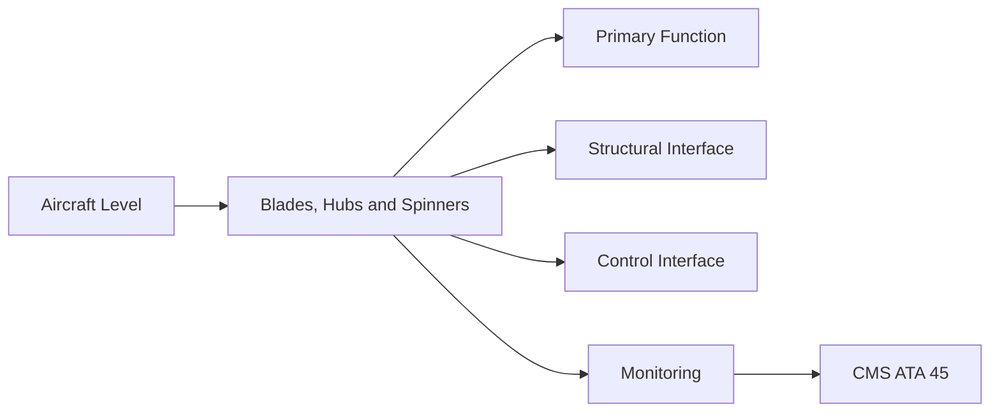
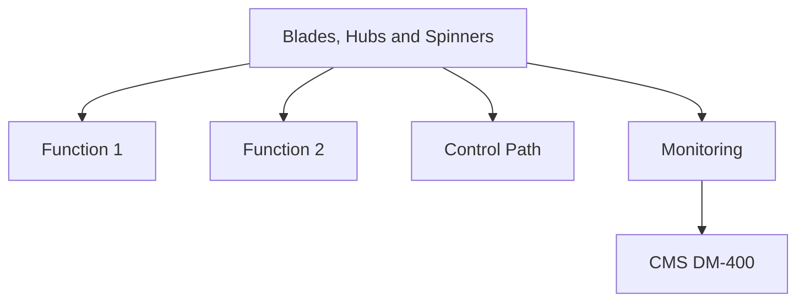

<!-- ──────────────────────────────────────────────────────────────────────────
     QATL-ATLAS-1000-ATLAS-060-069-061-030-BLADES-HUBS-AND-SPINNERS
     ATA 61 · Blades, Hubs and Spinners
     programme-defined aircraft type — ATLAS Register 1000
────────────────────────────────────────────────────────────────────────────── -->

# Blades, Hubs and Spinners

---

## §0 Hyperlink Policy

> All hyperlinks in this document are **relative** (five directory levels: `../../../../../`).
> Absolute URLs are forbidden. Every linked document must exist in the Q+ATLANTIDE repository
> before the link is activated. Broken links are treated as open issues and must be resolved
> before the document is promoted from `DRAFT` to `APPROVED`.

---

## §1 Purpose

This document defines the agnostic ATLAS standard-level architecture context for `Blades, Hubs and Spinners`.

It describes the controlled scope, functions, interfaces, safety considerations, lifecycle traceability, and S1000D/CSDB mapping logic that programme implementations shall instantiate when this node is applicable.

This document is not a programme design baseline. Programme-specific capacities, locations, part numbers, effectivity, operating limits, maintenance references, and data module codes shall be defined only inside the applicable programme implementation branch.
## §2 Applicability

| Applicability Level | Rule |
|---|---|
| Standard taxonomy | Applies to the ATLAS node `061` |
| Programme implementation | Conditional; determined by programme architecture, trade studies, certification basis, and applicability model |
| Product configuration | Defined in the programme-specific configuration baseline |
| Effectivity | Defined in the programme CSDB / applicability layer |
| Non-applicability | Must be explicitly stated in the programme impact-study branch when excluded |
## §3 Functional Description ![DRAFT]

**Blade design**: Aerofoil profile optimised for the [PROGRAMME-AIRCRAFT] cruise Mach number; CFRP spar-cap and shell construction; leading-edge erosion shield (titanium or nickel alloy electroform); variable-pitch root fitting with precision spar bearing.

**Hub design**: Titanium alloy forging; blade retention pockets with matched-pair pitch bearings; central shaft bore to engine spline; internal channel for pitch actuator oil (if hydraulic type) or signal routing (if EMA type).

**Spinner design**: CFRP or aluminium dome; attaches at spinner support frame on hub forward face; provides FOD and rain erosion protection to hub station; quick-release fasteners for maintenance access.

---

## §4 Functional Breakdown

| ID | Name | Description | Lead Division |
|---|---|---|---|
| F-001 | CFRP propeller blade with LE erosion cap | Blade-PN-TBD | N per propulsor |
| F-001 | Titanium hub forging | Hub-PN-TBD | 1 per propulsor |
| F-001 | Composite spinner dome | Spinner-PN-TBD | 1 per propulsor |
| F-001 | Precision spar bearing (blade root) | Bearing-PN-TBD | N per propulsor |
| F-001 | Titanium LE erosion shield (blade) | LE-Shield-PN-TBD | N per propulsor |

---

## §5 System Context — Mermaid Diagram

---

## §6 Internal Architecture — Mermaid Diagram

---

## §7 Components and LRUs

| Component | Part Number | Qty | Location | Maintenance Interval | Notes |
|---|---|---|---|---|---|
| CFRP propeller blade with LE erosion cap | Blade-PN-TBD | N per propulsor | Hub pitch pockets | On condition / SRM ADL check | TBD |
| Titanium hub forging | Hub-PN-TBD | 1 per propulsor | Engine shaft output flange | Overhaul cycle (TBD cycles) | TBD |
| Composite spinner dome | Spinner-PN-TBD | 1 per propulsor | Hub forward face, spinner frame | Replace on damage; inspect at A-check | TBD |
| Precision spar bearing (blade root) | Bearing-PN-TBD | N per propulsor | Blade root in hub pocket | Replace at overhaul or on condition | TBD |
| Titanium LE erosion shield (blade) | LE-Shield-PN-TBD | N per propulsor | Blade leading edge | On condition — replace per erosion ADL | TBD |

---

## §8 Interfaces

| Interface Type | Connected System | Protocol / Medium | Data / Function |
|---|---|---|---|
| Pitch actuator | ATA 61-040 | Mechanical pin/spline at blade root | Pitch change mechanism engagement |
| Engine shaft | ATA 62 Power Plant | Hub central spline bore | Torque and thrust transmission |
| Deicing system | ATA 61-060 | Electrical slip ring at hub | Power distribution to blade heater mats |
| NDT programme | ATA 60-030 | Inspection access | Hub bore ET / blade TT inspection |

---

## §9 Operating Modes

| Mode | Trigger | System State | Actions / Consequences |
|---|---|---|---|
| Operational | Blades rotating, pitch varied | All retention hardware at torque | Vibration monitored continuously |
| Maintenance access | Spinner removed | Drive isolated | Hub and blade root accessible |
| Blade replacement | Individual blade removed | Hub in maintenance bay | NDT of hub pocket; new blade torqued |
| Overhaul | Hub removed to shop | Full disassembly | Life tracking reset; bearing replacement |

---

## §10 Performance and Budgets ![DRAFT]

| Parameter | Requirement | Target / Design Value | Status |
|---|---|---|---|
| Hub design life (cycles) | TBD cycles (LLP per CS-35) | Fatigue analysis + test | TBD |
| Blade root spar bearing clearance | < 0.05 mm diametral | Dimensional inspection at overhaul | TBD |
| LE erosion shield adhesion (shear) | ≥ 25 MPa (APS-060 qualification) | Coupon test | TBD |
| Spinner dome stiffness (bird strike) | Withstand 4 lb bird at Vmo | Bird strike analysis / test | TBD |

---

## §11 Safety, Redundancy and Fault Tolerance

- Hub is a life-limited part (LLP); its cycle count must be tracked and it must be retired at the published limit regardless of condition.
- Matched-pair spar bearings must not be separated; each bearing must be installed in the same blade/hub pocket it was removed from.
- Any spinner dome damage exposing the hub to rain or bird ingestion requires immediate replacement; operating with a damaged spinner is prohibited.

---

## §12 Maintenance and Diagnostics

| Task | Interval | Access | Special Tools |
|---|---|---|---|
| Blade root torque check | C-check | Spinner removed, hub accessible | Calibrated torque wrench |
| Spar bearing condition check | Overhaul (shop) | Full hub disassembly | Dimensional gauge, clearance measurement |
| LE erosion shield disbond inspection | A-check (visual) | External blade access | Torch, tap test kit |
| Hub bore ET inspection | At blade removal / overhaul | Hub in shop | Eddy-current unit, bore probe |
| Spinner FOD inspection | A-check (visual) | External access | Torch, VIS-001 |

---

## §13 Footprint — Physical, Electrical, Maintenance, Data ![TBD]

| Footprint Type | Parameter | Value | Notes |
|---|---|---|---|
| Physical | Mass (system total) | ![TBD] | Pending OEM data |
| Physical | Envelope (max) | ![TBD] | Pending detailed design |
| Electrical | Peak power (W) | ![TBD] | To be defined |
| Maintenance | Access category | Standard line maintenance | Per AMM |
| Data | AFDX bandwidth | ![TBD] | Per AFDX bus load analysis |

---

## §14 Safety and Certification References ![DRAFT]

| Standard / Document | Title | Issuing Body | Applicability |
|---|---|---|---|
| EASA CS-35 | Airworthiness Standards: Propellers | EASA | Hub LLP life limit and certification |
| SAE ARP5765 | Aeronautical Design Standard — Propeller Design | SAE International | Blade and hub design guideline |
| AMS 4928 | Titanium Alloy — Ti-6Al-4V | SAE International | Hub forging material |
| ATA iSpec 2200 | Chapter 61 — Propellers and Propulsors | Air Transport Association | ATA chapter scope |
| [PROGRAMME-AIRCRAFT] APS-060 | Adhesive Process Specification — Propeller LE Cap Bonding | [PROGRAMME-AIRCRAFT] programme | LE cap bonding process |

---

## §15 V&V Approach ![TBD]

| Phase | Method | Acceptance Criterion | Status |
|---|---|---|---|
| Design | Analysis and simulation | Meets all §10 performance requirements | ![TBD] |
| Integration | Ground functional test | All BITE tests pass; interfaces verified | ![TBD] |
| Qualification | DO-160G environmental test | All applicable tests pass | ![TBD] |
| Certification | EASA CS-25 / CS-E compliance demonstration | Type Certificate / STC approval | ![TBD] |

---

## §16 Glossary

| Term | Definition |
|---|---|
| **Spar bearing** | Precision bearing at the blade root that allows blade pitch rotation within the hub pocket. |
| **Matched-pair bearings** | Bearing sets that must be installed together in the same hub pocket; separation invalidates clearance characteristics. |
| **LE erosion cap** | Metallic (Ti or Ni alloy) protective cap bonded to the blade leading edge to resist rain and particle erosion. |
| **LLP** | Life-Limited Part — the hub is an LLP with a mandatory cycle retirement limit defined in the propeller Type Certificate. |
| **Spinner frame** | Structural ring on the hub forward face to which the spinner dome attaches. |
| **CFRP shell** | Outer structural skin of the blade; CFRP woven or UD material providing torsional and flexural stiffness. |
| **Spar cap** | Unidirectional CFRP reinforcement running blade span-wise; carries primary bending load. |
| **Quick-release fastener** | Quarter-turn or similar fastener enabling rapid spinner removal for maintenance access. |
| **CS-35** | EASA Airworthiness Standards for Propellers; defines blade, hub, and spinner certification requirements. |
| **Pitch pocket** | Precision-machined recess in the hub into which each blade root is inserted and retained. |

---

## §17 Open Issues

| ID | Description | Owner | Target |
|---|---|---|---|
| OI-061-030-001 | Confirm hub design life (cycles) from propeller OEM fatigue analysis — pending OEM data | Q-MECHANICS / propeller OEM | 2026-Q4 |
| OI-061-030-002 | Qualify titanium vs. nickel-alloy LE erosion cap bonding system for SAF fuel environment | Q-GREENTECH / Q-MECHANICS | 2026-Q4 |

---

## §18 Status Legend

| Badge | Meaning |
|---|---|
| `![DRAFT]` | Section is drafted but not yet reviewed |
| `![TBD]` | Content not yet started — to be defined |
| `![To Be Completed]` | Partially complete — needs additional content |
| `![APPROVED]` | Reviewed and formally approved |

---

## §19 Related Documents (Siblings in this Subsection)

- [061-000](./061-000.md)
- [061-010](./061-010.md)
- [061-020](./061-020.md)
- [061-040](./061-040.md)
- [061-050](./061-050.md)
- [061-060](./061-060.md)
- [061-070](./061-070.md)
- [061-080](./061-080.md)
- [061-090](./061-090.md)

---

## §20 Change Log

| Rev | Date | Author | Description |
|---|---|---|---|
| 0.1 | 2026-05-11 | @copilot | Initial DRAFT — contextualized content per programme-defined aircraft type architecture |
