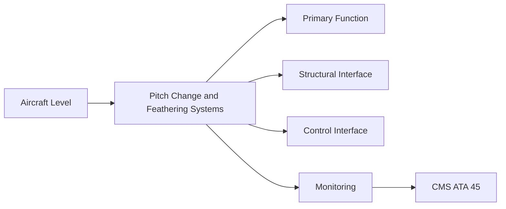
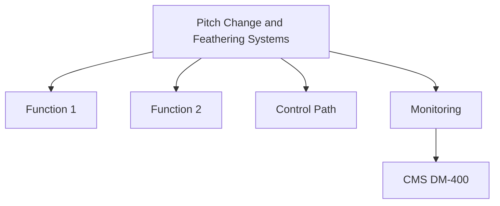

<!-- ──────────────────────────────────────────────────────────────────────────
     QATL-ATLAS-1000-ATLAS-060-069-061-040-PITCH-CHANGE-AND-FEATHERING-SYSTEMS
     ATA 61 · Pitch Change and Feathering Systems
     AMPEL360E eWTW — ATLAS Register 1000
────────────────────────────────────────────────────────────────────────────── -->

# Pitch Change and Feathering Systems

---

## §0 Hyperlink Policy

> All hyperlinks in this document are **relative** (five directory levels: `../../../../../`).
> Absolute URLs are forbidden. Every linked document must exist in the Q+ATLANTIDE repository
> before the link is activated. Broken links are treated as open issues and must be resolved
> before the document is promoted from `DRAFT` to `APPROVED`.

---

## §1 Purpose

This document defines the pitch-change mechanism (PCM) architecture, feathering logic, unfeathering provisions, and fail-safe pitch lock design for variable-pitch propeller systems on the AMPEL360E eWTW programme. Pitch control is a primary flight control function when turboprop or open-rotor propulsors are installed; loss of controlled feathering is a safety-critical failure mode.

The AMPEL360E pitch-change mechanism uses a PECU-commanded Electro-Mechanical Actuator (EMA) or Electro-Hydraulic Actuator (EHA) — selection pending detailed design trade. Regardless of actuator type, a fail-safe pitch lock must engage at a defined coarse-pitch position if actuator power is lost, preventing the propeller from going to flat pitch (which would cause excessive drag and uncontrolled asymmetric yaw on an engine-out event).

---

## §2 Applicability

| Parameter | Value |
|---|---|
| Aircraft Program | AMPEL360E eWTW |
| ATA reference | ATA 61-040 — Pitch Change and Feathering Systems |
| Certification basis | EASA CS-25 Amendment 27+ |
| S1000D SNS | 061-040-00 |

---

## §3 Functional Description ![DRAFT]

The pitch-change system architecture provides:
1. **Normal pitch control** — FADEC commands pitch angle via PECU → PCM actuator; blade angle sensor (LVDT) provides closed-loop feedback.
2. **Auto-feather** — on engine failure (torque below threshold), FADEC commands feather automatically; must operate within 5 s of engine torque loss.
3. **Manual feather** — crew can command feather via engine fire handle or dedicated feather pb.
4. **Fail-safe pitch lock** — mechanical spring-loaded coarse-pitch lock engages if actuator power is lost; prevents uncontrolled migration to flat pitch.
5. **Unfeathering accumulator** — pressurised oil (or electric alternative) allows the propeller to be unfeathered for an in-flight engine restart.

---

## §4 Functional Breakdown

| ID | Name | Description | Lead Division |
|---|---|---|---|
| F-001 | EMA pitch-change actuator (preferred) | EMA-PCM-PN-TBD | 1 per hub |
| F-001 | Fail-safe coarse-pitch spring lock | PCM-Lock-PN-TBD | 1 per hub |
| F-001 | LVDT blade angle sensor | LVDT-PN-TBD | N per blade |
| F-001 | Unfeathering accumulator (if hydraulic type) | Accum-PN-TBD | 1 per propulsor |
| F-001 | PECU (pitch command and monitoring) | PECU-PN-TBD | 1 per propulsor |

---

## §5 System Context — Mermaid Diagram

---

## §6 Internal Architecture — Mermaid Diagram

---

## §7 Components and LRUs

| Component | Part Number | Qty | Location | Maintenance Interval | Notes |
|---|---|---|---|---|---|
| EMA pitch-change actuator (preferred) | EMA-PCM-PN-TBD | 1 per hub | Hub actuation cylinder | On condition / seal check C-check | TBD |
| Fail-safe coarse-pitch spring lock | PCM-Lock-PN-TBD | 1 per hub | Actuator fail-safe detent | Replace at overhaul | TBD |
| LVDT blade angle sensor | LVDT-PN-TBD | N per blade | Pitch mechanism link | Annual calibration / on condition | TBD |
| Unfeathering accumulator (if hydraulic type) | Accum-PN-TBD | 1 per propulsor | Propulsor nacelle | Pressure check C-check | TBD |
| PECU (pitch command and monitoring) | PECU-PN-TBD | 1 per propulsor | Nacelle avionics bay | On condition / PBIT | TBD |

---

## §8 Interfaces

| Interface Type | Connected System | Protocol / Medium | Data / Function |
|---|---|---|---|
| FADEC | ATA 67 Engine Controls | ARINC 429 / AFDX pitch command | Thrust lever angle to pitch schedule |
| Auto-feather system | ATA 67 FADEC | Discrete / AFDX feather command | Engine torque-loss-triggered feather |
| ATA 24 Electrical Power | Power distribution | 28 V DC / HVDC EMA supply | Actuator power |
| ATA 69 Oil (if hydraulic) | Oil system | HP oil supply line | Hydraulic actuator supply/return |

---

## §9 Operating Modes

| Mode | Trigger | System State | Actions / Consequences |
|---|---|---|---|
| Normal pitch control | PECU commanded | FADEC-scheduled pitch | Blade angle closed-loop; LVDT feedback |
| Auto-feather | Engine torque loss | FADEC triggers auto-feather | Pitch to ~90° within 5 s |
| Manual feather | Crew feather command | FADEC passes command | Pitch to ~90°; engine shutdown confirmed |
| Fail-safe pitch lock | Actuator power loss | Spring-lock engages | Pitch held at coarse-pitch detent |
| Unfeather | Crew restart command | Accumulator charges actuator | Pitch moved from feather toward fine for engine restart |

---

## §10 Performance and Budgets ![DRAFT]

| Parameter | Requirement | Target / Design Value | Status |
|---|---|---|---|
| Auto-feather time (torque loss to full feather) | < 5 s | Flight test / analysis | TBD |
| Pitch actuator travel range | Fine pitch (TBD°) to feather (90°) | Rigging measurement | TBD |
| LVDT angle resolution | ± 0.1° | LVDT calibration | TBD |
| Fail-safe lock engagement force | TBD N·m (to be defined) | Mechanical test | TBD |

---

## §11 Safety, Redundancy and Fault Tolerance

- Auto-feather is safety-critical; PECU software for auto-feather logic is DO-178C DAL B.
- Fail-safe pitch lock must engage within 0.5 s of actuator power loss; this must be demonstrated by design analysis and test.
- The combination of auto-feather and fail-safe lock must prevent propeller from reaching flat pitch in any single-failure scenario.

---

## §12 Maintenance and Diagnostics

| Task | Interval | Access | Special Tools |
|---|---|---|---|
| PECU auto-feather logic BITE test | A-check | Maintenance terminal | PECU GSE command set |
| Fail-safe lock engagement test (simulated power loss) | C-check | Ground run / bench test | Test power supply; torque measurement |
| LVDT calibration check | Annual / after blade replacement | Hub access | Calibrated angle reference |
| Actuator seal inspection | C-check | Hub access | Seal inspection kit |
| Unfeathering accumulator pressure check | C-check | Accumulator service port | Pressure gauge |

---

## §13 Footprint — Physical, Electrical, Maintenance, Data ![TBD]

| Footprint Type | Parameter | Value | Notes |
|---|---|---|---|
| Physical | Mass (system total) | ![TBD] | Pending OEM data |
| Physical | Envelope (max) | ![TBD] | Pending detailed design |
| Electrical | Peak power (W) | ![TBD] | To be defined |
| Maintenance | Access category | Standard line maintenance | Per AMM |
| Data | AFDX bandwidth | ![TBD] | Per AFDX bus load analysis |

---

## §14 Safety and Certification References ![DRAFT]

| Standard / Document | Title | Issuing Body | Applicability |
|---|---|---|---|
| EASA CS-25 §25.1155 | Engine shutdown controls | EASA | Feathering system fail-safe requirement |
| EASA CS-35 §35.39 | Propeller pitch control system | EASA | Pitch change mechanism certification |
| DO-178C | Software Considerations in Airborne Systems | RTCA | PECU auto-feather software assurance |
| SAE ARP4761 | Safety Assessment Process Guideline | SAE International | FHA methodology for auto-feather function |
| ATA iSpec 2200 | Chapter 61 — Propellers and Propulsors | Air Transport Association | ATA chapter scope |

---

## §15 V&V Approach ![TBD]

| Phase | Method | Acceptance Criterion | Status |
|---|---|---|---|
| Design | Analysis and simulation | Meets all §10 performance requirements | ![TBD] |
| Integration | Ground functional test | All BITE tests pass; interfaces verified | ![TBD] |
| Qualification | DO-160G environmental test | All applicable tests pass | ![TBD] |
| Certification | EASA CS-25 / CS-E compliance demonstration | Type Certificate / STC approval | ![TBD] |

---

## §16 Glossary

| Term | Definition |
|---|---|
| **PCM** | Pitch Change Mechanism — the actuator and linkage system that rotates propeller blades to the commanded pitch angle. |
| **Auto-feather** | Automatic propeller feathering triggered by FADEC detection of engine torque loss. |
| **Fail-safe pitch lock** | Mechanical spring-loaded detent that holds blades at a defined coarse-pitch angle if actuator power is lost. |
| **Unfeathering accumulator** | Pressurised fluid reservoir providing energy to move blades from feather toward fine pitch for engine restart. |
| **DAL B** | Design Assurance Level B per DO-178C — second-highest software criticality level; hazardous failure effect. |
| **LVDT** | Linear Variable Differential Transformer — precision position sensor measuring blade angle. |
| **Coarse pitch** | Blade angle setting providing efficient cruise operation; the fail-safe detent is typically set near the cruise pitch. |
| **Flat pitch** | Minimum blade angle (near 0°); propeller produces maximum drag if blades migrate to flat pitch unexpectedly. |
| **Feather** | Blade angle ~90° to propeller disc; minimises aerodynamic drag after engine shutdown. |
| **EMA** | Electro-Mechanical Actuator — purely electric linear or rotary actuator; no internal hydraulic fluid. |

---

## §17 Open Issues

| ID | Description | Owner | Target |
|---|---|---|---|
| OI-061-040-001 | Complete EMA vs. EHA actuator trade study for pitch-change mechanism | Q-MECHANICS / Q-GREENTECH | 2026-Q3 |
| OI-061-040-002 | Define auto-feather torque threshold with propeller OEM to prevent nuisance feathering | Q-AIR / Q-GREENTECH | 2026-Q4 |
| OI-061-040-003 | Determine PECU software DAL for auto-feather function following FHA (currently assumed DAL B) | Q-AIR / safety | 2026-Q3 |

---

## §18 Status Legend

| Badge | Meaning |
|---|---|
| `![DRAFT]` | Section is drafted but not yet reviewed |
| `![TBD]` | Content not yet started — to be defined |
| `![To Be Completed]` | Partially complete — needs additional content |
| `![APPROVED]` | Reviewed and formally approved |

---

## §19 Related Documents (Siblings in this Subsection)

- [061-000](./061-000.md)
- [061-010](./061-010.md)
- [061-020](./061-020.md)
- [061-030](./061-030.md)
- [061-050](./061-050.md)
- [061-060](./061-060.md)
- [061-070](./061-070.md)
- [061-080](./061-080.md)
- [061-090](./061-090.md)

---

## §20 Change Log

| Rev | Date | Author | Description |
|---|---|---|---|
| 0.1 | 2026-05-11 | @copilot | Initial DRAFT — contextualized content per AMPEL360E eWTW architecture |
