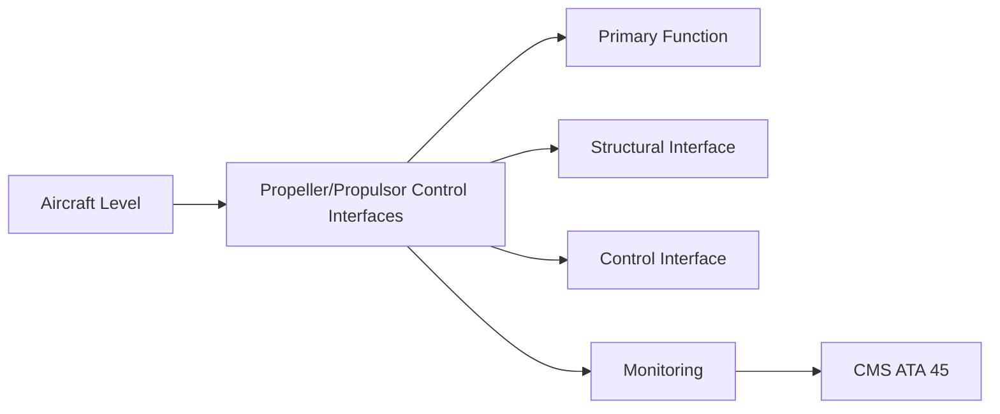
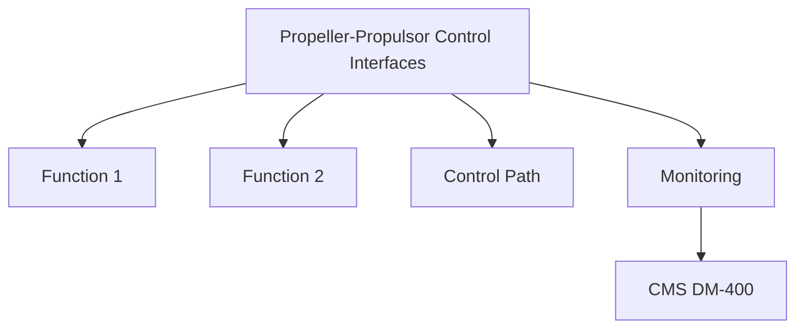

<!-- ──────────────────────────────────────────────────────────────────────────
     QATL-ATLAS-1000-ATLAS-060-069-061-050-PROPELLER-PROPULSOR-CONTROL-INTERFACES
     ATA 61 · Propeller/Propulsor Control Interfaces
     AMPEL360E eWTW — ATLAS Register 1000
────────────────────────────────────────────────────────────────────────────── -->

# Propeller/Propulsor Control Interfaces

---

## §0 Hyperlink Policy

> All hyperlinks in this document are **relative** (five directory levels: `../../../../../`).
> Absolute URLs are forbidden. Every linked document must exist in the Q+ATLANTIDE repository
> before the link is activated. Broken links are treated as open issues and must be resolved
> before the document is promoted from `DRAFT` to `APPROVED`.

---

## §1 Purpose

This document defines the command, feedback, and monitoring interfaces between propeller/propulsor systems and the aircraft propulsion control architecture. Correct interface definition is essential to ensure that FADEC thrust commands are faithfully translated to propeller pitch and speed responses, and that propulsor health data is correctly reported to CMS and ECAM for crew awareness and maintenance action.

The AMPEL360E eWTW propulsion control interface follows a hierarchical architecture: Thrust Lever Angle (TLA) from the cockpit → FADEC → PECU/EPCU → actuator → blade. Feedback runs in reverse: blade angle sensor → PECU → FADEC → ECAM. Monitoring runs in parallel: PECU health data → CMS (ATA 45) → maintenance terminal.

---

## §2 Applicability

| Parameter | Value |
|---|---|
| Aircraft Program | AMPEL360E eWTW |
| ATA reference | ATA 61-050 — Propeller/Propulsor Control Interfaces |
| Certification basis | EASA CS-25 Amendment 27+ |
| S1000D SNS | 061-050-00 |

---

## §3 Functional Description ![DRAFT]

The control interface hierarchy comprises:
- **TLA input** — Resolver on thrust lever provides TLA to FADEC; TLA calibration per AMM rigging task.
- **FADEC to PECU** — ARINC 429 or AFDX bus; pitch schedule command; N1 target; feather/reverse commands.
- **PECU to actuator** — PWM motor drive signal (EMA) or servo-valve current (EHA).
- **Blade angle feedback** — LVDT signal from PCM to PECU; PECU outputs calculated blade angle on ARINC 429 to FADEC and to ECAM.
- **ECAM display** — Blade angle, pitch mode (AUTO/MAN), feather status, PECU fault displayed on engine synoptic page.

---

## §4 Functional Breakdown

| ID | Name | Description | Lead Division |
|---|---|---|---|
| F-001 | TLA resolver | Cockpit resolver PN-TBD | 2 per TLA lever |
| F-001 | FADEC (ATA 67) | FADEC-PN-TBD | 1 per engine |
| F-001 | PECU | PECU-PN-TBD | 1 per propulsor |
| F-001 | ARINC 429 transceiver (PECU card) | ARINC-429-PN-TBD | Per PECU card |
| F-001 | ECAM engine synoptic (ATA 31) | ECAM-PN-TBD | 1 (crew-shared) |

---

## §5 System Context — Mermaid Diagram

---

## §6 Internal Architecture — Mermaid Diagram

---

## §7 Components and LRUs

| Component | Part Number | Qty | Location | Maintenance Interval | Notes |
|---|---|---|---|---|---|
| TLA resolver | Cockpit resolver PN-TBD | 2 per TLA lever | Thrust lever pedestal | Annual calibration check | TBD |
| FADEC (ATA 67) | FADEC-PN-TBD | 1 per engine | Engine nacelle avionics bay | On condition (FADEC) | TBD |
| PECU | PECU-PN-TBD | 1 per propulsor | Nacelle avionics bay | On condition / PBIT | TBD |
| ARINC 429 transceiver (PECU card) | ARINC-429-PN-TBD | Per PECU card | PECU chassis | On condition | TBD |
| ECAM engine synoptic (ATA 31) | ECAM-PN-TBD | 1 (crew-shared) | Cockpit centre display | On condition | TBD |

---

## §8 Interfaces

| Interface Type | Connected System | Protocol / Medium | Data / Function |
|---|---|---|---|
| FADEC | ATA 67 | ARINC 429 / AFDX | Pitch command, N1 reference, feather signal |
| Cockpit | ATA 31 ECAM | AFDX | Blade angle display, pitch mode, PECU fault |
| CMS | ATA 45 | AFDX | PECU BITE fault codes, vibration health data |
| ATA 24 Electrical Power | Power distribution | 28 V DC supply | PECU and actuator power |
| Auto-feather system | ATA 61-040 | Discrete / AFDX | Engine-out feather trigger from FADEC |

---

## §9 Operating Modes

| Mode | Trigger | System State | Actions / Consequences |
|---|---|---|---|
| Auto pitch (normal) | FADEC commanded, PECU active | PBIT passed | Closed-loop pitch control; LVDT feedback active |
| Manual pitch override | Crew manual override | Specific ground or abnormal condition | Direct PECU command from maintenance panel |
| Feather commanded | FADEC auto-feather or crew feather | Engine shutdown condition | PECU commands feather; status on ECAM |
| PECU failed (reversionary) | PECU CBIT fault detected | FADEC PECU fault declared | Fixed pitch fallback; ECAM CAUTION: PROP CTL FAULT |

---

## §10 Performance and Budgets ![DRAFT]

| Parameter | Requirement | Target / Design Value | Status |
|---|---|---|---|
| TLA resolver accuracy | ± 0.1° TLA | Bench calibration | TBD |
| ARINC 429 blade angle word update rate | 50 Hz | ARINC 429 bus analyser | TBD |
| FADEC to PECU command latency | < 20 ms | AFDX analysis | TBD |
| ECAM display update (blade angle) | 4 Hz minimum | ECAM display test | TBD |

---

## §11 Safety, Redundancy and Fault Tolerance

- TLA resolver calibration is safety-critical; only calibrated tooling and AMM-defined procedures are permitted for rigging.
- The PECU failed reversionary mode (fixed pitch) must be demonstrated safe for all applicable flight phases.
- ECAM display of PECU fault must not be deferrable under MEL without equivalent maintenance action.

---

## §12 Maintenance and Diagnostics

| Task | Interval | Access | Special Tools |
|---|---|---|---|
| TLA resolver calibration check | Annual / post-rigging | Cockpit access, aircraft on ground | TLA resolver calibration fixture + GSE |
| ARINC 429 blade angle word verification | After PECU replacement | Avionics test bench | ARINC 429 analyser |
| PECU PBIT execution and sign-off | A-check / post-PECU replacement | Maintenance terminal | CMS terminal, PECU GSE |
| ECAM engine synoptic blade angle display test | After avionics software load | Cockpit power-up | ECAM built-in test |
| Full control chain functional test (TLA to blade) | After any propulsor control maintenance | Ground run mode | PECU GSE + FADEC test mode |

---

## §13 Footprint — Physical, Electrical, Maintenance, Data ![TBD]

| Footprint Type | Parameter | Value | Notes |
|---|---|---|---|
| Physical | Mass (system total) | ![TBD] | Pending OEM data |
| Physical | Envelope (max) | ![TBD] | Pending detailed design |
| Electrical | Peak power (W) | ![TBD] | To be defined |
| Maintenance | Access category | Standard line maintenance | Per AMM |
| Data | AFDX bandwidth | ![TBD] | Per AFDX bus load analysis |

---

## §14 Safety and Certification References ![DRAFT]

| Standard / Document | Title | Issuing Body | Applicability |
|---|---|---|---|
| ARINC 429 | Digital Information Transfer System | ARINC | Propulsor control data bus standard |
| EASA CS-25 §25.901(b) | Powerplant installation — controls | EASA | Control interface installation requirement |
| DO-178C | Software Considerations in Airborne Systems | RTCA | PECU software assurance |
| SAE AS6858 | Electric Propulsion Control System Architecture | SAE International | EPCU/PECU architecture reference |
| ATA iSpec 2200 | Chapter 61 — Propellers and Propulsors | Air Transport Association | ATA chapter scope |

---

## §15 V&V Approach ![TBD]

| Phase | Method | Acceptance Criterion | Status |
|---|---|---|---|
| Design | Analysis and simulation | Meets all §10 performance requirements | ![TBD] |
| Integration | Ground functional test | All BITE tests pass; interfaces verified | ![TBD] |
| Qualification | DO-160G environmental test | All applicable tests pass | ![TBD] |
| Certification | EASA CS-25 / CS-E compliance demonstration | Type Certificate / STC approval | ![TBD] |

---

## §16 Glossary

| Term | Definition |
|---|---|
| **TLA** | Thrust Lever Angle — angular position of the flight-deck thrust lever; primary pilot input for thrust and pitch demand. |
| **Resolver** | Rotary position transducer providing analog electrical signals proportional to shaft angle. |
| **ARINC 429** | Digital avionics serial bus standard defining electrical, data format, and protocol specifications. |
| **Pitch mode** | Control mode of the propeller pitch system: AUTO (FADEC commanded) or MAN (direct crew/maintenance command). |
| **PECU CBIT** | Continuous Built-In Test — background diagnostics in the PECU monitoring all hardware channels during operation. |
| **Reversionary mode** | Degraded operating mode activated when the primary control path is no longer available. |
| **Fixed pitch fallback** | The propeller remains at its last commanded blade angle when PECU authority is lost. |
| **ECAM** | Electronic Centralised Aircraft Monitor — cockpit monitoring system displaying system status and alerts. |
| **ICD** | Interface Control Document — defines signal types, protocols, and physical characteristics of an interface. |
| **PWM** | Pulse Width Modulation — motor drive technique adjusting average voltage/current by varying duty cycle. |

---

## §17 Open Issues

| ID | Description | Owner | Target |
|---|---|---|---|
| OI-061-050-001 | Confirm ARINC 429 vs. AFDX interface type for PECU-FADEC link (ICD pending from FADEC OEM) | Q-MECHANICS / FADEC OEM | 2026-Q3 |
| OI-061-050-002 | Define ECAM display content for blade angle and pitch mode (pending ECAM style guide review) | Q-AIR / Q-DATAGOV | 2026-Q4 |

---

## §18 Status Legend

| Badge | Meaning |
|---|---|
| `![DRAFT]` | Section is drafted but not yet reviewed |
| `![TBD]` | Content not yet started — to be defined |
| `![To Be Completed]` | Partially complete — needs additional content |
| `![APPROVED]` | Reviewed and formally approved |

---

## §19 Related Documents (Siblings in this Subsection)

- [061-000](./061-000.md)
- [061-010](./061-010.md)
- [061-020](./061-020.md)
- [061-030](./061-030.md)
- [061-040](./061-040.md)
- [061-060](./061-060.md)
- [061-070](./061-070.md)
- [061-080](./061-080.md)
- [061-090](./061-090.md)

---

## §20 Change Log

| Rev | Date | Author | Description |
|---|---|---|---|
| 0.1 | 2026-05-11 | @copilot | Initial DRAFT — contextualized content per AMPEL360E eWTW architecture |
