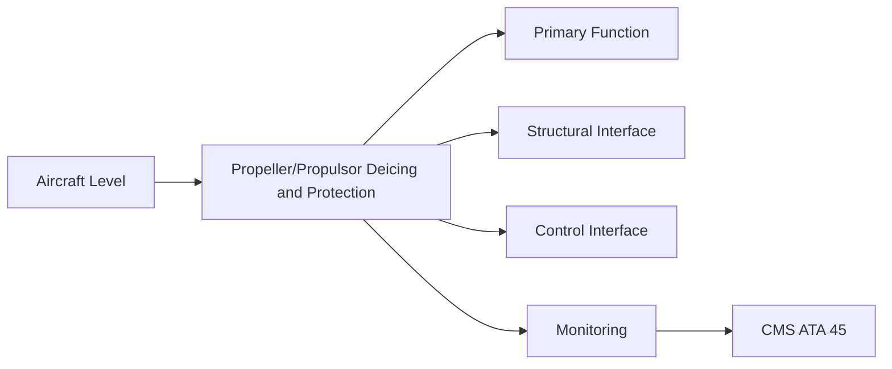
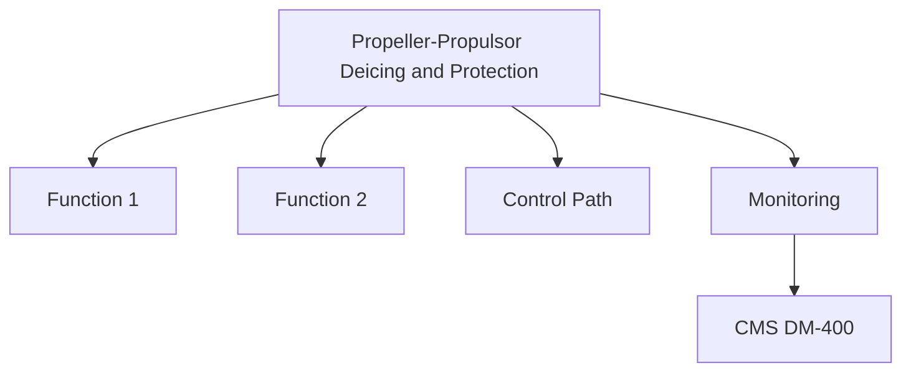

<!-- ──────────────────────────────────────────────────────────────────────────
     QATL-ATLAS-1000-ATLAS-060-069-061-060-PROPELLER-PROPULSOR-DEICING-AND-PROTECTION
     ATA 61 · Propeller/Propulsor Deicing and Protection
     programme-defined aircraft type — ATLAS Register 1000
────────────────────────────────────────────────────────────────────────────── -->

# Propeller/Propulsor Deicing and Protection

---

## §0 Hyperlink Policy

> All hyperlinks in this document are **relative** (five directory levels: `../../../../../`).
> Absolute URLs are forbidden. Every linked document must exist in the Q+ATLANTIDE repository
> before the link is activated. Broken links are treated as open issues and must be resolved
> before the document is promoted from `DRAFT` to `APPROVED`.

---

## §1 Purpose

This document defines the agnostic ATLAS standard-level architecture context for `Propeller/Propulsor Deicing and Protection`.

It describes the controlled scope, functions, interfaces, safety considerations, lifecycle traceability, and S1000D/CSDB mapping logic that programme implementations shall instantiate when this node is applicable.

This document is not a programme design baseline. Programme-specific capacities, locations, part numbers, effectivity, operating limits, maintenance references, and data module codes shall be defined only inside the applicable programme implementation branch.
## §2 Applicability

| Applicability Level | Rule |
|---|---|
| Standard taxonomy | Applies to the ATLAS node `061` |
| Programme implementation | Conditional; determined by programme architecture, trade studies, certification basis, and applicability model |
| Product configuration | Defined in the programme-specific configuration baseline |
| Effectivity | Defined in the programme CSDB / applicability layer |
| Non-applicability | Must be explicitly stated in the programme impact-study branch when excluded |
## §3 Functional Description ![DRAFT]

The electrothermal deicing system comprises:
- **Heater mats** — resistive heating elements embedded in the blade LE and adjacent suction surface; powered at typically 115 V AC or 28 V DC from an aircraft slip-ring.
- **Slip-ring assembly** — brushed or brushless rotating electrical connector at the hub; transfers power from airframe wiring to rotating blade wiring.
- **PDIC** — Propeller De-Ice Controller; sequences power to blade zones in cycling mode to shed ice progressively; monitors heater mat resistance for open-circuit detection.
- **Ice detection** — Primary ice detection from ATA 30 aircraft ice detection system; PDIC activates automatically when airframe ice detection triggers icing conditions.

---

## §4 Functional Breakdown

| ID | Name | Description | Lead Division |
|---|---|---|---|
| F-001 | Electrothermal heater mat (LE zone) | HeatMat-PN-TBD | N per blade |
| F-001 | Slip-ring assembly (hub) | SlipRing-PN-TBD | 1 per hub |
| F-001 | PDIC | PDIC-PN-TBD | 1 per propulsor |
| F-001 | Ice detector interface | ATA 30 IDS | Interface only |
| F-001 | Power supply (115 V AC TRU output) | ATA 24 transformer-rectifier unit | Shared |

---

## §5 System Context — Mermaid Diagram

---

## §6 Internal Architecture — Mermaid Diagram

---

## §7 Components and LRUs

| Component | Part Number | Qty | Location | Maintenance Interval | Notes |
|---|---|---|---|---|---|
| Electrothermal heater mat (LE zone) | HeatMat-PN-TBD | N per blade | Blade LE region (embedded) | On condition / resistance check C-check | TBD |
| Slip-ring assembly (hub) | SlipRing-PN-TBD | 1 per hub | Hub forward face | Brush wear check C-check / replace on wear | TBD |
| PDIC | PDIC-PN-TBD | 1 per propulsor | Nacelle avionics bay | On condition / PBIT | TBD |
| Ice detector interface | ATA 30 IDS | Interface only | IDS shared system | Per ATA 30 schedule | TBD |
| Power supply (115 V AC TRU output) | ATA 24 transformer-rectifier unit | Shared | Nacelle power panel | Per ATA 24 schedule | TBD |

---

## §8 Interfaces

| Interface Type | Connected System | Protocol / Medium | Data / Function |
|---|---|---|---|
| ATA 30 Ice Detection | Ice Detection System | Discrete / ARINC 429 | Icing condition signal to PDIC |
| ATA 24 Electrical Power | Power distribution | 115 V AC or 28 V DC supply | Heater mat power via slip-ring |
| ATA 45 CMS | Central Maintenance | AFDX | PDIC BITE fault codes; heater mat resistance data |
| ATA 31 ECAM | Cockpit | AFDX / ARINC 429 | De-ice status display; PDIC fault alert |

---

## §9 Operating Modes

| Mode | Trigger | System State | Actions / Consequences |
|---|---|---|---|
| Automatic deicing | Icing conditions detected | PDIC activated by IDS signal | Cycling heater power; shed ice progressively |
| Manual deicing | Crew selected (abnormal) | Manual switch on overhead panel | PDIC commanded manually |
| System off (no icing) | No icing condition | PDIC standby | All heater mats un-powered |
| PDIC fault | PDIC CBIT detects mat open-circuit | Fault logged in CMS | Degraded de-ice; maintenance action required; dispatch per MEL |

---

## §10 Performance and Budgets ![DRAFT]

| Parameter | Requirement | Target / Design Value | Status |
|---|---|---|---|
| Blade heater mat power density | TBD W/cm² (design target) | Icing certification analysis (CS-25 §25.1419) | TBD |
| Full blade de-ice cycle time | < 60 s | Icing tunnel test | TBD |
| Slip-ring brush life | TBD operating hours / replacement interval | Slip-ring OEM data | TBD |
| Open-circuit heater detection time | < 5 s from fault onset | PDIC CBIT verification | TBD |

---

## §11 Safety, Redundancy and Fault Tolerance

- Heater mat power must be cut off before any blade removal; slip-ring exposed contacts present an electrical shock hazard.
- PDIC must be tested per CS-25 §25.1419 icing certification campaign; flight into known icing without a functioning PDIC is prohibited.
- Slip-ring brush wear beyond service limit causes intermittent power loss and asymmetric blade heating; vibration exceedance is a consequence.

---

## §12 Maintenance and Diagnostics

| Task | Interval | Access | Special Tools |
|---|---|---|---|
| Heater mat resistance check (all zones) | C-check | Maintenance terminal / PDIC GSE | Resistance measurement kit |
| Slip-ring brush wear measurement | C-check | Hub access, spinner removed | Vernier calipers, brush wear limit gauge |
| PDIC PBIT execution | A-check | Maintenance terminal | CMS terminal |
| Icing-condition functional test (ground) | After PDIC replacement | Ground test with PDIC GSE simulate IDS | PDIC GSE, cycle timer |
| Heater mat bonding inspection (visual) | C-check | External blade LE access | Torch, VIS-001, tap test kit |

---

## §13 Footprint — Physical, Electrical, Maintenance, Data ![TBD]

| Footprint Type | Parameter | Value | Notes |
|---|---|---|---|
| Physical | Mass (system total) | ![TBD] | Pending OEM data |
| Physical | Envelope (max) | ![TBD] | Pending detailed design |
| Electrical | Peak power (W) | ![TBD] | To be defined |
| Maintenance | Access category | Standard line maintenance | Per AMM |
| Data | AFDX bandwidth | ![TBD] | Per AFDX bus load analysis |

---

## §14 Safety and Certification References ![DRAFT]

| Standard / Document | Title | Issuing Body | Applicability |
|---|---|---|---|
| EASA CS-25 §25.1419 | Ice protection systems | EASA | Propeller deicing certification requirement |
| SAE ARP5903 | Droplet Impingement and Ice Accretion Computer Codes | SAE International | Icing analysis reference |
| DO-160G Section 24 | Icing — Airborne Equipment | RTCA | PDIC environmental icing test |
| ATA iSpec 2200 | Chapter 61 — Propellers and Propulsors | Air Transport Association | ATA chapter scope |
| FAA AC 20-73A | Aircraft Ice Protection | FAA | Deicing system certification guidance |

---

## §15 V&V Approach ![TBD]

| Phase | Method | Acceptance Criterion | Status |
|---|---|---|---|
| Design | Analysis and simulation | Meets all §10 performance requirements | ![TBD] |
| Integration | Ground functional test | All BITE tests pass; interfaces verified | ![TBD] |
| Qualification | DO-160G environmental test | All applicable tests pass | ![TBD] |
| Certification | EASA CS-25 / CS-E compliance demonstration | Type Certificate / STC approval | ![TBD] |

---

## §16 Glossary

| Term | Definition |
|---|---|
| **PDIC** | Propeller De-Ice Controller — the electronic controller managing electrothermal deicing cycling and fault monitoring. |
| **Slip-ring** | Rotary electrical connector transferring power from stationary airframe wiring to rotating propeller blade wiring. |
| **Heater mat** | Resistive heating element embedded in the blade leading-edge structure; melts ice accretions when powered. |
| **Cycling deicing** | Deicing strategy where heater power is cycled between blade zones to allow ice to build slightly, then shed; more energy-efficient than continuous heating. |
| **Open-circuit fault** | Failure mode in which the heater mat circuit is broken; no current flows and the mat generates no heat. |
| **IDS** | Ice Detection System (ATA 30) — provides icing condition signal to PDIC. |
| **CS-25 §25.1419** | EASA certification standard for ice protection systems; defines compliance methods for in-flight icing. |
| **Electrothermal deicing** | Ice protection by resistive heating of blade surfaces; the only method available in the bleed-less [PROGRAMME-AIRCRAFT] architecture. |
| **Brush wear limit** | Maximum allowable brush erosion before the slip-ring contact quality degrades below acceptable resistance. |
| **Power density** | Heating power per unit area (W/cm²) applied to the blade leading edge during deicing. |

---

## §17 Open Issues

| ID | Description | Owner | Target |
|---|---|---|---|
| OI-061-060-001 | Define blade heater mat power density for [PROGRAMME-AIRCRAFT] icing envelope (pending icing analysis) | Q-AIR / icing specialist | 2026-Q4 |
| OI-061-060-002 | Select brush vs. brushless slip-ring technology (brushless preferred for reduced maintenance but longer qualification) | Q-MECHANICS / supplier | 2026-Q4 |
| OI-061-060-003 | Determine dispatch criteria (MEL) for single-blade heater mat failure | Q-AIR / safety / EASA | 2027-Q1 |

---

## §18 Status Legend

| Badge | Meaning |
|---|---|
| `![DRAFT]` | Section is drafted but not yet reviewed |
| `![TBD]` | Content not yet started — to be defined |
| `![To Be Completed]` | Partially complete — needs additional content |
| `![APPROVED]` | Reviewed and formally approved |

---

## §19 Related Documents (Siblings in this Subsection)

- [061-000](./061-000.md)
- [061-010](./061-010.md)
- [061-020](./061-020.md)
- [061-030](./061-030.md)
- [061-040](./061-040.md)
- [061-050](./061-050.md)
- [061-070](./061-070.md)
- [061-080](./061-080.md)
- [061-090](./061-090.md)

---

## §20 Change Log

| Rev | Date | Author | Description |
|---|---|---|---|
| 0.1 | 2026-05-11 | @copilot | Initial DRAFT — contextualized content per programme-defined aircraft type architecture |
