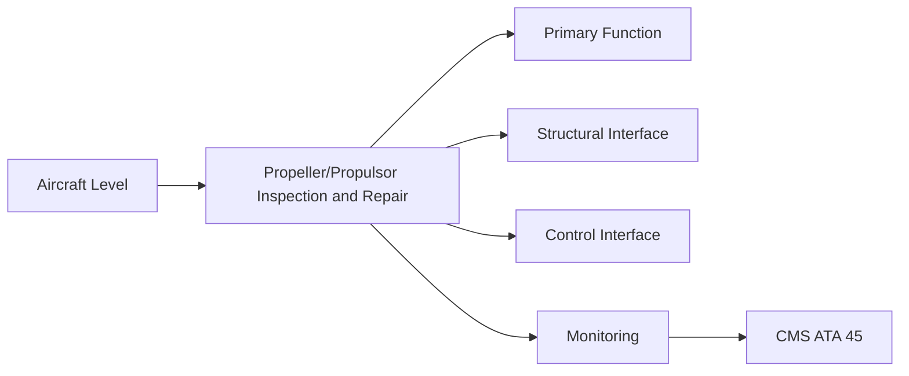
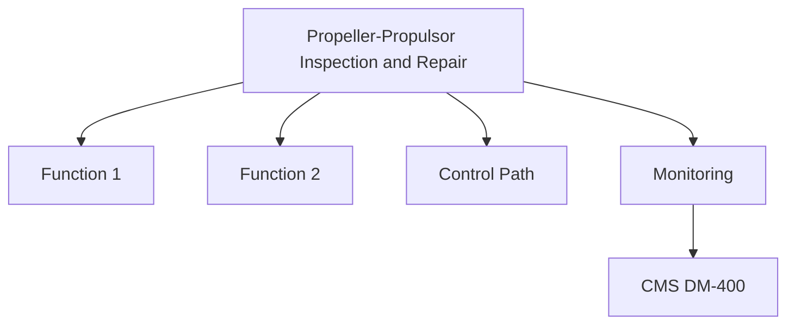

<!-- ──────────────────────────────────────────────────────────────────────────
     QATL-ATLAS-1000-ATLAS-060-069-061-070-PROPELLER-PROPULSOR-INSPECTION-AND-REPAIR
     ATA 61 · Propeller/Propulsor Inspection and Repair
     programme-defined aircraft type — ATLAS Register 1000
────────────────────────────────────────────────────────────────────────────── -->

# Propeller/Propulsor Inspection and Repair

---

## §0 Hyperlink Policy

> All hyperlinks in this document are **relative** (five directory levels: `../../../../../`).
> Absolute URLs are forbidden. Every linked document must exist in the Q+ATLANTIDE repository
> before the link is activated. Broken links are treated as open issues and must be resolved
> before the document is promoted from `DRAFT` to `APPROVED`.

---

## §1 Purpose

This document defines the agnostic ATLAS standard-level architecture context for `Propeller/Propulsor Inspection and Repair`.

It describes the controlled scope, functions, interfaces, safety considerations, lifecycle traceability, and S1000D/CSDB mapping logic that programme implementations shall instantiate when this node is applicable.

This document is not a programme design baseline. Programme-specific capacities, locations, part numbers, effectivity, operating limits, maintenance references, and data module codes shall be defined only inside the applicable programme implementation branch.
## §2 Applicability

| Applicability Level | Rule |
|---|---|
| Standard taxonomy | Applies to the ATLAS node `061` |
| Programme implementation | Conditional; determined by programme architecture, trade studies, certification basis, and applicability model |
| Product configuration | Defined in the programme-specific configuration baseline |
| Effectivity | Defined in the programme CSDB / applicability layer |
| Non-applicability | Must be explicitly stated in the programme impact-study branch when excluded |
## §3 Functional Description ![DRAFT]

The inspection and repair programme for ATA 61 components is structured in four categories:

1. **Pre-flight/A-check visual** — external visual survey; erosion check; spinner and LE condition.
2. **Scheduled C-check NDT** — full NDT programme per ATA 60-030 applied to blades, hub, and retention hardware.
3. **Approved standard repair (Class 2)** — composite patch, gel-coat restoration, LE cap re-bonding from SRM-061.
4. **Engineering-disposition repair / replacement (Class 3)** — any damage beyond SRM limits requires Q-MECHANICS engineering approval.

---

## §4 Functional Breakdown

| ID | Name | Description | Lead Division |
|---|---|---|---|
| F-001 | SRM-061 repair kit (Class 2 CFRP) | SRM-061 approved kit | Per repair event |
| F-001 | LE erosion cap re-bonding kit | LE-Bond-Kit-PN-TBD | Per repair event |
| F-001 | CFRP tap test kit | Approved kit | Per team |
| F-001 | Blade surface profile gauge | Calibrated depth gauge | Per repair team |
| F-001 | Cure blanket (electrothermal) | Approved heat blanket | Per repair bay |

---

## §5 System Context — Mermaid Diagram

---

## §6 Internal Architecture — Mermaid Diagram

---

## §7 Components and LRUs

| Component | Part Number | Qty | Location | Maintenance Interval | Notes |
|---|---|---|---|---|---|
| SRM-061 repair kit (Class 2 CFRP) | SRM-061 approved kit | Per repair event | Approved repair bay | Use before expiry | TBD |
| LE erosion cap re-bonding kit | LE-Bond-Kit-PN-TBD | Per repair event | Approved repair bay | Use before expiry | TBD |
| CFRP tap test kit | Approved kit | Per team | NDT store | Annual inspection | TBD |
| Blade surface profile gauge | Calibrated depth gauge | Per repair team | Repair bay | Annual calibration | TBD |
| Cure blanket (electrothermal) | Approved heat blanket | Per repair bay | Repair bay | Annual inspection + calibration | TBD |

---

## §8 Interfaces

| Interface Type | Connected System | Protocol / Medium | Data / Function |
|---|---|---|---|
| Engineering | Q-MECHANICS | Repair scheme approval | SRM-061 repair authority |
| NDT | NDT authority | Post-repair inspection | NDT procedure card for each repair class |
| Airworthiness authority | CAMO / EASA | Repair record and return-to-service approval | ARC or maintenance release |
| CSDB | Q-DATAGOV | Repair record DMs | S1000D DM-400 fault isolation / DM-720 installation |

---

## §9 Operating Modes

| Mode | Trigger | System State | Actions / Consequences |
|---|---|---|---|
| ADL monitoring | Damage within ADL | No repair needed | Reinspect at next scheduled interval |
| Class 2 standard repair | Damage beyond ADL, within SRM limits | Approved repair bay available | Post-repair NDT and balance check |
| Class 3 engineering disposition | Beyond SRM limits | Engineering engaged | Replace component or approved major repair |
| Component replacement | Class 3 or end-of-life | Replacement blade/hub available | Full installation per ATA 60-020 |

---

## §10 Performance and Budgets ![DRAFT]

| Parameter | Requirement | Target / Design Value | Status |
|---|---|---|---|
| Repair strength restoration (CFRP) | ≥ 90 % of original UTS after Class 2 repair | SRM-061 qualification coupons | TBD |
| LE cap re-bond shear strength | ≥ 25 MPa (APS-060) | Coupon test | TBD |
| Post-repair balance residual | ISO 1940-1 G1.0 | Balance machine cert | TBD (per repair event) |
| Repair documentation turnaround | < 24 h (Class 2) / < 72 h (Class 3) | Engineering SLA | TBD |

---

## §11 Safety, Redundancy and Fault Tolerance

- All propulsor repair work must be signed off by an authorised signatory with maintenance release authority; self-approval is prohibited.
- Class 3 repairs require written engineering concession before any repair work begins; not after.
- Post-repair NDT is mandatory before return to service; no exceptions for any repair affecting blade structural integrity.

---

## §12 Maintenance and Diagnostics

| Task | Interval | Access | Special Tools |
|---|---|---|---|
| Scheduled blade NDT programme | C-check | Access per AMM | Full NDT kit per ATA 60-030 |
| Class 2 CFRP patch repair | On-demand (damage event) | Approved repair bay | SRM-061 repair kit, cure blanket |
| LE cap re-bond repair | On-demand | Approved repair bay | LE bond kit, vacuum bag, cure blanket |
| Post-repair balance check | After every structural repair | Balance bay | ISO balance machine |
| Return-to-service functional check | After repair and balance | Ground run | Vibration analysis, PECU PBIT check |

---

## §13 Footprint — Physical, Electrical, Maintenance, Data ![TBD]

| Footprint Type | Parameter | Value | Notes |
|---|---|---|---|
| Physical | Mass (system total) | ![TBD] | Pending OEM data |
| Physical | Envelope (max) | ![TBD] | Pending detailed design |
| Electrical | Peak power (W) | ![TBD] | To be defined |
| Maintenance | Access category | Standard line maintenance | Per AMM |
| Data | AFDX bandwidth | ![TBD] | Per AFDX bus load analysis |

---

## §14 Safety and Certification References ![DRAFT]

| Standard / Document | Title | Issuing Body | Applicability |
|---|---|---|---|
| EASA CS-35 | Airworthiness Standards: Propellers | EASA | Propeller blade and hub structural integrity |
| [PROGRAMME-AIRCRAFT] SRM-061 | Structural Repair Manual — Chapter 61 | [PROGRAMME-AIRCRAFT] programme | Repair scheme authority |
| ISO 1940-1 | Balance quality requirements for rigid rotors | ISO | Post-repair balance standard G1.0 |
| ATA iSpec 2200 | Chapter 61 — Propellers and Propulsors | Air Transport Association | ATA chapter scope |
| EASA Part-145 | Approved Maintenance Organisation Requirements | EASA | Repair authority and authorised signatory requirements |

---

## §15 V&V Approach ![TBD]

| Phase | Method | Acceptance Criterion | Status |
|---|---|---|---|
| Design | Analysis and simulation | Meets all §10 performance requirements | ![TBD] |
| Integration | Ground functional test | All BITE tests pass; interfaces verified | ![TBD] |
| Qualification | DO-160G environmental test | All applicable tests pass | ![TBD] |
| Certification | EASA CS-25 / CS-E compliance demonstration | Type Certificate / STC approval | ![TBD] |

---

## §16 Glossary

| Term | Definition |
|---|---|
| **SRM-061** | Structural Repair Manual — Chapter 61 propeller/propulsor; defines ADL, standard repairs, and material specifications. |
| **ADL** | Allowable Damage Limits — maximum damage within which no structural repair is required. |
| **Class 2 repair** | Standard repair using SRM-061 approved scheme; no additional engineering concession required. |
| **Class 3 repair** | Damage beyond standard repair limits; requires written engineering disposition before work begins. |
| **Maintenance release** | Formal airworthiness document certifying that maintenance has been completed per approved data. |
| **Cure blanket** | Electrothermal heating blanket used to apply controlled heat cycle to CFRP repair patches. |
| **ARC** | Airworthiness Review Certificate — regulatory document confirming aircraft airworthiness status. |
| **CAMO** | Continuing Airworthiness Management Organisation — manages the airworthiness programme for the aircraft. |
| **Tap test** | Simple NDT method tapping a blade surface with a coin or hammer; hollow sound indicates delamination. |
| **Engineering concession** | Written approval allowing a component with damage beyond standard limits to be used within defined new limits. |

---

## §17 Open Issues

| ID | Description | Owner | Target |
|---|---|---|---|
| OI-061-070-001 | Validate Class 2 CFRP repair scheme in SRM-061 for [PROGRAMME-AIRCRAFT] blade geometry — coupon test program required | Q-MECHANICS / blade OEM | 2026-Q4 |
| OI-061-070-002 | Define ADL erosion limits for [PROGRAMME-AIRCRAFT] blade configuration (pending OEM test data) | Q-MECHANICS / blade OEM | 2026-Q4 |

---

## §18 Status Legend

| Badge | Meaning |
|---|---|
| `![DRAFT]` | Section is drafted but not yet reviewed |
| `![TBD]` | Content not yet started — to be defined |
| `![To Be Completed]` | Partially complete — needs additional content |
| `![APPROVED]` | Reviewed and formally approved |

---

## §19 Related Documents (Siblings in this Subsection)

- [061-000](./061-000.md)
- [061-010](./061-010.md)
- [061-020](./061-020.md)
- [061-030](./061-030.md)
- [061-040](./061-040.md)
- [061-050](./061-050.md)
- [061-060](./061-060.md)
- [061-080](./061-080.md)
- [061-090](./061-090.md)

---

## §20 Change Log

| Rev | Date | Author | Description |
|---|---|---|---|
| 0.1 | 2026-05-11 | @copilot | Initial DRAFT — contextualized content per programme-defined aircraft type architecture |
