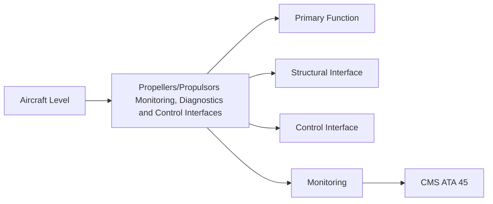
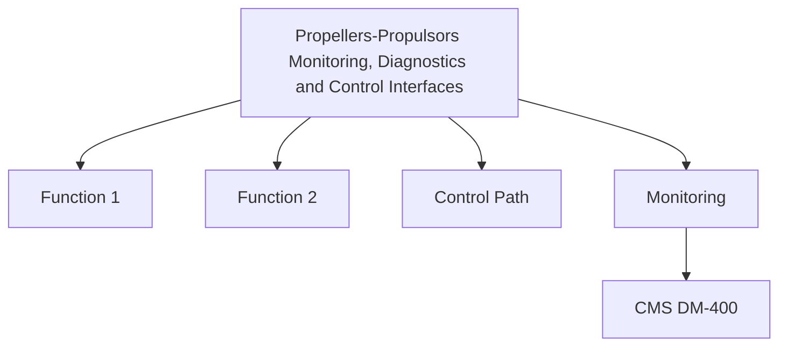

<!-- ──────────────────────────────────────────────────────────────────────────
     QATL-ATLAS-1000-ATLAS-060-069-061-080-PROPELLERS-PROPULSORS-MONITORING-DIAGNOSTICS-AND-CONTROL-INTERFACES
     ATA 61 · Propellers/Propulsors Monitoring, Diagnostics and Control Interfaces
     programme-defined aircraft type — ATLAS Register 1000
────────────────────────────────────────────────────────────────────────────── -->

# Propellers/Propulsors Monitoring, Diagnostics and Control Interfaces

---

## §0 Hyperlink Policy

> All hyperlinks in this document are **relative** (five directory levels: `../../../../../`).
> Absolute URLs are forbidden. Every linked document must exist in the Q+ATLANTIDE repository
> before the link is activated. Broken links are treated as open issues and must be resolved
> before the document is promoted from `DRAFT` to `APPROVED`.

---

## §1 Purpose

This document defines the agnostic ATLAS standard-level architecture context for `Propellers/Propulsors Monitoring, Diagnostics and Control Interfaces`.

It describes the controlled scope, functions, interfaces, safety considerations, lifecycle traceability, and S1000D/CSDB mapping logic that programme implementations shall instantiate when this node is applicable.

This document is not a programme design baseline. Programme-specific capacities, locations, part numbers, effectivity, operating limits, maintenance references, and data module codes shall be defined only inside the applicable programme implementation branch.
## §2 Applicability

| Applicability Level | Rule |
|---|---|
| Standard taxonomy | Applies to the ATLAS node `061` |
| Programme implementation | Conditional; determined by programme architecture, trade studies, certification basis, and applicability model |
| Product configuration | Defined in the programme-specific configuration baseline |
| Effectivity | Defined in the programme CSDB / applicability layer |
| Non-applicability | Must be explicitly stated in the programme impact-study branch when excluded |
## §3 Functional Description ![DRAFT]

The propulsor monitoring architecture comprises four parallel monitoring streams:
1. **Mechanical vibration** — hub-mounted MEMS; nacelle-mounted accelerometer; 1P, 2P, NP analysis.
2. **Pitch system health** — PECU/EPCU CBIT; blade angle tracking; actuator load current monitoring.
3. **Deicing health** — PDIC continuous mat resistance monitoring; slip-ring voltage drop trending.
4. **Structural health (future)** — optional fibre Bragg grating (FBG) strain sensor network in CFRP blades for structural load and fatigue monitoring.

All data streams converge at the PECU/EPCU, which packages and transmits health records to CMS via AFDX. Ground-based AHMS receives batch downloads for trend analysis and PHM.

---

## §4 Functional Breakdown

| ID | Name | Description | Lead Division |
|---|---|---|---|
| F-001 | MEMS vibration accelerometer (hub) | Sensor-PN-TBD | 2 per hub |
| F-001 | Nacelle accelerometer (broadband) | Sensor-PN-TBD | 1 per nacelle |
| F-001 | PECU with health data aggregation | PECU-PN-TBD | 1 per propulsor |
| F-001 | AHMS ground analysis workstation | Tool suite PN TBD | 1 per MRO hub |
| F-001 | FBG blade strain sensor network (future) | FBG-Blade-PN-TBD | Blades (optional) |

---

## §5 System Context — Mermaid Diagram

---

## §6 Internal Architecture — Mermaid Diagram

---

## §7 Components and LRUs

| Component | Part Number | Qty | Location | Maintenance Interval | Notes |
|---|---|---|---|---|---|
| MEMS vibration accelerometer (hub) | Sensor-PN-TBD | 2 per hub | Hub flange | Annual calibration | TBD |
| Nacelle accelerometer (broadband) | Sensor-PN-TBD | 1 per nacelle | Nacelle aft bulkhead | Annual calibration | TBD |
| PECU with health data aggregation | PECU-PN-TBD | 1 per propulsor | Nacelle avionics bay | On condition / PBIT | TBD |
| AHMS ground analysis workstation | Tool suite PN TBD | 1 per MRO hub | MRO operations centre | Per software update cycle | TBD |
| FBG blade strain sensor network (future) | FBG-Blade-PN-TBD | Blades (optional) | Embedded in CFRP spar | On condition | TBD |

---

## §8 Interfaces

| Interface Type | Connected System | Protocol / Medium | Data / Function |
|---|---|---|---|
| ATA 45 CMS | Central Maintenance | AFDX ARINC 664 P7 | BITE faults, health data packets |
| ATA 31 ECAM | Cockpit display | AFDX | Vibration level advisory; PECU fault alert |
| AHMS ground tool | Ground analysis | Wired / wireless download | Batch health records; trend dataset |
| ATA 30 PDIC | Deicing controller | Internal to PECU or AFDX | Heater mat resistance data |

---

## §9 Operating Modes

| Mode | Trigger | System State | Actions / Consequences |
|---|---|---|---|
| Normal operation | PECU/EPCU powered | PBIT passed, all streams active | All health parameters nominal |
| Vibration advisory | 1P exceeds advisory limit | In-flight or on ground | CMS message; ECAM advisory; maintenance review |
| Actuator anomaly | Abnormal actuator current trending | CBIT detection | CMS fault code; PHM flags for inspection |
| Ground data download | Aircraft at gate | Terminal connected | Full health record downloaded; PHM algorithm executed |

---

## §10 Performance and Budgets ![DRAFT]

| Parameter | Requirement | Target / Design Value | Status |
|---|---|---|---|
| Vibration advisory threshold | TBD ips (per propulsor OEM data) | Propulsor OEM vibration analysis | TBD |
| PECU CBIT fault detection coverage | ≥ 85 % of detectable hardware faults | BITE design analysis | TBD |
| PHM prediction lead time (actuator seal wear) | ≥ 200 FH advance warning | Algorithm validation test | TBD |
| AFDX health packet update rate | 1 Hz continuous; event-driven on fault | AFDX bus allocation | TBD |

---

## §11 Safety, Redundancy and Fault Tolerance

- Vibration exceedance above the 'action' limit mandates grounding pending engineering review.
- PHM recommendations are advisory; all maintenance work orders must be formally raised per CAMO procedures.
- PECU data download gaps > 200 FH should trigger engineering review of PHM prediction validity.

---

## §12 Maintenance and Diagnostics

| Task | Interval | Access | Special Tools |
|---|---|---|---|
| Vibration data download and trend review | A-check | Ground terminal | AHMS workstation |
| PECU PBIT execution and fault log check | A-check | Maintenance terminal | CMS terminal |
| MEMS accelerometer calibration check | Annual / after significant vibration event | Hub access | Calibration mass, accelerometer test rig |
| Heater mat resistance trend review (PDIC data) | C-check | PDIC BITE download | CMS terminal |
| AHMS software update | Per release schedule | Ground workstation | AHMS release package |

---

## §13 Footprint — Physical, Electrical, Maintenance, Data ![TBD]

| Footprint Type | Parameter | Value | Notes |
|---|---|---|---|
| Physical | Mass (system total) | ![TBD] | Pending OEM data |
| Physical | Envelope (max) | ![TBD] | Pending detailed design |
| Electrical | Peak power (W) | ![TBD] | To be defined |
| Maintenance | Access category | Standard line maintenance | Per AMM |
| Data | AFDX bandwidth | ![TBD] | Per AFDX bus load analysis |

---

## §14 Safety and Certification References ![DRAFT]

| Standard / Document | Title | Issuing Body | Applicability |
|---|---|---|---|
| DO-178C | Software Considerations in Airborne Systems | RTCA | PECU BITE software assurance |
| ARINC 664 P7 | Aircraft Data Network — AFDX | ARINC | CMS interface bus standard |
| MSG-3 Revision 2020 | Airline/Manufacturer Maintenance Programme Development | ATA / IATA | PHM credit methodology |
| ATA iSpec 2200 | Chapter 61 — Propellers and Propulsors | Air Transport Association | ATA chapter scope |
| SAE ARP4761 | Safety Assessment Process Guideline | SAE International | BITE coverage assessment |

---

## §15 V&V Approach ![TBD]

| Phase | Method | Acceptance Criterion | Status |
|---|---|---|---|
| Design | Analysis and simulation | Meets all §10 performance requirements | ![TBD] |
| Integration | Ground functional test | All BITE tests pass; interfaces verified | ![TBD] |
| Qualification | DO-160G environmental test | All applicable tests pass | ![TBD] |
| Certification | EASA CS-25 / CS-E compliance demonstration | Type Certificate / STC approval | ![TBD] |

---

## §16 Glossary

| Term | Definition |
|---|---|
| **FBG** | Fibre Bragg Grating — optical fibre sensor embedded in CFRP structure to measure strain; enables structural health monitoring. |
| **1P vibration** | Once-per-revolution vibration component; indicator of propeller mass imbalance. |
| **NP vibration** | N-per-revolution vibration (N = blade count); indicator of aerodynamic periodicity. |
| **AHMS** | Aircraft Health Management System — ground software suite for health data analysis and PHM. |
| **PHM** | Prognostic Health Management — predictive approach using sensor trends to forecast component remaining useful life. |
| **Digital Thread** | Continuous connected data record linking design, manufacturing, in-service, and maintenance data throughout the aircraft lifecycle. |
| **AFDX** | Avionics Full-Duplex Switched Ethernet — ARINC 664 Part 7; the avionics data network used on [PROGRAMME-AIRCRAFT]. |
| **CBIT** | Continuous Built-In Test — background PECU diagnostics running during normal operation. |
| **Advisory threshold** | Vibration or parameter level at which a CMS advisory message is generated; requires maintenance review but not immediate grounding. |
| **Action limit** | Vibration or parameter level at which the aircraft must be grounded for engineering review before next flight. |

---

## §17 Open Issues

| ID | Description | Owner | Target |
|---|---|---|---|
| OI-061-080-001 | Define vibration advisory and action limits for [PROGRAMME-AIRCRAFT] propulsor (pending OEM dynamic analysis) | Q-AIR / Q-MECHANICS | 2026-Q4 |
| OI-061-080-002 | Evaluate FBG structural health monitoring for CFRP blade spar — feasibility study required | Q-MECHANICS / Q-GREENTECH | 2027-Q1 |

---

## §18 Status Legend

| Badge | Meaning |
|---|---|
| `![DRAFT]` | Section is drafted but not yet reviewed |
| `![TBD]` | Content not yet started — to be defined |
| `![To Be Completed]` | Partially complete — needs additional content |
| `![APPROVED]` | Reviewed and formally approved |

---

## §19 Related Documents (Siblings in this Subsection)

- [061-000](./061-000.md)
- [061-010](./061-010.md)
- [061-020](./061-020.md)
- [061-030](./061-030.md)
- [061-040](./061-040.md)
- [061-050](./061-050.md)
- [061-060](./061-060.md)
- [061-070](./061-070.md)
- [061-090](./061-090.md)

---

## §20 Change Log

| Rev | Date | Author | Description |
|---|---|---|---|
| 0.1 | 2026-05-11 | @copilot | Initial DRAFT — contextualized content per programme-defined aircraft type architecture |
