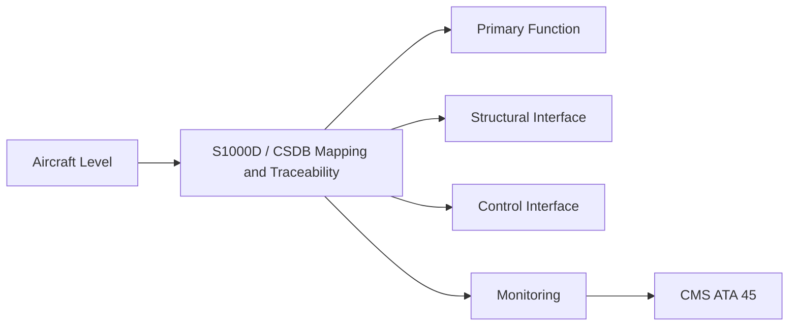
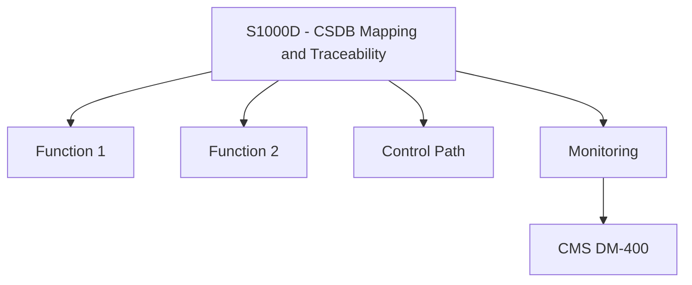

<!-- ──────────────────────────────────────────────────────────────────────────
     QATL-ATLAS-1000-ATLAS-060-069-061-090-S1000D---CSDB-MAPPING-AND-TRACEABILITY
     ATA 61 · S1000D / CSDB Mapping and Traceability
     AMPEL360E eWTW — ATLAS Register 1000
────────────────────────────────────────────────────────────────────────────── -->

# S1000D / CSDB Mapping and Traceability

---

## §0 Hyperlink Policy

> All hyperlinks in this document are **relative** (five directory levels: `../../../../../`).
> Absolute URLs are forbidden. Every linked document must exist in the Q+ATLANTIDE repository
> before the link is activated. Broken links are treated as open issues and must be resolved
> before the document is promoted from `DRAFT` to `APPROVED`.

---

## §1 Purpose

This document defines the S1000D DMRL and CSDB mapping for all ATA 61 Propellers and Propulsors documentation on the AMPEL360E eWTW programme. The DMC scheme `AMPEL360E-EWTW-061-{NNN}-00A-EN-US` is used for all 36 ATA 61 data modules.

The BREX file `AMPEL360E-BREX-061-v1` enforces four programme-specific constraints: (1) no DM may reference bleed-air-powered pitch change; (2) all blade removal/installation DMs must cite the applicable torque value from AMM Chapter 60 Standard Practices; (3) all composite repair DMs must cite SRM-061 and applicable repair class; (4) icing DMs must reference the electrothermal deicing architecture (no hot-air bleed).

---

## §2 Applicability

| Parameter | Value |
|---|---|
| Aircraft Program | AMPEL360E eWTW |
| ATA reference | ATA 61-090 — S1000D / CSDB Mapping and Traceability |
| Certification basis | EASA CS-25 Amendment 27+ |
| S1000D SNS | 061-090-00 |

---

## §3 Functional Description ![DRAFT]

The DMRL covers 36 data modules distributed across 9 SNS nodes (061-000 through 061-080). Key data modules include:
- **DM-040** (descriptive) for each subsubject — propeller assembly, pitch system, deice, controls.
- **DM-300** (inspection) — blade NDT schedule, hub bore inspection.
- **DM-400** (fault isolation) — PECU BITE fault tree, vibration fault isolation.
- **DM-520/720** (remove/install) — blade, hub, PECU, PDIC.
- **DM-941** (illustrated parts) — exploded propeller assembly views.

---

## §4 Functional Breakdown

| ID | Name | Description | Lead Division |
|---|---|---|---|
| F-001 | S1000D Issue 5.0 schema | S1000D.org | CSDB authoring platform |
| F-001 | BREX file AMPEL360E-BREX-061-v1 | Programme document | CSDB |
| F-001 | DMRL tracker (36 DMs) | Q-DATAGOV tool | PMO / Q-DATAGOV |
| F-001 | ICN registry (ATA 61 illustrations) | Q-DATAGOV database | CSDB platform |
| F-001 | CSDB authoring tool | Q-DATAGOV approved tool | CSDB platform |

---

## §5 System Context — Mermaid Diagram

---

## §6 Internal Architecture — Mermaid Diagram

---

## §7 Components and LRUs

| Component | Part Number | Qty | Location | Maintenance Interval | Notes |
|---|---|---|---|---|---|
| S1000D Issue 5.0 schema | S1000D.org | CSDB authoring platform | IT infrastructure | Per schema release | TBD |
| BREX file AMPEL360E-BREX-061-v1 | Programme document | CSDB | CSDB validator | Per BREX revision | TBD |
| DMRL tracker (36 DMs) | Q-DATAGOV tool | PMO / Q-DATAGOV | PMO tool | Continuously maintained | TBD |
| ICN registry (ATA 61 illustrations) | Q-DATAGOV database | CSDB platform | IT infrastructure | Continuously maintained | TBD |
| CSDB authoring tool | Q-DATAGOV approved tool | CSDB platform | IT infrastructure | Per software update | TBD |

---

## §8 Interfaces

| Interface Type | Connected System | Protocol / Medium | Data / Function |
|---|---|---|---|
| Q-GREENTECH technical authors | ATA 61 content | CSDB submission workflow | Technical content authoring |
| Q-MECHANICS engineering | Technical review authority | CSDB review/approval workflow | Approval before DM release |
| IETP publisher | Publication platform | Approved CSDB DMs | IETP for maintenance technicians |
| ATLAS architecture | Q+ATLANTIDE register | Traceability matrix | ATLAS subsubject to CSDB DM cross-reference |

---

## §9 Operating Modes

| Mode | Trigger | System State | Actions / Consequences |
|---|---|---|---|
| DMRL population | Programme start | DMRL empty | All 36 DMs identified; authors assigned |
| DM authoring | Active development | DM under authoring | Technical draft complete |
| BREX validation | Pre-CSDB submission | DM draft complete | BREX pass; DM ingested |
| DM release | Approved for publication | Engineering approved | DM RELEASED in CSDB |

---

## §10 Performance and Budgets ![DRAFT]

| Parameter | Requirement | Target / Design Value | Status |
|---|---|---|---|
| BREX first-pass validation rate (target) | ≥ 95 % pass without rework | CSDB submission log | TBD |
| DMRL 100 % completion | All 36 DMs RELEASED by MPD first issue | DMRL status report | TBD |
| Architecture traceability | 100 % of DMs linked to ATLAS subsubject | Traceability matrix audit | TBD |

---

## §11 Safety, Redundancy and Fault Tolerance

- No ATA 61 procedure DM may be released to IETP without engineering approval signature in the CSDB workflow.
- BREX failures on safety-relevant content (torque values, repair classification) must be corrected before DM release.

---

## §12 Maintenance and Diagnostics

| Task | Interval | Access | Special Tools |
|---|---|---|---|
| DMRL monthly status review | Monthly | PMO / Q-DATAGOV | DMRL tracker |
| BREX file update after design change | Per design change affecting BREX rules | CSDB platform | BREX editor |
| Traceability matrix update | After ATLAS architecture change | Q-DATAGOV | Cross-reference table |
| CSDB DM status audit at gate review | Programme gate | Q-DATAGOV / QA | CSDB status report |
| ICN registry quarterly audit | Quarterly | Q-DATAGOV | ICN database |

---

## §13 Footprint — Physical, Electrical, Maintenance, Data ![TBD]

| Footprint Type | Parameter | Value | Notes |
|---|---|---|---|
| Physical | Mass (system total) | ![TBD] | Pending OEM data |
| Physical | Envelope (max) | ![TBD] | Pending detailed design |
| Electrical | Peak power (W) | ![TBD] | To be defined |
| Maintenance | Access category | Standard line maintenance | Per AMM |
| Data | AFDX bandwidth | ![TBD] | Per AFDX bus load analysis |

---

## §14 Safety and Certification References ![DRAFT]

| Standard / Document | Title | Issuing Body | Applicability |
|---|---|---|---|
| S1000D Issue 5.0 | International Specification for Technical Publications | S1000D.org | Authoring standard |
| ATA iSpec 2200 | Chapter 61 — Propellers and Propulsors | Air Transport Association | ATA SNS reference |
| AMPEL360E GP-CSDB-001 | CSDB Governance Procedure | Q-DATAGOV | CSDB submission and release workflow |
| NAS 410 | NDT Personnel Qualification | AIA / NASM | BREX-enforced NDT citation |
| EASA CS-35 | Airworthiness Standards: Propellers | EASA | Evidence DM content requirements |

---

## §15 V&V Approach ![TBD]

| Phase | Method | Acceptance Criterion | Status |
|---|---|---|---|
| Design | Analysis and simulation | Meets all §10 performance requirements | ![TBD] |
| Integration | Ground functional test | All BITE tests pass; interfaces verified | ![TBD] |
| Qualification | DO-160G environmental test | All applicable tests pass | ![TBD] |
| Certification | EASA CS-25 / CS-E compliance demonstration | Type Certificate / STC approval | ![TBD] |

---

## §16 Glossary

| Term | Definition |
|---|---|
| **DMC** | Data Module Code — unique identifier for an S1000D data module. |
| **DMRL** | Data Module Requirement List — master list of all required data modules. |
| **BREX** | Business Rules eXchange — project-specific S1000D business rules enforced at CSDB ingestion. |
| **CSDB** | Common Source DataBase — controlled repository for S1000D data modules. |
| **ICN** | Illustration Control Number — unique ID for each illustration in the CSDB. |
| **SNS** | Standard Numbering System — hierarchical numbering for S1000D DMCs. |
| **IETP** | Interactive Electronic Technical Publication — electronically rendered maintenance manual from CSDB DMs. |
| **DM-040** | Descriptive data module — system or component description. |
| **DM-300** | Examination/inspection/check data module. |
| **DM-941** | Illustrated parts data module. |

---

## §17 Open Issues

| ID | Description | Owner | Target |
|---|---|---|---|
| OI-061-090-001 | Finalise BREX-061-v1 rule wording for composite repair DM citation requirement | Q-DATAGOV / Q-MECHANICS | 2026-Q3 |
| OI-061-090-002 | Resolve authoring resource allocation for 6 unassigned DMRL entries | Q-DATAGOV / PMO | 2026-Q4 |

---

## §18 Status Legend

| Badge | Meaning |
|---|---|
| `![DRAFT]` | Section is drafted but not yet reviewed |
| `![TBD]` | Content not yet started — to be defined |
| `![To Be Completed]` | Partially complete — needs additional content |
| `![APPROVED]` | Reviewed and formally approved |

---

## §19 Related Documents (Siblings in this Subsection)

- [061-000](./061-000.md)
- [061-010](./061-010.md)
- [061-020](./061-020.md)
- [061-030](./061-030.md)
- [061-040](./061-040.md)
- [061-050](./061-050.md)
- [061-060](./061-060.md)
- [061-070](./061-070.md)
- [061-080](./061-080.md)

---

## §20 Change Log

| Rev | Date | Author | Description |
|---|---|---|---|
| 0.1 | 2026-05-11 | @copilot | Initial DRAFT — contextualized content per AMPEL360E eWTW architecture |
