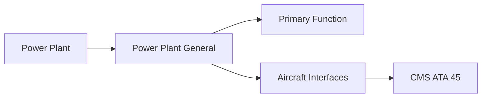
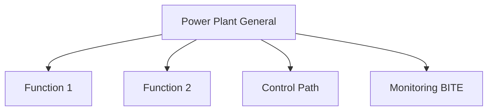

<!-- ──────────────────────────────────────────────────────────────────────────
     QATL-ATLAS-1000-ATLAS-060-069-062-000-POWER-PLANT-GENERAL
     ATA 62 · Power Plant General
     AMPEL360E eWTW — ATLAS Register 1000
────────────────────────────────────────────────────────────────────────────── -->

# Power Plant General

---

## §0 Hyperlink Policy

> All hyperlinks in this document are **relative** (five directory levels: `../../../../../`).
> Absolute URLs are forbidden. Every linked document must exist in the Q+ATLANTIDE repository
> before the link is activated. Broken links are treated as open issues and must be resolved
> before the document is promoted from `DRAFT` to `APPROVED`.

---

## §1 Purpose

The Power Plant (ATA 62) chapter defines the installed propulsion system at the nacelle/aircraft level — the engine plus all the structural, fluid, electrical, and control interfaces that connect it to the airframe. This is distinct from ATA 72–80 which define the engine as a standalone product.

For the AMPEL360E eWTW, two high-bypass turbofan engines are installed on under-wing pylons. Each power plant encompasses: the engine nacelle structure, engine mounting system, air intake and exhaust interfaces, fire zone, fuel supply connections, bleed-less pneumatic provisions (none on eWTW — air supply is EAC-only), and all engine-to-airframe LRU interfaces. The installed thrust class is TBD pending engine OEM selection.

---

## §2 Applicability

| Parameter | Value |
|---|---|
| Aircraft Program | AMPEL360E eWTW |
| ATA reference | ATA 62-000 — Power Plant General |
| S1000D SNS | 062-000-00 |

---

## §3 Functional Description ![DRAFT]

The power plant general document establishes:
- **Nacelle architecture** — inlet, fan cowl, thrust reverser, exhaust system as an integrated aeromechanical unit.
- **Engine mount system** — forward and aft mount links transferring thrust, torque, and vertical/lateral loads to the pylon and wing structure.
- **Fire zone** — engine fire zone defined per CS-25 §25.1181; fire-resistant materials; firewall provisions.
- **System interfaces** — oil, fuel, pneumatic (none), bleed-less EAC interface, electrical, data bus, and control interfaces at the QEC (Quick Engine Change) split line.

---

## §4 Functional Breakdown

| ID | Name | Description | Lead Division |
|---|---|---|---|
| F-001 | Engine (TCDS referenced) | High-bypass turbofan — OEM TBD | 2 |
| F-001 | Engine forward mount (fail-safe link) | Mount-PN-TBD | 1 per engine |
| F-001 | Engine aft mount (fail-safe link) | Mount-PN-TBD | 1 per engine |

---

## §5 System Context — Mermaid Diagram

---

## §6 Internal Architecture — Mermaid Diagram

---

## §7 Components and LRUs

| Component | Part Number | Qty | Location | Maintenance Interval | Notes |
|---|---|---|---|---|---|
| Engine (TCDS referenced) | High-bypass turbofan — OEM TBD | 2 | Wing under-wing nacelle | On condition / engine overhaul | Primary thrust unit; TCDS reference TBD |
| Engine forward mount (fail-safe link) | Mount-PN-TBD | 1 per engine | Pylon forward attach fitting | C-check visual + dimensional | CS-25 fail-safe mount system |
| Engine aft mount (fail-safe link) | Mount-PN-TBD | 1 per engine | Pylon aft attach fitting | C-check visual + dimensional | Torque, vertical, lateral load carry-out |
| Fan cowl panels (hinged) | Cowl-PN-TBD | 2 per engine | Nacelle mid-section | C-check hinge and latch check | Access to engine fan case and accessories |
| QEC harness (engine/airframe electrical) | QEC-Harn-PN-TBD | 1 per engine | QEC split plane | On condition / inspect at QEC disconnect | All engine LRU electrical connections |

---

## §8 Interfaces

| Interface Type | Connected System | Protocol / Medium | Data / Function |
|---|---|---|---|
| ATA 57 Wing/pylon | Structural | Engine mount attach fittings | Thrust, torque, vertical/lateral loads |
| ATA 24 Electrical | Power | HVDC / 28 V DC via QEC harness | Engine accessory power, FADEC power |
| ATA 26 Fire Protection | Fire detection | Engine fire loop | Fire detection / extinguishing commands |
| ATA 64 Fuel | Fuel feed | HP fuel line at QEC | Fuel supply to engine HP pump |
| ATA 67 Engine Controls | FADEC | AFDX / ARINC 429 at QEC | Thrust command and engine parameter feedback |

---

## §9 Operating Modes

| Mode | Trigger | System State | Actions / Consequences |
|---|---|---|---|
| Normal operation | Engines running | FADEC active | Full thrust authority, fire monitoring active |
| QEC (engine change) | Engine removal/installation | Aircraft in heavy maintenance bay | All QEC connections disconnected; safety stops applied |
| Engine fire | Fire detected | FADEC cuts fuel; fire bottle armed | Crew activates fire handle; agent discharged |
| Ground run | Engine test | Aircraft on ground, wheels chocked | Reduced power test; vibration and leak check |

---

## §10 Performance and Budgets ![DRAFT]

| Parameter | Requirement | Target / Design Value | Status |
|---|---|---|---|
| Engine installed dry weight | TBD kg (OEM data pending) | Engine OEM spec | TBD |
| Engine mount design load (forward) | TBD kN (per CS-25 §25.361) | Structural analysis | TBD |
| Nacelle drag coefficient | TBD (aerodynamic optimisation) | CFD analysis | TBD |
| Engine QEC time | < 8 h (target) | Maintenance trials | TBD |

---

## §11 Safety, Redundancy and Fault Tolerance

- Engine mount fail-safe design is mandatory per CS-25 §25.361; each mount link must be able to sustain design loads after loss of any single element.
- All fuel and oil lines at the QEC must be protected with cap and blind plugs immediately after disconnection to prevent contamination.
- Engine bay fire zone requires fire-resistant material certification per CS-25 §25.1185; standard aircraft materials are NOT acceptable in this zone.

---

## §12 Maintenance and Diagnostics

| Task | Interval | Access | Special Tools |
|---|---|---|---|
| Engine mount visual and dimensional check | C-check | Nacelle access, cowls open | Calibrated gap gauge, visual check |
| QEC harness continuity and insulation test | At engine change | Aircraft powered off | Multifunction test set |
| Fan cowl hinge and latch inspection | C-check | External cowl access | Torque wrench, visual |
| Engine fire loop resistance check | C-check | Engine bay access | Loop resistance test set |
| Engine installation leak check | After engine change | Ground run post-install | Fuel/oil leak UV lamp + visual survey |

---

## §13 Footprint — Physical, Electrical, Maintenance, Data ![TBD]

| Footprint Type | Parameter | Value | Notes |
|---|---|---|---|
| Physical | Mass (system total) | ![TBD] | Pending OEM data |
| Physical | Envelope (max) | ![TBD] | Pending detailed design |
| Electrical | Peak power (W) | ![TBD] | To be defined |
| Maintenance | Access category | Standard line maintenance | Per AMM |
| Data | AFDX bandwidth | ![TBD] | Per AFDX bus load analysis |

---

## §14 Safety and Certification References ![DRAFT]

| Standard / Document | Title | Issuing Body | Applicability |
|---|---|---|---|
| EASA CS-25 §25.1181 | Designated fire zones | EASA | Engine fire zone requirement |
| EASA CS-25 §25.361 | Engine and pylon structural loads | EASA | Engine mount design load factor |
| SAE AS1055 | Propulsion System Mount Design | SAE International | Mount design reference |
| ATA iSpec 2200 | Chapter 62 — Power Plant | Air Transport Association | ATA chapter scope |
| DO-160G | Environmental Conditions and Test Procedures | RTCA | Engine bay LRU qualification |

---

## §15 V&V Approach ![TBD]

| Phase | Method | Acceptance Criterion | Status |
|---|---|---|---|
| Design | Analysis and simulation | Meets all §10 performance requirements | ![TBD] |
| Integration | Ground functional test | All BITE tests pass; interfaces verified | ![TBD] |
| Qualification | DO-160G environmental test | All applicable tests pass | ![TBD] |
| Certification | EASA CS-25 / CS-E compliance demonstration | Type Certificate / STC approval | ![TBD] |

---

## §16 Glossary

| Term | Definition |
|---|---|
| **QEC** | Quick Engine Change — the defined split plane at which the engine plus all its aircraft connections can be disconnected and the engine removed as a unit. |
| **TCDS** | Type Certificate Data Sheet — regulatory document summarising the type certificate conditions for the engine. |
| **Fail-safe mount** | Engine mount system where each load path is duplicated; failure of any single element does not result in loss of mount function. |
| **Fire zone** | The designated engine compartment area treated to CS-25 §25.1181 fire-resistance standards; uses fire-resistant materials and seals. |
| **Pylon** | Structural fairing connecting the engine nacelle to the wing; carries all engine loads into the wing structure. |
| **Fan cowl** | Hinged panels forming the outer nacelle covering around the engine fan case; provides maintenance access to engine accessories. |
| **CS-25 §25.1181** | EASA standard defining the areas that must be designated as fire zones and the material requirements for those zones. |
| **Nacelle** | The aerodynamic pod enclosing the engine; includes inlet, fan cowl, thrust reverser, and exhaust nozzle sections. |
| **Bleed-less** | Design philosophy of the AMPEL360E eWTW: no engine bleed air for pneumatic systems; all pneumatic needs met by Electric Air Compressors (EAC). |
| **EAC** | Electric Air Compressor — electrically powered compressor providing pressurised air for cabin conditioning; replaces engine bleed on eWTW. |

---

## §17 Open Issues

| ID | Description | Owner | Target |
|---|---|---|---|
| OI-062-000-001 | Confirm engine OEM selection and TCDS reference number for AMPEL360E eWTW | Q-AIR / procurement | 2026-Q3 |
| OI-062-000-002 | Define QEC split plane design in coordination with engine OEM and nacelle supplier | Q-MECHANICS / nacelle OEM | 2026-Q4 |

---

## §18 Status Legend

| Badge | Meaning |
|---|---|
| `![DRAFT]` | Section is drafted but not yet reviewed |
| `![TBD]` | Content not yet started — to be defined |
| `![To Be Completed]` | Partially complete — needs additional content |
| `![APPROVED]` | Reviewed and formally approved |

---

## §19 Related Documents (Siblings in this Subsection)

- [062-010](./062-010.md)
- [062-020](./062-020.md)
- [062-030](./062-030.md)
- [062-040](./062-040.md)
- [062-050](./062-050.md)
- [062-060](./062-060.md)
- [062-070](./062-070.md)
- [062-080](./062-080.md)
- [062-090](./062-090.md)

---

## §20 Change Log

| Rev | Date | Author | Description |
|---|---|---|---|
| 0.1 | 2026-05-11 | @copilot | Initial DRAFT — contextualized content per AMPEL360E eWTW architecture |
