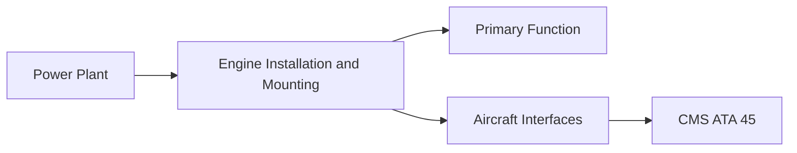
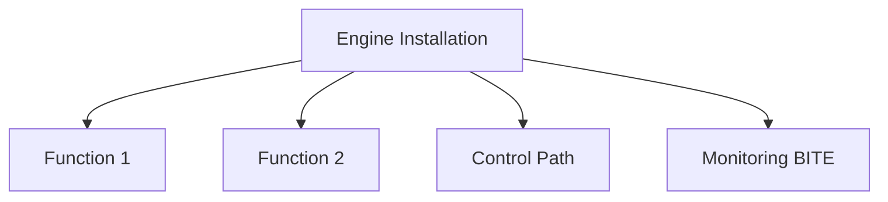

<!-- ──────────────────────────────────────────────────────────────────────────
     QATL-ATLAS-1000-ATLAS-060-069-062-010-ENGINE-INSTALLATION-AND-MOUNTING
     ATA 62 · Engine Installation and Mounting
     AMPEL360E eWTW — ATLAS Register 1000
────────────────────────────────────────────────────────────────────────────── -->

# Engine Installation and Mounting

---

## §0 Hyperlink Policy

> All hyperlinks in this document are **relative** (five directory levels: `../../../../../`).
> Absolute URLs are forbidden. Every linked document must exist in the Q+ATLANTIDE repository
> before the link is activated. Broken links are treated as open issues and must be resolved
> before the document is promoted from `DRAFT` to `APPROVED`.

---

## §1 Purpose

This document defines the controlled procedure for engine installation on the AMPEL360E eWTW, the torque schedules and shim selection for engine mount links, the engine build-up with QEC components, and the return-to-service ground-run checks. Engine installation is a safety-critical maintenance action: an incorrectly installed engine mount link can separate in flight.

---

## §2 Applicability

| Parameter | Value |
|---|---|
| Aircraft Program | AMPEL360E eWTW |
| ATA reference | ATA 62-010 — Engine Installation and Mounting |
| S1000D SNS | 062-010-00 |

---

## §3 Functional Description ![DRAFT]

Engine installation follows a four-phase sequence:
1. **Build-up** — attach all QEC harnesses, lines, brackets, and accessories to engine before crane lift.
2. **Cradle approach** — position engine on approved engine transport trolley; crane lift to pylon height using approved engine sling.
3. **Mount attachment** — engage forward mount first; shimming per pylon/engine gap measurement; torque to drawing specification; install aft mount.
4. **Post-installation checks** — all QEC connections made; ground leak check; engine ground run per AMM.

---

## §4 Functional Breakdown

| ID | Name | Description | Lead Division |
|---|---|---|---|
| F-001 | Engine transport trolley and cradle | GSE-Engine-TRL-PN-TBD | 1 per hangar |
| F-001 | Engine overhead crane sling | GSE-Sling-PN-TBD | 1 per hangar |
| F-001 | Mount link shim set | Shim-PN-TBD — drawing-specific | Per installation |

---

## §5 System Context — Mermaid Diagram

---

## §6 Internal Architecture — Mermaid Diagram

---

## §7 Components and LRUs

| Component | Part Number | Qty | Location | Maintenance Interval | Notes |
|---|---|---|---|---|---|
| Engine transport trolley and cradle | GSE-Engine-TRL-PN-TBD | 1 per hangar | Hangar GSE store | Annual load test | Rated for max engine mass × 3 |
| Engine overhead crane sling | GSE-Sling-PN-TBD | 1 per hangar | Hangar GSE store | Annual certification | Rated for max engine mass × 3 |
| Mount link shim set | Shim-PN-TBD — drawing-specific | Per installation | Fastener parts store | Single-use — not reusable | Precision-ground titanium shims |
| Torque wrench (engine mount bolts) | Calibrated — per mount torque range | 1 per installation team | Tool crib | 6-month calibration | Safety-critical torque application |
| QEC plug-and-cap set | Plug-Cap-PN-TBD | 1 set per engine | QEC kit store | Inspect before each use | Prevents contamination during engine transit |

---

## §8 Interfaces

| Interface Type | Connected System | Protocol / Medium | Data / Function |
|---|---|---|---|
| Pylon structure | ATA 57 Wing | Engine mount attach fittings | Forward + aft mount link attachment |
| Engine | ATA 72 Engine turbine | QEC split plane | Engine electrical, fuel, oil, control connections |
| Fire system | ATA 26 | Engine bay fire loop connection | Fire detection at engine installation |
| Fuel system | ATA 64 | HP fuel QEC fitting | Fuel supply at QEC connection |

---

## §9 Operating Modes

| Mode | Trigger | System State | Actions / Consequences |
|---|---|---|---|
| Engine installation | Heavy maintenance input | Aircraft in hangar bay | All mount bolts torqued; QEC complete; ground run passed |
| Engine removal | QEC event / AOG | Aircraft in hangar or line | Engine isolated; all connections capped; engine on trolley |
| Ground run (post-install) | After engine installation complete | Aircraft on designated test run pad | Leak-free; all parameters nominal; vibration within limits |

---

## §10 Performance and Budgets ![DRAFT]

| Parameter | Requirement | Target / Design Value | Status |
|---|---|---|---|
| Engine installation time (target) | < 6 h (build-up + installation + QEC) | Maintenance trials | TBD |
| Mount bolt torque retention (24 h) | Residual torque ≥ 80 % applied torque | Sample torque test | TBD |
| Ground run post-install duration | ≥ 30 min at idle + power checks | AMM task | TBD |

---

## §11 Safety, Redundancy and Fault Tolerance

- Engine sling and trolley must be rated for ≥ 3× engine mass; rating plates must be current and visible.
- Forward mount must be engaged before aft mount during installation; reversing this sequence can cause mount link misalignment.
- All mount bolts require independent torque verification by a second qualified technician (dual sign-off).

---

## §12 Maintenance and Diagnostics

| Task | Interval | Access | Special Tools |
|---|---|---|---|
| Engine sling and trolley load test | Before use after > 6 months idle / annually | GSE bay | Load test rig |
| Mount bolt dual-torque verification | At each engine installation | Mount access, nacelle cowls open | Calibrated torque wrench |
| QEC connection leak test | After installation ground run | Engine bay access | UV lamp, fuel/oil visual survey |
| Mount link gap and shim measurement | At each installation | Mount access | Feeler gauge, drawing |

---

## §13 Footprint — Physical, Electrical, Maintenance, Data ![TBD]

| Footprint Type | Parameter | Value | Notes |
|---|---|---|---|
| Physical | Mass (system total) | ![TBD] | Pending OEM data |
| Physical | Envelope (max) | ![TBD] | Pending detailed design |
| Electrical | Peak power (W) | ![TBD] | To be defined |
| Maintenance | Access category | Standard line maintenance | Per AMM |
| Data | AFDX bandwidth | ![TBD] | Per AFDX bus load analysis |

---

## §14 Safety and Certification References ![DRAFT]

| Standard / Document | Title | Issuing Body | Applicability |
|---|---|---|---|
| EASA CS-25 §25.361 | Engine and pylon structural loads | EASA | Mount design load standard |
| EASA Part-145 | Approved Maintenance Organisation | EASA | Dual sign-off maintenance requirement |
| SAE AS7114 | Propulsion System Installation Procedures | SAE International | Engine installation reference |
| ATA iSpec 2200 | Chapter 62 — Power Plant | Air Transport Association | ATA chapter scope |
| ISO 4309 | Cranes — Wire ropes — Code of practice for examination and discard | ISO | Crane sling maintenance standard |

---

## §15 V&V Approach ![TBD]

| Phase | Method | Acceptance Criterion | Status |
|---|---|---|---|
| Design | Analysis and simulation | Meets all §10 performance requirements | ![TBD] |
| Integration | Ground functional test | All BITE tests pass; interfaces verified | ![TBD] |
| Qualification | DO-160G environmental test | All applicable tests pass | ![TBD] |
| Certification | EASA CS-25 / CS-E compliance demonstration | Type Certificate / STC approval | ![TBD] |

---

## §16 Glossary

| Term | Definition |
|---|---|
| **SWL** | Safe Working Load — the maximum load that a crane, sling, or lifting device may legally and safely lift. |
| **Build-up** | The process of attaching all aircraft-side accessories, harnesses, and QEC components to an engine before crane installation. |
| **Mount link** | A single structural element (usually a rod or clevis) of the engine mount system transmitting a specific load component. |
| **Shim** | A precision-machined thin plate used to fill the gap between two mating surfaces; used to achieve correct mount pre-load. |
| **QEC (process)** | Quick Engine Change — the operational process of removing and installing an engine using the defined QEC split plane. |
| **Dual sign-off** | Requirement that two independent qualified persons verify and sign the completion of a safety-critical task. |
| **Overhead crane** | Gantry crane spanning a maintenance bay used for lifting heavy assemblies such as engines. |
| **CS-25 §25.361** | EASA structural load standard defining engine mount design limit load factors. |
| **Residual torque** | The torque remaining in a fastener 24 hours after initial torque application; used to verify joint integrity. |
| **AOG** | Aircraft on Ground — urgent maintenance condition requiring immediate action to return the aircraft to service. |

---

## §17 Open Issues

| ID | Description | Owner | Target |
|---|---|---|---|
| OI-062-010-001 | Define mount link shim calculation procedure for AMPEL360E pylon/engine interface tolerances | Q-MECHANICS / nacelle OEM | 2026-Q4 |
| OI-062-010-002 | Confirm engine installation crane SWL requirements for AMPEL360E engine mass | Q-MECHANICS / facilities | 2026-Q3 |

---

## §18 Status Legend

| Badge | Meaning |
|---|---|
| `![DRAFT]` | Section is drafted but not yet reviewed |
| `![TBD]` | Content not yet started — to be defined |
| `![To Be Completed]` | Partially complete — needs additional content |
| `![APPROVED]` | Reviewed and formally approved |

---

## §19 Related Documents (Siblings in this Subsection)

- [062-000](./062-000.md)
- [062-020](./062-020.md)
- [062-030](./062-030.md)
- [062-040](./062-040.md)
- [062-050](./062-050.md)
- [062-060](./062-060.md)
- [062-070](./062-070.md)
- [062-080](./062-080.md)
- [062-090](./062-090.md)

---

## §20 Change Log

| Rev | Date | Author | Description |
|---|---|---|---|
| 0.1 | 2026-05-11 | @copilot | Initial DRAFT — contextualized content per AMPEL360E eWTW architecture |
