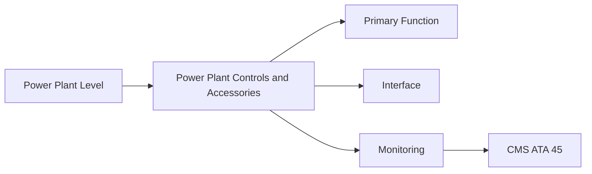
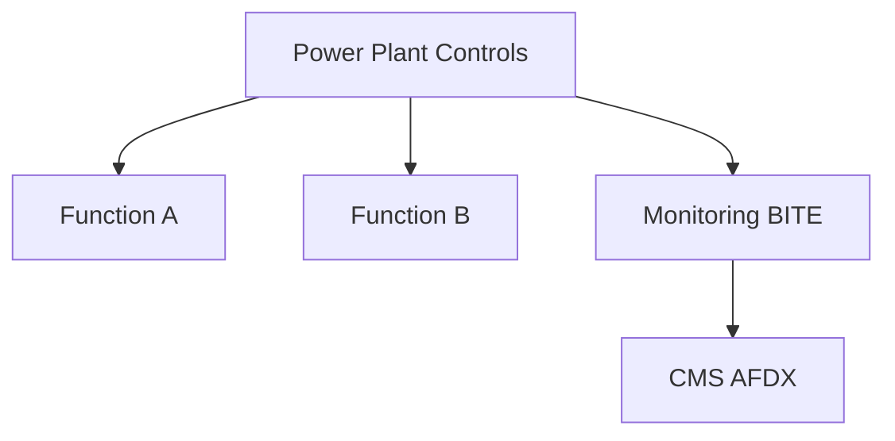

<!-- ──────────────────────────────────────────────────────────────────────────
     QATL-ATLAS-1000-ATLAS-060-069-062-040-POWER-PLANT-CONTROLS-AND-ACCESSORIES
     ATA 62 · Power Plant Controls and Accessories
     AMPEL360E eWTW — ATLAS Register 1000
────────────────────────────────────────────────────────────────────────────── -->

# Power Plant Controls and Accessories

---

## §0 Hyperlink Policy

> All hyperlinks in this document are **relative** (five directory levels: `../../../../../`).
> Absolute URLs are forbidden. Every linked document must exist in the Q+ATLANTIDE repository
> before the link is activated. Broken links are treated as open issues and must be resolved
> before the document is promoted from `DRAFT` to `APPROVED`.

---

## §1 Purpose

AMPEL360E power plant accessories include the FADEC, starter-generator, oil system components, ignition system, and associated LRUs installed on the engine accessory gearbox and in the nacelle accessory bay. All accessories interface with the aircraft via QEC connections at the installation split plane.

---

## §2 Applicability

| Parameter | Value |
|---|---|
| Aircraft Program | AMPEL360E eWTW |
| ATA reference | ATA 62-040 — Power Plant Controls and Accessories |
| Certification basis | EASA CS-25 Amdt 27+ |
| S1000D SNS | 062-040-00 |

---

## §3 Functional Description ![DRAFT]

System description for Power Plant Controls and Accessories within the AMPEL360E eWTW Power Plant architecture. See §3 Functional Description for technical detail.

---

## §4 Functional Breakdown

| ID | Name | Description | Lead Division |
|---|---|---|---|
| F-001 | Power Plant Controls and Accessories Function 1 | Primary system function | Q-GREENTECH |
| F-002 | Power Plant Controls and Accessories Function 2 | Secondary function | Q-MECHANICS |
| F-003 | Interface Management | Manage all system interfaces at QEC split plane | Q-MECHANICS / Q-AIR |

---

## §5 System Context — Mermaid Diagram

---

## §6 Internal Architecture — Mermaid Diagram

---

## §7 Components and LRUs

| Component | Part Number | Qty | Location | Maintenance Interval | Notes |
|---|---|---|---|---|---|
| FADEC unit | FADEC-PN-TBD | 1 per engine | Engine fan case accessories bay | On condition / BITE | DO-178C DAL A software |
| Starter-generator (combined) | SG-PN-TBD | 1 per engine | Accessory gearbox | On condition | Starting + generation; HVDC output |
| Accessory gearbox (AGB) | AGB-PN-TBD | 1 per engine | Fan case 6 o'clock | Overhaul cycle (OEM TBD) | Drives all engine accessories |
| Oil filter and chip detector | OilFilt-PN-TBD | 1 per engine | AGB oil system | On condition / replace at C-check | Metal particle detection |
| Fuel control unit (HMU) | HMU-PN-TBD | 1 per engine | Engine core accessories | On condition | Hydro-Mechanical Unit metering fuel |

---

## §8 Interfaces

| Interface Type | Connected System | Protocol / Medium | Data / Function |
|---|---|---|---|
| ATA 45 CMS | Central Maintenance | AFDX | Health data and BITE fault codes |
| ATA 24 Electrical | Power distribution | HVDC / 28 V DC | LRU power supply |
| ATA 26 Fire Protection | Fire zone | Fire detector loop | Fire monitoring |

---

## §9 Operating Modes

| Mode | Trigger | System State | Actions / Consequences |
|---|---|---|---|
| Normal operation | All systems powered | Nominal | Full function active |
| Maintenance | Systems isolated | Aircraft grounded | LOTO active; task in progress |
| Engine change (QEC) | Engine removal/installation | Heavy maintenance | QEC split plane open |

---

## §10 Performance and Budgets ![DRAFT]

| Parameter | Requirement | Target / Design Value | Status |
|---|---|---|---|
| System availability | ≥ 99.9 % dispatch reliability | RAMS analysis | TBD |
| Maintenance access time | < 5 min to first access | Maintainability analysis | TBD |

---

## §11 Safety, Redundancy and Fault Tolerance

- All work in the Power Plant Controls and Accessories area requires FADEC isolation and fuel system isolation before starting.
- Fire-zone materials in ATA 62 must meet CS-25 §25.1185 requirements; standard aircraft materials not permitted.
- Dual sign-off required for all engine mount and QEC tasks.

---

## §12 Maintenance and Diagnostics

| Task | Interval | Access | Special Tools |
|---|---|---|---|
| Scheduled inspection of Power Plant Controls and Accessories | C-check | Nacelle access | Inspection kit per AMM |
| BITE download for Power Plant Controls and Accessories | A-check | Maintenance terminal | CMS terminal |

---

## §13 Footprint — Physical, Electrical, Maintenance, Data ![TBD]

| Footprint Type | Parameter | Value | Notes |
|---|---|---|---|
| Physical | Mass (system total) | ![TBD] | Pending OEM data |
| Physical | Envelope (max) | ![TBD] | Pending detailed design |
| Electrical | Peak power (W) | ![TBD] | To be defined |
| Maintenance | Access category | Standard line maintenance | Per AMM |
| Data | AFDX bandwidth | ![TBD] | Per AFDX bus load analysis |

---

## §14 Safety and Certification References ![DRAFT]

| Standard / Document | Title | Issuing Body | Applicability |
|---|---|---|---|
| EASA CS-25 §25.1181 | Designated fire zones | EASA | Fire zone requirement |
| ATA iSpec 2200 | Chapter 62 — Power Plant | ATA | Chapter scope |
| DO-160G | Environmental conditions | RTCA | LRU environmental qualification |
| SAE AS7114 | Propulsion System Installation | SAE | Engine installation reference |
| ARINC 664 P7 | AFDX network | ARINC | Data bus standard |

---

## §15 V&V Approach ![TBD]

| Phase | Method | Acceptance Criterion | Status |
|---|---|---|---|
| Design | Analysis and simulation | Meets all §10 performance requirements | ![TBD] |
| Integration | Ground functional test | All BITE tests pass; interfaces verified | ![TBD] |
| Qualification | DO-160G environmental test | All applicable tests pass | ![TBD] |
| Certification | EASA CS-25 / CS-E compliance demonstration | Type Certificate / STC approval | ![TBD] |

---

## §16 Glossary

| Term | Definition |
|---|---|
| **QEC** | Quick Engine Change — the defined split plane for engine removal and installation. |
| **FADEC** | Full Authority Digital Engine Control — the engine computer governing all fuel and control functions. |
| **Fire zone** | Engine compartment area treated to CS-25 §25.1181 fire-resistance standards. |
| **CS-25 §25.1185** | EASA standard for fuel lines in fire zones. |
| **BREX** | Business Rules eXchange — project-specific S1000D rules. |
| **BITE** | Built-In Test Equipment — self-test functionality within an LRU. |
| **ACMF** | Aircraft Condition Monitoring Function — FADEC data recorder for in-service trending. |
| **EDIU** | Engine Data Interface Unit — gateway between engine FADEC bus and aircraft AFDX. |
| **LRU** | Line Replaceable Unit — a module designed for rapid removal and replacement. |
| **NPN** | Not Part Number — placeholder for components whose part numbers are not yet assigned. |

---

## §17 Open Issues

| ID | Description | Owner | Target |
|---|---|---|---|
| OI-062-040-001 | Finalise Power Plant Controls and Accessories design for AMPEL360E baseline (OEM data pending) | Q-MECHANICS | 2026-Q4 |

---

## §18 Status Legend

| Badge | Meaning |
|---|---|
| `![DRAFT]` | Section is drafted but not yet reviewed |
| `![TBD]` | Content not yet started — to be defined |
| `![To Be Completed]` | Partially complete — needs additional content |
| `![APPROVED]` | Reviewed and formally approved |

---

## §19 Related Documents (Siblings in this Subsection)

- [062-000](./062-000.md)
- [062-010](./062-010.md)
- [062-020](./062-020.md)
- [062-030](./062-030.md)
- [062-050](./062-050.md)
- [062-060](./062-060.md)
- [062-070](./062-070.md)
- [062-080](./062-080.md)
- [062-090](./062-090.md)

---

## §20 Change Log

| Rev | Date | Author | Description |
|---|---|---|---|
| 0.1 | 2026-05-11 | @copilot | Initial DRAFT — contextualized content per AMPEL360E eWTW architecture |
