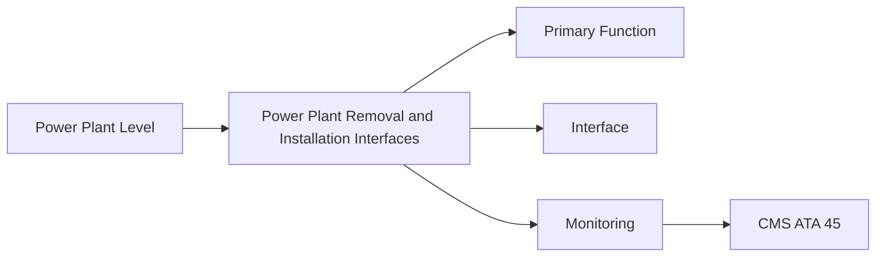
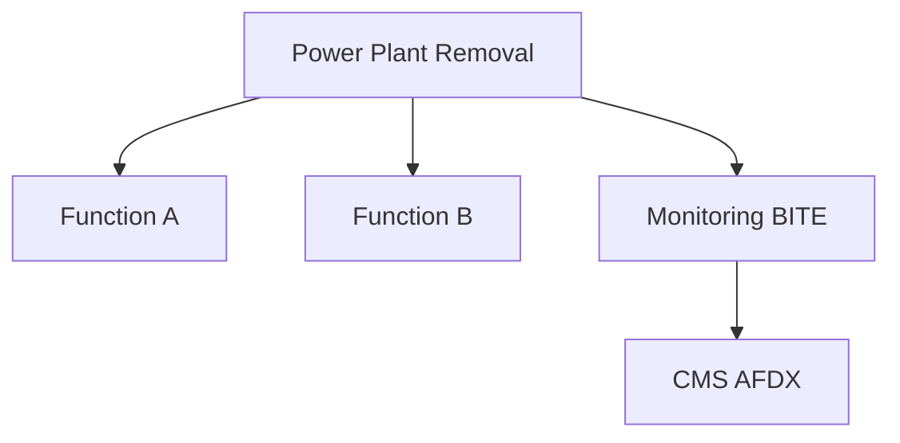

<!-- ──────────────────────────────────────────────────────────────────────────
     QATL-ATLAS-1000-ATLAS-060-069-062-070-POWER-PLANT-REMOVAL-AND-INSTALLATION-INTERFACES
     ATA 62 · Power Plant Removal and Installation Interfaces
     programme-defined aircraft type — ATLAS Register 1000
────────────────────────────────────────────────────────────────────────────── -->

# Power Plant Removal and Installation Interfaces

---

## §0 Hyperlink Policy

> All hyperlinks in this document are **relative** (five directory levels: `../../../../../`).
> Absolute URLs are forbidden. Every linked document must exist in the Q+ATLANTIDE repository
> before the link is activated. Broken links are treated as open issues and must be resolved
> before the document is promoted from `DRAFT` to `APPROVED`.

---

## §1 Purpose

This document defines the agnostic ATLAS standard-level architecture context for `Power Plant Removal and Installation Interfaces`.

It describes the controlled scope, functions, interfaces, safety considerations, lifecycle traceability, and S1000D/CSDB mapping logic that programme implementations shall instantiate when this node is applicable.

This document is not a programme design baseline. Programme-specific capacities, locations, part numbers, effectivity, operating limits, maintenance references, and data module codes shall be defined only inside the applicable programme implementation branch.
## §2 Applicability

| Applicability Level | Rule |
|---|---|
| Standard taxonomy | Applies to the ATLAS node `062` |
| Programme implementation | Conditional; determined by programme architecture, trade studies, certification basis, and applicability model |
| Product configuration | Defined in the programme-specific configuration baseline |
| Effectivity | Defined in the programme CSDB / applicability layer |
| Non-applicability | Must be explicitly stated in the programme impact-study branch when excluded |
## §3 Functional Description ![DRAFT]

System description for Power Plant Removal and Installation Interfaces within the programme-defined aircraft type Power Plant architecture. See §3 Functional Description for technical detail.

---

## §4 Functional Breakdown

| ID | Name | Description | Lead Division |
|---|---|---|---|
| F-001 | Power Plant Removal and Installation Interfaces Function 1 | Primary system function | Q-GREENTECH |
| F-002 | Power Plant Removal and Installation Interfaces Function 2 | Secondary function | Q-MECHANICS |
| F-003 | Interface Management | Manage all system interfaces at QEC split plane | Q-MECHANICS / Q-AIR |

---

## §5 System Context — Mermaid Diagram

---

## §6 Internal Architecture — Mermaid Diagram

---

## §7 Components and LRUs

| Component | Part Number | Qty | Location | Maintenance Interval | Notes |
|---|---|---|---|---|---|
| QEC ICD (document) | ICD-062-QEC-001 | Programme document | QMS / engineering record | Update at each design change | Defines all interface connections |
| QEC fuel disconnects (self-sealing) | FuelDisc-PN-TBD | 2 per engine (supply + return) | QEC split plane | Leak test after each QEC event | Self-sealing; no fuel spill |
| QEC oil supply disconnect | OilDisc-PN-TBD | 1 per engine | QEC split plane | Inspect O-ring at each QEC | Engine/airframe oil interface |
| QEC electrical connector set | ElecDisc-PN-TBD — multi-pin | Per engine (10 connectors TBD) | QEC split plane | Inspect pins at each QEC | All engine LRU power and data |
| QEC bleed-air connectors | N/A — bleed-less [PROGRAMME-VARIANT] | 0 | Not applicable | N/A | No bleed air interface on [PROGRAMME-AIRCRAFT] |

---

## §8 Interfaces

| Interface Type | Connected System | Protocol / Medium | Data / Function |
|---|---|---|---|
| ATA 45 CMS | Central Maintenance | AFDX | Health data and BITE fault codes |
| ATA 24 Electrical | Power distribution | HVDC / 28 V DC | LRU power supply |
| ATA 26 Fire Protection | Fire zone | Fire detector loop | Fire monitoring |

---

## §9 Operating Modes

| Mode | Trigger | System State | Actions / Consequences |
|---|---|---|---|
| Normal operation | All systems powered | Nominal | Full function active |
| Maintenance | Systems isolated | Aircraft grounded | LOTO active; task in progress |
| Engine change (QEC) | Engine removal/installation | Heavy maintenance | QEC split plane open |

---

## §10 Performance and Budgets ![DRAFT]

| Parameter | Requirement | Target / Design Value | Status |
|---|---|---|---|
| System availability | ≥ 99.9 % dispatch reliability | RAMS analysis | TBD |
| Maintenance access time | < 5 min to first access | Maintainability analysis | TBD |

---

## §11 Safety, Redundancy and Fault Tolerance

- All work in the Power Plant Removal and Installation Interfaces area requires FADEC isolation and fuel system isolation before starting.
- Fire-zone materials in ATA 62 must meet CS-25 §25.1185 requirements; standard aircraft materials not permitted.
- Dual sign-off required for all engine mount and QEC tasks.

---

## §12 Maintenance and Diagnostics

| Task | Interval | Access | Special Tools |
|---|---|---|---|
| Scheduled inspection of Power Plant Removal and Installation Interfaces | C-check | Nacelle access | Inspection kit per AMM |
| BITE download for Power Plant Removal and Installation Interfaces | A-check | Maintenance terminal | CMS terminal |

---

## §13 Footprint — Physical, Electrical, Maintenance, Data ![TBD]

| Footprint Type | Parameter | Value | Notes |
|---|---|---|---|
| Physical | Mass (system total) | ![TBD] | Pending OEM data |
| Physical | Envelope (max) | ![TBD] | Pending detailed design |
| Electrical | Peak power (W) | ![TBD] | To be defined |
| Maintenance | Access category | Standard line maintenance | Per AMM |
| Data | AFDX bandwidth | ![TBD] | Per AFDX bus load analysis |

---

## §14 Safety and Certification References ![DRAFT]

| Standard / Document | Title | Issuing Body | Applicability |
|---|---|---|---|
| EASA CS-25 §25.1181 | Designated fire zones | EASA | Fire zone requirement |
| ATA iSpec 2200 | Chapter 62 — Power Plant | ATA | Chapter scope |
| DO-160G | Environmental conditions | RTCA | LRU environmental qualification |
| SAE AS7114 | Propulsion System Installation | SAE | Engine installation reference |
| ARINC 664 P7 | AFDX network | ARINC | Data bus standard |

---

## §15 V&V Approach ![TBD]

| Phase | Method | Acceptance Criterion | Status |
|---|---|---|---|
| Design | Analysis and simulation | Meets all §10 performance requirements | ![TBD] |
| Integration | Ground functional test | All BITE tests pass; interfaces verified | ![TBD] |
| Qualification | DO-160G environmental test | All applicable tests pass | ![TBD] |
| Certification | EASA CS-25 / CS-E compliance demonstration | Type Certificate / STC approval | ![TBD] |

---

## §16 Glossary

| Term | Definition |
|---|---|
| **QEC** | Quick Engine Change — the defined split plane for engine removal and installation. |
| **FADEC** | Full Authority Digital Engine Control — the engine computer governing all fuel and control functions. |
| **Fire zone** | Engine compartment area treated to CS-25 §25.1181 fire-resistance standards. |
| **CS-25 §25.1185** | EASA standard for fuel lines in fire zones. |
| **BREX** | Business Rules eXchange — project-specific S1000D rules. |
| **BITE** | Built-In Test Equipment — self-test functionality within an LRU. |
| **ACMF** | Aircraft Condition Monitoring Function — FADEC data recorder for in-service trending. |
| **EDIU** | Engine Data Interface Unit — gateway between engine FADEC bus and aircraft AFDX. |
| **LRU** | Line Replaceable Unit — a module designed for rapid removal and replacement. |
| **NPN** | Not Part Number — placeholder for components whose part numbers are not yet assigned. |

---

## §17 Open Issues

| ID | Description | Owner | Target |
|---|---|---|---|
| OI-062-070-001 | Finalise Power Plant Removal and Installation Interfaces design for [PROGRAMME-AIRCRAFT] baseline (OEM data pending) | Q-MECHANICS | 2026-Q4 |

---

## §18 Status Legend

| Badge | Meaning |
|---|---|
| `![DRAFT]` | Section is drafted but not yet reviewed |
| `![TBD]` | Content not yet started — to be defined |
| `![To Be Completed]` | Partially complete — needs additional content |
| `![APPROVED]` | Reviewed and formally approved |

---

## §19 Related Documents (Siblings in this Subsection)

- [062-000](./062-000.md)
- [062-010](./062-010.md)
- [062-020](./062-020.md)
- [062-030](./062-030.md)
- [062-040](./062-040.md)
- [062-050](./062-050.md)
- [062-060](./062-060.md)
- [062-080](./062-080.md)
- [062-090](./062-090.md)

---

## §20 Change Log

| Rev | Date | Author | Description |
|---|---|---|---|
| 0.1 | 2026-05-11 | @copilot | Initial DRAFT — contextualized content per programme-defined aircraft type architecture |
