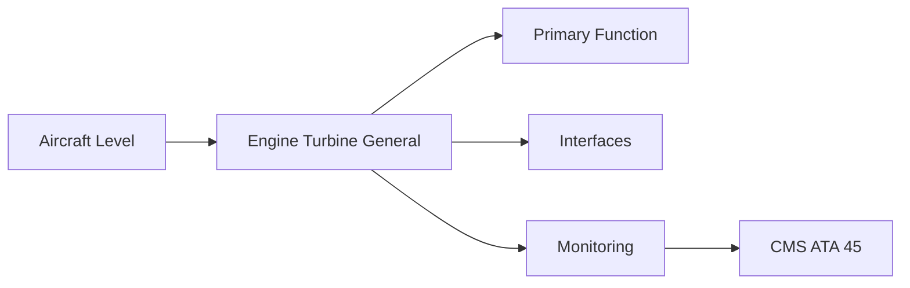
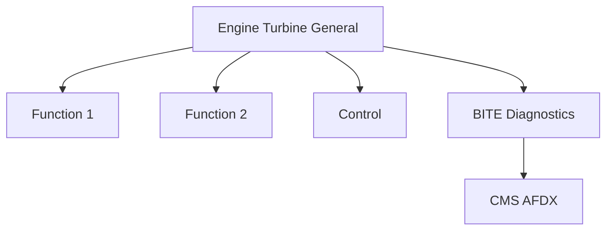

<!-- ──────────────────────────────────────────────────────────────────────────
     QATL-ATLAS-1000-ATLAS-060-069-063-000-ENGINE-TURBINE-GENERAL
     ATA 63 · Engine Turbine General
     AMPEL360E eWTW — ATLAS Register 1000
────────────────────────────────────────────────────────────────────────────── -->

# Engine Turbine General

---

## §0 Hyperlink Policy

> All hyperlinks in this document are **relative** (five directory levels: `../../../../../`).
> Absolute URLs are forbidden. Every linked document must exist in the Q+ATLANTIDE repository
> before the link is activated. Broken links are treated as open issues and must be resolved
> before the document is promoted from `DRAFT` to `APPROVED`.

---

## §1 Purpose

ATA Chapter 63 covers the gas turbine engine core — the high-energy thermodynamic machine converting fuel chemical energy into shaft power and exhaust thrust. The AMPEL360E eWTW baseline is a two-spool high-bypass turbofan. The chapter defines the core architecture, performance envelope, and maintenance philosophy for the engine as a certified product installed on the aircraft.

The engine is certified as a product under EASA CS-E; the aircraft interface is defined by the QEC ICD (ATA 62). The SAF compatibility requirement mandates 100 % ASTM D7566 Annex A fuel from first delivery, with no materials or sealants that are incompatible with high-aromatic SAF blends.

---

## §2 Applicability

| Parameter | Value |
|---|---|
| Aircraft Program | AMPEL360E eWTW |
| ATA reference | ATA 63-000 — Engine Turbine General |
| Certification basis | EASA CS-25 Amdt 27+ |
| S1000D SNS | 063-000-00 |

---

## §3 Functional Description ![DRAFT]

Two-spool high-bypass turbofan architecture:
- **Fan**: single-stage wide-chord; bypass ratio > 8:1.
- **LPC/Booster**: 3–4 axial stages, driven by LPT.
- **HPC**: 8–10 axial stages with VSVs, driven by HPT.
- **Combustor**: annular lean-burn, SAF-compatible.
- **HPT**: 1–2 stages, single-crystal blades.
- **LPT**: 5–7 stages, drives fan + LPC.
- **Exhaust**: fixed-convergent core nozzle; bypass duct nozzle.

---

## §4 Functional Breakdown

| ID | Name | Description | Lead Division |
|---|---|---|---|
| F-001 | Fan assembly (wide-chord) | Primary function | Q-GREENTECH |
| F-002 | System integration | Interface management | Q-MECHANICS |
| F-003 | Monitoring | BITE and health data | Q-AIR |

---

## §5 System Context — Mermaid Diagram

---

## §6 Internal Architecture — Mermaid Diagram

---

## §7 Components and LRUs

| Component | Part Number | Qty | Location | Maintenance Interval | Notes |
|---|---|---|---|---|---|
| Fan assembly (wide-chord) | Fan-PN-TBD | 1 per engine | Fan case front | On condition / OEM overhaul | LCF life-limited; cycle tracking mandatory |
| HPC disc set (stages 1–10) | HPC-Disc-PN-TBD | 1 set per engine | HPC rotor | OEM LLP cycle limit | LLP — tracked individually per stage |
| HPT blade set (SX) | HPT-Blade-PN-TBD | 1 set per engine | HPT rotor | On condition / hot-section inspect | Single-crystal; TBC-coated; LLP for LCF |
| Annular combustor liner | Combust-PN-TBD | 1 per engine | HPC exit / HPT inlet | Borescope at C-check | TBC-coated; SAF-compatible fuel nozzles |
| LP turbine module | LPT-PN-TBD | 1 per engine | Engine aft core | OEM overhaul cycle | Drives fan + LPC; LPT discs are LLPs |

---

## §8 Interfaces

| Interface Type | Connected System | Protocol / Medium | Data / Function |
|---|---|---|---|
| ATA 45 CMS | Central Maintenance System | AFDX ARINC 664 P7 | BITE faults and health data |
| ATA 24 Electrical Power | Power distribution | HVDC / 28 V DC | LRU power supply |
| ATA 67 Engine Controls | FADEC | ARINC 429 / AFDX | Control commands and feedback |
| ATA 31 ECAM | Cockpit display | AFDX | Crew indication and alerts |

---

## §9 Operating Modes

| Mode | Trigger | System State | Actions / Consequences |
|---|---|---|---|
| Normal operation | Aircraft/engine powered | Nominal | Full function active |
| Engine shutdown | Commanded or fault | FADEC stops fuel | System de-energised |
| Maintenance | Isolated | Aircraft grounded | LOTO active |
| Ground test | Post-maintenance | Engine on ground | Test pass before service |

---

## §10 Performance and Budgets ![DRAFT]

| Parameter | Requirement | Target / Design Value | Status |
|---|---|---|---|
| System availability | ≥ 99.9 % dispatch | RAMS analysis | TBD |
| BITE fault detection | ≥ 80 % coverage | BITE design analysis | TBD |

---

## §11 Safety, Redundancy and Fault Tolerance

- All Engine Turbine General maintenance requires FADEC and fuel system isolation before starting.
- Safety-critical fastener torques require calibrated tooling and dual sign-off.
- BITE failures affecting Engine Turbine General dispatch must be resolved or deferred per approved MEL.

---

## §12 Maintenance and Diagnostics

| Task | Interval | Access | Special Tools |
|---|---|---|---|
| Scheduled Engine Turbine General inspection | C-check | Per AMM access | NDT and inspection kit |
| BITE log review and download | A-check | Maintenance terminal | CMS terminal |
| Engine Turbine General functional test after LRU replacement | After LRU change | Ground run | FADEC GSE |

---

## §13 Footprint — Physical, Electrical, Maintenance, Data ![TBD]

| Footprint Type | Parameter | Value | Notes |
|---|---|---|---|
| Physical | Mass (system total) | ![TBD] | Pending OEM data |
| Physical | Envelope (max) | ![TBD] | Pending detailed design |
| Electrical | Peak power (W) | ![TBD] | To be defined |
| Maintenance | Access category | Standard line maintenance | Per AMM |
| Data | AFDX bandwidth | ![TBD] | Per AFDX bus load analysis |

---

## §14 Safety and Certification References ![DRAFT]

| Standard / Document | Title | Issuing Body | Applicability |
|---|---|---|---|
| EASA CS-E | Airworthiness Standards for Engines | EASA | Engine type certification basis |
| ASTM D7566 | Standard Specification for Aviation Turbine Fuel Containing Synthesized Hydrocarbons | ASTM | SAF compatibility |
| SAE ARP1179 | Aircraft Gas Turbine Engine Monitoring Systems | SAE International | Engine monitoring reference |
| ATA iSpec 2200 | Chapter 63 — Engine Turbine | ATA | ATA chapter scope |
| DO-160G | Environmental Conditions and Test Procedures | RTCA | Engine LRU environmental qualification |

---

## §15 V&V Approach ![TBD]

| Phase | Method | Acceptance Criterion | Status |
|---|---|---|---|
| Design | Analysis and simulation | Meets all §10 performance requirements | ![TBD] |
| Integration | Ground functional test | All BITE tests pass; interfaces verified | ![TBD] |
| Qualification | DO-160G environmental test | All applicable tests pass | ![TBD] |
| Certification | EASA CS-25 / CS-E compliance demonstration | Type Certificate / STC approval | ![TBD] |

---

## §16 Glossary

| Term | Definition |
|---|---|
| **SAF** | Sustainable Aviation Fuel — ASTM D7566 qualified; 100 % compatibility from first delivery. |
| **LCF** | Low Cycle Fatigue — fatigue from each engine start/shutdown cycle; dictates disc and fan blade LLP limits. |
| **LLP** | Life-Limited Part — component with mandatory retirement limit in the engine Type Certificate. |
| **HPT** | High-Pressure Turbine — single/twin stage; hottest most highly stressed rotating component. |
| **LPT** | Low-Pressure Turbine — multi-stage; drives fan and LPC spool. |
| **Borescope inspection** | NDT using flexible endoscope through access ports to inspect hot-section without disassembly. |
| **DS casting** | Directionally Solidified — turbine blade with columnar grain for improved creep resistance. |
| **TBC** | Thermal Barrier Coating — ceramic insulating coating on HPT blades and combustor. |
| **Annular combustor** | Full-annular combustor; uniform circumferential temperature profile; lower NOx than can-annular. |
| **HPC** | High-Pressure Compressor — multi-stage axial; raises cycle pressure ratio; driven by HPT. |

---

## §17 Open Issues

| ID | Description | Owner | Target |
|---|---|---|---|
| OI-063-000-001 | Finalise Engine Turbine General design with engine OEM | Q-MECHANICS | 2026-Q4 |
| OI-063-000-002 | Define BITE coverage for Engine Turbine General | Q-AIR / safety | 2027-Q1 |

---

## §18 Status Legend

| Badge | Meaning |
|---|---|
| `![DRAFT]` | Section is drafted but not yet reviewed |
| `![TBD]` | Content not yet started — to be defined |
| `![To Be Completed]` | Partially complete — needs additional content |
| `![APPROVED]` | Reviewed and formally approved |

---

## §19 Related Documents (Siblings in this Subsection)

- [063-010](./063-010.md)
- [063-020](./063-020.md)
- [063-030](./063-030.md)
- [063-040](./063-040.md)
- [063-050](./063-050.md)
- [063-060](./063-060.md)
- [063-070](./063-070.md)
- [063-080](./063-080.md)
- [063-090](./063-090.md)

---

## §20 Change Log

| Rev | Date | Author | Description |
|---|---|---|---|
| 0.1 | 2026-05-11 | @copilot | Initial DRAFT — contextualized content per AMPEL360E eWTW architecture |
