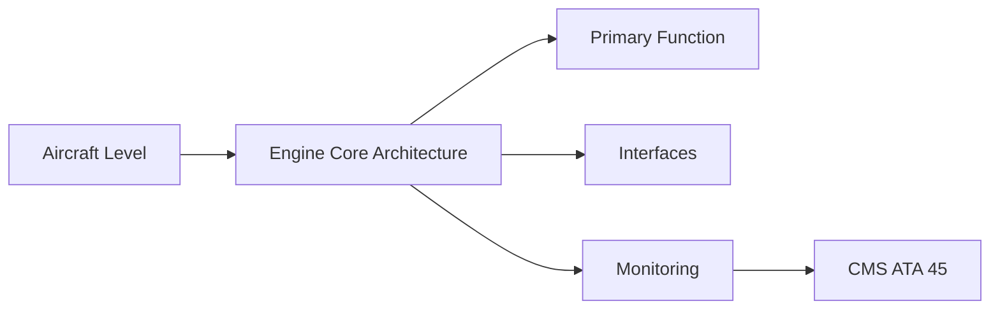
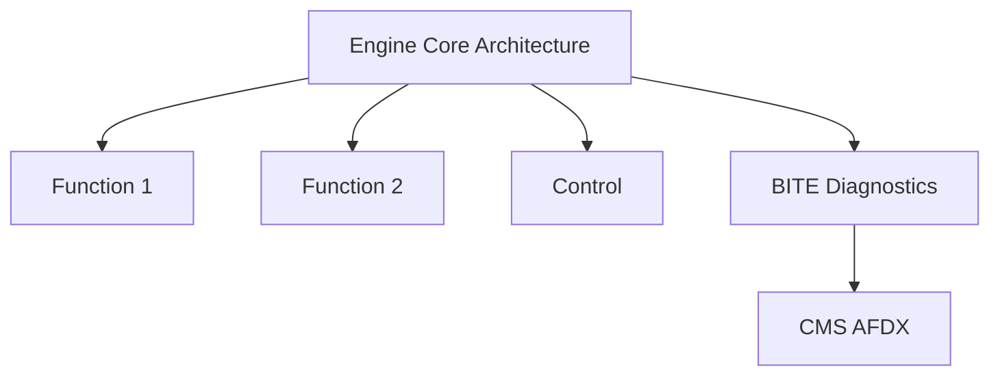

<!-- ──────────────────────────────────────────────────────────────────────────
     QATL-ATLAS-1000-ATLAS-060-069-063-010-ENGINE-CORE-ARCHITECTURE
     ATA 63 · Engine Core Architecture
     programme-defined aircraft type — ATLAS Register 1000
────────────────────────────────────────────────────────────────────────────── -->

# Engine Core Architecture

---

## §0 Hyperlink Policy

> All hyperlinks in this document are **relative** (five directory levels: `../../../../../`).
> Absolute URLs are forbidden. Every linked document must exist in the Q+ATLANTIDE repository
> before the link is activated. Broken links are treated as open issues and must be resolved
> before the document is promoted from `DRAFT` to `APPROVED`.

---

## §1 Purpose

This document defines the agnostic ATLAS standard-level architecture context for `Engine Core Architecture`.

It describes the controlled scope, functions, interfaces, safety considerations, lifecycle traceability, and S1000D/CSDB mapping logic that programme implementations shall instantiate when this node is applicable.

This document is not a programme design baseline. Programme-specific capacities, locations, part numbers, effectivity, operating limits, maintenance references, and data module codes shall be defined only inside the applicable programme implementation branch.
## §2 Applicability

| Applicability Level | Rule |
|---|---|
| Standard taxonomy | Applies to the ATLAS node `063` |
| Programme implementation | Conditional; determined by programme architecture, trade studies, certification basis, and applicability model |
| Product configuration | Defined in the programme-specific configuration baseline |
| Effectivity | Defined in the programme CSDB / applicability layer |
| Non-applicability | Must be explicitly stated in the programme impact-study branch when excluded |
## §3 Functional Description ![DRAFT]

Two-spool turbofan core architecture provides module-based maintenance with defined split lines at fan/LPC module, HPC module, combustor+HPT module, and LPT module. Bearing frame positions (fan frame, HPC front frame, turbine rear frame) define the structural load path from rotor to stator and to the engine mounts.

---

## §4 Functional Breakdown

| ID | Name | Description | Lead Division |
|---|---|---|---|
| F-001 | Fan frame (forward bearing support) | Primary function | Q-GREENTECH |
| F-002 | System integration | Interface management | Q-MECHANICS |
| F-003 | Monitoring | BITE and health data | Q-AIR |

---

## §5 System Context — Mermaid Diagram

---

## §6 Internal Architecture — Mermaid Diagram

---

## §7 Components and LRUs

| Component | Part Number | Qty | Location | Maintenance Interval | Notes |
|---|---|---|---|---|---|
| Fan frame (forward bearing support) | FanFrame-PN-TBD | 1 per engine | Fan case inlet | Inspect at fan removal | Structural load path; No.1+2 bearings |
| High-pressure rotor (HPC+HPT) | HP-Rotor-PN-TBD | 1 per engine | Engine core centre | OEM overhaul cycle | LLP — HPC discs life-limited per stage |
| Low-pressure rotor (Fan+LPC+LPT) | LP-Rotor-PN-TBD | 1 per engine | Engine inner annulus | OEM overhaul cycle | Fan life-limited; LPT discs LLP |
| Turbine rear frame | TRF-PN-TBD | 1 per engine | LPT exit | Inspect at LPT removal | Structural; No.5 bearing support |
| Core casing (inter-spool) | CoreCas-PN-TBD | 1 per engine | HPC outer annulus | Inspect at HPC removal | Pressure casing; VSV actuator attachment |

---

## §8 Interfaces

| Interface Type | Connected System | Protocol / Medium | Data / Function |
|---|---|---|---|
| ATA 45 CMS | Central Maintenance System | AFDX ARINC 664 P7 | BITE faults and health data |
| ATA 24 Electrical Power | Power distribution | HVDC / 28 V DC | LRU power supply |
| ATA 67 Engine Controls | FADEC | ARINC 429 / AFDX | Control commands and feedback |
| ATA 31 ECAM | Cockpit display | AFDX | Crew indication and alerts |

---

## §9 Operating Modes

| Mode | Trigger | System State | Actions / Consequences |
|---|---|---|---|
| Normal operation | Aircraft/engine powered | Nominal | Full function active |
| Engine shutdown | Commanded or fault | FADEC stops fuel | System de-energised |
| Maintenance | Isolated | Aircraft grounded | LOTO active |
| Ground test | Post-maintenance | Engine on ground | Test pass before service |

---

## §10 Performance and Budgets ![DRAFT]

| Parameter | Requirement | Target / Design Value | Status |
|---|---|---|---|
| System availability | ≥ 99.9 % dispatch | RAMS analysis | TBD |
| BITE fault detection | ≥ 80 % coverage | BITE design analysis | TBD |

---

## §11 Safety, Redundancy and Fault Tolerance

- All Engine Core Architecture maintenance requires FADEC and fuel system isolation before starting.
- Safety-critical fastener torques require calibrated tooling and dual sign-off.
- BITE failures affecting Engine Core Architecture dispatch must be resolved or deferred per approved MEL.

---

## §12 Maintenance and Diagnostics

| Task | Interval | Access | Special Tools |
|---|---|---|---|
| Scheduled Engine Core Architecture inspection | C-check | Per AMM access | NDT and inspection kit |
| BITE log review and download | A-check | Maintenance terminal | CMS terminal |
| Engine Core Architecture functional test after LRU replacement | After LRU change | Ground run | FADEC GSE |

---

## §13 Footprint — Physical, Electrical, Maintenance, Data ![TBD]

| Footprint Type | Parameter | Value | Notes |
|---|---|---|---|
| Physical | Mass (system total) | ![TBD] | Pending OEM data |
| Physical | Envelope (max) | ![TBD] | Pending detailed design |
| Electrical | Peak power (W) | ![TBD] | To be defined |
| Maintenance | Access category | Standard line maintenance | Per AMM |
| Data | AFDX bandwidth | ![TBD] | Per AFDX bus load analysis |

---

## §14 Safety and Certification References ![DRAFT]

| Standard / Document | Title | Issuing Body | Applicability |
|---|---|---|---|
| EASA CS-E | Airworthiness Standards for Engines | EASA | Certification basis |
| SAE AS1360 | Gas Turbine Engine Core Architecture | SAE International | Core design reference |
| SAE ARP1309 | Gas Turbine Engine Overhaul Maintenance | SAE International | Module overhaul concept |
| ATA iSpec 2200 | Chapter 63 — Engine Turbine | ATA | ATA chapter scope |
| DO-160G | Environmental Conditions and Test Procedures | RTCA | Engine case sensor qualification |

---

## §15 V&V Approach ![TBD]

| Phase | Method | Acceptance Criterion | Status |
|---|---|---|---|
| Design | Analysis and simulation | Meets all §10 performance requirements | ![TBD] |
| Integration | Ground functional test | All BITE tests pass; interfaces verified | ![TBD] |
| Qualification | DO-160G environmental test | All applicable tests pass | ![TBD] |
| Certification | EASA CS-25 / CS-E compliance demonstration | Type Certificate / STC approval | ![TBD] |

---

## §16 Glossary

| Term | Definition |
|---|---|
| **Two-spool architecture** | Independent HP and LP shafts each driven by their own turbine stage. |
| **Module approach** | Engine sub-assemblies (modules) replaceable without full overhaul. |
| **Bearing frame** | Structural frame housing a rotor bearing; transmits rotor loads to engine case. |
| **VSV** | Variable Stator Vane — adjustable angle HPC stator; FADEC-scheduled for surge margin. |
| **TRF** | Turbine Rear Frame — structural aft frame housing No.5 bearing and aft mount attachment. |
| **HP rotor** | HPC disc stack + HPT disc; rotates faster than LP rotor. |
| **LP rotor** | Fan + LPC stages + LPT stages; rotates slower than HP rotor. |
| **Module split line** | Assembly joint at which a module can be separated for replacement. |
| **Intercase** | Casing between HPC exit and combustor entry; combustor and HPT mounting surface. |
| **OPR** | Overall Pressure Ratio — ratio of inlet to HPC exit total pressure; key thermodynamic parameter. |

---

## §17 Open Issues

| ID | Description | Owner | Target |
|---|---|---|---|
| OI-063-010-001 | Finalise Engine Core Architecture design with engine OEM | Q-MECHANICS | 2026-Q4 |
| OI-063-010-002 | Define BITE coverage for Engine Core Architecture | Q-AIR / safety | 2027-Q1 |

---

## §18 Status Legend

| Badge | Meaning |
|---|---|
| `![DRAFT]` | Section is drafted but not yet reviewed |
| `![TBD]` | Content not yet started — to be defined |
| `![To Be Completed]` | Partially complete — needs additional content |
| `![APPROVED]` | Reviewed and formally approved |

---

## §19 Related Documents (Siblings in this Subsection)

- [063-000](./063-000.md)
- [063-020](./063-020.md)
- [063-030](./063-030.md)
- [063-040](./063-040.md)
- [063-050](./063-050.md)
- [063-060](./063-060.md)
- [063-070](./063-070.md)
- [063-080](./063-080.md)
- [063-090](./063-090.md)

---

## §20 Change Log

| Rev | Date | Author | Description |
|---|---|---|---|
| 0.1 | 2026-05-11 | @copilot | Initial DRAFT — contextualized content per programme-defined aircraft type architecture |
