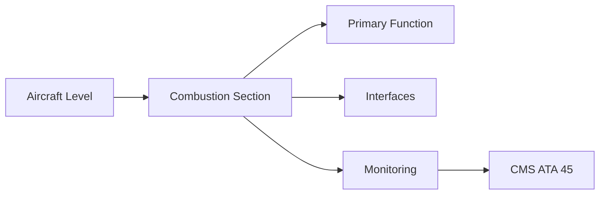
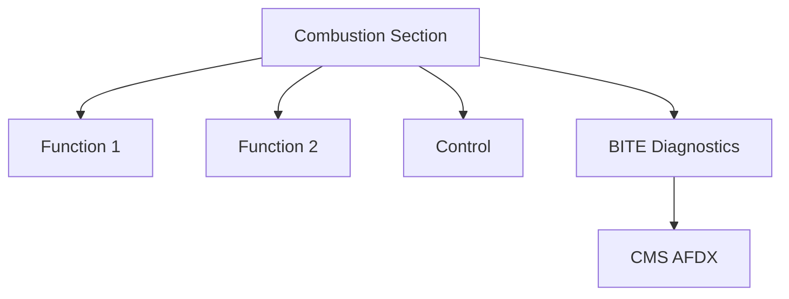

<!-- ──────────────────────────────────────────────────────────────────────────
     QATL-ATLAS-1000-ATLAS-060-069-063-030-COMBUSTION-SECTION
     ATA 63 · Combustion Section
     programme-defined aircraft type — ATLAS Register 1000
────────────────────────────────────────────────────────────────────────────── -->

# Combustion Section

---

## §0 Hyperlink Policy

> All hyperlinks in this document are **relative** (five directory levels: `../../../../../`).
> Absolute URLs are forbidden. Every linked document must exist in the Q+ATLANTIDE repository
> before the link is activated. Broken links are treated as open issues and must be resolved
> before the document is promoted from `DRAFT` to `APPROVED`.

---

## §1 Purpose

This document defines the agnostic ATLAS standard-level architecture context for `Combustion Section`.

It describes the controlled scope, functions, interfaces, safety considerations, lifecycle traceability, and S1000D/CSDB mapping logic that programme implementations shall instantiate when this node is applicable.

This document is not a programme design baseline. Programme-specific capacities, locations, part numbers, effectivity, operating limits, maintenance references, and data module codes shall be defined only inside the applicable programme implementation branch.
## §2 Applicability

| Applicability Level | Rule |
|---|---|
| Standard taxonomy | Applies to the ATLAS node `063` |
| Programme implementation | Conditional; determined by programme architecture, trade studies, certification basis, and applicability model |
| Product configuration | Defined in the programme-specific configuration baseline |
| Effectivity | Defined in the programme CSDB / applicability layer |
| Non-applicability | Must be explicitly stated in the programme impact-study branch when excluded |
## §3 Functional Description ![DRAFT]

Single annular combustor (SAC) with lean-burn fuel injection (TAPS or multipoint). Designed for 100 % SAF compatibility from day one. Combustor liner: nickel superalloy with TBC. 20–24 fuel nozzles with dual pilot/main circuits for NOx reduction. Must meet ICAO CAEP/11 NOx limits.

---

## §4 Functional Breakdown

| ID | Name | Description | Lead Division |
|---|---|---|---|
| F-001 | Annular combustor liner | Primary function | Q-GREENTECH |
| F-002 | System integration | Interface management | Q-MECHANICS |
| F-003 | Monitoring | BITE and health data | Q-AIR |

---

## §5 System Context — Mermaid Diagram

---

## §6 Internal Architecture — Mermaid Diagram

---

## §7 Components and LRUs

| Component | Part Number | Qty | Location | Maintenance Interval | Notes |
|---|---|---|---|---|---|
| Annular combustor liner | CombLiner-PN-TBD | 1 per engine | HP turbine inlet | Borescope at C-check | TBC-coated nickel alloy; SAF-compatible |
| Fuel nozzle assembly (lean-burn) | FuelNoz-PN-TBD | 20–24 per engine | Combustor front face | Replace on condition / OEM interval | SAF-compatible; TAPS or multipoint |
| Combustor outer casing | CombCase-PN-TBD | 1 per engine | Combustor outer annulus | Inspect at module removal | Pressure boundary; dilution hole pattern |
| T41 thermocouple (HPT inlet temperature) | T41-TC-PN-TBD | Multiple per engine | HPT NGV platform | On condition / calibration | Key FADEC limit parameter |
| Igniter plug (2× per combustor) | Ign-PN-TBD | 2 per engine | Combustor igniter ports (4 and 8 o'clock) | On condition / ATA 65 interval | Spark ignition for start and relight |

---

## §8 Interfaces

| Interface Type | Connected System | Protocol / Medium | Data / Function |
|---|---|---|---|
| ATA 45 CMS | Central Maintenance System | AFDX ARINC 664 P7 | BITE faults and health data |
| ATA 24 Electrical Power | Power distribution | HVDC / 28 V DC | LRU power supply |
| ATA 67 Engine Controls | FADEC | ARINC 429 / AFDX | Control commands and feedback |
| ATA 31 ECAM | Cockpit display | AFDX | Crew indication and alerts |

---

## §9 Operating Modes

| Mode | Trigger | System State | Actions / Consequences |
|---|---|---|---|
| Normal operation | Aircraft/engine powered | Nominal | Full function active |
| Engine shutdown | Commanded or fault | FADEC stops fuel | System de-energised |
| Maintenance | Isolated | Aircraft grounded | LOTO active |
| Ground test | Post-maintenance | Engine on ground | Test pass before service |

---

## §10 Performance and Budgets ![DRAFT]

| Parameter | Requirement | Target / Design Value | Status |
|---|---|---|---|
| System availability | ≥ 99.9 % dispatch | RAMS analysis | TBD |
| BITE fault detection | ≥ 80 % coverage | BITE design analysis | TBD |

---

## §11 Safety, Redundancy and Fault Tolerance

- All Combustion Section maintenance requires FADEC and fuel system isolation before starting.
- Safety-critical fastener torques require calibrated tooling and dual sign-off.
- BITE failures affecting Combustion Section dispatch must be resolved or deferred per approved MEL.

---

## §12 Maintenance and Diagnostics

| Task | Interval | Access | Special Tools |
|---|---|---|---|
| Scheduled Combustion Section inspection | C-check | Per AMM access | NDT and inspection kit |
| BITE log review and download | A-check | Maintenance terminal | CMS terminal |
| Combustion Section functional test after LRU replacement | After LRU change | Ground run | FADEC GSE |

---

## §13 Footprint — Physical, Electrical, Maintenance, Data ![TBD]

| Footprint Type | Parameter | Value | Notes |
|---|---|---|---|
| Physical | Mass (system total) | ![TBD] | Pending OEM data |
| Physical | Envelope (max) | ![TBD] | Pending detailed design |
| Electrical | Peak power (W) | ![TBD] | To be defined |
| Maintenance | Access category | Standard line maintenance | Per AMM |
| Data | AFDX bandwidth | ![TBD] | Per AFDX bus load analysis |

---

## §14 Safety and Certification References ![DRAFT]

| Standard / Document | Title | Issuing Body | Applicability |
|---|---|---|---|
| EASA CS-E §810 | Combustion system standards | EASA | Combustor certification |
| ICAO Annex 16 Vol II CAEP/11 | NOx emission standards | ICAO | NOx compliance |
| ASTM D7566 | SAF specification | ASTM | 100 % SAF compatibility |
| SAE ARP1491 | Gas Turbine Combustion System | SAE International | Combustor design reference |
| ATA iSpec 2200 | Chapter 63 | ATA | ATA chapter scope |

---

## §15 V&V Approach ![TBD]

| Phase | Method | Acceptance Criterion | Status |
|---|---|---|---|
| Design | Analysis and simulation | Meets all §10 performance requirements | ![TBD] |
| Integration | Ground functional test | All BITE tests pass; interfaces verified | ![TBD] |
| Qualification | DO-160G environmental test | All applicable tests pass | ![TBD] |
| Certification | EASA CS-25 / CS-E compliance demonstration | Type Certificate / STC approval | ![TBD] |

---

## §16 Glossary

| Term | Definition |
|---|---|
| **SAF** | Sustainable Aviation Fuel — ASTM D7566; 100 % compatible with [PROGRAMME-AIRCRAFT] combustor. |
| **TAPS** | Twin Annular Pre-Swirl — lean-burn fuel injection with pilot and main circuits for low NOx. |
| **TBC** | Thermal Barrier Coating — ceramic (YSZ) on combustor liner and turbine blades. |
| **T41** | HPT inlet total temperature — the maximum temperature in the engine gas path. |
| **NOx** | Nitrogen oxides — regulated ICAO CAEP/11 emission; minimised by lean-burn combustion. |
| **CAEP/11** | ICAO Committee on Aviation Environmental Protection — current NOx standard. |
| **Lean-burn** | Combustion with excess air; reduces peak flame temperature and NOx. |
| **Dilution hole** | Combustor liner holes admitting cooling air to reduce hot-gas temperature before turbine entry. |
| **Hot-section inspection** | Borescope inspection of combustor and turbine at defined FH intervals. |
| **Pilot/main circuits** | Dual fuel injection circuits enabling staged combustion for NOx reduction. |

---

## §17 Open Issues

| ID | Description | Owner | Target |
|---|---|---|---|
| OI-063-030-001 | Finalise Combustion Section design with engine OEM | Q-MECHANICS | 2026-Q4 |
| OI-063-030-002 | Define BITE coverage for Combustion Section | Q-AIR / safety | 2027-Q1 |

---

## §18 Status Legend

| Badge | Meaning |
|---|---|
| `![DRAFT]` | Section is drafted but not yet reviewed |
| `![TBD]` | Content not yet started — to be defined |
| `![To Be Completed]` | Partially complete — needs additional content |
| `![APPROVED]` | Reviewed and formally approved |

---

## §19 Related Documents (Siblings in this Subsection)

- [063-000](./063-000.md)
- [063-010](./063-010.md)
- [063-020](./063-020.md)
- [063-040](./063-040.md)
- [063-050](./063-050.md)
- [063-060](./063-060.md)
- [063-070](./063-070.md)
- [063-080](./063-080.md)
- [063-090](./063-090.md)

---

## §20 Change Log

| Rev | Date | Author | Description |
|---|---|---|---|
| 0.1 | 2026-05-11 | @copilot | Initial DRAFT — contextualized content per programme-defined aircraft type architecture |
