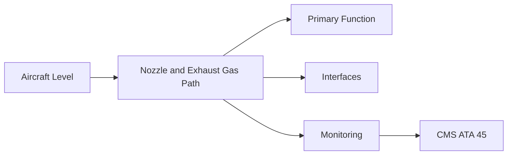
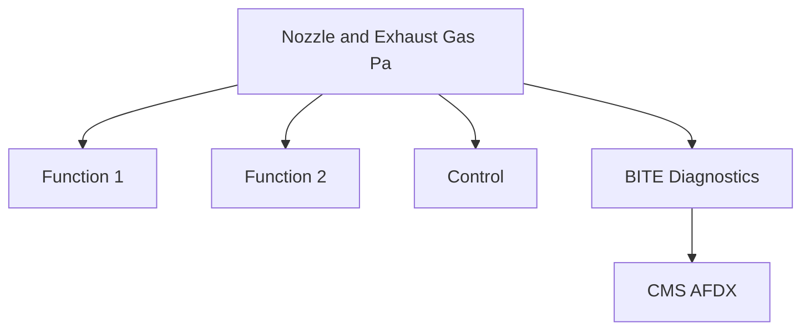

<!-- ──────────────────────────────────────────────────────────────────────────
     QATL-ATLAS-1000-ATLAS-060-069-063-050-NOZZLE-AND-EXHAUST-GAS-PATH
     ATA 63 · Nozzle and Exhaust Gas Path
     programme-defined aircraft type — ATLAS Register 1000
────────────────────────────────────────────────────────────────────────────── -->

# Nozzle and Exhaust Gas Path

---

## §0 Hyperlink Policy

> All hyperlinks in this document are **relative** (five directory levels: `../../../../../`).
> Absolute URLs are forbidden. Every linked document must exist in the Q+ATLANTIDE repository
> before the link is activated. Broken links are treated as open issues and must be resolved
> before the document is promoted from `DRAFT` to `APPROVED`.

---

## §1 Purpose

This document defines the agnostic ATLAS standard-level architecture context for `Nozzle and Exhaust Gas Path`.

It describes the controlled scope, functions, interfaces, safety considerations, lifecycle traceability, and S1000D/CSDB mapping logic that programme implementations shall instantiate when this node is applicable.

This document is not a programme design baseline. Programme-specific capacities, locations, part numbers, effectivity, operating limits, maintenance references, and data module codes shall be defined only inside the applicable programme implementation branch.
## §2 Applicability

| Applicability Level | Rule |
|---|---|
| Standard taxonomy | Applies to the ATLAS node `063` |
| Programme implementation | Conditional; determined by programme architecture, trade studies, certification basis, and applicability model |
| Product configuration | Defined in the programme-specific configuration baseline |
| Effectivity | Defined in the programme CSDB / applicability layer |
| Non-applicability | Must be explicitly stated in the programme impact-study branch when excluded |
## §3 Functional Description ![DRAFT]

Fixed-convergent core nozzle and bypass nozzle (formed by nacelle aft cowl). No thrust reverser in programme baseline. Acoustic liner on bypass inner wall for ICAO Chapter 14 noise compliance. CMC core nozzle option under evaluation for weight savings.

---

## §4 Functional Breakdown

| ID | Name | Description | Lead Division |
|---|---|---|---|
| F-001 | Core exhaust nozzle (fixed convergent) | Primary function | Q-GREENTECH |
| F-002 | System integration | Interface management | Q-MECHANICS |
| F-003 | Monitoring | BITE and health data | Q-AIR |

---

## §5 System Context — Mermaid Diagram

---

## §6 Internal Architecture — Mermaid Diagram

---

## §7 Components and LRUs

| Component | Part Number | Qty | Location | Maintenance Interval | Notes |
|---|---|---|---|---|---|
| Core exhaust nozzle (fixed convergent) | CoreNoz-PN-TBD | 1 per engine | LPT exit | Borescope at C-check | Nickel alloy or CMC; high-temperature |
| Bypass nozzle inner cowl | BypassNozIn-PN-TBD | 1 per engine | Nacelle aft inner annulus | Visual + tap-test at C-check | Acoustic liner inboard surface |
| EGT probe (exhaust plane) | EGT-PN-TBD | Multiple per engine | Core exhaust exit | On condition | Primary engine over-temp indication |
| Acoustic liner panels | AcLiner-PN-TBD | Per nacelle aft | Bypass duct inner wall | Inspect and tap-test at C-check | SDOF or 2DOF for jet noise attenuation |
| Exhaust plug (centre body) | ExhPlug-PN-TBD | 1 per engine | Core nozzle centre body | Inspect at C-check | May not be fitted on all variants |

---

## §8 Interfaces

| Interface Type | Connected System | Protocol / Medium | Data / Function |
|---|---|---|---|
| ATA 45 CMS | Central Maintenance System | AFDX ARINC 664 P7 | BITE faults and health data |
| ATA 24 Electrical Power | Power distribution | HVDC / 28 V DC | LRU power supply |
| ATA 67 Engine Controls | FADEC | ARINC 429 / AFDX | Control commands and feedback |
| ATA 31 ECAM | Cockpit display | AFDX | Crew indication and alerts |

---

## §9 Operating Modes

| Mode | Trigger | System State | Actions / Consequences |
|---|---|---|---|
| Normal operation | Aircraft/engine powered | Nominal | Full function active |
| Engine shutdown | Commanded or fault | FADEC stops fuel | System de-energised |
| Maintenance | Isolated | Aircraft grounded | LOTO active |
| Ground test | Post-maintenance | Engine on ground | Test pass before service |

---

## §10 Performance and Budgets ![DRAFT]

| Parameter | Requirement | Target / Design Value | Status |
|---|---|---|---|
| System availability | ≥ 99.9 % dispatch | RAMS analysis | TBD |
| BITE fault detection | ≥ 80 % coverage | BITE design analysis | TBD |

---

## §11 Safety, Redundancy and Fault Tolerance

- All Nozzle and Exhaust Gas Path maintenance requires FADEC and fuel system isolation before starting.
- Safety-critical fastener torques require calibrated tooling and dual sign-off.
- BITE failures affecting Nozzle and Exhaust Gas Path dispatch must be resolved or deferred per approved MEL.

---

## §12 Maintenance and Diagnostics

| Task | Interval | Access | Special Tools |
|---|---|---|---|
| Scheduled Nozzle and Exhaust Gas Path inspection | C-check | Per AMM access | NDT and inspection kit |
| BITE log review and download | A-check | Maintenance terminal | CMS terminal |
| Nozzle and Exhaust Gas Path functional test after LRU replacement | After LRU change | Ground run | FADEC GSE |

---

## §13 Footprint — Physical, Electrical, Maintenance, Data ![TBD]

| Footprint Type | Parameter | Value | Notes |
|---|---|---|---|
| Physical | Mass (system total) | ![TBD] | Pending OEM data |
| Physical | Envelope (max) | ![TBD] | Pending detailed design |
| Electrical | Peak power (W) | ![TBD] | To be defined |
| Maintenance | Access category | Standard line maintenance | Per AMM |
| Data | AFDX bandwidth | ![TBD] | Per AFDX bus load analysis |

---

## §14 Safety and Certification References ![DRAFT]

| Standard / Document | Title | Issuing Body | Applicability |
|---|---|---|---|
| ICAO Annex 16 Vol I Chapter 14 | Aircraft noise standards | ICAO | Exhaust noise certification |
| EASA CS-36 | Aircraft Noise Standards | EASA | Noise certification basis |
| ASTM C1834 | Ceramic Matrix Composites | ASTM | CMC nozzle qualification |
| ATA iSpec 2200 | Chapter 63 | ATA | ATA chapter scope |
| SAE AIR1903 | Thrust Reverser and Exhaust Nozzle Design | SAE International | Nozzle design reference |

---

## §15 V&V Approach ![TBD]

| Phase | Method | Acceptance Criterion | Status |
|---|---|---|---|
| Design | Analysis and simulation | Meets all §10 performance requirements | ![TBD] |
| Integration | Ground functional test | All BITE tests pass; interfaces verified | ![TBD] |
| Qualification | DO-160G environmental test | All applicable tests pass | ![TBD] |
| Certification | EASA CS-25 / CS-E compliance demonstration | Type Certificate / STC approval | ![TBD] |

---

## §16 Glossary

| Term | Definition |
|---|---|
| **CMC** | Ceramic Matrix Composite — high-temperature structural material for core nozzle; lower density. |
| **SDOF liner** | Single Degree Of Freedom acoustic liner — honeycomb absorbing specific noise frequency. |
| **Convergent nozzle** | Nozzle with decreasing cross-section; air accelerates to sonic conditions at exit. |
| **EGT** | Exhaust Gas Temperature — key FADEC parameter and crew ECAM indication. |
| **ICAO Chapter 14** | Current ICAO noise standard for large turbofan aircraft. |
| **2DOF liner** | Two Degree Of Freedom liner — broader frequency range noise absorption. |
| **Bypass nozzle** | Outer nozzle through which fan bypass stream exits the nacelle. |
| **Choked flow** | Sonic velocity at nozzle throat; maximum mass flow for given upstream conditions. |
| **Acoustic treatment** | Noise-absorbing material on duct/nozzle walls reducing radiated noise. |
| **Centre body** | Bullet-shaped plug at core nozzle exit directing core exhaust flow. |

---

## §17 Open Issues

| ID | Description | Owner | Target |
|---|---|---|---|
| OI-063-050-001 | Finalise Nozzle and Exhaust Gas Path design with engine OEM | Q-MECHANICS | 2026-Q4 |
| OI-063-050-002 | Define BITE coverage for Nozzle and Exhaust Gas Path | Q-AIR / safety | 2027-Q1 |

---

## §18 Status Legend

| Badge | Meaning |
|---|---|
| `![DRAFT]` | Section is drafted but not yet reviewed |
| `![TBD]` | Content not yet started — to be defined |
| `![To Be Completed]` | Partially complete — needs additional content |
| `![APPROVED]` | Reviewed and formally approved |

---

## §19 Related Documents (Siblings in this Subsection)

- [063-000](./063-000.md)
- [063-010](./063-010.md)
- [063-020](./063-020.md)
- [063-030](./063-030.md)
- [063-040](./063-040.md)
- [063-060](./063-060.md)
- [063-070](./063-070.md)
- [063-080](./063-080.md)
- [063-090](./063-090.md)

---

## §20 Change Log

| Rev | Date | Author | Description |
|---|---|---|---|
| 0.1 | 2026-05-11 | @copilot | Initial DRAFT — contextualized content per programme-defined aircraft type architecture |
