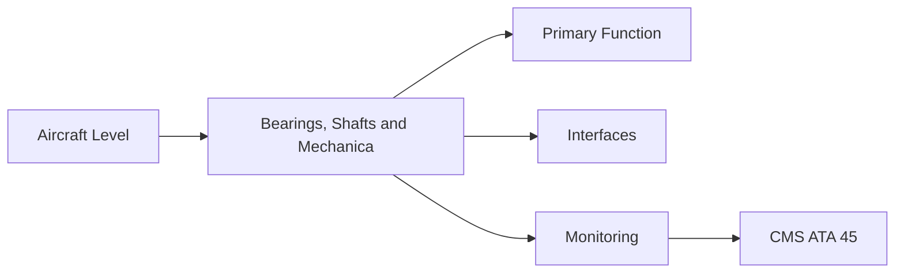
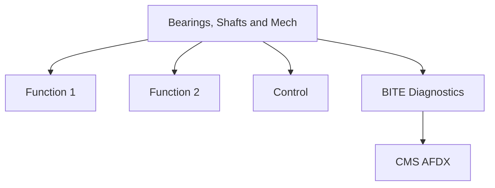

<!-- ──────────────────────────────────────────────────────────────────────────
     QATL-ATLAS-1000-ATLAS-060-069-063-060-BEARINGS-SHAFTS-AND-MECHANICAL-TRANSMISSION
     ATA 63 · Bearings, Shafts and Mechanical Transmission
     AMPEL360E eWTW — ATLAS Register 1000
────────────────────────────────────────────────────────────────────────────── -->

# Bearings, Shafts and Mechanical Transmission

---

## §0 Hyperlink Policy

> All hyperlinks in this document are **relative** (five directory levels: `../../../../../`).
> Absolute URLs are forbidden. Every linked document must exist in the Q+ATLANTIDE repository
> before the link is activated. Broken links are treated as open issues and must be resolved
> before the document is promoted from `DRAFT` to `APPROVED`.

---

## §1 Purpose

Bearing arrangement: No.1 ball (fan forward), No.2 roller (fan aft), No.3 roller (HPC front), No.4 ball/roller (HPT rear), No.5 roller (LPT rear). HP shaft (inner) carries HPC+HPT. LP shaft (outer) carries fan+LPC+LPT. Tower shaft drives AGB from HP rotor. Oil debris monitoring (ODM) is the primary bearing condition indicator.

---

## §2 Applicability

| Parameter | Value |
|---|---|
| Aircraft Program | AMPEL360E eWTW |
| ATA reference | ATA 63-060 — Bearings, Shafts and Mechanical Transmission |
| Certification basis | EASA CS-25 Amdt 27+ |
| S1000D SNS | 063-060-00 |

---

## §3 Functional Description ![DRAFT]

Bearing arrangement: No.1 ball (fan forward), No.2 roller (fan aft), No.3 roller (HPC front), No.4 ball/roller (HPT rear), No.5 roller (LPT rear). HP shaft (inner) carries HPC+HPT. LP shaft (outer) carries fan+LPC+LPT. Tower shaft drives AGB from HP rotor. Oil debris monitoring (ODM) is the primary bearing condition indicator.

---

## §4 Functional Breakdown

| ID | Name | Description | Lead Division |
|---|---|---|---|
| F-001 | No.1 ball bearing (fan forward) | Primary function | Q-GREENTECH |
| F-002 | System integration | Interface management | Q-MECHANICS |
| F-003 | Monitoring | BITE and health data | Q-AIR |

---

## §5 System Context — Mermaid Diagram

---

## §6 Internal Architecture — Mermaid Diagram

---

## §7 Components and LRUs

| Component | Part Number | Qty | Location | Maintenance Interval | Notes |
|---|---|---|---|---|---|
| No.1 ball bearing (fan forward) | Brg1-PN-TBD | 1 per engine | Fan frame | On condition / chip monitor | Locating bearing; carries thrust loads |
| No.4 ball/roller bearing (HPT rear) | Brg4-PN-TBD | 1 per engine | HPT rear housing | On condition / ODM | Highest-temperature bearing; critical on-condition |
| HP shaft (inner) | HPShaft-PN-TBD | 1 per engine | Engine core centre | On condition / dimensional at overhaul | Torque + thrust HPT → HPC |
| LP shaft (outer) | LPShaft-PN-TBD | 1 per engine | Engine annular region | On condition / dimensional at overhaul | Torque LPT → fan + LPC |
| Tower shaft (AGB drive) | TowerShaft-PN-TBD | 1 per engine | HP shaft → AGB | On condition / inspect at overhaul | Bevel gear drive to accessory gearbox |

---

## §8 Interfaces

| Interface Type | Connected System | Protocol / Medium | Data / Function |
|---|---|---|---|
| ATA 45 CMS | Central Maintenance System | AFDX ARINC 664 P7 | BITE faults and health data |
| ATA 24 Electrical Power | Power distribution | HVDC / 28 V DC | LRU power supply |
| ATA 67 Engine Controls | FADEC | ARINC 429 / AFDX | Control commands and feedback |
| ATA 31 ECAM | Cockpit display | AFDX | Crew indication and alerts |

---

## §9 Operating Modes

| Mode | Trigger | System State | Actions / Consequences |
|---|---|---|---|
| Normal operation | Aircraft/engine powered | Nominal | Full function active |
| Engine shutdown | Commanded or fault | FADEC stops fuel | System de-energised |
| Maintenance | Isolated | Aircraft grounded | LOTO active |
| Ground test | Post-maintenance | Engine on ground | Test pass before service |

---

## §10 Performance and Budgets ![DRAFT]

| Parameter | Requirement | Target / Design Value | Status |
|---|---|---|---|
| System availability | ≥ 99.9 % dispatch | RAMS analysis | TBD |
| BITE fault detection | ≥ 80 % coverage | BITE design analysis | TBD |

---

## §11 Safety, Redundancy and Fault Tolerance

- All Bearings, Shafts and Mechanical Transmission maintenance requires FADEC and fuel system isolation before starting.
- Safety-critical fastener torques require calibrated tooling and dual sign-off.
- BITE failures affecting Bearings, Shafts and Mechanical Transmission dispatch must be resolved or deferred per approved MEL.

---

## §12 Maintenance and Diagnostics

| Task | Interval | Access | Special Tools |
|---|---|---|---|
| Scheduled Bearings, Shafts and Mechanical Transmission inspection | C-check | Per AMM access | NDT and inspection kit |
| BITE log review and download | A-check | Maintenance terminal | CMS terminal |
| Bearings, Shafts and Mechanical Transmission functional test after LRU replacement | After LRU change | Ground run | FADEC GSE |

---

## §13 Footprint — Physical, Electrical, Maintenance, Data ![TBD]

| Footprint Type | Parameter | Value | Notes |
|---|---|---|---|
| Physical | Mass (system total) | ![TBD] | Pending OEM data |
| Physical | Envelope (max) | ![TBD] | Pending detailed design |
| Electrical | Peak power (W) | ![TBD] | To be defined |
| Maintenance | Access category | Standard line maintenance | Per AMM |
| Data | AFDX bandwidth | ![TBD] | Per AFDX bus load analysis |

---

## §14 Safety and Certification References ![DRAFT]

| Standard / Document | Title | Issuing Body | Applicability |
|---|---|---|---|
| EASA CS-E §860 | Engine rotor integrity | EASA | Shaft and bearing structural certification |
| SAE AIR4784 | Gas Turbine Bearing Prognostics | SAE International | Bearing condition monitoring |
| SAE ARP4101 | Oil Debris Monitoring | SAE International | ODM sensor standard |
| ATA iSpec 2200 | Chapter 63 | ATA | ATA chapter scope |
| ISO 281 | Rolling bearings — dynamic load ratings | ISO | Bearing life calculation |

---

## §15 V&V Approach ![TBD]

| Phase | Method | Acceptance Criterion | Status |
|---|---|---|---|
| Design | Analysis and simulation | Meets all §10 performance requirements | ![TBD] |
| Integration | Ground functional test | All BITE tests pass; interfaces verified | ![TBD] |
| Qualification | DO-160G environmental test | All applicable tests pass | ![TBD] |
| Certification | EASA CS-25 / CS-E compliance demonstration | Type Certificate / STC approval | ![TBD] |

---

## §16 Glossary

| Term | Definition |
|---|---|
| **Ball bearing** | Bearing with ball rolling elements; carries radial and axial loads. |
| **Roller bearing** | Bearing with cylindrical rolling elements; primarily radial loads. |
| **Locating bearing** | The bearing constraining axial position of the rotor; typically a ball bearing. |
| **ODM** | Oil Debris Monitor — magnetic chip detector measuring metallic particles in oil return. |
| **Tower shaft** | Bevel gear shaft from HP rotor to AGB transmitting mechanical power for accessories. |
| **AGB** | Accessory Gearbox — drives engine accessories (fuel pump, oil pump, generators). |
| **HP shaft** | High-pressure inner shaft connecting HPC and HPT. |
| **LP shaft** | Low-pressure outer shaft connecting fan, LPC, and LPT. |
| **Bevel gear** | Gear with teeth on conical surface; changes drive direction from axial to radial. |
| **Chip detector** | Magnetic plug accumulating metallic debris from oil circuit; inspected at C-check. |

---

## §17 Open Issues

| ID | Description | Owner | Target |
|---|---|---|---|
| OI-063-060-001 | Finalise Bearings, Shafts and Mechanical Transmission design with engine OEM | Q-MECHANICS | 2026-Q4 |
| OI-063-060-002 | Define BITE coverage for Bearings, Shafts and Mechanical Transmission | Q-AIR / safety | 2027-Q1 |

---

## §18 Status Legend

| Badge | Meaning |
|---|---|
| `![DRAFT]` | Section is drafted but not yet reviewed |
| `![TBD]` | Content not yet started — to be defined |
| `![To Be Completed]` | Partially complete — needs additional content |
| `![APPROVED]` | Reviewed and formally approved |

---

## §19 Related Documents (Siblings in this Subsection)

- [063-000](./063-000.md)
- [063-010](./063-010.md)
- [063-020](./063-020.md)
- [063-030](./063-030.md)
- [063-040](./063-040.md)
- [063-050](./063-050.md)
- [063-070](./063-070.md)
- [063-080](./063-080.md)
- [063-090](./063-090.md)

---

## §20 Change Log

| Rev | Date | Author | Description |
|---|---|---|---|
| 0.1 | 2026-05-11 | @copilot | Initial DRAFT — contextualized content per AMPEL360E eWTW architecture |
