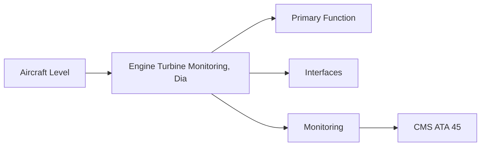
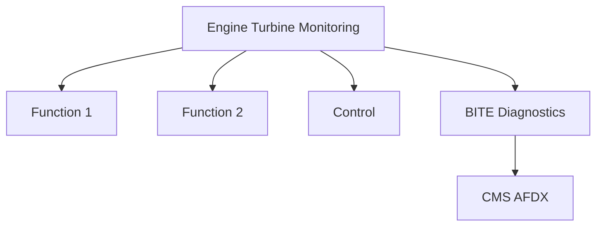

<!-- ──────────────────────────────────────────────────────────────────────────
     QATL-ATLAS-1000-ATLAS-060-069-063-080-ENGINE-TURBINE-MONITORING-DIAGNOSTICS-AND-CONTROL-INTERFACES
     ATA 63 · Engine Turbine Monitoring, Diagnostics and Control Interfaces
     programme-defined aircraft type — ATLAS Register 1000
────────────────────────────────────────────────────────────────────────────── -->

# Engine Turbine Monitoring, Diagnostics and Control Interfaces

---

## §0 Hyperlink Policy

> All hyperlinks in this document are **relative** (five directory levels: `../../../../../`).
> Absolute URLs are forbidden. Every linked document must exist in the Q+ATLANTIDE repository
> before the link is activated. Broken links are treated as open issues and must be resolved
> before the document is promoted from `DRAFT` to `APPROVED`.

---

## §1 Purpose

This document defines the agnostic ATLAS standard-level architecture context for `Engine Turbine Monitoring, Diagnostics and Control Interfaces`.

It describes the controlled scope, functions, interfaces, safety considerations, lifecycle traceability, and S1000D/CSDB mapping logic that programme implementations shall instantiate when this node is applicable.

This document is not a programme design baseline. Programme-specific capacities, locations, part numbers, effectivity, operating limits, maintenance references, and data module codes shall be defined only inside the applicable programme implementation branch.
## §2 Applicability

| Applicability Level | Rule |
|---|---|
| Standard taxonomy | Applies to the ATLAS node `063` |
| Programme implementation | Conditional; determined by programme architecture, trade studies, certification basis, and applicability model |
| Product configuration | Defined in the programme-specific configuration baseline |
| Effectivity | Defined in the programme CSDB / applicability layer |
| Non-applicability | Must be explicitly stated in the programme impact-study branch when excluded |
## §3 Functional Description ![DRAFT]

FADEC dual-channel monitoring with > 1 000 parameters. EDIU provides FADEC-to-AFDX gateway. ACMF acquires per-flight cruise snapshot for EGT margin trending. ODM (oil debris monitoring) detects metallic particles for bearing health monitoring.

---

## §4 Functional Breakdown

| ID | Name | Description | Lead Division |
|---|---|---|---|
| F-001 | FADEC dual-channel unit | Primary function | Q-GREENTECH |
| F-002 | System integration | Interface management | Q-MECHANICS |
| F-003 | Monitoring | BITE and health data | Q-AIR |

---

## §5 System Context — Mermaid Diagram

---

## §6 Internal Architecture — Mermaid Diagram

---

## §7 Components and LRUs

| Component | Part Number | Qty | Location | Maintenance Interval | Notes |
|---|---|---|---|---|---|
| FADEC dual-channel unit | FADEC-PN-TBD | 1 per engine | Accessories bay | On condition / BITE | DO-178C DAL A; 2-channel cross-monitor |
| EDIU | EDIU-PN-TBD | 1 per engine | Accessories bay | On condition | FADEC bus → AFDX gateway |
| ODM / magnetic chip detector | ODM-PN-TBD | 2 per engine | AGB + bearing sumps | On condition / check at C-check | Early bearing wear detection |
| Engine vibration monitor (EVM) | EVM-PN-TBD | 2 per engine | Fan frame + TRF | Annual calibration | 1P fan vibration; N1/N2 trending |
| ACMF software module | FADEC/EDIU DAL D | Per engine | FADEC or EDIU | Software update | Per-flight EGT margin; ground upload |

---

## §8 Interfaces

| Interface Type | Connected System | Protocol / Medium | Data / Function |
|---|---|---|---|
| ATA 45 CMS | Central Maintenance System | AFDX ARINC 664 P7 | BITE faults and health data |
| ATA 24 Electrical Power | Power distribution | HVDC / 28 V DC | LRU power supply |
| ATA 67 Engine Controls | FADEC | ARINC 429 / AFDX | Control commands and feedback |
| ATA 31 ECAM | Cockpit display | AFDX | Crew indication and alerts |

---

## §9 Operating Modes

| Mode | Trigger | System State | Actions / Consequences |
|---|---|---|---|
| Normal operation | Aircraft/engine powered | Nominal | Full function active |
| Engine shutdown | Commanded or fault | FADEC stops fuel | System de-energised |
| Maintenance | Isolated | Aircraft grounded | LOTO active |
| Ground test | Post-maintenance | Engine on ground | Test pass before service |

---

## §10 Performance and Budgets ![DRAFT]

| Parameter | Requirement | Target / Design Value | Status |
|---|---|---|---|
| System availability | ≥ 99.9 % dispatch | RAMS analysis | TBD |
| BITE fault detection | ≥ 80 % coverage | BITE design analysis | TBD |

---

## §11 Safety, Redundancy and Fault Tolerance

- All Engine Turbine Monitoring, Diagnostics and Control Interfaces maintenance requires FADEC and fuel system isolation before starting.
- Safety-critical fastener torques require calibrated tooling and dual sign-off.
- BITE failures affecting Engine Turbine Monitoring, Diagnostics and Control Interfaces dispatch must be resolved or deferred per approved MEL.

---

## §12 Maintenance and Diagnostics

| Task | Interval | Access | Special Tools |
|---|---|---|---|
| Scheduled Engine Turbine Monitoring, Diagnostics and Control Interfaces inspection | C-check | Per AMM access | NDT and inspection kit |
| BITE log review and download | A-check | Maintenance terminal | CMS terminal |
| Engine Turbine Monitoring, Diagnostics and Control Interfaces functional test after LRU replacement | After LRU change | Ground run | FADEC GSE |

---

## §13 Footprint — Physical, Electrical, Maintenance, Data ![TBD]

| Footprint Type | Parameter | Value | Notes |
|---|---|---|---|
| Physical | Mass (system total) | ![TBD] | Pending OEM data |
| Physical | Envelope (max) | ![TBD] | Pending detailed design |
| Electrical | Peak power (W) | ![TBD] | To be defined |
| Maintenance | Access category | Standard line maintenance | Per AMM |
| Data | AFDX bandwidth | ![TBD] | Per AFDX bus load analysis |

---

## §14 Safety and Certification References ![DRAFT]

| Standard / Document | Title | Issuing Body | Applicability |
|---|---|---|---|
| DO-178C | Software Considerations | RTCA | FADEC DAL A software assurance |
| ARINC 664 P7 | Aircraft Data Network — AFDX | ARINC | EDIU-to-CMS data bus |
| SAE ARP1179 | Engine Monitoring Systems | SAE International | Engine monitoring reference |
| ATA iSpec 2200 | Chapter 63 | ATA | ATA chapter scope |
| SAE ARP4761 | Safety Assessment Process | SAE International | FADEC BITE coverage |

---

## §15 V&V Approach ![TBD]

| Phase | Method | Acceptance Criterion | Status |
|---|---|---|---|
| Design | Analysis and simulation | Meets all §10 performance requirements | ![TBD] |
| Integration | Ground functional test | All BITE tests pass; interfaces verified | ![TBD] |
| Qualification | DO-160G environmental test | All applicable tests pass | ![TBD] |
| Certification | EASA CS-25 / CS-E compliance demonstration | Type Certificate / STC approval | ![TBD] |

---

## §16 Glossary

| Term | Definition |
|---|---|
| **FADEC** | Full Authority Digital Engine Control — primary engine monitor and controller. |
| **EDIU** | Engine Data Interface Unit — translates FADEC bus protocol to aircraft AFDX. |
| **ODM** | Oil Debris Monitor — detects metallic particles in oil return; early bearing wear indicator. |
| **EVM** | Engine Vibration Monitor — measures rotor imbalance vibration. |
| **ACMF** | Aircraft Condition Monitoring Function — cruise data recorder for ground trending. |
| **Dual-channel FADEC** | Two independent FADEC computation channels with cross-comparison. |
| **AFDX** | Avionics Full-Duplex Switched Ethernet — ARINC 664 P7 aircraft data network. |
| **EGT margin trending** | Monitoring EGT margin decay to predict engine shop visit. |
| **Chip detector** | Magnetic plug in oil return line; accumulates metallic debris. |
| **N1/N2 vibration** | Fan (N1) and HP rotor (N2) vibration; exceedance triggers maintenance. |

---

## §17 Open Issues

| ID | Description | Owner | Target |
|---|---|---|---|
| OI-063-080-001 | Finalise Engine Turbine Monitoring, Diagnostics and Control Interfaces design with engine OEM | Q-MECHANICS | 2026-Q4 |
| OI-063-080-002 | Define BITE coverage for Engine Turbine Monitoring, Diagnostics and Control Interfaces | Q-AIR / safety | 2027-Q1 |

---

## §18 Status Legend

| Badge | Meaning |
|---|---|
| `![DRAFT]` | Section is drafted but not yet reviewed |
| `![TBD]` | Content not yet started — to be defined |
| `![To Be Completed]` | Partially complete — needs additional content |
| `![APPROVED]` | Reviewed and formally approved |

---

## §19 Related Documents (Siblings in this Subsection)

- [063-000](./063-000.md)
- [063-010](./063-010.md)
- [063-020](./063-020.md)
- [063-030](./063-030.md)
- [063-040](./063-040.md)
- [063-050](./063-050.md)
- [063-060](./063-060.md)
- [063-070](./063-070.md)
- [063-090](./063-090.md)

---

## §20 Change Log

| Rev | Date | Author | Description |
|---|---|---|---|
| 0.1 | 2026-05-11 | @copilot | Initial DRAFT — contextualized content per programme-defined aircraft type architecture |
