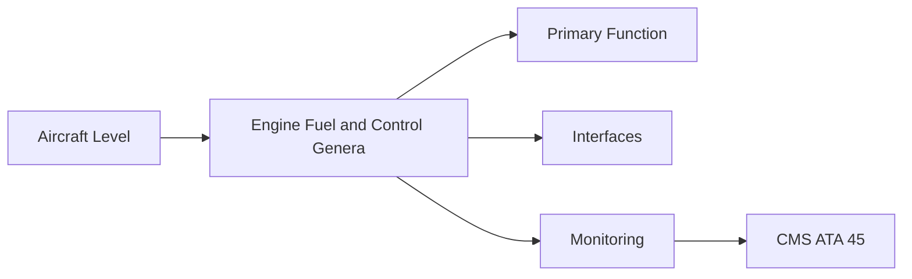
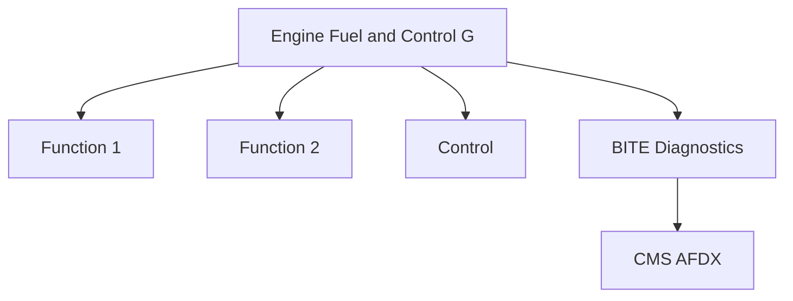

<!-- ──────────────────────────────────────────────────────────────────────────
     QATL-ATLAS-1000-ATLAS-060-069-064-000-ENGINE-FUEL-AND-CONTROL-GENERAL
     ATA 64 · Engine Fuel and Control General
     AMPEL360E eWTW — ATLAS Register 1000
────────────────────────────────────────────────────────────────────────────── -->

# Engine Fuel and Control General

---

## §0 Hyperlink Policy

> All hyperlinks in this document are **relative** (five directory levels: `../../../../../`).
> Absolute URLs are forbidden. Every linked document must exist in the Q+ATLANTIDE repository
> before the link is activated. Broken links are treated as open issues and must be resolved
> before the document is promoted from `DRAFT` to `APPROVED`.

---

## §1 Purpose

ATA Chapter 64 defines the architecture of the engine fuel metering and control system — from the aircraft fuel supply at the QEC interface to the combustor fuel nozzles. On the AMPEL360E eWTW, the fuel system is bleed-less; all aircraft pneumatic needs are met by the Electric Air Compressor (EAC), not by compressor bleed. This eliminates the conventional bleed-air-cooled fuel heat exchanger and significantly simplifies the fuel-side heat management.

The AMPEL360E eWTW is designed for 100 % Sustainable Aviation Fuel (SAF, ASTM D7566 Annex A) compatibility, requiring all fuel-wetted materials, sealants, and nozzle orifice geometry to accommodate the full range of SAF aromatic content and lubricity characteristics from day-one certification.

---

## §2 Applicability

| Parameter | Value |
|---|---|
| Aircraft Program | AMPEL360E eWTW |
| ATA reference | ATA 64-000 — Engine Fuel and Control General |
| Certification basis | EASA CS-25 Amdt 27+ |
| S1000D SNS | 064-000-00 |

---

## §3 Functional Description ![DRAFT]

The ATA 64 system architecture includes:
- **Fuel supply at QEC** — aircraft HP fuel supply from ATA 28 at the QEC interface.
- **Low-pressure (LP) pump** — engine-driven, mounted on AGB; supplies HP pump suction.
- **High-pressure (HP) pump** — engine-driven, gear-type; delivers metered fuel at HMU inlet pressure.
- **Hydro-Mechanical Unit (HMU)** — metering valve, governing, bleed valve scheduling.
- **FADEC fuel schedule** — FADEC commands HMU via EHV (Electro-Hydraulic Valve); closed-loop N1 and EGT limiting.
- **Fuel nozzles** — lean-burn dual-circuit nozzles at combustor front face.

---

## §4 Functional Breakdown

| ID | Name | Description | Lead Division |
|---|---|---|---|
| F-001 | LP fuel pump (engine-driven) | Primary function | Q-GREENTECH |
| F-002 | System integration | Interface management | Q-MECHANICS |
| F-003 | Monitoring | BITE and health data | Q-AIR |

---

## §5 System Context — Mermaid Diagram

---

## §6 Internal Architecture — Mermaid Diagram

---

## §7 Components and LRUs

| Component | Part Number | Qty | Location | Maintenance Interval | Notes |
|---|---|---|---|---|---|
| LP fuel pump (engine-driven) | LP-Pump-PN-TBD | 1 per engine | AGB 6 o'clock | On condition / replace at overhaul | Suction feed to HP pump; pressure boost |
| HP fuel pump (gear-type) | HP-Pump-PN-TBD | 1 per engine | AGB 9 o'clock | On condition / replace at overhaul | Main metering pressure supply to HMU |
| HMU (Hydro-Mechanical Unit) | HMU-PN-TBD | 1 per engine | AGB upper | On condition | Metering valve, governing, VSV/bleed scheduling |
| FADEC EHV (Electro-Hydraulic Valve) | EHV-PN-TBD | 1 per engine | HMU integral | On condition / FADEC BITE | FADEC fuel metering command interface |
| Fuel nozzle set (lean-burn) | FuelNoz-PN-TBD | 20–24 per engine | Combustor front face | Replace on condition / OEM interval | SAF-compatible; pilot + main circuits |

---

## §8 Interfaces

| Interface Type | Connected System | Protocol / Medium | Data / Function |
|---|---|---|---|
| ATA 45 CMS | Central Maintenance System | AFDX ARINC 664 P7 | BITE faults and health data |
| ATA 24 Electrical Power | Power distribution | HVDC / 28 V DC | LRU power supply |
| ATA 67 Engine Controls | FADEC | ARINC 429 / AFDX | Control commands and feedback |
| ATA 31 ECAM | Cockpit display | AFDX | Crew indication and alerts |

---

## §9 Operating Modes

| Mode | Trigger | System State | Actions / Consequences |
|---|---|---|---|
| Normal operation | Aircraft/engine powered | Nominal | Full function active |
| Engine shutdown | Commanded or fault | FADEC stops fuel | System de-energised |
| Maintenance | Isolated | Aircraft grounded | LOTO active |
| Ground test | Post-maintenance | Engine on ground | Test pass before service |

---

## §10 Performance and Budgets ![DRAFT]

| Parameter | Requirement | Target / Design Value | Status |
|---|---|---|---|
| System availability | ≥ 99.9 % dispatch | RAMS analysis | TBD |
| BITE fault detection | ≥ 80 % coverage | BITE design analysis | TBD |

---

## §11 Safety, Redundancy and Fault Tolerance

- All Engine Fuel and Control General maintenance requires FADEC and fuel system isolation before starting.
- Safety-critical fastener torques require calibrated tooling and dual sign-off.
- BITE failures affecting Engine Fuel and Control General dispatch must be resolved or deferred per approved MEL.

---

## §12 Maintenance and Diagnostics

| Task | Interval | Access | Special Tools |
|---|---|---|---|
| Scheduled Engine Fuel and Control General inspection | C-check | Per AMM access | NDT and inspection kit |
| BITE log review and download | A-check | Maintenance terminal | CMS terminal |
| Engine Fuel and Control General functional test after LRU replacement | After LRU change | Ground run | FADEC GSE |

---

## §13 Footprint — Physical, Electrical, Maintenance, Data ![TBD]

| Footprint Type | Parameter | Value | Notes |
|---|---|---|---|
| Physical | Mass (system total) | ![TBD] | Pending OEM data |
| Physical | Envelope (max) | ![TBD] | Pending detailed design |
| Electrical | Peak power (W) | ![TBD] | To be defined |
| Maintenance | Access category | Standard line maintenance | Per AMM |
| Data | AFDX bandwidth | ![TBD] | Per AFDX bus load analysis |

---

## §14 Safety and Certification References ![DRAFT]

| Standard / Document | Title | Issuing Body | Applicability |
|---|---|---|---|
| EASA CS-E §780 | Fuel and induction system — engines | EASA | Engine fuel system certification |
| ASTM D7566 | SAF specification | ASTM International | SAF material compatibility requirement |
| SAE ARP1533 | Aircraft Fuel System Design | SAE International | Fuel system architecture reference |
| ATA iSpec 2200 | Chapter 64 — Engine Fuel and Control | ATA | ATA chapter scope |
| DO-178C | Software Considerations | RTCA | FADEC fuel metering software assurance |

---

## §15 V&V Approach ![TBD]

| Phase | Method | Acceptance Criterion | Status |
|---|---|---|---|
| Design | Analysis and simulation | Meets all §10 performance requirements | ![TBD] |
| Integration | Ground functional test | All BITE tests pass; interfaces verified | ![TBD] |
| Qualification | DO-160G environmental test | All applicable tests pass | ![TBD] |
| Certification | EASA CS-25 / CS-E compliance demonstration | Type Certificate / STC approval | ![TBD] |

---

## §16 Glossary

| Term | Definition |
|---|---|
| **SAF** | Sustainable Aviation Fuel — ASTM D7566 Annex A; 100 % compatible from first delivery. |
| **HMU** | Hydro-Mechanical Unit — the mechanical core of the fuel control; meters fuel flow to nozzles. |
| **EHV** | Electro-Hydraulic Valve — the FADEC command interface to the HMU; converts FADEC electrical signal to hydraulic metering action. |
| **LP pump** | Low-Pressure engine-driven pump; boosts suction pressure for HP pump; prevents HP pump cavitation. |
| **HP pump** | High-Pressure gear pump; produces main metering pressure; displacement-type. |
| **Fuel burn-off** | The use of fuel flow as the primary working fluid (power and heat transfer) in the fuel control system. |
| **Bleed-less** | No engine compressor bleed air used for aircraft systems on AMPEL360E eWTW. |
| **AGB** | Accessory Gearbox — engine-driven gearbox mounting LP pump, HP pump, HMU, and other accessories. |
| **Lean-burn nozzle** | Fuel nozzle designed for lean combustion; pilot circuit at low power, main circuit added at higher power. |
| **Metering valve** | The variable-orifice valve in the HMU that controls fuel flow rate to the nozzles. |

---

## §17 Open Issues

| ID | Description | Owner | Target |
|---|---|---|---|
| OI-064-000-001 | Finalise Engine Fuel and Control General design with engine OEM | Q-MECHANICS | 2026-Q4 |
| OI-064-000-002 | Define BITE coverage for Engine Fuel and Control General | Q-AIR / safety | 2027-Q1 |

---

## §18 Status Legend

| Badge | Meaning |
|---|---|
| `![DRAFT]` | Section is drafted but not yet reviewed |
| `![TBD]` | Content not yet started — to be defined |
| `![To Be Completed]` | Partially complete — needs additional content |
| `![APPROVED]` | Reviewed and formally approved |

---

## §19 Related Documents (Siblings in this Subsection)

- [064-010](./064-010.md)
- [064-020](./064-020.md)
- [064-030](./064-030.md)
- [064-040](./064-040.md)
- [064-050](./064-050.md)
- [064-060](./064-060.md)
- [064-070](./064-070.md)
- [064-080](./064-080.md)
- [064-090](./064-090.md)

---

## §20 Change Log

| Rev | Date | Author | Description |
|---|---|---|---|
| 0.1 | 2026-05-11 | @copilot | Initial DRAFT — contextualized content per AMPEL360E eWTW architecture |
