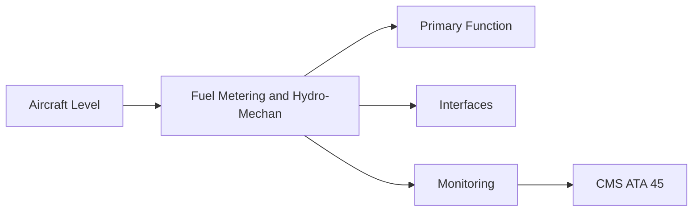
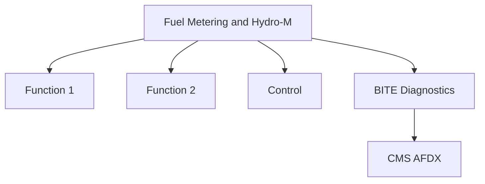

<!-- ──────────────────────────────────────────────────────────────────────────
     QATL-ATLAS-1000-ATLAS-060-069-064-010-FUEL-METERING-AND-HYDRO-MECHANICAL-CONTROL
     ATA 64 · Fuel Metering and Hydro-Mechanical Control
     AMPEL360E eWTW — ATLAS Register 1000
────────────────────────────────────────────────────────────────────────────── -->

# Fuel Metering and Hydro-Mechanical Control

---

## §0 Hyperlink Policy

> All hyperlinks in this document are **relative** (five directory levels: `../../../../../`).
> Absolute URLs are forbidden. Every linked document must exist in the Q+ATLANTIDE repository
> before the link is activated. Broken links are treated as open issues and must be resolved
> before the document is promoted from `DRAFT` to `APPROVED`.

---

## §1 Purpose

The HMU (Hydro-Mechanical Unit) is the primary fuel metering device. It receives high-pressure fuel from the HP pump and meters the correct flow rate to the combustor nozzles under FADEC command. The HMU also schedules VSV actuator hydraulic pressure and HPC bleed valve hydraulic pilot pressure, integrating fuel and compressor geometry control in a single LRU.

---

## §2 Applicability

| Parameter | Value |
|---|---|
| Aircraft Program | AMPEL360E eWTW |
| ATA reference | ATA 64-010 — Fuel Metering and Hydro-Mechanical Control |
| Certification basis | EASA CS-25 Amdt 27+ |
| S1000D SNS | 064-010-00 |

---

## §3 Functional Description ![DRAFT]

The HMU (Hydro-Mechanical Unit) is the primary fuel metering device. It receives high-pressure fuel from the HP pump and meters the correct flow rate to the combustor nozzles under FADEC command. The HMU also schedules VSV actuator hydraulic pressure and HPC bleed valve hydraulic pilot pressure, integrating fuel and compressor geometry control in a single LRU.

---

## §4 Functional Breakdown

| ID | Name | Description | Lead Division |
|---|---|---|---|
| F-001 | HMU (Hydro-Mechanical Unit) | Primary function | Q-GREENTECH |
| F-002 | System integration | Interface management | Q-MECHANICS |
| F-003 | Monitoring | BITE and health data | Q-AIR |

---

## §5 System Context — Mermaid Diagram

---

## §6 Internal Architecture — Mermaid Diagram

---

## §7 Components and LRUs

| Component | Part Number | Qty | Location | Maintenance Interval | Notes |
|---|---|---|---|---|---|
| HMU (Hydro-Mechanical Unit) | HMU-PN-TBD | 1 per engine | AGB upper face | On condition / overhaul | FADEC-commanded; meters fuel and VSV/bleed |
| Fuel metering valve (FMV) | FMV — integral to HMU | 1 per engine | HMU internal | On condition | Controls fuel mass flow to nozzles |
| Fuel shut-off valve (FSOV) | FSOV-PN-TBD | 1 per engine | HMU / LP fuel line | Functional test at C-check | Fail-safe closed; FADEC and crew fire-handle command |
| EHV (FADEC-to-HMU) | EHV — integral to HMU | 1 per engine | HMU integral | On condition / FADEC BITE | FADEC electrical → HMU hydraulic interface |
| Fuel filter (HMU inlet) | FuelFilt-PN-TBD | 1 per engine | HMU inlet | Replace at C-check interval | Prevents particulate contamination of HMU |

---

## §8 Interfaces

| Interface Type | Connected System | Protocol / Medium | Data / Function |
|---|---|---|---|
| ATA 45 CMS | Central Maintenance System | AFDX ARINC 664 P7 | BITE faults and health data |
| ATA 24 Electrical Power | Power distribution | HVDC / 28 V DC | LRU power supply |
| ATA 67 Engine Controls | FADEC | ARINC 429 / AFDX | Control commands and feedback |
| ATA 31 ECAM | Cockpit display | AFDX | Crew indication and alerts |

---

## §9 Operating Modes

| Mode | Trigger | System State | Actions / Consequences |
|---|---|---|---|
| Normal operation | Aircraft/engine powered | Nominal | Full function active |
| Engine shutdown | Commanded or fault | FADEC stops fuel | System de-energised |
| Maintenance | Isolated | Aircraft grounded | LOTO active |
| Ground test | Post-maintenance | Engine on ground | Test pass before service |

---

## §10 Performance and Budgets ![DRAFT]

| Parameter | Requirement | Target / Design Value | Status |
|---|---|---|---|
| System availability | ≥ 99.9 % dispatch | RAMS analysis | TBD |
| BITE fault detection | ≥ 80 % coverage | BITE design analysis | TBD |

---

## §11 Safety, Redundancy and Fault Tolerance

- All Fuel Metering and Hydro-Mechanical Control maintenance requires FADEC and fuel system isolation before starting.
- Safety-critical fastener torques require calibrated tooling and dual sign-off.
- BITE failures affecting Fuel Metering and Hydro-Mechanical Control dispatch must be resolved or deferred per approved MEL.

---

## §12 Maintenance and Diagnostics

| Task | Interval | Access | Special Tools |
|---|---|---|---|
| Scheduled Fuel Metering and Hydro-Mechanical Control inspection | C-check | Per AMM access | NDT and inspection kit |
| BITE log review and download | A-check | Maintenance terminal | CMS terminal |
| Fuel Metering and Hydro-Mechanical Control functional test after LRU replacement | After LRU change | Ground run | FADEC GSE |

---

## §13 Footprint — Physical, Electrical, Maintenance, Data ![TBD]

| Footprint Type | Parameter | Value | Notes |
|---|---|---|---|
| Physical | Mass (system total) | ![TBD] | Pending OEM data |
| Physical | Envelope (max) | ![TBD] | Pending detailed design |
| Electrical | Peak power (W) | ![TBD] | To be defined |
| Maintenance | Access category | Standard line maintenance | Per AMM |
| Data | AFDX bandwidth | ![TBD] | Per AFDX bus load analysis |

---

## §14 Safety and Certification References ![DRAFT]

| Standard / Document | Title | Issuing Body | Applicability |
|---|---|---|---|
| EASA CS-E §780 | Fuel and induction system | EASA | HMU certification requirement |
| SAE ARP1533 | Aircraft Fuel System Design | SAE International | HMU architecture reference |
| SAE AIR5025 | Fuel Metering System Design | SAE International | FMV design reference |
| ATA iSpec 2200 | Chapter 64 | ATA | ATA chapter scope |
| DO-178C | Software Considerations | RTCA | FADEC EHV command software assurance |

---

## §15 V&V Approach ![TBD]

| Phase | Method | Acceptance Criterion | Status |
|---|---|---|---|
| Design | Analysis and simulation | Meets all §10 performance requirements | ![TBD] |
| Integration | Ground functional test | All BITE tests pass; interfaces verified | ![TBD] |
| Qualification | DO-160G environmental test | All applicable tests pass | ![TBD] |
| Certification | EASA CS-25 / CS-E compliance demonstration | Type Certificate / STC approval | ![TBD] |

---

## §16 Glossary

| Term | Definition |
|---|---|
| **FMV** | Fuel Metering Valve — the variable-orifice valve controlling fuel flow to nozzles. |
| **FSOV** | Fuel Shut-Off Valve — a normally-closed valve that shuts fuel flow to the engine; activated by FADEC shutdown command or crew fire handle. |
| **EHV** | Electro-Hydraulic Valve — converts FADEC digital/electrical command into hydraulic metering action in the HMU. |
| **HMU** | Hydro-Mechanical Unit — integrated fuel metering and engine geometry control unit. |
| **Fuel filter DP** | Differential Pressure across the fuel filter; high DP indicates filter blockage; triggers replacement. |
| **VSV schedule** | The relationship between HPC VSV angle and engine condition parameters; resident in both HMU and FADEC. |
| **HP fuel pressure** | The working pressure at HMU inlet produced by HP pump; typically 80–120 bar at take-off. |
| **Fail-safe closed** | The FSOV default position is closed; it requires positive command (power) to open and remain open. |
| **Fuel burn-off** | The practice of using fuel as the heat sink and working fluid in fuel metering systems. |
| **Metering pressure** | The differential pressure across the metering valve; maintained by a pressure-regulating valve in the HMU. |

---

## §17 Open Issues

| ID | Description | Owner | Target |
|---|---|---|---|
| OI-064-010-001 | Finalise Fuel Metering and Hydro-Mechanical Control design with engine OEM | Q-MECHANICS | 2026-Q4 |
| OI-064-010-002 | Define BITE coverage for Fuel Metering and Hydro-Mechanical Control | Q-AIR / safety | 2027-Q1 |

---

## §18 Status Legend

| Badge | Meaning |
|---|---|
| `![DRAFT]` | Section is drafted but not yet reviewed |
| `![TBD]` | Content not yet started — to be defined |
| `![To Be Completed]` | Partially complete — needs additional content |
| `![APPROVED]` | Reviewed and formally approved |

---

## §19 Related Documents (Siblings in this Subsection)

- [064-000](./064-000.md)
- [064-020](./064-020.md)
- [064-030](./064-030.md)
- [064-040](./064-040.md)
- [064-050](./064-050.md)
- [064-060](./064-060.md)
- [064-070](./064-070.md)
- [064-080](./064-080.md)
- [064-090](./064-090.md)

---

## §20 Change Log

| Rev | Date | Author | Description |
|---|---|---|---|
| 0.1 | 2026-05-11 | @copilot | Initial DRAFT — contextualized content per AMPEL360E eWTW architecture |
