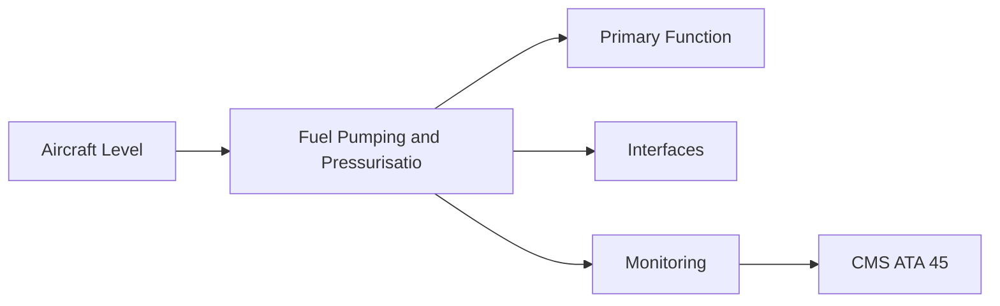
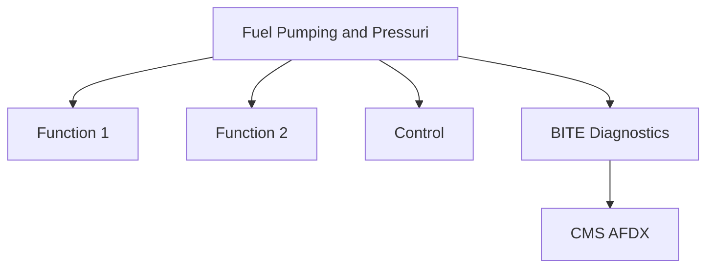

<!-- ──────────────────────────────────────────────────────────────────────────
     QATL-ATLAS-1000-ATLAS-060-069-064-020-FUEL-PUMPING-AND-PRESSURISATION
     ATA 64 · Fuel Pumping and Pressurisation
     AMPEL360E eWTW — ATLAS Register 1000
────────────────────────────────────────────────────────────────────────────── -->

# Fuel Pumping and Pressurisation

---

## §0 Hyperlink Policy

> All hyperlinks in this document are **relative** (five directory levels: `../../../../../`).
> Absolute URLs are forbidden. Every linked document must exist in the Q+ATLANTIDE repository
> before the link is activated. Broken links are treated as open issues and must be resolved
> before the document is promoted from `DRAFT` to `APPROVED`.

---

## §1 Purpose

Engine fuel pumping comprises the AGB-driven LP pump (suction boost) and HP pump (main pressure). The LP pump prevents HP pump cavitation by ensuring adequate inlet pressure across the aircraft flight envelope, including high-altitude low-temperature SAF operation. A boost pump in the aircraft fuel tank (ATA 28) also supplements the LP pump at high-altitude low-pressure conditions.

---

## §2 Applicability

| Parameter | Value |
|---|---|
| Aircraft Program | AMPEL360E eWTW |
| ATA reference | ATA 64-020 — Fuel Pumping and Pressurisation |
| Certification basis | EASA CS-25 Amdt 27+ |
| S1000D SNS | 064-020-00 |

---

## §3 Functional Description ![DRAFT]

Engine fuel pumping comprises the AGB-driven LP pump (suction boost) and HP pump (main pressure). The LP pump prevents HP pump cavitation by ensuring adequate inlet pressure across the aircraft flight envelope, including high-altitude low-temperature SAF operation. A boost pump in the aircraft fuel tank (ATA 28) also supplements the LP pump at high-altitude low-pressure conditions.

---

## §4 Functional Breakdown

| ID | Name | Description | Lead Division |
|---|---|---|---|
| F-001 | LP fuel pump (engine AGB-driven) | Primary function | Q-GREENTECH |
| F-002 | System integration | Interface management | Q-MECHANICS |
| F-003 | Monitoring | BITE and health data | Q-AIR |

---

## §5 System Context — Mermaid Diagram

---

## §6 Internal Architecture — Mermaid Diagram

---

## §7 Components and LRUs

| Component | Part Number | Qty | Location | Maintenance Interval | Notes |
|---|---|---|---|---|---|
| LP fuel pump (engine AGB-driven) | LP-Pump-PN-TBD | 1 per engine | AGB 6 o'clock | On condition / replace at overhaul | Centrifugal or gear type; suction boost |
| HP fuel pump (engine AGB-driven) | HP-Pump-PN-TBD | 1 per engine | AGB 9 o'clock | On condition / replace at overhaul | Gear-type positive displacement; primary metering pressure |
| Fuel/oil heat exchanger (FOHE) | FOHE-PN-TBD | 1 per engine | LP fuel circuit | On condition / inspect at C-check | Cools engine oil using LP fuel; warms cold fuel — no bleed-air heat exchanger |
| Pump inlet pressure sensor | PumpSensor-PN-TBD | 1 per engine | LP pump outlet | On condition | FADEC monitoring HP pump inlet condition |
| Fuel pressure relief valve | PumpRelief-PN-TBD | 1 per engine | HP pump outlet | Inspect at C-check | Protects HP system from over-pressure; bypasses to LP circuit |

---

## §8 Interfaces

| Interface Type | Connected System | Protocol / Medium | Data / Function |
|---|---|---|---|
| ATA 45 CMS | Central Maintenance System | AFDX ARINC 664 P7 | BITE faults and health data |
| ATA 24 Electrical Power | Power distribution | HVDC / 28 V DC | LRU power supply |
| ATA 67 Engine Controls | FADEC | ARINC 429 / AFDX | Control commands and feedback |
| ATA 31 ECAM | Cockpit display | AFDX | Crew indication and alerts |

---

## §9 Operating Modes

| Mode | Trigger | System State | Actions / Consequences |
|---|---|---|---|
| Normal operation | Aircraft/engine powered | Nominal | Full function active |
| Engine shutdown | Commanded or fault | FADEC stops fuel | System de-energised |
| Maintenance | Isolated | Aircraft grounded | LOTO active |
| Ground test | Post-maintenance | Engine on ground | Test pass before service |

---

## §10 Performance and Budgets ![DRAFT]

| Parameter | Requirement | Target / Design Value | Status |
|---|---|---|---|
| System availability | ≥ 99.9 % dispatch | RAMS analysis | TBD |
| BITE fault detection | ≥ 80 % coverage | BITE design analysis | TBD |

---

## §11 Safety, Redundancy and Fault Tolerance

- All Fuel Pumping and Pressurisation maintenance requires FADEC and fuel system isolation before starting.
- Safety-critical fastener torques require calibrated tooling and dual sign-off.
- BITE failures affecting Fuel Pumping and Pressurisation dispatch must be resolved or deferred per approved MEL.

---

## §12 Maintenance and Diagnostics

| Task | Interval | Access | Special Tools |
|---|---|---|---|
| Scheduled Fuel Pumping and Pressurisation inspection | C-check | Per AMM access | NDT and inspection kit |
| BITE log review and download | A-check | Maintenance terminal | CMS terminal |
| Fuel Pumping and Pressurisation functional test after LRU replacement | After LRU change | Ground run | FADEC GSE |

---

## §13 Footprint — Physical, Electrical, Maintenance, Data ![TBD]

| Footprint Type | Parameter | Value | Notes |
|---|---|---|---|
| Physical | Mass (system total) | ![TBD] | Pending OEM data |
| Physical | Envelope (max) | ![TBD] | Pending detailed design |
| Electrical | Peak power (W) | ![TBD] | To be defined |
| Maintenance | Access category | Standard line maintenance | Per AMM |
| Data | AFDX bandwidth | ![TBD] | Per AFDX bus load analysis |

---

## §14 Safety and Certification References ![DRAFT]

| Standard / Document | Title | Issuing Body | Applicability |
|---|---|---|---|
| EASA CS-E §770 | Fuel pumping | EASA | Engine fuel pump certification |
| SAE ARP1533 | Aircraft Fuel System Design | SAE International | Fuel pump architecture reference |
| SAE AIR825 | Aeronautical Hydraulic and Fuel Systems | SAE International | Pump technology reference |
| ATA iSpec 2200 | Chapter 64 | ATA | ATA chapter scope |
| ASTM D7566 | SAF specification | ASTM | Cold fuel viscosity compatibility |

---

## §15 V&V Approach ![TBD]

| Phase | Method | Acceptance Criterion | Status |
|---|---|---|---|
| Design | Analysis and simulation | Meets all §10 performance requirements | ![TBD] |
| Integration | Ground functional test | All BITE tests pass; interfaces verified | ![TBD] |
| Qualification | DO-160G environmental test | All applicable tests pass | ![TBD] |
| Certification | EASA CS-25 / CS-E compliance demonstration | Type Certificate / STC approval | ![TBD] |

---

## §16 Glossary

| Term | Definition |
|---|---|
| **LP pump** | Low-Pressure pump — boosts suction pressure for HP pump; prevents cavitation. |
| **HP pump** | High-Pressure gear pump — the primary fuel pressurisation device providing HMU metering pressure. |
| **FOHE** | Fuel/Oil Heat Exchanger — heats cold fuel and cools engine oil simultaneously; no bleed-air heat exchanger needed on AMPEL360E. |
| **Cavitation** | Formation of vapour bubbles in a pump inlet due to low pressure; causes erosion and loss of pump performance. |
| **Boost pump (ATA 28)** | Aircraft tank boost pump providing positive suction pressure to engine LP pump at high altitude. |
| **Gear pump** | A positive-displacement pump using meshing gears to transfer fluid; used for HP fuel pumping for its pressure-handling capability. |
| **Pressure relief valve** | A valve that opens when pump outlet pressure exceeds the set point; protects downstream components. |
| **Suction boost** | Raising the LP pump inlet pressure above ambient to prevent HP pump cavitation. |
| **Cold fuel** | Fuel at very low temperature (< −40 °C) encountered at high altitude; higher viscosity; wax crystal risk for some blends. |
| **AGB** | Accessory Gearbox — engine-driven gearbox from which LP and HP fuel pumps are mechanically driven. |

---

## §17 Open Issues

| ID | Description | Owner | Target |
|---|---|---|---|
| OI-064-020-001 | Finalise Fuel Pumping and Pressurisation design with engine OEM | Q-MECHANICS | 2026-Q4 |
| OI-064-020-002 | Define BITE coverage for Fuel Pumping and Pressurisation | Q-AIR / safety | 2027-Q1 |

---

## §18 Status Legend

| Badge | Meaning |
|---|---|
| `![DRAFT]` | Section is drafted but not yet reviewed |
| `![TBD]` | Content not yet started — to be defined |
| `![To Be Completed]` | Partially complete — needs additional content |
| `![APPROVED]` | Reviewed and formally approved |

---

## §19 Related Documents (Siblings in this Subsection)

- [064-000](./064-000.md)
- [064-010](./064-010.md)
- [064-030](./064-030.md)
- [064-040](./064-040.md)
- [064-050](./064-050.md)
- [064-060](./064-060.md)
- [064-070](./064-070.md)
- [064-080](./064-080.md)
- [064-090](./064-090.md)

---

## §20 Change Log

| Rev | Date | Author | Description |
|---|---|---|---|
| 0.1 | 2026-05-11 | @copilot | Initial DRAFT — contextualized content per AMPEL360E eWTW architecture |
