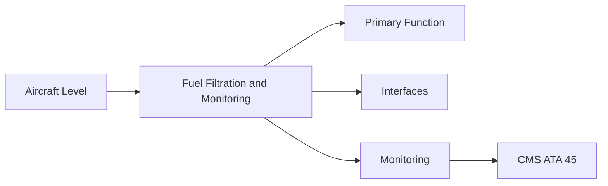
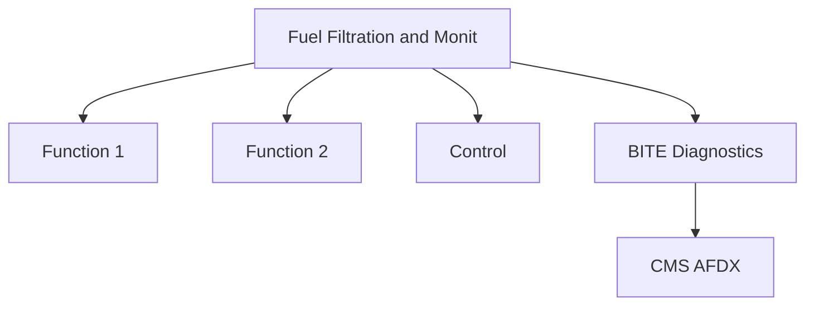

<!-- ──────────────────────────────────────────────────────────────────────────
     QATL-ATLAS-1000-ATLAS-060-069-064-030-FUEL-FILTRATION-AND-MONITORING
     ATA 64 · Fuel Filtration and Monitoring
     programme-defined aircraft type — ATLAS Register 1000
────────────────────────────────────────────────────────────────────────────── -->

# Fuel Filtration and Monitoring

---

## §0 Hyperlink Policy

> All hyperlinks in this document are **relative** (five directory levels: `../../../../../`).
> Absolute URLs are forbidden. Every linked document must exist in the Q+ATLANTIDE repository
> before the link is activated. Broken links are treated as open issues and must be resolved
> before the document is promoted from `DRAFT` to `APPROVED`.

---

## §1 Purpose

This document defines the agnostic ATLAS standard-level architecture context for `Fuel Filtration and Monitoring`.

It describes the controlled scope, functions, interfaces, safety considerations, lifecycle traceability, and S1000D/CSDB mapping logic that programme implementations shall instantiate when this node is applicable.

This document is not a programme design baseline. Programme-specific capacities, locations, part numbers, effectivity, operating limits, maintenance references, and data module codes shall be defined only inside the applicable programme implementation branch.
## §2 Applicability

| Applicability Level | Rule |
|---|---|
| Standard taxonomy | Applies to the ATLAS node `064` |
| Programme implementation | Conditional; determined by programme architecture, trade studies, certification basis, and applicability model |
| Product configuration | Defined in the programme-specific configuration baseline |
| Effectivity | Defined in the programme CSDB / applicability layer |
| Non-applicability | Must be explicitly stated in the programme impact-study branch when excluded |
## §3 Functional Description ![DRAFT]

Fuel filtration protects the HMU, fuel nozzles, and FOHE from particulate contamination. The programme-defined aircraft type engine fuel system includes a primary filter at HMU inlet and a secondary filter in the LP circuit. A differential pressure (DP) switch on the primary filter triggers a CMS alert when the filter approaches bypass threshold.

---

## §4 Functional Breakdown

| ID | Name | Description | Lead Division |
|---|---|---|---|
| F-001 | Primary fuel filter (HMU inlet) | Primary function | Q-GREENTECH |
| F-002 | System integration | Interface management | Q-MECHANICS |
| F-003 | Monitoring | BITE and health data | Q-AIR |

---

## §5 System Context — Mermaid Diagram

---

## §6 Internal Architecture — Mermaid Diagram

---

## §7 Components and LRUs

| Component | Part Number | Qty | Location | Maintenance Interval | Notes |
|---|---|---|---|---|---|
| Primary fuel filter (HMU inlet) | PrimFilt-PN-TBD | 1 per engine | HMU inlet | Replace at C-check interval | 20 µm absolute; DP switch |
| Secondary fuel filter (LP circuit) | SecFilt-PN-TBD | 1 per engine | LP fuel line | Replace at C-check interval | 40 µm absolute; LP circuit protection |
| Filter DP switch (primary) | DP-Switch-PN-TBD | 1 per engine | Primary filter housing | On condition / test at C-check | FADEC and CMS alert at high DP |
| Fuel chip detector (magnetic) | FuelChip-PN-TBD | 1 per engine | LP/HP circuit union | Inspect at C-check | Metallic particle detection |
| Fuel temperature sensor | FuelTemp-PN-TBD | 1 per engine | LP fuel circuit | On condition | FADEC fuel density compensation and icing monitor |

---

## §8 Interfaces

| Interface Type | Connected System | Protocol / Medium | Data / Function |
|---|---|---|---|
| ATA 45 CMS | Central Maintenance System | AFDX ARINC 664 P7 | BITE faults and health data |
| ATA 24 Electrical Power | Power distribution | HVDC / 28 V DC | LRU power supply |
| ATA 67 Engine Controls | FADEC | ARINC 429 / AFDX | Control commands and feedback |
| ATA 31 ECAM | Cockpit display | AFDX | Crew indication and alerts |

---

## §9 Operating Modes

| Mode | Trigger | System State | Actions / Consequences |
|---|---|---|---|
| Normal operation | Aircraft/engine powered | Nominal | Full function active |
| Engine shutdown | Commanded or fault | FADEC stops fuel | System de-energised |
| Maintenance | Isolated | Aircraft grounded | LOTO active |
| Ground test | Post-maintenance | Engine on ground | Test pass before service |

---

## §10 Performance and Budgets ![DRAFT]

| Parameter | Requirement | Target / Design Value | Status |
|---|---|---|---|
| System availability | ≥ 99.9 % dispatch | RAMS analysis | TBD |
| BITE fault detection | ≥ 80 % coverage | BITE design analysis | TBD |

---

## §11 Safety, Redundancy and Fault Tolerance

- All Fuel Filtration and Monitoring maintenance requires FADEC and fuel system isolation before starting.
- Safety-critical fastener torques require calibrated tooling and dual sign-off.
- BITE failures affecting Fuel Filtration and Monitoring dispatch must be resolved or deferred per approved MEL.

---

## §12 Maintenance and Diagnostics

| Task | Interval | Access | Special Tools |
|---|---|---|---|
| Scheduled Fuel Filtration and Monitoring inspection | C-check | Per AMM access | NDT and inspection kit |
| BITE log review and download | A-check | Maintenance terminal | CMS terminal |
| Fuel Filtration and Monitoring functional test after LRU replacement | After LRU change | Ground run | FADEC GSE |

---

## §13 Footprint — Physical, Electrical, Maintenance, Data ![TBD]

| Footprint Type | Parameter | Value | Notes |
|---|---|---|---|
| Physical | Mass (system total) | ![TBD] | Pending OEM data |
| Physical | Envelope (max) | ![TBD] | Pending detailed design |
| Electrical | Peak power (W) | ![TBD] | To be defined |
| Maintenance | Access category | Standard line maintenance | Per AMM |
| Data | AFDX bandwidth | ![TBD] | Per AFDX bus load analysis |

---

## §14 Safety and Certification References ![DRAFT]

| Standard / Document | Title | Issuing Body | Applicability |
|---|---|---|---|
| EASA CS-E §790 | Fuel system filtration | EASA | Fuel filter certification requirement |
| SAE AS8679 | Fuel Filter Standards | SAE International | Filter performance specification |
| ASTM D7566 | SAF specification | ASTM | Filter material SAF compatibility |
| ATA iSpec 2200 | Chapter 64 | ATA | ATA chapter scope |
| DEF STAN 91-091 | Aviation Turbine Fuel — UK | UK MoD | Fuel quality reference (SAF blending allowance) |

---

## §15 V&V Approach ![TBD]

| Phase | Method | Acceptance Criterion | Status |
|---|---|---|---|
| Design | Analysis and simulation | Meets all §10 performance requirements | ![TBD] |
| Integration | Ground functional test | All BITE tests pass; interfaces verified | ![TBD] |
| Qualification | DO-160G environmental test | All applicable tests pass | ![TBD] |
| Certification | EASA CS-25 / CS-E compliance demonstration | Type Certificate / STC approval | ![TBD] |

---

## §16 Glossary

| Term | Definition |
|---|---|
| **DP switch** | Differential Pressure switch — triggers when filter pressure drop exceeds threshold; indicates filter nearing bypass. |
| **Primary fuel filter** | The main particulate filter protecting the HMU metering valve from contamination. |
| **Filter bypass** | A valve that opens allowing unfiltered fuel to flow if filter becomes fully blocked; last-resort protection against starvation. |
| **Chip detector** | Magnetic plug in fuel circuit accumulating ferrous metallic debris; indicator of component wear in fuel pump or HMU. |
| **Fuel temperature** | Key FADEC input for fuel density compensation in fuel flow calculation and for cold fuel icing risk assessment. |
| **µm absolute** | Filter rating in micrometres — 'absolute' means no particles of that size or larger pass through. |
| **LP circuit** | Low-Pressure fuel circuit between aircraft boost pump and HP pump inlet. |
| **Contamination** | Introduction of particles or water into the fuel system; can cause nozzle clogging or HMU valve sticking. |
| **Fuel icing** | Formation of ice crystals in fuel at low temperature; can block filters; prevented by FOHE warming. |
| **SAF compatibility** | All filter element materials must be compatible with SAF aromatic content range 0–25 %. |

---

## §17 Open Issues

| ID | Description | Owner | Target |
|---|---|---|---|
| OI-064-030-001 | Finalise Fuel Filtration and Monitoring design with engine OEM | Q-MECHANICS | 2026-Q4 |
| OI-064-030-002 | Define BITE coverage for Fuel Filtration and Monitoring | Q-AIR / safety | 2027-Q1 |

---

## §18 Status Legend

| Badge | Meaning |
|---|---|
| `![DRAFT]` | Section is drafted but not yet reviewed |
| `![TBD]` | Content not yet started — to be defined |
| `![To Be Completed]` | Partially complete — needs additional content |
| `![APPROVED]` | Reviewed and formally approved |

---

## §19 Related Documents (Siblings in this Subsection)

- [064-000](./064-000.md)
- [064-010](./064-010.md)
- [064-020](./064-020.md)
- [064-040](./064-040.md)
- [064-050](./064-050.md)
- [064-060](./064-060.md)
- [064-070](./064-070.md)
- [064-080](./064-080.md)
- [064-090](./064-090.md)

---

## §20 Change Log

| Rev | Date | Author | Description |
|---|---|---|---|
| 0.1 | 2026-05-11 | @copilot | Initial DRAFT — contextualized content per programme-defined aircraft type architecture |
