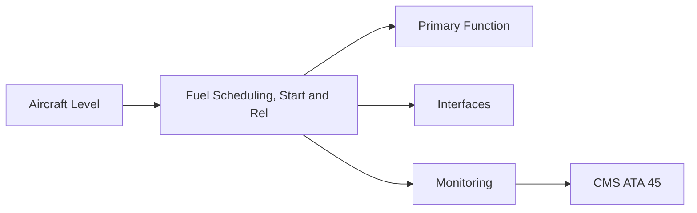
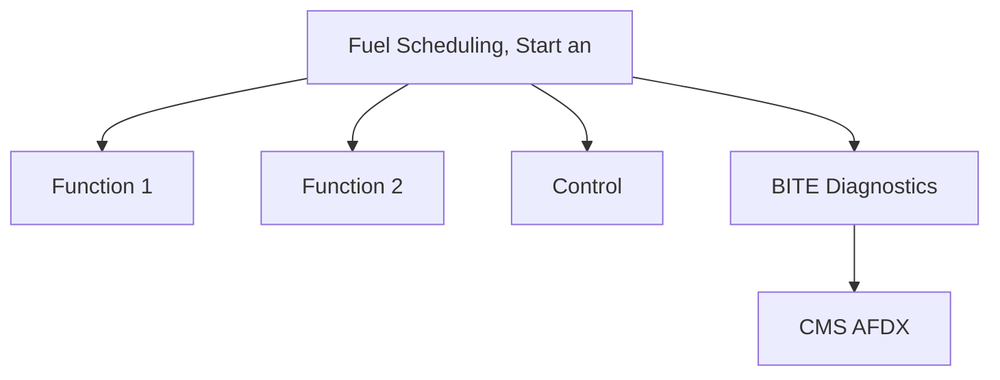

<!-- ──────────────────────────────────────────────────────────────────────────
     QATL-ATLAS-1000-ATLAS-060-069-064-040-FUEL-SCHEDULING-START-AND-RELIGHT
     ATA 64 · Fuel Scheduling, Start and Relight
     AMPEL360E eWTW — ATLAS Register 1000
────────────────────────────────────────────────────────────────────────────── -->

# Fuel Scheduling, Start and Relight

---

## §0 Hyperlink Policy

> All hyperlinks in this document are **relative** (five directory levels: `../../../../../`).
> Absolute URLs are forbidden. Every linked document must exist in the Q+ATLANTIDE repository
> before the link is activated. Broken links are treated as open issues and must be resolved
> before the document is promoted from `DRAFT` to `APPROVED`.

---

## §1 Purpose

FADEC manages all engine fuel scheduling functions: start fuel schedule (pilot-circuit only during start for reliable light-off), idle scheduling, power management, relight envelope, and fuel flow limiting. The start fuel schedule is critical for hot-start prevention — a hot start occurs when EGT exceeds the T41 limit during start, causing HPT blade oxidation damage.

---

## §2 Applicability

| Parameter | Value |
|---|---|
| Aircraft Program | AMPEL360E eWTW |
| ATA reference | ATA 64-040 — Fuel Scheduling, Start and Relight |
| Certification basis | EASA CS-25 Amdt 27+ |
| S1000D SNS | 064-040-00 |

---

## §3 Functional Description ![DRAFT]

FADEC manages all engine fuel scheduling functions: start fuel schedule (pilot-circuit only during start for reliable light-off), idle scheduling, power management, relight envelope, and fuel flow limiting. The start fuel schedule is critical for hot-start prevention — a hot start occurs when EGT exceeds the T41 limit during start, causing HPT blade oxidation damage.

---

## §4 Functional Breakdown

| ID | Name | Description | Lead Division |
|---|---|---|---|
| F-001 | FADEC start fuel schedule (software) | Primary function | Q-GREENTECH |
| F-002 | System integration | Interface management | Q-MECHANICS |
| F-003 | Monitoring | BITE and health data | Q-AIR |

---

## §5 System Context — Mermaid Diagram

---

## §6 Internal Architecture — Mermaid Diagram

---

## §7 Components and LRUs

| Component | Part Number | Qty | Location | Maintenance Interval | Notes |
|---|---|---|---|---|---|
| FADEC start fuel schedule (software) | FADEC DAL A | Per engine | FADEC hardware | Software update cycle | Governs start fuel flow to prevent hot start / rich extinction |
| Fuel flow transducer (FFT) | FFT-PN-TBD | 1 per engine | HP fuel supply line | On condition / calibration check | Measures fuel mass flow; FADEC and ACMF input |
| Start valve (fuel) | StartValve-PN-TBD | 1 per engine | LP circuit | Functional test at C-check | FADEC-commanded; opens to supply fuel to pilot circuit at start |
| Igniter trigger (FADEC-commanded) | Ign-Cmd — FADEC signal | 1 per engine | FADEC to ignition exciter | Software controlled | FADEC sequences fuel + ignition for start |
| N1/N2 speed sensors (for start logic) | SpeedSens-PN-TBD | 2 per engine per spool | Fan frame / HP bearing frame | On condition / replace on failure | FADEC monitors spool acceleration during start |

---

## §8 Interfaces

| Interface Type | Connected System | Protocol / Medium | Data / Function |
|---|---|---|---|
| ATA 45 CMS | Central Maintenance System | AFDX ARINC 664 P7 | BITE faults and health data |
| ATA 24 Electrical Power | Power distribution | HVDC / 28 V DC | LRU power supply |
| ATA 67 Engine Controls | FADEC | ARINC 429 / AFDX | Control commands and feedback |
| ATA 31 ECAM | Cockpit display | AFDX | Crew indication and alerts |

---

## §9 Operating Modes

| Mode | Trigger | System State | Actions / Consequences |
|---|---|---|---|
| Normal operation | Aircraft/engine powered | Nominal | Full function active |
| Engine shutdown | Commanded or fault | FADEC stops fuel | System de-energised |
| Maintenance | Isolated | Aircraft grounded | LOTO active |
| Ground test | Post-maintenance | Engine on ground | Test pass before service |

---

## §10 Performance and Budgets ![DRAFT]

| Parameter | Requirement | Target / Design Value | Status |
|---|---|---|---|
| System availability | ≥ 99.9 % dispatch | RAMS analysis | TBD |
| BITE fault detection | ≥ 80 % coverage | BITE design analysis | TBD |

---

## §11 Safety, Redundancy and Fault Tolerance

- All Fuel Scheduling, Start and Relight maintenance requires FADEC and fuel system isolation before starting.
- Safety-critical fastener torques require calibrated tooling and dual sign-off.
- BITE failures affecting Fuel Scheduling, Start and Relight dispatch must be resolved or deferred per approved MEL.

---

## §12 Maintenance and Diagnostics

| Task | Interval | Access | Special Tools |
|---|---|---|---|
| Scheduled Fuel Scheduling, Start and Relight inspection | C-check | Per AMM access | NDT and inspection kit |
| BITE log review and download | A-check | Maintenance terminal | CMS terminal |
| Fuel Scheduling, Start and Relight functional test after LRU replacement | After LRU change | Ground run | FADEC GSE |

---

## §13 Footprint — Physical, Electrical, Maintenance, Data ![TBD]

| Footprint Type | Parameter | Value | Notes |
|---|---|---|---|
| Physical | Mass (system total) | ![TBD] | Pending OEM data |
| Physical | Envelope (max) | ![TBD] | Pending detailed design |
| Electrical | Peak power (W) | ![TBD] | To be defined |
| Maintenance | Access category | Standard line maintenance | Per AMM |
| Data | AFDX bandwidth | ![TBD] | Per AFDX bus load analysis |

---

## §14 Safety and Certification References ![DRAFT]

| Standard / Document | Title | Issuing Body | Applicability |
|---|---|---|---|
| EASA CS-E §860 | Engine start system | EASA | Start fuel schedule certification |
| DO-178C | Software Considerations | RTCA | FADEC start schedule DAL A assurance |
| SAE ARP1533 | Aircraft Fuel System Design | SAE International | Start fuel design reference |
| ATA iSpec 2200 | Chapter 64 | ATA | ATA chapter scope |
| FAA AC 25.939 | Evaluating the Operating Limits of Turbine Engines | FAA | Hot start limit compliance guidance |

---

## §15 V&V Approach ![TBD]

| Phase | Method | Acceptance Criterion | Status |
|---|---|---|---|
| Design | Analysis and simulation | Meets all §10 performance requirements | ![TBD] |
| Integration | Ground functional test | All BITE tests pass; interfaces verified | ![TBD] |
| Qualification | DO-160G environmental test | All applicable tests pass | ![TBD] |
| Certification | EASA CS-25 / CS-E compliance demonstration | Type Certificate / STC approval | ![TBD] |

---

## §16 Glossary

| Term | Definition |
|---|---|
| **Hot start** | Condition where EGT exceeds limit during engine start; FADEC must detect and abort. |
| **Hung start** | Start where N1 accelerates to self-sustaining speed but fails to reach idle; FADEC detects and aborts. |
| **Wet start** | Excess fuel flow during start without ignition; creates fuel pool; fire risk. |
| **Pilot circuit** | The primary (small orifice) fuel nozzle circuit used exclusively during start and ground idle for stable combustion. |
| **Relight envelope** | The range of altitude, airspeed, and windmill speed within which a dead engine can be relighted in flight. |
| **In-flight relight** | Restart of a shutdown engine in flight; FADEC-managed with continuous ignition for 30 s. |
| **N1 self-sustaining** | The N1 speed at which the engine generates enough turbine power to continue accelerating without the starter. |
| **Starter cut-off** | The N2 speed at which the starter motor is de-energised during start (typically 50–55 % N2). |
| **FFT** | Fuel Flow Transducer — measures fuel mass flow for FADEC control loops and ACMF condition monitoring. |
| **FADEC DAL A** | Design Assurance Level A — the highest DO-178C software level; required for FADEC fuel scheduling functions that directly affect engine operation. |

---

## §17 Open Issues

| ID | Description | Owner | Target |
|---|---|---|---|
| OI-064-040-001 | Finalise Fuel Scheduling, Start and Relight design with engine OEM | Q-MECHANICS | 2026-Q4 |
| OI-064-040-002 | Define BITE coverage for Fuel Scheduling, Start and Relight | Q-AIR / safety | 2027-Q1 |

---

## §18 Status Legend

| Badge | Meaning |
|---|---|
| `![DRAFT]` | Section is drafted but not yet reviewed |
| `![TBD]` | Content not yet started — to be defined |
| `![To Be Completed]` | Partially complete — needs additional content |
| `![APPROVED]` | Reviewed and formally approved |

---

## §19 Related Documents (Siblings in this Subsection)

- [064-000](./064-000.md)
- [064-010](./064-010.md)
- [064-020](./064-020.md)
- [064-030](./064-030.md)
- [064-050](./064-050.md)
- [064-060](./064-060.md)
- [064-070](./064-070.md)
- [064-080](./064-080.md)
- [064-090](./064-090.md)

---

## §20 Change Log

| Rev | Date | Author | Description |
|---|---|---|---|
| 0.1 | 2026-05-11 | @copilot | Initial DRAFT — contextualized content per AMPEL360E eWTW architecture |
